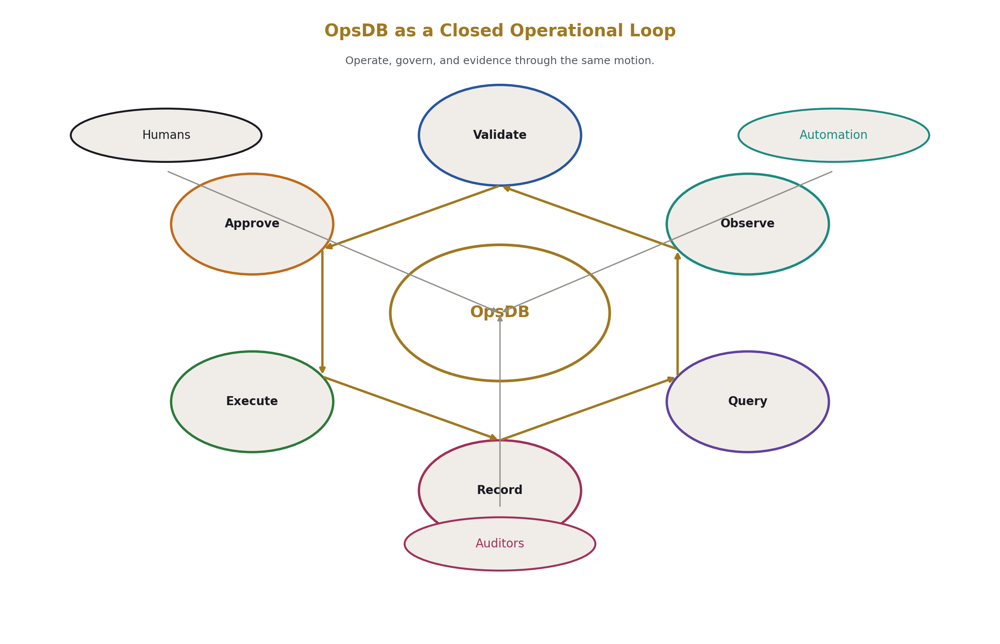
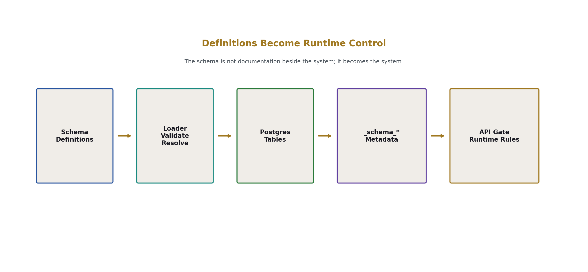
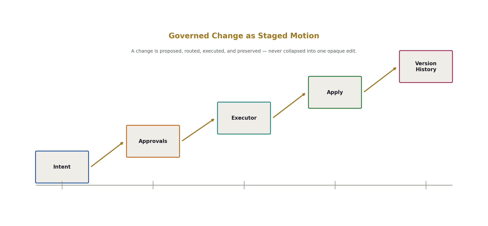
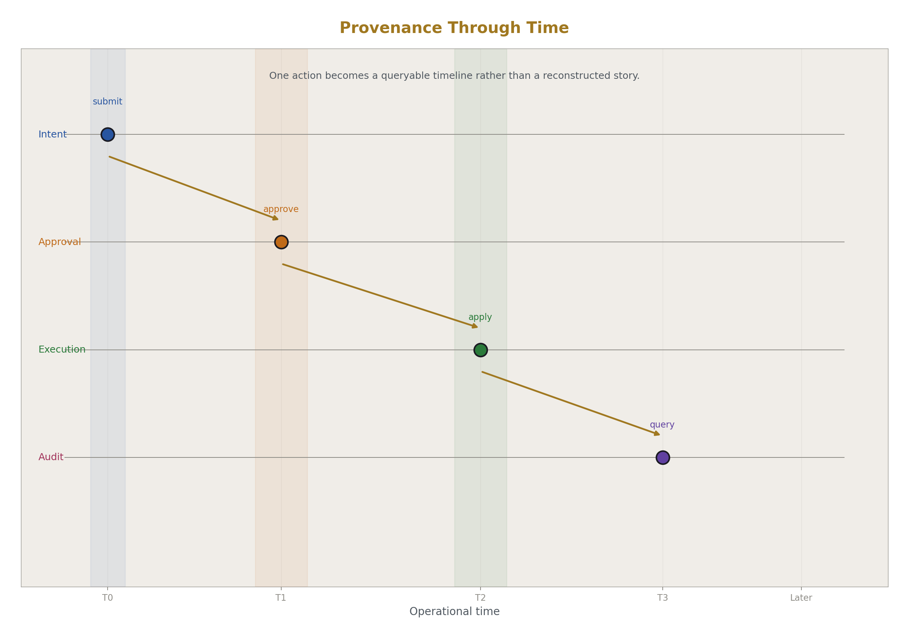
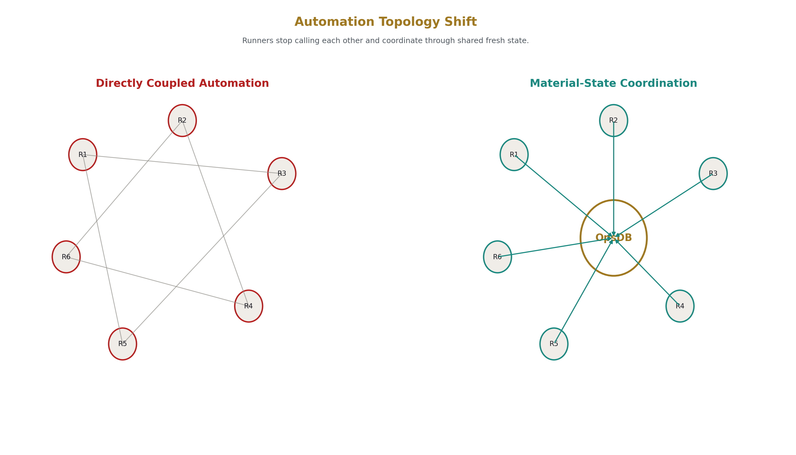
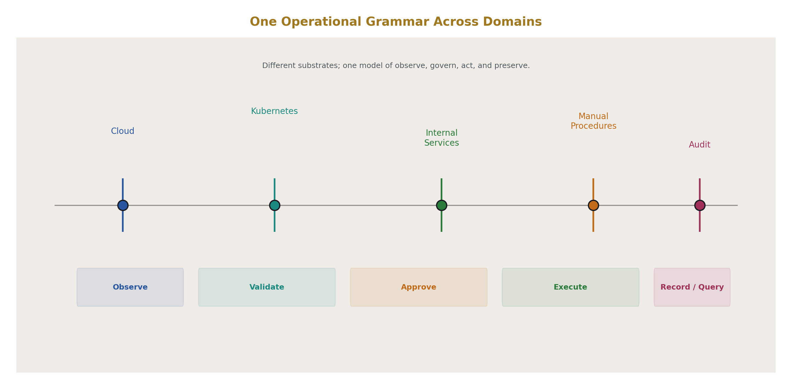
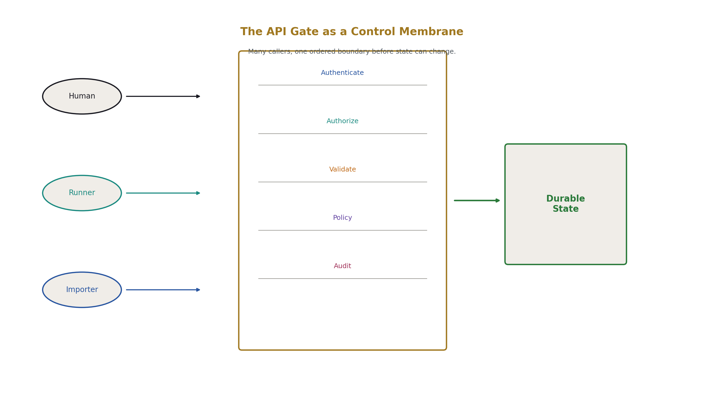
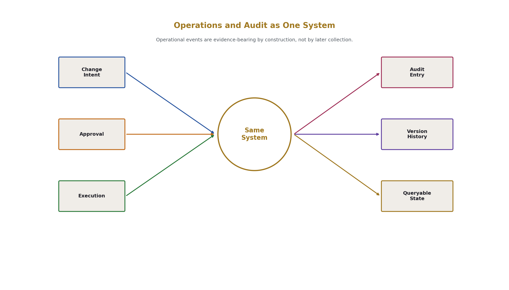

# OpsDB

OpsDB is a unified operations data and control plane for humans, automation, and auditors.

It is designed around a simple idea: operations, governance, and audit should not be separate activities stitched together after the fact. They should happen through the same system, using the same data, with the same provenance.

In OpsDB, state is modeled explicitly, changes are validated and governed, automation interacts through a single API path, and every action is queryable across time.

## What this repository is

This repository is currently a skeleton project.

It is not a finished implementation. Most of the code is scaffolding: types are defined, package structure exists, interfaces are declared, and function bodies are mostly placeholders. The purpose of the current repository is to establish the shape of the project as a real codebase.

Much of that surface is being filled out with LLM assistance. That means:
- files exist where they are expected to exist
- APIs and types are concretely declared
- package boundaries are visible
- implementation intent is described in comments and docs
- the repository can serve as a navigable example of the intended system

At this stage, the value of the repository is not that it fully works. The value is that it exists as a concrete artifact.

It is a better example of what OpsDB should be than a prose spec alone, because it shows:
- how the system is decomposed
- where components live
- what the interfaces look like
- how subsystems connect
- what implementation work remains

Future efforts may turn more of this skeleton into working functionality, but that is not being promised here. For now, this repository should be read as an implementation-shaped reference for the project.

## What OpsDB is intended to do

OpsDB is intended to unify:

- operational data
- governed changes
- automation runners
- schema-managed entities
- version history
- approvals and routing
- audit and provenance

The intended model is:

1. Schema definitions describe the operational world.
2. A schema loader turns those definitions into database structure and runtime metadata.
3. A single API gate validates, authorizes, audits, and executes all interactions.
4. Runners and importers read from OpsDB, act in the world, and write back to OpsDB.
5. Auditors can query the same system used by operators and automation.

This creates one operational loop for three user classes:

- humans
- automation
- auditors

## Why this exists

Most organizations operate through a patchwork of:
- scripts
- tickets
- dashboards
- cloud APIs
- Kubernetes tools
- spreadsheets
- approval systems
- compliance evidence gathering

OpsDB is meant to provide a single operational grammar across all of that:

- observe
- validate
- approve
- execute
- record
- query later

That applies to cloud resources, Kubernetes operations, internal systems, manual procedures, and compliance-relevant activity.

## Current status

Current status is best described as:

- structurally present
- semantically described
- not yet fully implemented

You will find:
- monorepo layout
- schema definitions and supporting docs
- internal package boundaries
- tool directories for API, schema loader, runners, and libraries
- Go stubs with real types and signatures
- detailed comments describing intended logic
- reference documents describing file responsibilities and interfaces

You should not assume:
- complete functionality
- production readiness
- stable behavior
- implemented persistence or enforcement logic in all paths

## How to read this repository

A useful way to approach the project is:

- `docs/` for worldview, architecture, and decisions
- `schema/` for data model definitions
- `internal/` for shared packages and vocabulary
- `tools/opsdb-schema/` for schema loading and DDL generation
- `tools/opsdb-api/` for the gate pipeline
- `tools/opsdb-runner-lib/` for runner lifecycle and API access
- `tools/` importer and runner directories for concrete operational patterns

If you want to understand the intended mechanics, the code stubs and IOSE-style docs are often more informative than the higher-level spec, because they show the actual interfaces and package relationships.

## What this repository is for right now

Right now, this repository serves as:

- a concrete blueprint
- a structural prototype
- a surface for discussion and iteration
- a better-than-prose example of the intended project shape

It is the beginning of an implementation, not the completion of one.

## Notes

- LLM assistance is being used to help build out repository surface area and implementation scaffolding.
- That should be understood as a documentation and structure aid, not as proof that all behavior exists.
- The project should currently be evaluated on clarity of architecture and coherence of interfaces, not on completeness of execution.

## In one sentence

OpsDB is a skeleton implementation of a unified operations, automation, and audit control plane, intended to show what the project should look like in real code before it fully exists as working software.

# OpsDB Explanatory Diagrams

## OpsDB as a Closed Operational Loop

## Schema Definitions Provide Runtime Control

## Change Management

## Provenance Through Time

## Automation Shift

## One Operational Grammar Across Domains

## The API Gate as a Control Membrane

## Operations and Audit as One System

# Tracking Skeleton Improvements

## tools/opsdb-api

- Second LLM pass complete.  These have been rewritten again with an LLM to integrate them, so they should be able to be worked into functioning.

## internals/*

- Second LLM pass complete.  These have been rewritten again with LLMs to integrate them.  Not ready for compilation, just moved closer.

## tools/opsdb-schema/*

- Second LLM pass complete

## tools/opsdb-runner-lib/*

- Second LLM pass complete

## tools/runners/*

- Second LLM pass complete

## tools/importers/*

- These are still just skeleton examples of what the logic in-total needs to do, and need a 2nd pass to integrate them together, before human troubleshooting to get them to compile and run.
