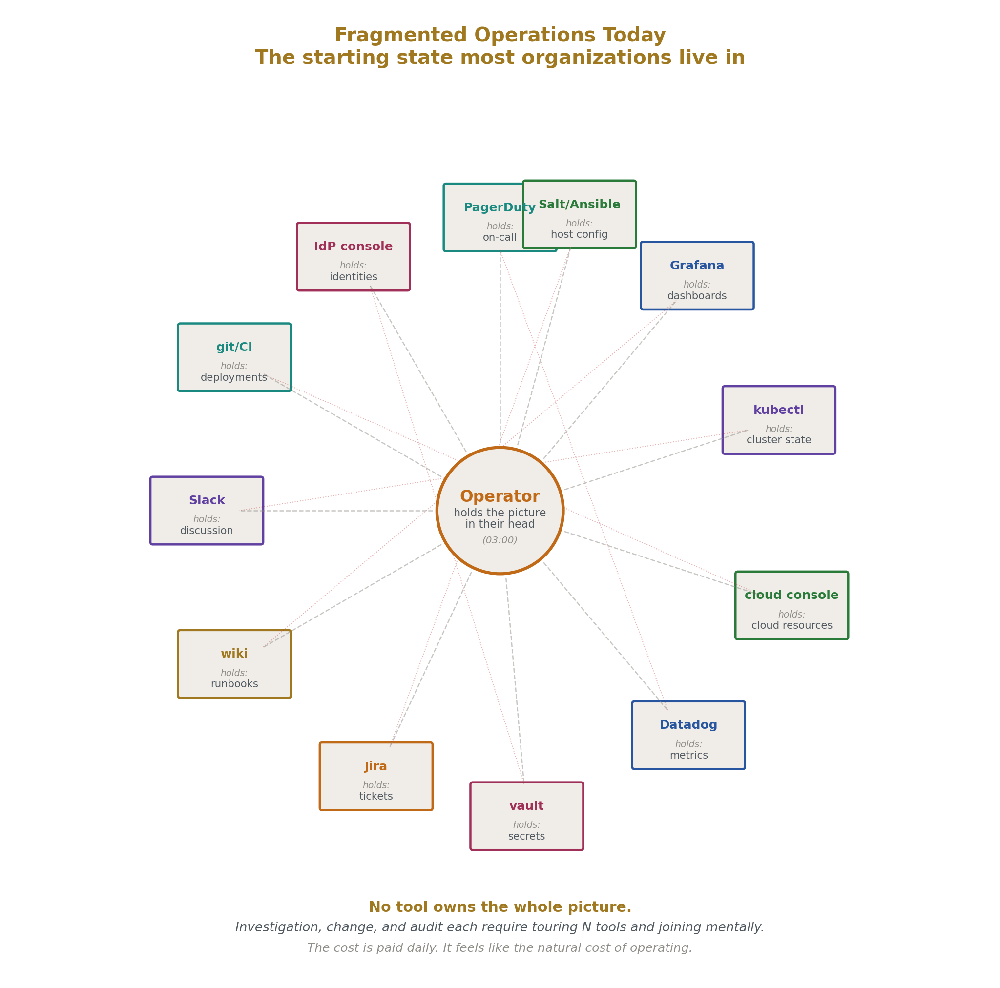
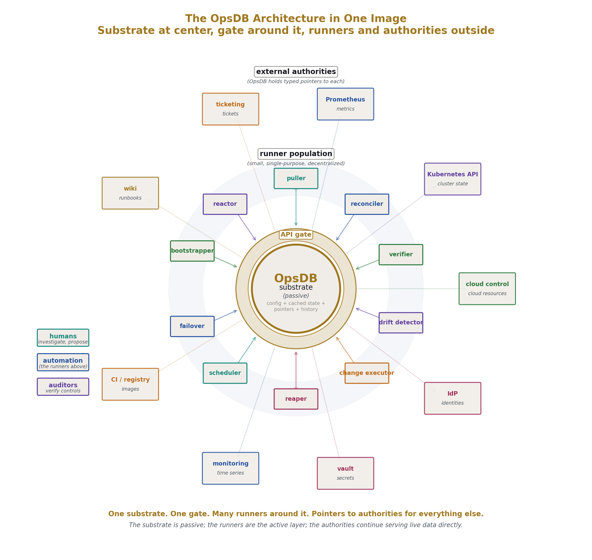
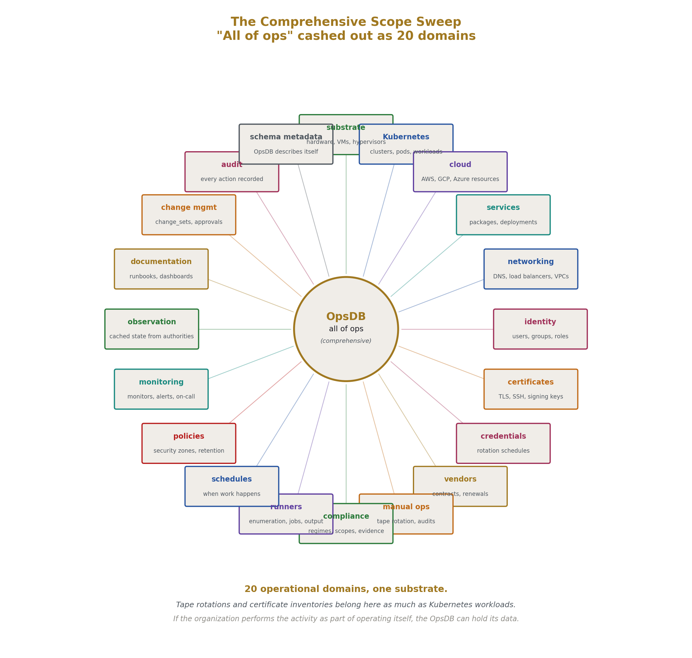
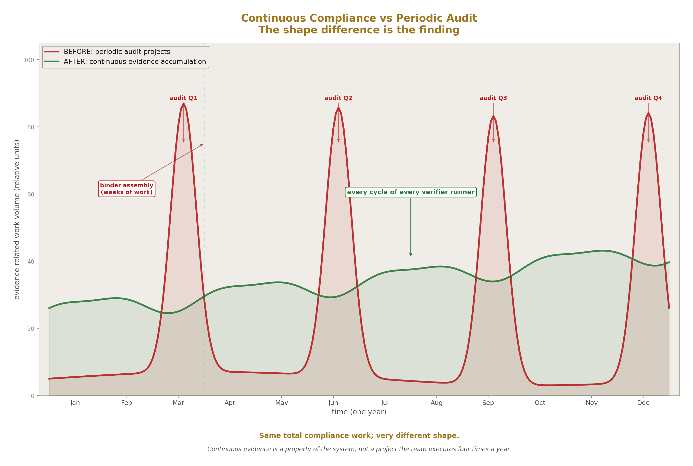
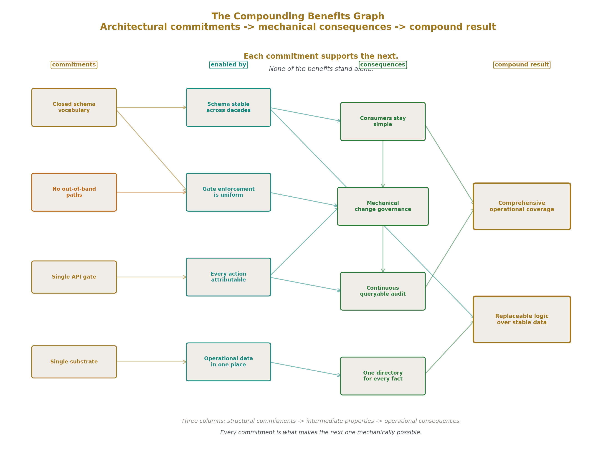
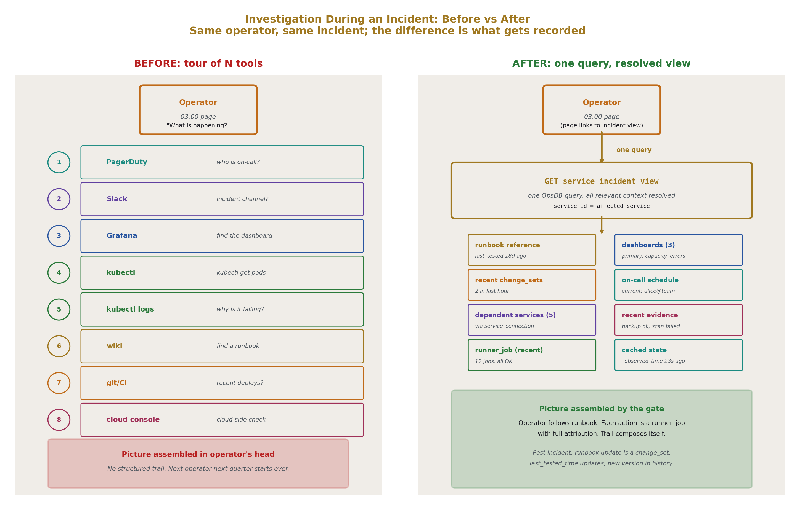
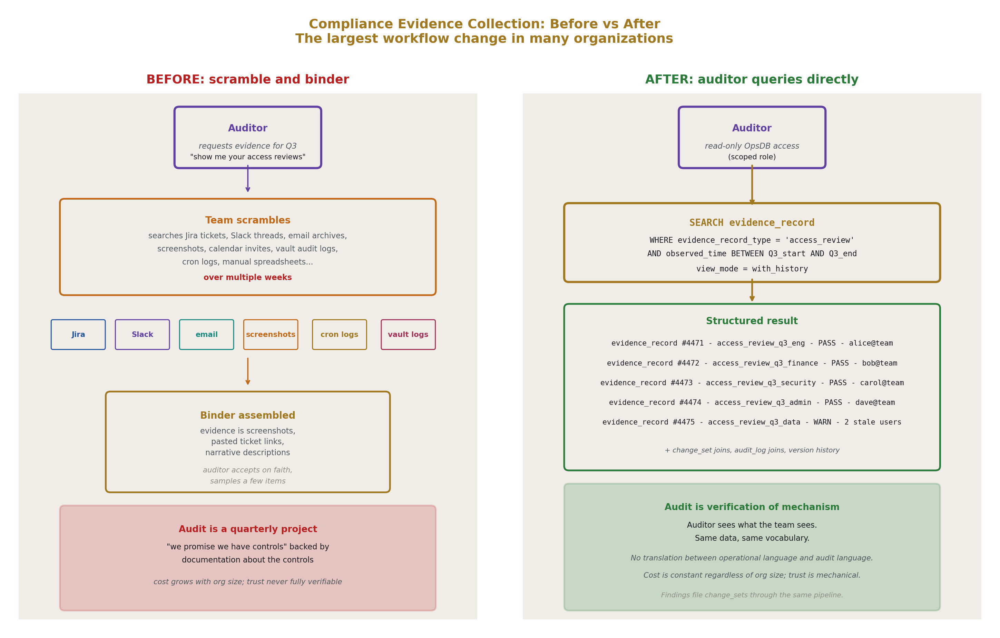
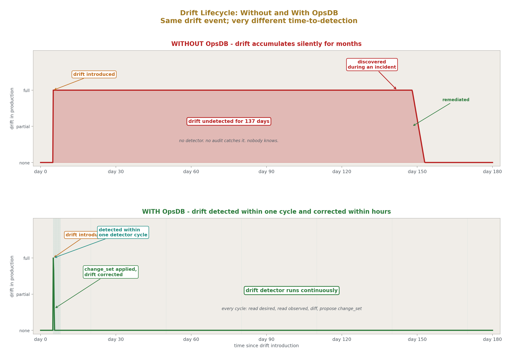

# The OpsDB: A Substrate for Coherent Operations
## What It Is, What You Get, How It Changes the Work

**AI Usage Disclosure:** Only the top metadata, figures, refs and final copyright sections were edited by the author. All paper content was LLM-generated using Anthropic's Opus 4.7. 

---

## Abstract

This paper introduces the OpsDB to readers who have not encountered the prior six papers in the series. The OpsDB is a centralized data substrate that holds the full operational reality of an organization — configuration, observed state, schedules, policies, runner enumeration, documentation references, evidence, change history, audit — accessed through a single API gate that enforces authentication, authorization, validation, change management, versioning, and audit uniformly across every entity. Three populations consume the substrate through scoped access: humans investigating and proposing changes, automation runners performing operational work, auditors verifying controls. A small fleet of decentralized runners reads from the OpsDB, acts in the world through shared libraries, and writes results back; the OpsDB itself is passive and never invokes work. The schema is itself data, declared in YAML files in a git repo, evolved through the same change-management discipline that governs every other operational change.

This paper covers what the OpsDB is, what an organization receives by building one, and how operational workflows change when an OpsDB is in place. It reads as an introduction; the prior six papers (OPSDB-9 through OPSDB-7) provide the structural specifications. A reader who finishes this paper should understand whether their organization would benefit from an OpsDB and what it would feel like to operate inside one.

---

## 1. What this paper is for

The OPSDB infrastructure series specifies a particular architectural pattern for organizational operations. Six prior papers establish the structure: a taxonomy of operational mechanisms (OPSDB-9), the OpsDB design (OPSDB-2), a concrete schema (OPSDB-4), the runner pattern (OPSDB-5), the API gate (OPSDB-6), and schema construction (OPSDB-7). Together they specify what to build and why each commitment matters.

This paper is different. It is for a reader who has not seen the prior six. It introduces the OpsDB from first principles, explains what an organization gets by building one, and describes how operational workflows change. The prior papers tell you how to build the system; this paper tells you what the system is for.

The reader this paper is written for is an operations engineer, a platform team lead, a CTO, or an architect looking at their organization's current operational fragmentation and wondering whether there is a better pattern. They are familiar with Kubernetes, with cloud platforms, with configuration management, with monitoring stacks, with the daily work of keeping production running. They have lived with the costs of fragmentation — the scattered evidence during audits, the missing runbooks, the unknown ownership, the repeated incidents that come from drift nobody noticed. They are looking for a coherent alternative.

What this paper provides: a complete picture of what an OpsDB is, what changes when you have one, and what the discipline of building and maintaining one looks like in practice. What this paper does not provide: the structural specifications. For those, read the prior six papers.

---

## 2. The starting point: what operations looks like today

Before describing the OpsDB, it is worth being precise about what it replaces.

A typical mid-to-large organization operates across many tools. Configuration lives in cloud consoles, Kubernetes manifests in git, Salt or Ansible inventories in their own repositories, vault paths configured separately, DNS zones in another provider's interface, monitoring configurations in Prometheus YAML and Datadog UI, identity provider settings in an admin console. Observed state lives in monitoring systems, with different teams using different stacks for different domains. Documentation lives in wikis, Notion, README files, shared drives. Audit evidence lives in tickets, Slack threads, email archives, screenshots.

When something goes wrong, the operator's first job is to assemble a coherent picture from these scattered sources. They open PagerDuty to see who is on-call. They open Grafana to see the dashboards. They SSH into a bastion or kubectl into a cluster. They check Slack to see if anyone else is investigating. They open the wiki to find a runbook, which may or may not be current. They check git to see what was recently deployed. Each of these is a separate tool with its own access controls, its own query language, its own data model.

When a configuration change is needed, the operator updates one tool and tries to remember to update the others. The configuration in Salt is correct, but the documentation in the wiki is stale. The cloud console has the new instance type, but the capacity planning spreadsheet was not updated. The monitoring alert was added, but the runbook describing how to respond was not.

When an audit arrives, the team scrambles. The auditor asks for evidence that controls are operating. The evidence is scattered: who is on-call is in PagerDuty, change approvals are in Jira tickets, verification that backups happened is in CloudWatch logs, evidence that credentials were rotated is in vault audit logs that nobody routinely queries. The team produces a binder. The auditor accepts on faith because the alternative — actually verifying that the scattered evidence forms a coherent whole — is unworkable.

This is the failure state. It is not anyone's fault. Each tool is doing its job; the problem is that no tool is responsible for the picture as a whole, and no substrate ties the tools together. The fragmentation produces specific costs: investigation takes longer than it should, configuration drifts silently, audit response is a project rather than a query, automation written by one team duplicates automation written by another team because neither team had a way to know the other existed.

Most organizations live in this state. They have lived in it for so long that the costs feel like the natural cost of operating, rather than a consequence of architectural choices that could be made differently.

The OpsDB is the architectural alternative.

---

## 3. What the OpsDB is

The OpsDB is a centralized data substrate that holds the full operational reality of an organization. It is the place where every operational fact either lives directly or has a structured pointer to where it lives. Every interaction with that data passes through a single API gate that enforces authentication, authorization, validation, change management, versioning, and audit uniformly.

The OpsDB is consumed by three populations: humans operating the system, automation runners performing decentralized work, and auditors verifying compliance. All three populations access the same data through the same gate, with scoped permissions appropriate to their role.

The OpsDB itself is passive. It does not invoke work. It does not push changes. It does not orchestrate runners. It answers queries and accepts writes. The active layer — the runners — operate around it: reading from it, acting in the world through standardized libraries, writing results back.

That is the entire design at the highest level. The rest of this paper unpacks what each of those words means in practice.

### 3.1 What the OpsDB holds

The OpsDB holds operational data across every domain the organization wants to coordinate. The categories:

**Centrally-managed configuration.** What the organization has chosen to coordinate through one substrate rather than fragment across tools. Service definitions, deployment specifications, on-call rotations, escalation policies, retention policies, alert thresholds, security policies. When the organization decides "this configuration should be coordinated across the operational domain," it goes in the OpsDB.

**Cached observed state.** Pulled snapshots from authorities. Kubernetes pod status, cloud resource state, recent metric summaries, identity provider group memberships. The OpsDB does not replace Prometheus or Datadog; it holds enough cached data that automation can reason locally without round-tripping to monitoring systems on every decision, with timestamps so consumers know the age of the data.

**Authority pointers.** For everything not held locally, the directory of where it lives. Which Prometheus server holds which metric. Which cluster runs which service. Which vault path holds which secret. Which wiki page documents which service. The OpsDB is the place humans and automation go first when they need to know where something is.

**Schedules.** When runners run. When backups happen. When certificates expire. When credentials rotate. When compliance audits are due. When manual tasks (tape rotations, vendor reviews, license renewals) are scheduled. Schedules are queryable data; runners and humans read them and act on them.

**Runner enumeration and metadata.** What automation exists. What each runner does. Where it runs. What it affects. Who owns it. The OpsDB does not hold runner code; it holds runner deployment metadata.

**Structured documentation metadata.** Owners, stakeholders, support teams, runbook references, dashboard references, last-reviewed dates. The structured metadata layer over the unstructured prose layer in the wiki. The OpsDB does not replace the wiki; it points at the wiki and tracks what should be reviewed when.

**Policies.** Security zones, compliance scopes, data classifications, escalation paths, change-management rules, retention policies. All declarative, all queryable, all governed.

**Version history.** Every prior state of every centrally-managed entity, reconstructible to the retention horizon. Every change is recorded with attribution to the change_set that produced it.

**Audit log.** Every API action recorded with identity, timestamp, action, target. Append-only at the strictest level the substrate supports.

**Change-management state.** Pending change_sets, approval status, approval records, rejected proposals. The full trail of every change that has been proposed, whether or not it ultimately committed.

**Evidence records.** Outcomes of verification work. Did Tuesday's backup happen? Did the credential rotation succeed? Did the compliance scan pass? Each verification produces a structured record.

This is comprehensive scope. It is not "server, network, cloud configuration." It is everything operationally meaningful that the organization performs. Tape rotations, vendor contract renewals, certificate inventories, office key card deactivation when employees leave, laptop fleet patch status, internal CA certificate renewals, DR backup restoration tests — all are operational realities, all are candidates for OpsDB tracking, all benefit from being structured rather than scattered.

### 3.2 What the OpsDB does not hold

The boundaries are as important as the contents.

The OpsDB does not hold long-form prose. Wiki pages, design documents, decision rationale narratives live in the wiki or document store; the OpsDB has structured pointers to them with last-reviewed metadata.

The OpsDB does not hold time-series at full resolution. Prometheus, Datadog, CloudWatch hold full-resolution metrics; the OpsDB holds enough cached recent state for operational reasoning, with pointers to the monitoring system for live queries.

The OpsDB does not hold code. Runner code, package code, container images live in repositories and registries; the OpsDB holds pointers (image references, repo URLs, version tags).

The OpsDB does not hold secrets. Vault and equivalent systems hold secret values; the OpsDB holds pointers to vault paths, never the secrets themselves.

The OpsDB does not host discussion. Slack, Teams, chat platforms hold conversations; the OpsDB has authority pointers to threads where context is needed.

The OpsDB does not replace the ticketing system. Jira, Linear, ServiceNow hold ticket workflows; the OpsDB references tickets where appropriate.

The OpsDB is not an orchestrator. It does not invoke runners, fire triggers, push changes. Runners run on their own schedules through their own scheduling primitives; the OpsDB is consulted by them, not directing them.

The OpsDB is not a runtime dependency for live services. Already-running services keep running when the OpsDB is unreachable. Runners with cached or templated configuration continue. Authorities continue serving live data directly. The OpsDB is the coordination substrate, not the data plane.

Each boundary kept makes the OpsDB better at what it does and lets each external system do what it does well. Crossing a boundary weakens both systems.

### 3.3 The single API gate

Every interaction with the OpsDB passes through one API. There is no SSH-into-the-database. There is no out-of-band path. There is no shadow administrative tooling. The API is the only way data enters or leaves.

This is the architectural commitment that makes everything else work. Single source of truth requires a single gate enforcing it. If alternate paths exist, the gate's disciplines become advisory rather than enforced, and every claim the OpsDB makes about its data — that changes are tracked, that access is controlled, that history is complete — becomes unreliable.

The API enforces, on every operation:

**Authentication.** Who is calling? Humans authenticate via the organization's identity provider. Runners authenticate using credentials issued by the secret backend. Every action is attributable.

**Authorization.** Is this caller permitted to perform this operation on this target? Five layers compose: standard role and group membership, per-entity governance flags, per-field classification, per-runner declared scope, policy rules. All five must pass.

**Validation.** Does the request match the schema? Are values within declared bounds? Do referenced entities exist? Does the operation violate any active semantic invariant policy?

**Change management.** For changes to centrally-managed data, has the appropriate approval been collected? The API computes who must approve based on policy, records the change_set in pending state, and waits.

**Versioning.** When data is updated, the prior state is preserved in version history. Reconstruction at any point in time is one query.

**Audit.** Every action — successful or rejected — produces an audit log entry with full attribution.

The substrate underneath the API is simple. It is a relational database. It stores what the API hands it. The complexity that governance requires lives in the API, where it is uniform and inspectable. The substrate stays portable across storage engines because it is not contaminated with policy logic.

### 3.4 The runner pattern

Runners are the active layer around the passive OpsDB. Each runner is a small, single-purpose unit of code that reads from the OpsDB, acts in the world through standardized shared libraries, and writes results back. The pattern in one sentence: get from the OpsDB, act in the world, set to the OpsDB.

A runner reads its configuration from the OpsDB. It reads the data it needs to act — desired state, observed state, target lists, policies. It performs whatever operational work is its job: applying configuration to hosts, pulling metrics from monitoring authorities, verifying that scheduled work happened, comparing desired versus observed and correcting drift. It writes its outcome back to the OpsDB: a runner_job row recording the cycle, output variables expressing what was produced, evidence records attesting to what was verified, change_set proposals for changes it wants to make.

Several specific runner kinds recur:

**Pullers** read from authorities (Prometheus, Kubernetes API, cloud control planes, identity providers) and write the cached state into the OpsDB. The most numerous kind in a mature OpsDB.

**Reconcilers** compare desired state against observed state and act to close the gap. The Kubernetes operator pattern, generalized across all operational domains.

**Verifiers** check that scheduled work happened or scheduled state is correct. Did the backup happen? Did the cert renew? Did the compliance scan pass? They produce evidence records.

**Drift detectors** compare desired versus observed and propose corrections via change_set rather than acting directly.

**Change-set executors** read approved change_sets and apply the field changes through the API.

**Reapers** apply retention policies, trimming past-horizon data.

**Schedulers** read schedule data and enforce it on whatever substrate the target runs on (cron, systemd timer, Kubernetes CronJob).

Runners do not coordinate with each other directly. There is no orchestrator. When runner A produces output that runner B needs, runner A writes a row, runner B reads that row on its next cycle. The OpsDB is the rendezvous; runners are independent processes meeting through data.

This is loose coupling. A runner that crashes does not block any other runner. A runner can be replaced, restarted, retired, or rewritten without affecting any other runner. Each runner is small enough to be fully knowable by one team — typically 200 to 500 lines of runner-specific logic, with shared libraries handling the heavy lifting (OpsDB API access, retry, error handling, logging, world-side operations through standardized clients).

The shared library suite is what keeps runners small and consistent. Without it, every runner reinvents basics inconsistently — the same fragmentation problem the OpsDB exists to solve, recurring at the runner layer. With it, runners differ only in their specific job; how they interact with the world is uniform.

### 3.5 Three populations on one substrate

The OpsDB is not built for one audience. It serves three populations whose needs converge on the same data.

**Humans** investigate incidents, plan changes, query state, build dashboards on top of OpsDB queries, propose changes, review approvals. They use UIs that sit on the API. Their work is exploratory: follow pointers, join across entity types, look at history, query observed and configured state side by side.

**Automation** — the runners — read OpsDB to know what to do; write back to record what they did. Pullers populate caches. Reconcilers correct drift. Verifiers produce evidence. Their work is structured: each runner queries for specific data shapes, performs specific work, writes specific results.

**Auditors** verify that controls are operating. They have read-only scoped access to audit log, version history, change-management records, evidence records, policy data. Their queries are read-heavy and broad in scope, focused on history and structure rather than on specific operational decisions.

The three populations share the same data through the same gate with scoped access. The disciplines applied for one population produce benefits for the others as a side effect. Change management for humans produces audit evidence for auditors. Versioning for rollback produces point-in-time reconstruction for auditors. Schedule data for runners produces compliance task tracking for auditors. Structured ownership metadata for human routing produces accountability evidence for auditors.

This is the soft power of the architecture. The OpsDB is one substrate doing many jobs because the underlying data is the same data and the disciplines compose.

### 3.6 The schema is itself data

The OpsDB's schema — the description of what entity types exist, what fields each has, what constraints apply, what relationships connect them — is itself data. It lives as YAML files in a git repository. A loader reads the files, validates them, and produces both the relational database structure and the API's validation metadata from the same source.

The schema is declared in a closed, bounded vocabulary: a small list of types (int, float, varchar, text, boolean, datetime, date, json, enum, foreign_key), modifiers (nullable, default, unique), and constraints (range bounds, length bounds, enum sets, foreign key references). Nothing else. No regex. No embedded logic. No conditional constraints. No inheritance. No templating.

Schema evolution flows through change management. New entities, new fields, widened ranges — all are change_sets reviewed through the org's git workflow and applied through schema_change_set rows. Some changes are forbidden outright: no field deletions, no renames, no type changes. Type changes happen by duplication and double-write; the old field becomes a tombstone but is never removed.

This discipline is what makes long-lived schemas possible. Consumers can trust that fields they read by name will always exist. Audit log entries from years ago remain interpretable. Version history rows reference fields that still mean what they meant. The cost is occasional schema gymnastics; the benefit is decade-scale stability for everything that depends on the schema.

---

## 4. What you get when you build one

This section addresses the question: what specifically does an organization receive by building an OpsDB? The answer is not abstract. It is a list of capabilities the organization gains, each of which has cost in fragmented operations and which becomes structural with the OpsDB in place.

### 4.1 One place to find any operational fact

Within the OpsDB's scope, every operational fact has one authoritative location. Either the OpsDB holds the fact directly, or the OpsDB points at the authority that holds it. A human or a script with one connection to the OpsDB can find any operational fact, either by reading it or by following a pointer.

Investigation no longer requires knowing N tools. It requires knowing the OpsDB and using its directory to reach authorities when needed. The mental load of "where does this live?" collapses to one query.

### 4.2 Continuous, queryable audit

Every change to centrally-managed data goes through the API gate. Every gate operation produces an audit log entry with full attribution. Every change_set has its approval trail queryable. Every entity has its version history reconstructible.

When an auditor asks "show me every production configuration change in the last quarter and who approved each," the answer is a query result, not a binder assembly project. Compliance becomes a property of the system, not a quarterly fire drill.

For SOC 2, ISO 27001, and similar regimes, this is a substantial improvement in audit cost and confidence. For more stringent regimes (PCI, HIPAA, FedRAMP), the structured-data-plus-mechanical-controls approach lines up well with what those regimes actually want — enforced mechanisms, not promised practices.

### 4.3 Mechanical change governance

Every change to centrally-managed data flows through change_sets. Validation runs (schema, bounds, semantic invariants, policy). Approval routes per declared rules. The change is recorded with attribution. On approval, an executor runner applies it through the API.

Segregation of duties is enforceable as policy rules. Approval requirements scale with risk: routine drift correction in staging may auto-approve, while changes to production-critical entities require multiple approvers from designated groups. Emergency changes have a defined break-glass path with mandatory post-hoc review.

The discipline that ad-hoc operations attempt to maintain through process documents and tribal knowledge is, in the OpsDB-coordinated organization, mechanically enforced.

### 4.4 Decentralized work with central coordination

The runner pattern means many small pieces of automation, each doing one thing, each independent. No central orchestrator. No single point of failure. No coordination through fragile in-memory state.

Coordination happens through shared data. Runner A writes a row; runner B reads it. The OpsDB is the rendezvous. Runners can be replaced, restarted, or retired without affecting any other runner. Adding new automation is adding a new runner that reads from and writes to the OpsDB; existing automation is unaffected.

This scales well. An organization with 50 runners and one with 500 runners are structurally similar; the difference is breadth of operational coverage, not architectural complexity. The shared library suite keeps runners small as the population grows.

### 4.5 Point-in-time reconstruction

Version history makes "what did this look like at time T" a single query. Useful for incident investigation: "what was the configuration at the time the incident started?" Useful for audit: "show me the state of the system across all entities at the audit period boundary." Useful for rollback: rollback is a change_set restoring prior values, going through the same approval pipeline as any other change.

Reconstruction is bounded by retention policy. Compliance-relevant entities typically retain 7+ years. Ephemeral configuration may retain 90 days. The retention is itself policy data, change-managed.

### 4.6 Schema stability across decades

The schema is the long-lived artifact. The forbidden list — no deletions, no renames, no type changes — means consumers can trust the schema's stability. A runner written five years ago can still run today against the same field names. Audit log entries from any past point remain interpretable. Version history rows reference fields that still mean what they meant.

The cost of this stability is occasional duplication when types genuinely need to change. A field that needs a type change is duplicated alongside; double-writing happens for several release cycles; readers migrate; the old field becomes a tombstone but persists. Storage is the price of stable history.

### 4.7 Mechanical defense against operator error

Most operational outages are caused by intended actions whose consequences were not fully anticipated. The OpsDB provides multiple layers of defense:

The schema rejects malformed writes at the gate. Change management routes high-stakes changes to humans who can catch errors before approval. Validation checks cross-field invariants and dependency contracts. Bulk operations are atomic at the change_set boundary; partial application is never visible. Optimistic concurrency catches stale-state submissions before approval starts. Runner report keys reject writes outside declared scope.

None of these prevent every error. But each closes off a category of error that otherwise produces incidents.

### 4.8 Observability of operations itself

The OpsDB is observable about its own operations. Queries to "which runners are running?" "which runners haven't run in 24 hours?" "which runners are hitting their bounds?" "which change_sets are pending approval longer than expected?" are direct queries against operational data.

Operations as a function becomes inspectable. The team can see what's happening across the operational domain without piecing together signals from many tools. Patterns become visible: a runner consistently hitting its retry budget points at an unhealthy authority, a change_set type taking longer to approve than others points at a routing problem, evidence records consistently failing for a specific control point at a real operational gap.

### 4.9 Vendor and substrate independence

The OpsDB is not built on any particular cloud, orchestrator, or commercial platform. It is self-contained operational software. The schema is portable across storage engines. The API surface is engine-independent. The runners are written against shared libraries, not against specific vendors.

A reorganization that replaces the cloud provider, swaps the orchestrator, or changes the monitoring stack does not require replacing the OpsDB. The OpsDB's representation of "workload state cached from the workload platform" is updated to reflect the new authority. Pullers for the new authority replace pullers for the old. The rest of the substrate is unchanged.

This independence is operational insurance. Tools and platforms come and go on multi-year cycles. The schema, the API, the runner population, the policies, the audit history persist across each transition.

### 4.10 The compounding benefits

The benefits compound. Each capability strengthens the others.

Continuous audit is possible because every change goes through the gate. The gate is uniform because there is no out-of-band path. The lack of out-of-band paths is enforceable because the schema and API are the only way to interact with the data. The schema is stable because the closed vocabulary forbids the kinds of changes that would break consumers. Consumers can be simple because the schema is stable. Many consumers can exist because they are simple. The breadth of consumers is what produces the comprehensive operational coverage.

Each commitment supports the next. None of the benefits stand alone. The OpsDB is what an organization gets by making all of these commitments together.

---

## 5. How operational workflows change

This section describes specific operational scenarios as they look before and after the OpsDB is in place. The changes are concrete and observable; this is what daily operational work feels like with an OpsDB versus without.

### 5.1 Investigation during an incident

Before. PagerDuty pages the on-call engineer at 03:00. The engineer opens Slack to find the incident channel, which is just being created. They open Grafana to find the dashboard for the affected service, URL bookmarked or remembered. They SSH to a bastion and kubectl into the cluster. They run `kubectl get pods -n production` to find the pods. They run `kubectl logs <pod>` to see what's happening. They guess or recall which runbook applies; open the wiki, search, find a runbook that may be current. They follow steps, run commands, restart something. They update the incident channel. Post-incident, they may or may not update the runbook somewhere. The investigation is a tour of many tools, with the operator holding the picture in their head.

After. The page from the OpsDB-coordinated escalation runner includes a link to a service incident view. The view resolves: the service's runbook reference (with last-tested time visible), the relevant dashboard URLs, the recent change_set history (was anything deployed in the last hour?), the recent evidence records (did backup verification fail? did a compliance scan find something?), the dependent services from the connection graph, the on-call schedules for upstream services. The engineer follows the runbook. Documented commands are runner invocations through the API; execution goes through the gate's policy (auto-approved for low-stakes, approval-required for higher-stakes). As the engineer takes actions, runner_job rows record what was done with attribution. The structured trail is automatic.

Post-incident, the runbook is updated through a change_set; the runbook reference's last-tested time is updated; the new version is in version history and queryable.

The difference is not that the engineer works faster (though they may). The difference is that the trail composes itself. The next person investigating a similar incident next quarter has a queryable record of what was done and why.

### 5.2 Deployment

Before. A developer opens a pull request. CI runs. After merge, Argo CD or Flux syncs the cluster, or someone runs `kubectl apply`. The team hopes it worked. Datadog or Grafana is checked later, or not. Whether the new image's digest matches what was intended is rarely verified explicitly. If something goes wrong, the team correlates Slack discussion, CI logs, and cluster events into a timeline.

After. A developer (or a runner acting on their behalf) submits a change_set targeting the relevant entity — a Kubernetes workload version, a configuration variable set, a helm release version. Validation runs (schema, bounds, semantic, policy). Approval routes per declared rules. On approval, the change_set executor applies the OpsDB-side change and signals readiness via an output variable. A specialized runner (helm git exporter, configuration applier, or whatever the entity demands) reads the output variable and performs the world-side action: commits to git for Argo to pick up, applies via cloud API, calls Salt apply, whatever the substrate requires. A deploy watcher records the rollout in cached state. An image digest verifier confirms the deployed digest matches intent and writes an evidence record. If a digest mismatch is detected, a compliance finding is filed.

The trail is one query joining several tables. The auditor querying "every production deployment last quarter and its outcome" gets a structured result with image digests, approver identities, deployment timestamps, and verification outcomes. None of this required extra effort beyond running the standard runner cast; the trail is the natural data the operations produce.

### 5.3 Certificate renewal

Before. A cron job somewhere runs cert-manager or an ACME client. It renews the cert if everything is configured correctly. Hopefully it works. The team gets paged when certs are 7 days from expiring, or doesn't, depending on whether the alerting is set up. When it fails, the failure is often noticed only when the cert actually expires.

After. The certificate inventory is in the OpsDB. Each cert has a certificate_expiration_schedule. A renewal runner reads the schedule, performs renewal via shared library, and writes an evidence record on each cycle. A drift detector confirms the new cert is in place where expected. If renewal fails, a compliance finding is filed for the responsible role to investigate. If the cert reaches an expiration warning threshold without successful renewal, an alert fires to the appropriate role.

The cert inventory is queryable. "Show me every cert expiring in the next 90 days" is a direct query. "Which certs failed their last renewal attempt?" is a direct query. The pattern that fails silently in fragmented operations becomes a routine query in OpsDB-coordinated operations.

### 5.4 Compliance evidence collection

Before. The auditor arrives. The auditor sends a request for evidence: "show me your access review evidence for Q3," "show me your change management approval records," "show me your backup verification logs." The team scrambles. People search through Jira tickets, Slack threads, email archives, screenshots. The evidence is assembled into a binder over several weeks. The auditor accepts on faith and samples a few items.

After. Continuous compliance is a property of the system. Verifier runners produce evidence records on every cycle of every scheduled check. Quarterly access reviews are recorded in evidence records. Backup verifications are recorded in evidence records. Credential rotations are recorded in evidence records. Compliance scans against organizational policies produce structured findings.

When the auditor arrives, they receive read-only scoped access to the OpsDB. They query the same data the team queries. "Show me access review evidence for Q3" is a direct query against evidence records. "Show me change management approval records" is a direct query joining audit log to change_set tables. "Show me backup verification logs" is a direct query against evidence records.

The auditor sees what the team sees. There is no translation from "operational language" to "audit language" because both populations use the same vocabulary — the schema's entity types and field names. The audit becomes verification of mechanism, not assembly of evidence.

This is the largest workflow change in many organizations. Audit moves from a quarterly project to a routine query.

### 5.5 Drift correction

Before. Drift accumulates silently. A service's configuration in production diverges from what's checked into git. A Kubernetes cluster has manual interventions that nobody documented. A cloud security group has an extra rule somebody added during an incident. Nobody knows about the drift until the next incident or the next manual audit catches it months later.

After. A drift detector runner reads desired state from the OpsDB and observed state from authorities. It computes the diff on every cycle. For each non-trivial drift, it either auto-corrects via change_set (per policy, for low-stakes corrections in non-production) or files a finding for human review. Drift never accumulates past one detection cycle.

The team has structured visibility into "what is currently drifted, and why?" The "why" is captured in the change_set the drift detector proposes; humans review the proposal and either approve the correction or update the desired state to match the new reality. Either way, the drift is resolved by the next cycle.

### 5.6 Onboarding new automation

Before. A team needs to automate something — a new compliance check, a new operational verification, a new reconciler. They write a script. The script lives somewhere — in their team's repo, on a specific machine. It runs on a cron schedule that team owns. Other teams don't know it exists. It accesses authorities directly with credentials hardcoded into its environment. It logs to its own log destination. When it fails, only the owning team notices.

After. The team writes a runner against the shared library suite. They register a runner_spec in the OpsDB through a change_set. The runner_spec declares the runner's purpose, schedule, target scope, capabilities, and report keys. The runner is deployed through normal CI/CD; runner_machine rows associate runner specs with the machines that host them.

Once deployed, the runner appears in the runner enumeration. Other teams can see what it does and what it affects. Its job history is in runner_job rows. Its outputs are in runner_job_output_var rows. Its evidence (if any) is in evidence_record rows. Failures are visible to anyone querying runner job status.

Adding new automation is structurally additive. It doesn't disturb existing runners. It doesn't add new tools to learn. It contributes to the comprehensive operational coverage rather than becoming yet another disconnected slice.

### 5.7 Schema evolution

Before. Database schema changes are dangerous. Migration scripts are tested in staging and then run in production with held breath. Sometimes they break consumers in ways that aren't apparent until later. The DDL is one source of truth; the validation logic in the API is another; they drift.

After. Schema changes are change_sets against the schema repo. They are reviewed through the org's git workflow. The CI generates a schema_change_set that goes through the same approval pipeline as any other change. The schema executor applies the DDL atomically and updates the schema metadata tables. The schema repo and the OpsDB stay synchronized by construction.

The forbidden list (no deletions, no renames, no type changes) means changes are mechanically additive. Type changes happen by duplication; readers migrate at their own pace; the old field becomes a tombstone. Consumers written against an older schema continue working because the schema only ever grows.

### 5.8 Vendor or substrate transitions

Before. Replacing the cloud provider is a multi-year project. Replacing the configuration management tool is a multi-quarter project. Replacing the monitoring stack involves rewriting dashboards and alerts. Each transition involves rewriting integrations, rebuilding institutional knowledge, and accepting outages during the cutover.

After. Replacing the cloud provider means: write new pullers for the new cloud's authorities; deprecate the old pullers when the migration completes; update authority pointers as resources move. The schema's representation of cloud_resource and storage_resource accommodates both providers through the typed payload pattern. Existing entity rows reference the new provider's resources via authority pointers. The runners that aren't cloud-specific keep working unchanged.

The scope of the transition is bounded. The OpsDB persists. The audit history persists. The runner population mostly persists. Only the world-side adapters change.

This is the operational independence claim made concrete. Tools and platforms come and go; the OpsDB outlives them.

### 5.9 What stays the same

Some things do not change.

The fundamental work of operations is unchanged. Services still need to run, monitoring still needs to alert, incidents still happen, capacity still needs planning, vendors still need management. The OpsDB does not eliminate operational work; it makes the work coordinated.

The skill set of operations engineers is unchanged. They still need to understand systems, networking, storage, security, distributed systems failure modes. The OpsDB is a tool for coordinating their work, not a replacement for it.

Organizational dynamics are unchanged. The OpsDB does not solve disagreement about priorities, ownership disputes, communication problems between teams. It provides a shared substrate, but the humans still have to use it well.

The OpsDB rewards organizations that bring the discipline to maintain it. It does not produce the discipline. An organization that cannot maintain a single source of truth, that allows fragmentation to creep back in, that bypasses the gate when it's convenient — that organization will not succeed in operating an OpsDB. The OpsDB is a tool for organizations that have or can develop the discipline; it amplifies their capability rather than substituting for it.

---

## 6. What the discipline of building one looks like

Building an OpsDB is not a one-time project. It is an ongoing discipline. This section describes what the discipline involves at the architectural, organizational, and operational levels.

### 6.1 The architectural commitments

Several commitments are non-negotiable and must hold throughout the OpsDB's life. Compromise on any of them and the system degrades to a partial implementation that does not deliver the consequences.

**One OpsDB per scope.** An organization has either one OpsDB (the typical case) or multiple OpsDBs for genuinely structural reasons — security perimeters where API access control is structurally insufficient, legal or regulatory zones with data residency requirements, organizational boundaries between independently-operating units. There is no stable "two OpsDBs" state; an organization is either committed to one and defends it, or committed to many and architects for them coherently. Adding a second OpsDB for convenience or for technical fragility is a first step toward fragmentation.

**The API is the only path.** No SSH-into-the-database. No out-of-band tools. No shadow paths. Direct database access exists for substrate operators under separation-of-duties controls, narrowly scoped, audited, and used only for maintenance operations that cannot be expressed through the API.

**The OpsDB is passive.** It does not invoke runners, fire triggers, push changes, or initiate any activity in the world. The active layer is the runners, and the runners drive the timing.

**The substrate is portable.** The schema does not depend on storage-engine-specific features. The API does not expose engine semantics. The OpsDB can be migrated across storage engines without disturbing the schema, the runners, or the operational reality the OpsDB describes.

**Schema evolution is governed.** No deletions. No renames. No type changes. The closed vocabulary. The forbidden list. The duplication-and-double-write pattern when types must change.

**Comprehensive scope.** The OpsDB covers all operational data the organization wants coordinated, including domains like vendor contracts, manual operations, and certificate inventories that conventional systems leave to spreadsheets and tribal knowledge.

### 6.2 The organizational commitments

The OpsDB is an organizational artifact, not just a technical one. Several roles and disciplines are necessary.

**The schema steward role.** Some person or team is responsible for the comprehensive coherence of the schema. They review schema-evolution change_sets. They notice when slicing-the-pie is needed (when a new operational domain is being added and the schema needs refinement to absorb it). They resist fragmentation and feature creep. They hold the whole in mind across the many domains the OpsDB covers, ensuring that additions cohere. Without this role, the schema drifts to aggregate; with it, the schema accumulates value over time.

**The investment in the API.** The API is sophisticated and continues to grow. New validation rules, new approval workflows, new audit requirements, new query patterns. The substrate stays simple; the API earns the complexity. Organizations that under-invest in the API end up with a database, not an OpsDB.

**The investment in the shared library suite.** Runners are cheap because the libraries are good. The library suite is what keeps the runner population consistent at scale. Each new operational domain is a candidate for new shared library capabilities; the investment in libraries pays back many times in cheap runners.

**The discipline of refusing fragmentation.** Every team that wants a "small separate OpsDB for our use case" is solving a real problem; the right response is usually to absorb the use case into the existing schema rather than fragmenting. This is a recurring discipline; the pressure for fragmentation is constant.

**The discipline of refusing feature creep.** The OpsDB is not a wiki, not a monitoring system, not a code repository, not an orchestrator, not a chat system, not a ticketing system, not a secrets manager. Each pressure to expand the scope has a real motivation; each is a bad idea. The discipline is to refuse and to direct each pressure to the right system, with the OpsDB pointing at it through structured pointers.

### 6.3 The operational disciplines

Day-to-day operations of the OpsDB itself follow certain patterns.

**Comprehensive thinking, aggregate building.** The schema is built incrementally because no team can teleport to a finished schema. But each piece is approached with comprehensive thinking — slicing the pie at the level being added, asking what's missing, refining when new things don't fit. The thinking is at the level of the whole; the building is at the level of the piece.

**One way to do each thing.** Within the OpsDB-coordinated environment, converge on one method per task. The shared library suite is the framework's enforcement of this. Many almost-identical implementations are the failure mode the OpsDB exists to prevent.

**Idempotency, level-triggering, bounding.** Every runner is idempotent; level-triggered where possible (re-evaluating current state on every cycle rather than depending on event delivery); bounded in every dimension (retry budget, execution time, scope per cycle, queue depth, memory). These three disciplines are non-negotiable at the runner layer.

**Bound everything.** Every long-running mechanism has explicit limits. Every queue has a max depth. Every cache has a max size. Every connection has a timeout. Every retry has a budget. The bounds may be very large, but they must exist.

**Reversible changes.** Prefer mechanisms that allow rollback. Rollback is itself a change_set restoring prior values. Side-channel rollbacks are forbidden; everything goes through the same pipeline.

**Make state observable.** What cannot be seen cannot be operated. The OpsDB is observable about itself by construction; runners produce structured records; the audit log is queryable; schema metadata describes what exists.

### 6.4 The starting move

An organization adopting the OpsDB design does not start with the full system. The pattern is incremental:

1. **Top-level taxonomy first.** Five or six top-level concepts. Get the shape sliced thoughtfully before populating. The comprehensive cuts from the schema (substrate, services, runners, schedules, policies, observation, audit) are a reasonable starting point.

2. **Pick a domain that matters.** The most painful or most valuable operational domain. Could be Kubernetes coordination, could be cloud resource governance, could be tape backup tracking, could be certificate inventory, depending on what the organization actually struggles with.

3. **Slice that domain.** Entities, relationships, schedules, policies, evidence types, authorities. Get the schema right for this domain. Declare it in the schema repo.

4. **Build the substrate and API.** Pick a storage engine. Build the API with the disciplines (auth, validation, change management, versioning, audit). Build it to be portable across storage engines from the start.

5. **Build a runner or two in the domain.** Real runners doing real work, reading from and writing to the OpsDB. This forces the schema to be useful, not just elegant.

6. **Do another domain.** Repeat. Notice where the second domain's needs overlap the first — that's where the top-level taxonomy gets refined.

7. **Keep going.** Each domain refines the schema. Each runner confirms the schema is useful. Eventually the OpsDB covers most operational reality. There is no ceremony of "the schema is finished"; there is just "it covers what matters and absorbs new things cleanly."

The discipline is unchanged from the start: comprehensive thinking, aggregate building, slicing the pie when domains are added, resistance to fragmentation and feature creep, investment in the API and the shared libraries.

### 6.5 What this asks of the organization

The OpsDB design rewards organizations that bring the discipline. It does not produce the discipline. An organization without the commitment to put operational data in one place, to enforce one gate, to refuse fragmentation, to think comprehensively while building aggregately — that organization will not succeed in operating an OpsDB.

For organizations that bring the discipline, the OpsDB delivers what fragmented operations cannot: coherent automation, continuous compliance, auditable change, replaceable logic over stable data, and the ability to operate the entire operational domain as one coordinated system.

The cost is real. Building an OpsDB is engineering investment. Maintaining it is ongoing investment. The discipline of refusing the wrong things — wrong fragmentation, wrong scope expansion, wrong shortcuts that bypass the gate — is constant. The schema steward role is continuous responsibility. The investment in the API and the shared libraries compounds over years.

The benefit is also real. Operations becomes inspectable. Compliance becomes continuous. Audit becomes a query rather than a project. New automation is additive rather than fragmenting. The schema persists across decades while everything around it evolves.

Whether the trade is right for a given organization depends on whether the costs of fragmentation that organization is currently absorbing — costs that are often invisible because they are absorbed as the natural cost of operating — exceed the costs of building and maintaining the discipline. For organizations that have lived with fragmentation long enough to see its costs clearly, the trade is usually obvious.

---

## 7. Where to go from here

This paper has introduced the OpsDB at a level appropriate for a reader who had not encountered the concept before. It has not specified the structure in detail. For that, the prior six papers in the series provide the structural specifications.

**OPSDB-9** establishes the taxonomy of operational mechanisms, properties, and principles that the OpsDB design draws on. Reading it gives a vocabulary for talking about operations in general; it is foundational for understanding why the OpsDB makes the structural choices it does.

**OPSDB-2** specifies the OpsDB design itself: the architectural commitments, the cardinality rule (1 or N OpsDBs, never 2), the content scope, the three consumer populations, the API as governance perimeter, the construction discipline. It is the design document.

**OPSDB-4** demonstrates a concrete schema. Roughly 150 entity types across all the operational domains the OpsDB covers. It is one example schema; an organization adopting the OpsDB design will adapt the schema to its specific operational reality, but the structural patterns transfer.

**OPSDB-5** specifies the runner pattern in detail. Runner kinds, the shared library suite, coordination through shared substrate, the three load-bearing disciplines (idempotency, level-triggering, bounding), per-runner change-management gating.

**OPSDB-6** specifies the API gate. The 10-step gate sequence, the five-layer authorization model, field-level versioning, optimistic concurrency, the change_set lifecycle, runner report keys, audit logging. It is the active layer where governance happens.

**OPSDB-7** specifies how the schema itself is constructed. The closed constraint vocabulary. The schema repo as YAML files in git. The forbidden list — no deletions, no renames, no type changes. The duplication-and-double-write pattern. Schema evolution through change management.

The six papers are ordered as they are because each builds on the prior. A reader serious about implementing an OpsDB should read them in order. A reader who only wants the architectural intuition can read OPSDB-2 alone and have most of the picture; the others provide depth.

---

## 8. Closing

The OpsDB is a centralized data substrate that holds the full operational reality of an organization, accessed through a single API gate, consumed by humans and automation and auditors through scoped permissions, surrounded by a population of small decentralized runners that do the active work. The schema is itself data, governed by the same discipline that governs every other operational change.

What an organization receives by building one: a single place to find any operational fact, continuous queryable audit, mechanical change governance, decentralized work with central coordination, point-in-time reconstruction across the operational domain, schema stability across decades, mechanical defense against operator error, observability of operations itself, and independence from any particular vendor or substrate.

How operational workflows change: investigation moves from tour-of-tools to one query plus directed pointers. Deployment moves from "run kubectl apply and hope" to a change_set producing a queryable trail through the runner cast. Certificate renewal moves from "hopefully the cron job worked" to evidence records on every cycle. Compliance evidence collection moves from quarterly project to routine query. Drift correction moves from "discovered during the next incident" to caught within one detector cycle. New automation is additive. Schema evolution is governed. Vendor and substrate transitions are bounded in scope.

What it asks of the organization: the discipline to put operational data in one place, to enforce one gate, to refuse fragmentation and feature creep, to think comprehensively while building aggregately, to maintain the schema steward role and the investment in the API and the shared libraries. For organizations that bring the discipline, the OpsDB delivers operations that compose; for organizations that do not, the OpsDB is just another database, with all the costs and none of the benefits.

The OPSDB infrastructure series specifies one coherent architectural alternative to operational fragmentation. The architecture is opinionated, the disciplines are non-negotiable, and the benefits compound. This paper has been the introduction. The structural specifications follow in the prior six papers, each closing a specific layer of the design.

The work is real; the result is an organization that can operate its full domain as one coordinated system rather than as a collection of fragments. That capability is the consequence of the choices the OpsDB design makes, sustained by the discipline the organization brings to maintaining them.

---

*End of OPSDB-1.*

