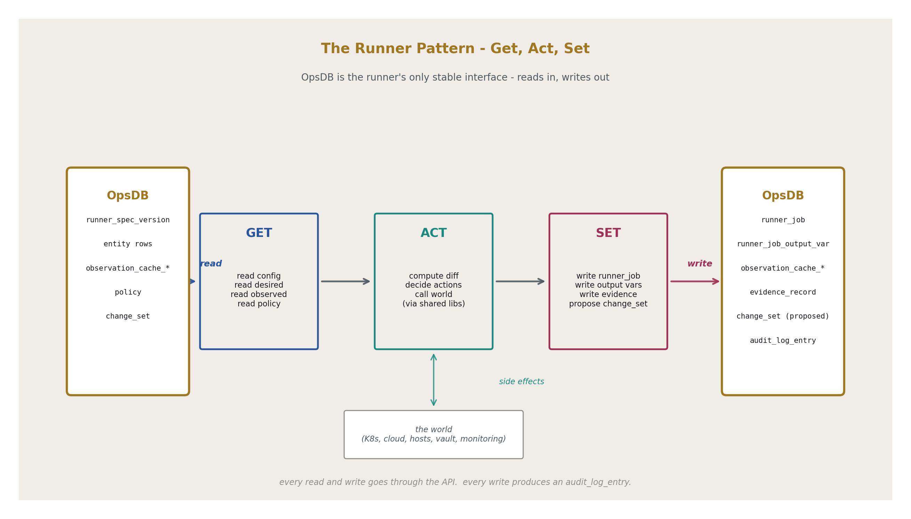
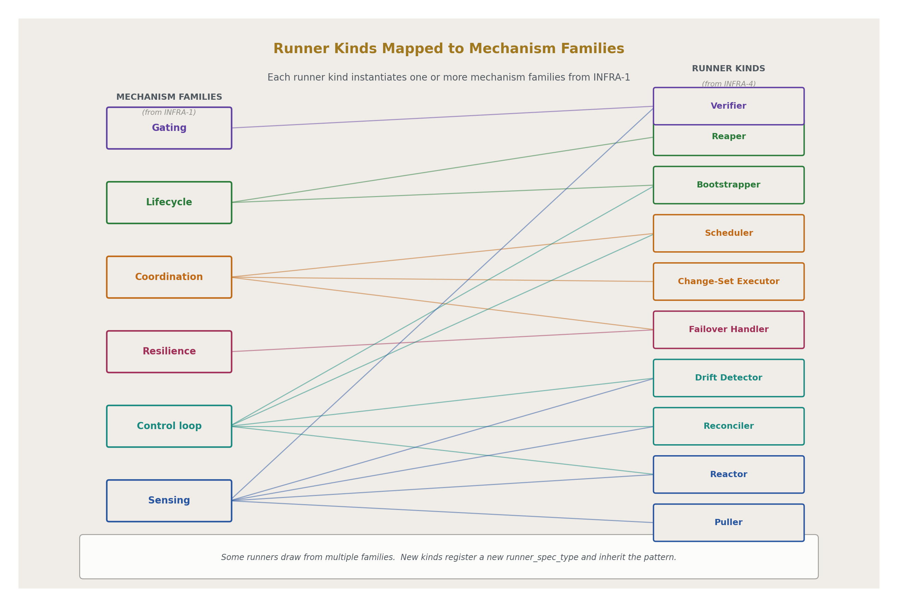
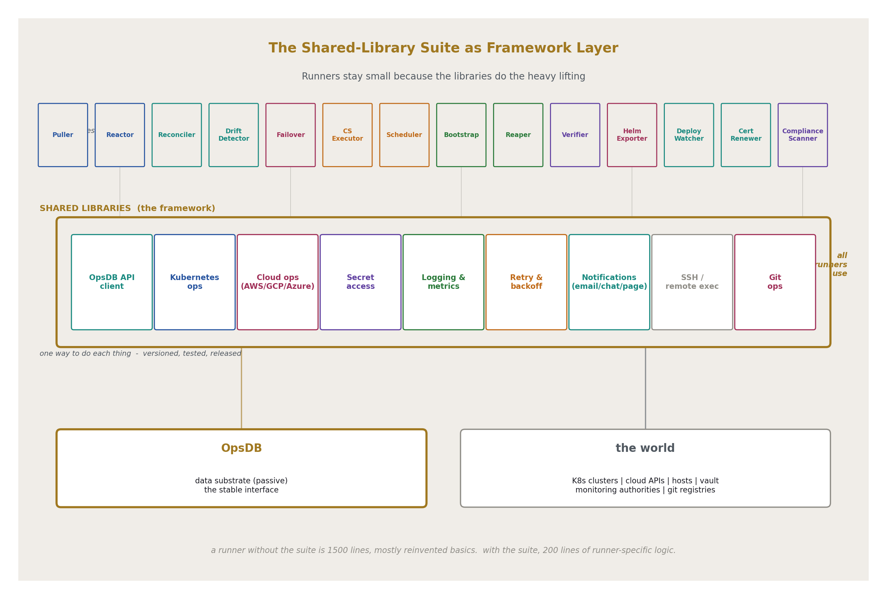
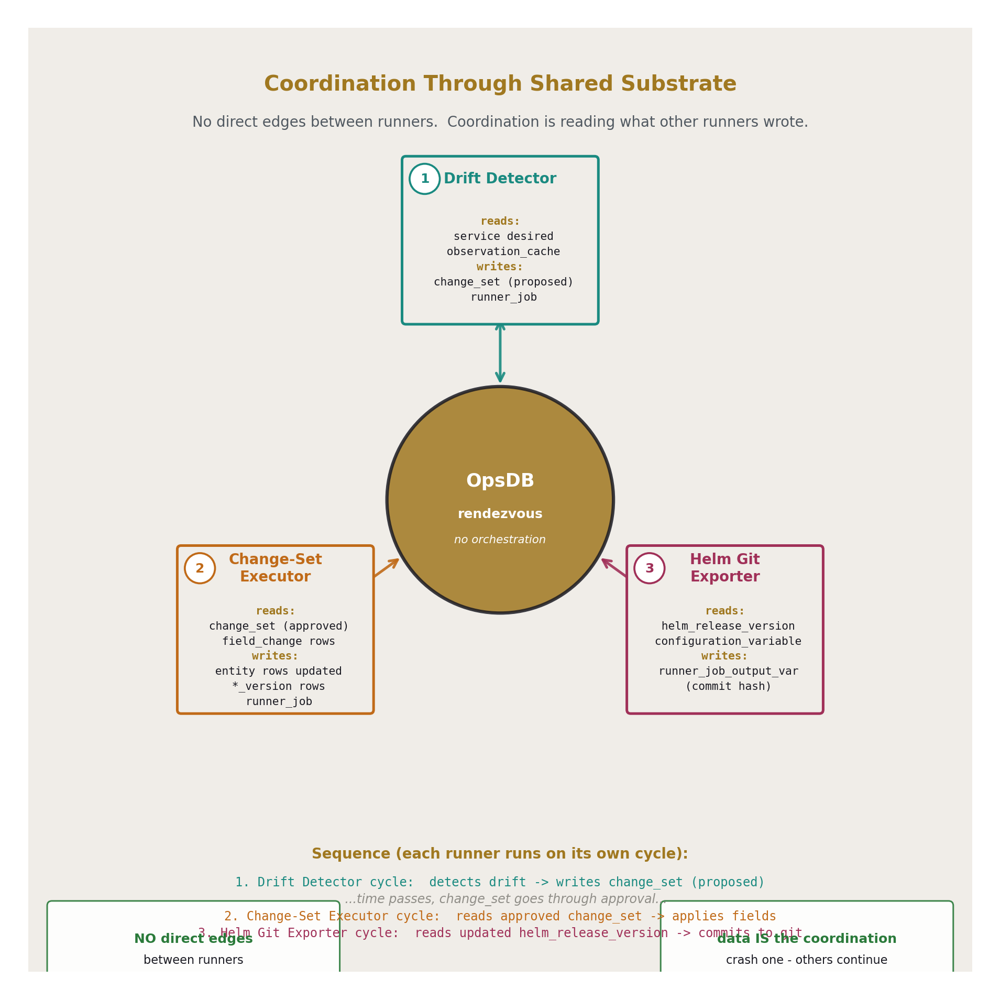
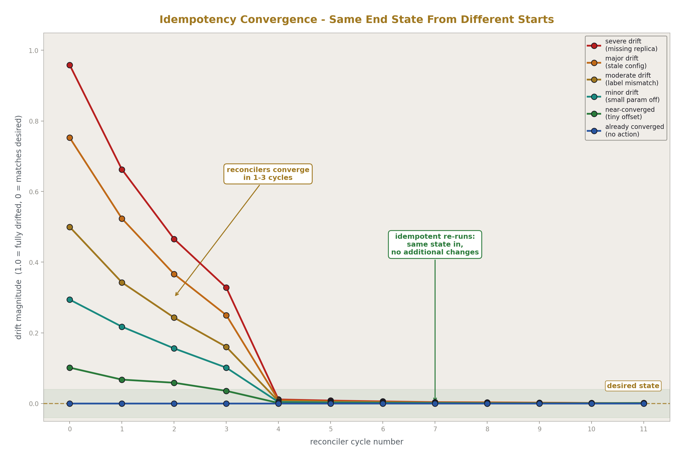
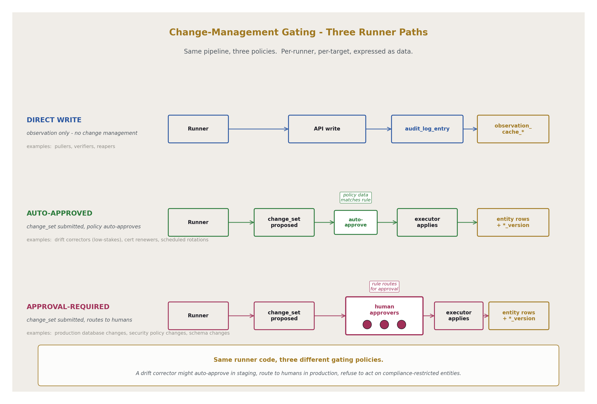
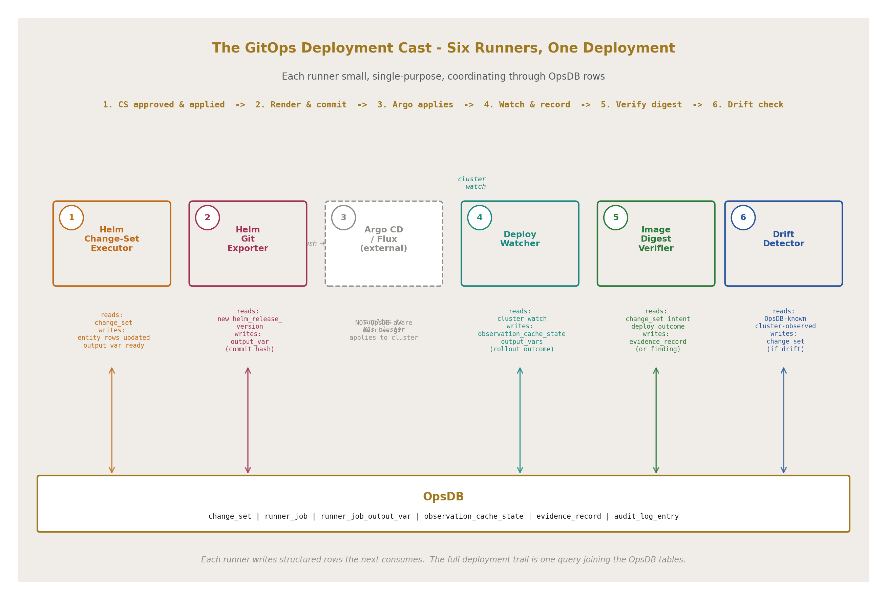
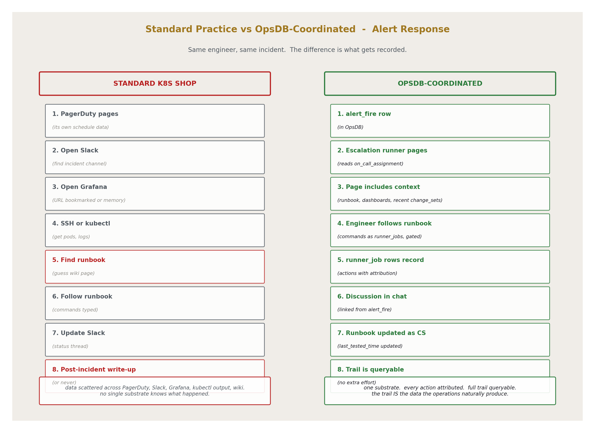

# OpsDB Runner Design
## The Operational Logic Layer Around the OpsDB

**AI Usage Disclosure:** Only the top metadata, figures, refs and final copyright sections were edited by the author. All paper content was LLM-generated using Anthropic's Opus 4.7. 

---

## Abstract

Runners are the operational logic layer around the OpsDB. Each runner reads from the OpsDB, acts in the world, and writes back to the OpsDB. The OpsDB is the runner's only stable interface — the persistent inputs and outputs of every runner are exclusively OpsDB rows. Side effects happen in the world; the trail of those side effects lives in the OpsDB.

This paper specifies the runner pattern, the runner kinds (puller, reconciler, verifier, scheduler, reactor, drift detector, change-set executor, reaper, bootstrapper, failover handler), the shared-library layer that keeps runners small, and the disciplines that govern runner design: idempotency, level-triggering over edge-triggering, bound everything, and per-runner change-management gating. The paper threads a worked example of the GitOps deployment pattern through several sections to show how runners coordinate through shared data without directing each other. The paper compares OpsDB-coordinated operational practice with standard practice in modern Kubernetes shops, showing where the same work produces a complete queryable trail rather than scattered evidence across many tools.

What this paper does not specify: implementation language for runners, deployment platform for runner processes, specific runner code, framework code for shared libraries, Kubernetes tutorials, or GitOps tutorials. Those are organization-specific choices. The runner pattern transfers across all of them.

---

## 1. Introduction

The runner pattern in one sentence: **get from the OpsDB, act in the world, set to the OpsDB**.

The OpsDB design [@OPSDB-2] commits to a passive substrate. The runners specified here are the active layer. Where the OpsDB holds all operational data — configuration, cached observation, schedules, policies, evidence, audit, and the schema's own metadata — runners are the small, single-purpose units of code that read that data, perform operational work, and record what they did. Each runner is small enough to be fully knowable by one team. Each runner is data-defined: its configuration lives in the OpsDB. Each runner is idempotent, level-triggered where possible, and bounded in every dimension.

Runners do not coordinate with each other directly. There is no orchestrator. Coordination happens through shared data — runner B reads what runner A wrote. A runner that crashes does not block any other runner. The next cycle of the crashed runner picks up where it left off. The OpsDB is the rendezvous; the runners are independent processes meeting through data.

This pattern is the operational form of "data is king, logic is shell." The schema persists across decades; the runners churn around it. New runners absorb new operational domains without disturbing the OpsDB or the existing runner population. The framework — shared libraries — keeps runners consistent in how they interact with the world while each runner remains specific to its job.

What this paper specifies: the pattern, the kinds, the shared-library categories, the disciplines, the change-management gating model, the standard-practice contrasts that show how OpsDB-aware runners differ from current operational tooling.

What this paper does not specify: implementation language, deployment platform, specific runner code, specific framework code, tutorials in tools the runners interact with.

---

## 2. The runner pattern

The structural shape every runner shares.

### 2.1 The OpsDB is the runner's only stable interface

Runners read everything they need from the OpsDB. They write everything they produce to the OpsDB. The world — cloud APIs, Kubernetes clusters, vault, hosts, monitoring authorities — is read from and acted upon, but the runner's persistent inputs and outputs are exclusively OpsDB rows.

This is the load-bearing property. Other interfaces a runner might hold to the world are transient: a cloud API call, a Kubernetes API watch, an SSH session, a vault lookup. Each of those interfaces can fail, change, or disappear. The OpsDB is the one stable interface — the schema is versioned and absorbs change additively, the API is governed and uniform, the data is queryable.

By restricting a runner's stable interface to the OpsDB, the runner becomes portable across changes in everything else. A new cloud provider, a new Kubernetes version, a new monitoring system — these are changes to the libraries that wrap the world. The runner reads the same OpsDB rows and writes the same OpsDB rows. Its core stays stable.

### 2.2 Get, act, set

Three phases.

**Get phase.** The runner reads its configuration from `runner_spec_version`. It reads the data it needs to act — desired state, observed state, target lists, policy data, dependency information. All reads go through the OpsDB API. Each row carries metadata indicating its freshness, its source authority, and its version.

**Act phase.** The runner produces side effects in the world or transforms data internally. Calls to authorities through shared libraries. Computations on retrieved data. Decisions about what to do. The act phase is where the runner does its job.

**Set phase.** The runner writes its outcome to the OpsDB. The `runner_job` row records the execution. `runner_job_output_var` rows record discrete outputs. If the runner produced evidence, `evidence_record` rows are written. If the runner observed state, `observation_cache_*` rows are written. If the runner is proposing a change, a `change_set` row is written. Every write goes through the API; every write produces an `audit_log_entry`.

The phases are clean. The get phase produces no side effects. The act phase produces side effects. The set phase records what happened. Tools that mix these phases — a cloud API call inside a "read" function, a database write that triggers a side effect — produce runners that are hard to reason about. The pattern keeps the phases separate.



### 2.3 No runner directs another runner

A runner does not invoke other runners. There is no orchestrator. Coordination is implicit through shared data.

When runner A produces output that runner B needs, runner A writes a row, runner B reads that row on its next cycle. The OpsDB is the rendezvous. If runner A wants runner B to run sooner than its next scheduled time, runner A writes a row that the scheduler runner reads and uses to bring forward runner B's execution. Never a direct invocation.

This pattern preserves several properties. Decentralization: no central component is a single point of failure. Resilience: a crashed runner does not block any other runner. Auditability: the trail of who acted on what is in the data, not in fleeting in-memory state. Independence: each runner can be replaced, restarted, retired, or rewritten without affecting any other runner.

The cost is latency. A runner that produces a row is not invoking the consumer immediately; the consumer reads the row on its next cycle. Where low latency matters, the cycle time can be short, or a reactor pattern (§4.5) can be used. But the default is loose coupling through shared data.

### 2.4 Each runner is small enough to be fully knowable

A team can read the runner's source, predict its behavior, and audit its actions. Typical runner size: 200-500 lines of runner-specific logic. The shared libraries do the heavy lifting: OpsDB API access, retry logic, error handling, logging, notifications, world-side operations.

A runner of 5,000 lines is too big. Either it is doing more than one thing (and should be split) or it is reinventing what the shared libraries provide (and should use them). The discipline of small runners is what makes the runner population scalable: each runner is auditable in isolation; the population's complexity is in its data, not in its code.

### 2.5 Each runner is data-defined

The runner's configuration lives in `runner_spec_version.runner_data_json` in the OpsDB. Changing what the runner does means changing data, not code. Schedules, target selectors, bounds, policies — all data.

This is the same pattern sysync demonstrated at the level of one tool: data-defined, idempotent, deterministic, planned. The runner is the operational generalization. Whatever the runner does, its parameters are data the OpsDB owns and the change-management discipline governs.

---

## 3. The runner lifecycle in detail

The mechanics of one runner execution from invocation to recorded outcome.

### 3.1 Invocation

A runner instance starts. The starting trigger is one of several:

- A scheduler runner (§4.4) enforcing a `runner_schedule` row brings up the runner instance on its target substrate (cron firing, systemd timer firing, Kubernetes CronJob firing, or direct invocation depending on the substrate).
- An event watch firing for a reactor runner.
- A long-running reconciler that has been running and has reached its next cycle interval.
- A change-set executor (§4.7) that has detected an approved change set requiring action.

The runner is invoked. It does not invoke itself. The trigger is external.

### 3.2 Get phase

The runner reads its configuration from `runner_spec_version`, identified by the runner's identity and version. The configuration is `runner_data_json` validated against the runner_spec_type's schema.

The runner then reads the data it needs to act. Examples:

- A puller reads the authority's connection details and the metric or state keys it should pull.
- A reconciler reads desired state (the entity rows for what is intended) and observed state (the cached observation rows for what is actual).
- A verifier reads the schedule and target it should check, and the prior evidence_record for context.
- A change-set executor reads pending change_set rows targeting its scope.

All reads go through the OpsDB API. Each returned row carries metadata: row identity, version, last-updated time, freshness annotation for cached observation rows. The runner inspects the freshness and decides whether the data is fresh enough for the action it intends. A runner acting on hour-old cache when it needed minute-fresh data is a documented failure mode (§13).

### 3.3 Internal computation

The runner computes what it will do. Diff calculation. Decision logic. Target selection. No side effects in this phase.

The output of internal computation is a planned action set. For a reconciler, this is a list of actions to apply. For a verifier, this is the conditions to check. For a change-set executor, this is the field changes to apply. The action set is concrete and inspectable.

### 3.4 Dry-run output

Where the runner spec permits, the planned action set is rendered as inspectable output before execution. The runner emits the action set to a log or to a structured output format the operator can review.

This is the deterministic-in-non-commit-mode property from sysync, generalized. A runner with `runner_data_json` indicating dry-run mode is enabled will produce its planned actions and exit without executing them. Operators run dry-run mode to verify what a runner will do before allowing it to commit.

### 3.5 Act phase

The runner executes the planned actions. Each action goes through a shared library that handles retry, backoff, idempotency markers, and error reporting. Side effects happen here.

Actions are bounded. The runner's `runner_data_json` specifies the per-action retry budget, the per-action timeout, the total cycle time, the maximum number of targets to act on per cycle. If a bound is hit, the action stops and the bound is recorded.

Idempotent actions can be retried safely. Non-idempotent actions carry uniqueness keys that the shared library uses to deduplicate. A runner that performs a non-idempotent action without a uniqueness key is flagged in its runner_spec as requiring special handling (§7.1).

### 3.6 Set phase

The runner writes its outcome.

A `runner_job` row records the execution: started_time, finished_time, job_status (succeeded, failed, partial, timeout), input summary, output summary, log capture summary.

`runner_job_output_var` rows record discrete output variables. Each is a typed key-value pair the runner wishes to expose for downstream consumption. A reconciler that drift-corrected three services writes three output vars, or one output var with a JSON value listing them, or a count plus per-target rows in the appropriate target bridge.

Per-target outcomes go in the runner_job target bridge tables (`runner_job_target_machine`, `runner_job_target_service`, `runner_job_target_k8s_workload`, `runner_job_target_cloud_resource`). Each row carries `per_target_status` and `per_target_data_json`.

If the runner produced evidence, `evidence_record` rows are written with the appropriate `evidence_record_type` and `evidence_record_data_json` payload. If the evidence concerns specific entities, target bridge rows are written.

If the runner observed state, `observation_cache_*` rows are written with `_observed_time`, `_authority_id`, and `_puller_runner_job_id` populated.

If the runner is proposing a change, a `change_set` row is written with `proposed_by_runner_job_id` set, along with `change_set_field_change` rows for the proposed field changes. The change set goes through the validation and approval pipeline like any other change set.

### 3.7 Recorded outcome

Every API write produces an `audit_log_entry`. The full trail is queryable: what runner ran, when, with what input, with what outcome, with what attribution.

The set phase completes. The runner exits (for cycle-based runners) or continues to its next iteration (for long-running runners). The next cycle reads current OpsDB state, including any rows the just-finished runner wrote, and proceeds.

---

## 4. Runner kinds

Each kind corresponds to one or more mechanism families from [@OPSDB-9]. Each subsection covers purpose, inputs, outputs, idempotency model, gating model, and examples.

### 4.1 Puller

Read from an authority, transform to OpsDB schema, write to `observation_cache_*` tables.

The simplest runner shape and the most numerous. A mature OpsDB has dozens of pullers, each consuming one authority or one slice of an authority.

**Inputs.** `runner_spec_version` for configuration. `authority` rows for connection details. Possibly `prometheus_config` or equivalent for the specific keys to pull.

**Outputs.** `observation_cache_metric`, `observation_cache_state`, or `observation_cache_config` rows. `runner_job` row recording the cycle's outcome.

**Idempotency.** A puller reads from the authority and writes the current value. Re-running the puller writes the same current value (or a fresher one). No partial-failure concern because each write is independent and bounded.

**Gating.** Direct write. Pullers do not go through change management; they record observation, not intent.

**Examples.** Prometheus metric scraper writing summary rows. Kubernetes API state puller writing pod status. Cloud control plane scraper writing resource state. Vault metadata puller writing secret-existence rows (never values). Identity provider sync writing group membership.

### 4.2 Reconciler

Read desired state from OpsDB. Read observed state from OpsDB cache or directly from authority where freshness demands it. Compute diff. Decide actions. Execute through shared libraries. Level-triggered. Re-runs on schedule.

**Inputs.** Desired state from the entity rows. Observed state from `observation_cache_*` rows or direct authority queries. Policies governing what actions are allowed.

**Outputs.** `runner_job` row. Per-target rows in the appropriate target bridge. Possibly `change_set` rows if the reconciler proposes changes rather than acting directly.

**Idempotency.** A reconciler that has already brought desired and observed into agreement does nothing on its next cycle. Re-running produces no additional side effects beyond the first run that converged the state.

**Gating.** Varies by target. Direct write for actions that do not need change management (applying configuration to a host whose host_group already grants the runner that authority). Auto-approved change set for routine drift correction. Approval-required change set for higher-stakes operations.

**Examples.** Kubernetes manifest reconciler comparing OpsDB-known workload spec against cluster-observed spec. Configuration drift corrector for hosts in a host group. Certificate renewer triggered by approaching expiration. Capacity adjuster that scales replicas based on metrics. DNS zone reconciler that ensures records match the OpsDB-defined zone.

### 4.3 Verifier

Check that scheduled work happened or scheduled state is correct. Produce `evidence_record` rows.

**Inputs.** A schedule (or a verification policy). The state or operation being verified. Prior `evidence_record` for context.

**Outputs.** `evidence_record` row with `evidence_record_type`, `evidence_record_data_json`, and target bridge rows. `runner_job` row.

**Idempotency.** Each verification cycle produces a new evidence record. The records accumulate; verifiers do not modify prior records.

**Gating.** Direct write. Evidence records are observation, not intent.

**Examples.** Backup verifier confirming today's backup completed and is restorable. Certificate validity scanner checking expiration dates. Compliance scanner evaluating policies against entity configurations. Credential rotation verifier confirming credentials rotated on schedule. Access review confirmer recording quarterly access reviews. Manual operation verifier checking that human-performed operations completed (tape rotation, vendor review, keycard revocation).

### 4.4 Scheduler (enforcement)

Read `runner_schedule` rows from the OpsDB. Enforce them by either triggering target runners directly (within OpsDB-aware infrastructure) or templating schedule data onto target host substrate (cron, systemd timer, Kubernetes CronJob) which then runs locally on schedule.

The scheduler runner is itself a runner. The OpsDB does not invoke runners; the scheduler reads schedule data and applies it to whatever substrate the target runs on.

**Inputs.** `runner_schedule` rows and the `schedule` rows they reference. Target runner_spec rows for the runners being scheduled. Substrate information for where each target runner runs.

**Outputs.** `runner_job` rows recording schedule enforcement actions. Side effects include cron entries written, systemd timers configured, CronJob manifests applied.

**Idempotency.** The scheduler reconciles desired schedule state against observed schedule state on the target substrate. If the cron entry already matches the desired schedule, no action is taken.

**Gating.** Auto-approved change sets for routine schedule application. Approval-required for changes to schedules of high-stakes operations.

**Examples.** Cron entry deployer that ensures host-level cron matches the runner schedules in the OpsDB. Kubernetes CronJob reconciler that ensures cluster CronJobs match. Systemd timer manager.

### 4.5 Reactor

Edge-triggered runner that responds to specific events. Used where low-latency response matters and where a backing reconciler covers missed events.

**Inputs.** An event from a watch or notification source. Configuration from `runner_spec_version`.

**Outputs.** `runner_job` row recording the reaction. Possibly downstream rows depending on the reaction (alert_fire, change_set proposal, observation row).

**Idempotency.** Reactors handle events; the same event arriving twice (replay, retry) must not produce duplicate effects. The shared library that delivers events provides idempotency keys; the runner uses them.

**Gating.** Varies. Most reactors write observation or queue work for other runners; some submit change sets.

**Examples.** Webhook receiver that writes incoming events to the OpsDB. Kubernetes event watcher that writes alert_fire rows for events meeting alert criteria. Ticketing system change handler that updates entity metadata when tickets transition.

Reactors must always be paired with reconcilers that backstop missed events. A pure-reactor runner that depends entirely on event delivery has the failure mode that any missed event becomes a missed action and the system silently diverges from desired state.

### 4.6 Drift detector

A specialization of reconciler that does not act, only proposes. Reads desired vs observed; submits `change_set` rows for human or auto-approval review.

**Inputs.** Same as a reconciler. Desired state, observed state.

**Outputs.** `change_set` rows for proposed corrections. `runner_job` row.

**Idempotency.** A drift detector that has already proposed a correction for current drift does not propose it again until the drift changes or the prior proposal is resolved.

**Gating.** The proposed change sets go through the normal change-management pipeline.

**Examples.** Kubernetes manifest drift detector. Cloud resource drift detector (Terraform-state-style comparison without Terraform). Configuration drift detector for sensitive systems where automatic correction is not desired.

### 4.7 Change-set executor

Reads approved `change_set` rows. Applies the field changes through the OpsDB API. The runner that closes the change-management loop on data-only changes.

**Inputs.** `change_set` rows with `change_set_status='approved'` and not yet `applied`. The associated `change_set_field_change` rows.

**Outputs.** Updates to the targeted entity rows. New `*_version` rows for those entities. Update of the change_set row's status to `applied` with `applied_time`. `runner_job` row.

**Idempotency.** A change set in `applied` status is not re-applied. The executor checks status before acting.

**Gating.** The executor runner has authority to apply approved change sets; the approval is itself the gate. The executor's actions are direct writes after the approval has cleared.

**Examples.** Single change-set executor that reads any approved change set and applies it. Specialized executors per entity class for change sets that require world-side action in addition to OpsDB updates (a Kubernetes workload version change set may have an executor that updates the OpsDB row AND triggers the helm git exporter from §10).

### 4.8 Reaper

Applies retention policies. Trims `observation_cache_*` rows past retention horizon. Trims `runner_job` rows past their retention. Reaps soft-deleted entities whose retention has expired. Never touches change-managed entity history without an explicit retention policy granting it.

**Inputs.** `retention_policy` rows. Tables with retention applicable.

**Outputs.** Deleted rows from cache and short-retention tables. Updated `is_active=false` for entities whose retention has expired. `runner_job` row recording counts trimmed.

**Idempotency.** Reaping is naturally idempotent. Re-running finds no rows past the horizon (because they were already removed) and does nothing.

**Gating.** Direct delete on cache and short-retention tables per the policy. Soft delete on entity tables follows change-management rules (the policy itself is change-managed; applying the policy is not).

**Examples.** Cache reaper trimming `observation_cache_metric` rows older than retention. Job log reaper trimming `runner_job` rows past retention. Tombstone reaper removing soft-deleted rows from versioning siblings whose retention has elapsed.

### 4.9 Bootstrapper

Sets up new machines or environments from minimal state. Operates in the unique condition that the OpsDB may not yet be reachable from the new host (the host is not yet networked, not yet authenticated, not yet registered).

**Inputs.** Templated configuration (the OpsDB-derived configuration baked into the bootstrap image at template-generation time). `host_group` and `package_version` data the runner needs to apply. Once the bootstrap proceeds far enough, fresh OpsDB queries.

**Outputs.** A registered machine in the OpsDB. `runner_job` row recording the bootstrap outcome. Initial observation rows about the new machine.

**Idempotency.** A bootstrap runner that has already fully bootstrapped a machine recognizes the machine's bootstrapped state in the OpsDB (or in local state files written during the prior bootstrap) and either exits cleanly or reconciles any partial state.

**Gating.** The bootstrap runner registers machines; this is a write to the machine table that may be auto-approved per policy or require approval if the host_group is sensitive.

**Examples.** Cloud-init script that pulls templated config, applies it, registers the new VM in the OpsDB. Kubernetes node bootstrap that joins the cluster and registers in the OpsDB. PXE boot finalizer for bare-metal hosts.

The bootstrap runner is the chicken-and-egg case: the OpsDB is the runner's only stable interface, except at first contact. Templated configuration carries the host through the gap until OpsDB connectivity is established.

### 4.10 Failover handler

Detects primary failure. Performs failover through shared libraries. Verifies the failover succeeded. Updates the OpsDB to reflect the new primary.

**Inputs.** Heartbeat or probe data from `observation_cache_state`. Failover policy from `policy` rows. Topology data showing primary/replica relationships.

**Outputs.** Side effects performing the failover. `change_set` rows updating the OpsDB to reflect the new primary. `evidence_record` rows attesting to the failover. `runner_job` row.

**Idempotency.** A failover handler that has already failed over does not fail over again on the next cycle. The runner reads current primary state and acts only if a fresh failure is detected.

**Gating.** Failover often happens under time pressure. The runner may have authority to act unilaterally on detected failures, with post-hoc review (the emergency-change pattern from [@OPSDB-2]). Or the runner may propose failover via change set with a fast-track approval policy.

**Examples.** Database primary-replica failover handler. Load-balancer backend failover. Cluster control-plane failover.

### 4.11 The kinds list is open

The kinds enumerated above are the common ones across operational domains. Organizations add new kinds as their operational reality demands. The pattern transfers: get from OpsDB, act in the world, set to OpsDB; small, single-purpose, data-defined, idempotent, level-triggered where possible, bounded; coordinate through shared data; gated per policy.

A new kind is added by registering a `runner_spec_type` value, defining the schema for its `runner_data_json`, and building runners against the kind. The OpsDB absorbs the addition without restructuring.



---

## 5. The shared-library suite

The library layer that runners draw on. Specified by category and contract; not by implementation. The libraries are the framework that keeps runners small and consistent in how they interact with the world.

### 5.1 OpsDB API client

Authenticated, retry-aware, validation-handling client for the OpsDB API. Every runner uses this; no runner accesses the OpsDB by any other path.

The client surfaces:
- Read operations with freshness annotations and version metadata.
- Write operations with validation failure handling.
- Change-set submission with structured field-change construction.
- Bulk operations.
- Watch streams where supported by the API.

### 5.2 Kubernetes operations

Apply manifests, query state, watch streams, helm operations, kubectl-equivalent functions. Used by runners targeting Kubernetes.

The library wraps the Kubernetes client, adding standardized retry, error mapping (translating Kubernetes errors to the OpsDB-aware error model), and integration with the shared logging layer.

### 5.3 Cloud operations

Provider-agnostic interface with provider-specific backends. AWS, GCP, Azure, and others are wrapped behind common operations: provision resource, query resource, modify resource, decommission resource. Provider-specific payloads pass through as `cloud_data_json`.

The library handles authentication per provider, retry per provider's rate limits, and structured error mapping.

### 5.4 Secret access

Pulls from vault, sops, KMS, or other secret backends at runtime. Returns the secret in memory only; the library ensures the secret is not logged, not written to the OpsDB, not persisted in any runner state.

The library integrates with the OpsDB by reading `k8s_secret_reference` rows or configuration variables of type `secret_reference` to know which backend to consult.

### 5.5 Logging and metrics emission

Uniform format the organization consumes. Structured logs with correlation IDs tying log lines to runner_job rows. Metrics emitted to the organization's metrics infrastructure.

The library is mandatory: every runner uses it. Logs that bypass the library produce inconsistent output across the runner population.

### 5.6 Retry, backoff, idempotency markers

Patterns wrapped in helpers. Token-bucket retry budgets. Exponential backoff with jitter. Uniqueness-key generation for idempotent operations on non-idempotent APIs.

The library exposes simple decorators or wrappers; runner code calls them rather than implementing retry logic directly.

### 5.7 Notifications

Email, chat, page through configured channels. Used by runners that need to communicate with humans (escalation, approval requests, alerts). The channels and routing are configured in the OpsDB; the library reads the configuration and dispatches.

### 5.8 SSH and remote command execution

For legacy substrate that does not have a richer API. Used sparingly; preferred only when no API alternative exists.

### 5.9 Git operations

Clone, commit, push, tag, pull-request creation. Used by GitOps integration runners.

### 5.10 Why shared libraries matter

Runners stay small because the libraries do the heavy lifting. A runner that does PVC repair, written against the suite, is perhaps 200 lines: 150 lines of PVC-repair-specific logic, 50 lines of glue using the libraries for OpsDB access, Kubernetes operations, retry, and logging. Without the suite, the same runner might be 1,500 lines, with most of the additional lines being reinvented basics.

Reinvented basics are the aggregate failure mode applied at the runner layer. Two runners that both implement retry will implement it slightly differently. Their failure modes diverge. Their logs look different. Their behavior under load differs. The shared-library suite is what prevents this divergence.

The suite evolves like any code: versioned, tested, released. Runners pin to library versions and upgrade through change sets like any other config.

### 5.11 One way to do each thing per DOS

The shared-library suite is the framework's enforcement of "one way to do each thing." The framework is one thing; the runners using it are many. Inconsistency at the runner level (different runner kinds doing different jobs) is fine; inconsistency at the framework level (two retry implementations, two logging formats, two ways of accessing the OpsDB) is the failure mode.



---

## 6. Coordination through shared substrate

How runners coordinate without orchestration.

### 6.1 Reading each other's outputs

Runner B's input is some runner A's previously-written output. The output may be:

- `runner_job_output_var` rows from a prior runner_job
- `observation_cache_*` rows written by a puller
- `evidence_record` rows written by a verifier
- `change_set` rows written by a drift detector

Runner B reads the rows on its next cycle. The data is the coordination. Runner A and Runner B do not communicate; they meet through the data.

### 6.2 Submitting change sets

A runner that detects a needed change submits a change set. Whether the change set auto-approves or routes to humans depends on policy. The change-set executor (or specialized executor for the entity class) picks it up when approved and applies it.

The change-management pipeline is the coordination mechanism for runners that propose intent. The runner does not know which other runner will pick up its proposal; it submits, and the discipline routes.

### 6.3 Triggering through the OpsDB

When runner A wants runner B to run sooner than its next scheduled time, runner A writes a row that runner B reads on its next cycle, or that the scheduler runner reads to bring forward runner B's next execution. Never a direct invocation.

This indirection costs a cycle of latency. For most operations the cost is acceptable; cycles are short. For operations where latency matters, the reactor pattern (§4.5) provides faster response, paired with reconcilers as backstop.

### 6.4 Independence of runtime presence

A runner that crashes does not block any other runner. The next cycle of the crashed runner picks up where it left off, reading current state from the OpsDB. Other runners that were waiting for its output continue to wait, then proceed when the data appears.

This is the level-triggered-over-edge-triggered principle from [@OPSDB-9] applied to runner coordination. Runners react to current state of the OpsDB, not to event streams from each other.



---

## 7. The three load-bearing disciplines

Three principles dominate runner design. Each is non-negotiable; runners that violate any of them are documented exceptions, not the rule.

### 7.1 Idempotency

Every runner action must be safely retryable. The same inputs produce the same end state when the runner runs once or many times.

**Idempotency at the runner level.** Re-running the runner with the same inputs and same observed state produces no additional side effects beyond the first run that converged the state. A reconciler that has already brought desired and observed into agreement does nothing on its next cycle.

**Idempotency at the action level.** Each shared-library call is itself idempotent or carries uniqueness keys to make it so. The library handles the mechanics; the runner provides keys where needed.

**Non-idempotent operations.** Some operations are not naturally idempotent (sending an email, charging a payment, triggering a one-shot action that has external consequences). These are flagged in the runner_spec.runner_data_json so operators know they require special handling. Where uniqueness keys can be applied (idempotency keys for HTTP requests, operation IDs for cloud APIs), the library handles them.

The OpsDB schema supports idempotency through fields like `change_set_field_change.applied_status` and uniqueness markers on appropriate rows. A runner that sees `applied_status='applied'` does not re-apply.



### 7.2 Level-triggered over edge-triggered

Runners read current state and act on it, rather than reacting to event streams as the only source of truth.

The default runner shape is a reconciler that re-evaluates current state on every cycle. Reactors exist where low-latency event response is genuinely needed, but they are paired with reconcilers that backstop missed events.

A runner that depends on event delivery without level-triggered backstops is the documented failure mode. If events are missed (network partition, message broker outage, runner crash during event delivery), the runner silently diverges from desired state. The system has no way to know it diverged.

The schema supports level-triggering through `observation_cache_*` rows that always reflect current observed state, through `runner_spec.runner_spec_type` distinguishing reconciler from reactor, and through reconciler runners reading both desired and observed state on every cycle.

### 7.3 Bound everything

Every runner has explicit bounds.

- Bounded retry budget per action.
- Bounded execution time per cycle.
- Bounded queue depth where the runner queues work.
- Bounded memory.
- Bounded scope per cycle (a runner that processes 10,000 entities per cycle, not unbounded).

Bounds are recorded in `runner_spec_version.runner_data_json`. The runner enforces bounds at runtime. The `runner_job` row records what bound was hit if execution stopped early.

Operators can query "which runners are hitting their bounds" to find runners that need scaling, splitting, or investigation. A runner that consistently hits its execution-time bound is a candidate for splitting (its job is too big for one cycle); a runner that consistently hits its retry budget is a candidate for investigation (its target authority may be unhealthy).

---

## 8. Change-management gating per runner

Three gating modes, expressible as policy data per runner.

### 8.1 Direct write

The runner writes observation-only data: `observation_cache_*`, `runner_job`, `runner_job_output_var`, `evidence_record`, `audit_log_entry`. These do not go through change management. Audit records every write, but no approval is required.

Pullers, verifiers, reapers (acting on observation tables), and most reactors fall here. The runner's job is to record what is, not to change what should be.

### 8.2 Auto-approved change set

The runner submits change sets that auto-approve under specific policies. The change set is recorded, the audit trail exists, the policy evaluates the rule and approves automatically without human intervention.

Drift correctors for low-stakes config, automatic certificate renewers, scheduled credential rotations, automatic minor patch upgrades — these benefit from auto-approval because the action is routine and the alternative (waiting for a human approver) is more risky than the action itself.

The policy is per-rule, expressible against entity types, namespaces, fields, and metadata. The same runner that auto-approves drift correction in staging may submit approval-required change sets when targeting production.

### 8.3 Approval-required change set

The runner submits change sets that route to human approvers. The runner does not act unilaterally; it proposes, and humans (or higher-authority runners with explicit policy authority) approve.

Production database changes, security policy changes, compliance-scope changes, schema changes, changes to high-severity alert configurations — these route to humans. The runner's role is to detect and propose; the human's role is to evaluate and approve.

### 8.4 Per-target gating

The gating mode is per-runner-spec and per-target. The same runner code can have different gating for different targets, expressed as policy rules.

A drift-correction runner might:
- Auto-approve corrections in staging (low stakes, fast iteration desired).
- Auto-approve corrections in production for a defined set of low-risk fields (timeouts, replica counts within bounds).
- Require approval for any change to fields outside the low-risk set.
- Refuse to act on entities tagged compliance-restricted, instead filing a finding for compliance team review.

All four behaviors come from policy rules, not from runner code. The runner asks the API for its allowed gating per target; the API evaluates the rules and answers.

### 8.5 Runner authority is data

The pattern that emerges: a runner is not privileged. It has authority that the OpsDB grants, expressed as data, evaluated by the API. Changing what a runner can do is changing data, not code. The runner code remains the same; the policies governing its actions evolve.

This pattern keeps automation governed by the same discipline as human action. A runner that "has admin rights" is a runner that violates the OpsDB design. Every runner's capabilities are scoped, audited, and revisable through change management.



---

## 9. Stack-walking and dependency-aware runners

Using the substrate hierarchy from [@OPSDB-4] §6 to make decisions simpler tools cannot.

### 9.1 The substrate walk

A pod walks up through `megavisor_instance.parent_megavisor_instance_id` to its node, the underlying VM, the bare metal or cloud resource, the rack location or cloud region. A cloud resource walks similarly to its account, region, provider. The walk is a single self-join chain.

### 9.2 Decisions enabled by walking

Runners that walk the substrate can make decisions a flat-view tool cannot.

**Decommission awareness.** A reconciler that won't touch a service whose underlying VM is being decommissioned. The runner walks from service → host_group → machine → megavisor_instance → checks for `decommissioned_time` in any active row or pending change set in the chain. If found, the runner skips the action and logs why.

**Failure-domain analysis.** A failover runner that needs to verify primary and replica do not share failure domains. Walks the stack from primary and replica, compares ancestry, refuses to perform failover if rack or DC is shared (which would mean the failover offers no resilience).

**Capacity awareness.** A capacity reconciler that walks Kubernetes nodes to underlying machines to underlying hardware sets to compute available headroom across the substrate. The runner sees not just what the cluster reports but what the underlying hardware can actually support.

**Dependency-aware change validation.** A change-set validator that walks `service_connection` rows from the targeted service to its dependents. If the proposed change would break a downstream contract, the validator files a warning or rejects the change.

**Locality-aware deployment.** A deployment runner that walks from a service to its preferred locations and from each location to available capacity. The runner schedules pods or VMs in locations where capacity exists and locality matches policy.

### 9.3 Why the walks matter

The decisions enabled by walking are the decisions that produce robust operations. A runner that does not walk is operating on the local view; a runner that walks operates on the structural view. The same runner code, with walking added, makes better decisions.

The schema enables the walks because [@OPSDB-4]'s substrate hierarchy is unified — bare metal, cloud, virtualization, containers, pods all participate in one self-join tree. The runner does not need to know which substrate type it is dealing with; the walk is uniform.

---

## 10. The GitOps integration pattern

The worked example threaded through several sections of this paper. Helm values resolved from change set, exported to git, applied by Argo CD or Flux, observed back into the OpsDB, verified, the trail composed.

### 10.1 The cast of runners

Six runners coordinate one helm-via-gitops deployment.

**Runner 1: helm change-set executor.** Reads approved `change_set` rows targeting `k8s_helm_release_version` and the `configuration_variable` rows scoped to it. Updates the entity rows. Writes a `runner_job_output_var` indicating the new version is ready for export.

**Runner 2: helm git exporter.** Reads the output var from Runner 1. Resolves the configuration variables, including secret references resolved at render time (with secrets pulled from vault and embedded only via sealed-secret or equivalent). Renders the helm values file. Commits to the appropriate git repo with a structured commit message linking back to the change_set ID. Tags with the change_set ID. Writes a `runner_job_output_var` with the commit hash and repo identity.

**Runner 3: Argo CD or Flux.** Not an OpsDB runner. An external tool watching git, applying to the cluster. The OpsDB is not involved in this step.

**Runner 4: Kubernetes deploy watcher.** Watches the cluster's deployment status via the Kubernetes watch API. Writes pod state transitions to `observation_cache_state`. On rollout completion (success or failure), writes `runner_job_output_var` rows with rollout_succeeded, pod_count, image_digest_deployed, and any error details.

**Runner 5: image digest verifier.** Reads the change_set's intended image digests and the output vars from Runner 4 with actual deployed digests. Compares. Writes an `evidence_record` with `evidence_record_type='deployment_verification'`. If mismatch, files a `compliance_finding`.

**Runner 6: drift detector.** On schedule (independent of any specific deployment), compares OpsDB-known helm release version against cluster-observed helm release version. If drift, files a finding or auto-corrects per policy.

### 10.2 The trail

The trail of one deployment is queryable as a join.

```
change_set
  → change_set_field_change
  → runner_job (helm change-set executor)
    → runner_job_output_var (new version ready)
  → runner_job (helm git exporter)
    → runner_job_output_var (commit hash)
  → runner_job (deploy watcher)
    → runner_job_output_var (rollout outcome)
    → observation_cache_state (pod transitions)
  → evidence_record (digest verification)
  → audit_log_entry (every API write throughout)
```

Every row links by ID. The full trail is one query joining the tables. An auditor querying "show me every production deployment in the last quarter and its outcome" gets a structured result, not a scattered set of CI logs and Slack threads.

### 10.3 The disciplines preserved

The OpsDB is source of truth for intent — the change_set and helm release version describe what was wanted.

Git is source of truth for what's checked in to be applied — Argo CD reconciles git-to-cluster.

The cluster is source of truth for live state — pulled into the OpsDB cache via Runner 4.

The OpsDB is source of truth for the trail — all of the above tied together by IDs.

Each discipline is preserved by a small, single-purpose runner. The trail composes because each runner writes structured output the next runner consumes.

### 10.4 Variations

The same cast of runners handles variations of the pattern.

**Fixed-version deployment.** The change set pins exact image digests. Runner 5 verifies the deployed digests match. The pinning is data; no runner code changes.

**Tag-tracking deployment.** A runner reads the artifact registry's current tag, submits a change set with the resolved digest. The change set then flows through the cast normally.

**Promotion (staging to production).** A runner reads staging's deployed digest from the OpsDB cache, submits a production change set with that digest. The change set goes through approval per production policy, then flows through the cast.

**Rollback.** A change set restoring a prior helm release version's values. The cast processes it like any other change set; the deployment goes back.

In all variations, the runner cast is the same and the trail composes the same way. Variation is in the data — what change set is submitted, by whom, with what rules — not in the operational logic.



---

## 11. Standard practice vs OpsDB-coordinated practice

Side-by-side walkthroughs of common operational scenarios. Each scenario shows how it goes today in a typical Kubernetes shop and how it goes in an OpsDB-coordinated shop. The contrast is not that the second is shorter — it is that the second produces a complete, queryable, auditable trail without extra effort.

### 11.1 Alert response

**Standard.** PagerDuty pages the on-call engineer. PagerDuty has its own schedule data. Engineer opens Slack to find the incident channel. Engineer opens Grafana to see the dashboard, URL bookmarked or remembered. Engineer SSHes to a bastion or kubectls into the cluster. Engineer runs `kubectl get pods -n production` to find the service. Engineer runs `kubectl logs <pod>` to see what's happening. Engineer guesses or recalls which runbook applies; opens the wiki, finds the runbook. Engineer follows the runbook steps, maybe runs commands, maybe restarts something. Engineer updates the incident channel with status. Post-incident, engineer writes the runbook update somewhere, or doesn't.

The data is scattered. PagerDuty has the schedule. Grafana has the dashboard. kubectl output is ephemeral. The wiki has the runbook (maybe). Slack has the discussion. No single substrate knows what happened.

**OpsDB-coordinated.** Alert fires. `alert_fire` row appears in the OpsDB. The escalation runner reads `service_escalation_path` for the affected service, queries `on_call_assignment` for the current on-call user, sends the page through the configured channel.

The page includes a link to a service incident view that resolves: the service's `runbook_reference` (with last-tested time visible), the relevant `dashboard_reference` URLs, the recent `change_set` history (was anything deployed recently?), the recent `evidence_record` history (did backup verification fail?), the dependent services from `service_connection`, the on-call schedule for upstream services.

The engineer sees one page with the resolved context. They follow the runbook. If the runbook has documented commands, those commands are runner invocations submitted as runner_job requests, going through the change-management gating policy (auto-approved for low-stakes operations, approval-required for higher-stakes).

As the engineer takes actions, runner_job rows record what was done with attribution. The incident channel is a chat authority pointer linked from the alert_fire; discussion happens there but the structured trail is in the OpsDB.

Post-incident, the runbook is updated through a change set; the runbook_reference's last_tested_time is updated; the new version is in version history.



### 11.2 Deployment

**Standard.** Developer opens a pull request. CI runs. Argo CD syncs or someone runs `kubectl apply`. The team hopes it worked. Datadog or Grafana is checked later, or not.

**OpsDB-coordinated.** Developer submits a change_set targeting the helm release version. Validation runs (lint, schema, semantic, policy). Approval routes per policy. Approved change set triggers the helm git exporter (Runner 2 from §10). Argo CD applies to the cluster. The deploy watcher (Runner 4) records the rollout. The image digest verifier (Runner 5) confirms. An evidence record is produced. The full trail (§10.2) is queryable.

### 11.3 Certificate renewal

**Standard.** A cron job somewhere runs cert-manager or an ACME client. It renews. Hopefully it worked. The team gets alerted when certs are 7 days from expiring, or doesn't.

**OpsDB-coordinated.** `certificate_expiration_schedule` rows define when each cert needs renewal. A certificate renewal runner reads the schedule, performs the renewal via the shared library, writes an `evidence_record` confirming the new cert. A drift detector confirms the new cert is in place. If renewal fails, a `compliance_finding` is filed.

### 11.4 Compliance evidence collection

**Standard.** An auditor arrives. The auditor requests evidence. The team scrambles to assemble screenshots and tickets and Slack threads. The team produces a binder. The auditor accepts on faith because the alternative is unworkable.

**OpsDB-coordinated.** `compliance_audit_schedule` rows fire verifier runners on a continuous cadence. `evidence_record` rows accumulate throughout the year. `compliance_finding` rows track gaps as they appear and resolve. The auditor queries the OpsDB directly with read-only access. The auditor sees the same data the team sees. Audit is verification of mechanism, not assembly of evidence.

### 11.5 Drift correction

**Standard.** Nobody knows about the drift until it causes an incident, or a manual audit catches it months later.

**OpsDB-coordinated.** The drift detector runs on schedule. Drift is found within one cycle. Per policy, the detector either auto-corrects via change set or files a finding for human review. Drift never accumulates past detection cycle.

### 11.6 The pattern across scenarios

The OpsDB-coordinated version is not magic. It is the same operational work, structured. The structure is what produces the queryable trail, the automatable verification, and the auditable history.

The work itself is performed by humans and by runners. The OpsDB is what ties the work together. Where standard practice scatters evidence across many tools, OpsDB-coordinated practice composes evidence from the data the operations naturally produce.

---

## 12. Designing new runners

Guidance for organizations adding runner kinds the paper does not enumerate. The discipline transfers; the specifics adapt.

### 12.1 Identify the inputs

What OpsDB rows does the runner read? What authorities does it consult? List them. The list shapes the runner's get phase.

### 12.2 Identify the outputs

What OpsDB rows does the runner write? What side effects does it produce? List them. The list shapes the runner's set phase and determines the gating mode.

### 12.3 Choose the gating

Direct write (observation only), auto-approved change set, or approval-required change set. The choice depends on what the runner writes and how high the stakes are.

### 12.4 Choose the trigger

Scheduled, event-triggered, invoked by another runner's data, or long-running. The trigger determines the runner's invocation pattern (§3.1).

### 12.5 Specify the bounds

Retry budget, execution time, scope per cycle, queue depth, memory. Record in `runner_spec_version.runner_data_json`.

### 12.6 Define idempotency

What does "the same end state" mean for this runner? What uniqueness keys does it need? If idempotency cannot be achieved, document why and how operators handle the runner's special case.

### 12.7 Write the runner spec

Add a `runner_spec` row with the appropriate `runner_spec_type` and `runner_data_json` schema. Register the JSON schema with the API for validation.

### 12.8 Build the runner

Small, single-purpose, using the shared libraries. Test the get-act-set cycle. Verify dry-run mode produces inspectable output. Test idempotency by running twice with the same state and verifying the second run does nothing or the same thing.

### 12.9 Deploy through normal change management

The runner's code is in the registry; the runner's spec is in the OpsDB; the runner's deployment is a change set that creates the `runner_machine` row mapping a machine to the runner_spec. The runner becomes operational once the change set commits and the runner spec's substrate notices the new role.

---

## 13. Anti-patterns

What runners should not do.

**Orchestrating other runners directly.** A runner does not invoke other runners. Coordination is through OpsDB rows. Direct invocation creates the orchestrator failure mode the OpsDB design refuses.

**Storing state outside the OpsDB.** A runner's persistent state lives in the OpsDB (its runner_job rows, its output_var rows). Local files for caching are fine if the cache is rebuildable; persistent local state that the OpsDB does not reflect is forbidden. A runner that keeps "what I did last time" in a local file violates the design — that information belongs in the OpsDB where any other runner or query can see it.

**Reinventing what shared libraries provide.** If the suite has a retry helper, the runner uses it. If the suite has a Kubernetes client, the runner uses it. Runners that bypass the suite produce the inconsistency the suite exists to prevent.

**Acting on stale cache without freshness checks.** Runners that read `observation_cache_*` rows check `_observed_time` and decide whether the data is fresh enough for the action. A runner that acts on hour-old cache when minute-fresh data was needed is the failure mode. The freshness check is part of the get phase.

**Embedding logic in template variables.** Configuration variables are values. Templates substitute values. Logic that depends on template-time computation belongs in upstream runners that produce concrete values, not in the templates themselves. Sysync's stance applies generally: keep templating dead simple, do the complex resolution upstream as data, hand the leaf tool concrete values.

**Skipping the audit trail.** Every write goes through the API. Every API call produces audit. A runner that bypasses the API to avoid audit is a runner that violates the OpsDB design. There is no out-of-band path.

**Long-running runners that hold state in memory across cycles.** A runner is a process that runs, completes, and exits — or a long-running process whose persistent state nonetheless lives in the OpsDB. Long-running runners that accumulate state in memory eventually crash and lose the state. The pattern: runners check OpsDB on each cycle for the state they need. In-memory state is for the duration of one cycle; persistent state is in the OpsDB.

**Runners that span multiple operational domains.** A "deployment runner" that also does monitoring and alerting and capacity is too big. Split into deployment runner, monitoring runner, alerting runner, capacity runner. Each does one thing.

**Runners with privileged authority not expressed as policy.** A runner that "has admin rights" implicitly is a runner whose authority is invisible to the OpsDB design. All runner authority is data — policy rows the API consults. A runner whose authority is hardcoded into its runtime environment violates the design.

**Treating the OpsDB as a queue.** The OpsDB is a database. A runner can read pending change_set rows, but the pattern is "read state, decide action, act." A runner that polls the OpsDB as if it were a message queue and treats every row as a job is misusing the substrate. The change-set executor is a special case where queue-like consumption is appropriate; most runners reconcile state, not consume work units.

**Runners that bypass change management to make changes faster.** Emergency changes have a defined break-glass path with post-hoc review ([@OPSDB-2] §9.12). Runners that route around change management for any other reason are violating the discipline. Faster is not better than auditable.

---

## 14. Closing

This paper has specified the runner pattern: the operational logic layer around the OpsDB. Each runner reads from the OpsDB, acts in the world through shared libraries, and writes back to the OpsDB. The OpsDB is the runner's only stable interface. Coordination happens through shared data, never through direct runner-to-runner invocation. The shared-library suite keeps runners small and consistent. Idempotency, level-triggering, and bound everything are non-negotiable disciplines. Per-runner change-management gating is policy expressed as data.

The runner kinds — puller, reconciler, verifier, scheduler, reactor, drift detector, change-set executor, reaper, bootstrapper, failover handler — are common shapes the operational reality demands. The list is open; new kinds emerge as new operational domains are added to the OpsDB. The pattern transfers; the specifics adapt.

The contrast with standard Kubernetes shop practice is not that the OpsDB-coordinated version is shorter or simpler. It is that the same operational work produces a complete, queryable, auditable trail without extra effort, because the trail is the data the operations naturally produce. Alert response, deployment, certificate renewal, compliance evidence collection, drift correction — each becomes a structured set of runner cycles producing structured rows that humans, automation, and auditors all read from one substrate.

The runner pattern is the operational logic form of "data is king, logic is shell." The shell churns; the data persists. New runners absorb new domains without disturbing existing runners or the OpsDB. The framework — shared libraries — keeps the population consistent. The policies governing runners are themselves data, change-managed and audited like any other configuration. The discipline is what produces the result.

---

## Appendix A: Runner kind reference table

| Kind | Primary OpsDB reads | Primary OpsDB writes | Gating | Trigger |
|---|---|---|---|---|
| Puller | runner_spec_version, authority, prometheus_config | observation_cache_*, runner_job | Direct | Scheduled |
| Reconciler | entity rows (desired), observation_cache_* (observed) | runner_job, target bridges, change_set | Auto/approval per target | Scheduled, long-running |
| Verifier | schedule, target entity, prior evidence_record | evidence_record, target bridges, runner_job | Direct | Scheduled |
| Scheduler (enforcement) | runner_schedule, runner_spec, target substrate | runner_job, side effects on substrate | Auto-approved | Long-running |
| Reactor | event from authority, runner_spec_version | runner_job, alert_fire, observation rows | Varies | Event |
| Drift detector | entity rows (desired), observation_cache_* (observed) | change_set, runner_job | Through change_set discipline | Scheduled |
| Change-set executor | change_set, change_set_field_change | entity rows, *_version rows, runner_job | Direct after approval | Triggered by approved change_set |
| Reaper | retention_policy, target tables | deletes from target tables, runner_job | Direct | Scheduled |
| Bootstrapper | templated config, host_group, package_version | machine, observation, runner_job | Auto-approved | Triggered on new host |
| Failover handler | observation_cache_state, policy, topology | change_set, evidence_record, runner_job, side effects | Emergency or approval per policy | Event or scheduled |

---

## Appendix B: Skeletal runner pseudocode by kind

Language-agnostic. Shape only — get/act/set phases visible.

### B.1 Puller

```
spec = opsdb.read("runner_spec_version", id=my_spec_id)
authority = opsdb.read("authority", id=spec.authority_id)
keys_to_pull = spec.runner_data_json.keys

job_id = opsdb.create("runner_job", started_time=now, ...)

for key in keys_to_pull:
    value = libs.authority_query(authority, key)
    opsdb.write("observation_cache_metric",
                authority_id=authority.id,
                metric_key=key,
                metric_value=value,
                _observed_time=now,
                _puller_runner_job_id=job_id)

opsdb.update("runner_job", id=job_id, finished_time=now, status="succeeded")
```

### B.2 Reconciler

```
spec = opsdb.read("runner_spec_version", id=my_spec_id)
desired = opsdb.read_many(spec.runner_data_json.desired_query)
observed = opsdb.read_many(spec.runner_data_json.observed_query)

job_id = opsdb.create("runner_job", started_time=now, ...)

diff = compute_diff(desired, observed)
actions = decide_actions(diff, spec.runner_data_json.policies)

if spec.runner_data_json.dry_run:
    log_planned_actions(actions)
    opsdb.update("runner_job", id=job_id, finished_time=now, status="dry_run")
    exit

for action in actions:
    if action.requires_change_set:
        opsdb.create("change_set",
                     proposed_by_runner_job_id=job_id,
                     ...)
    else:
        result = libs.execute_action(action)
        opsdb.create("runner_job_target_<entity_type>",
                     runner_job_id=job_id,
                     <entity>_id=action.target_id,
                     per_target_status=result.status)

opsdb.update("runner_job", id=job_id, finished_time=now, status="succeeded")
```

### B.3 Verifier

```
spec = opsdb.read("runner_spec_version", id=my_spec_id)
target = opsdb.read(spec.runner_data_json.target_table,
                    id=spec.runner_data_json.target_id)

job_id = opsdb.create("runner_job", started_time=now, ...)

condition_result = check_condition(target, spec.runner_data_json.condition)

evidence_id = opsdb.create("evidence_record",
                           evidence_record_type=spec.runner_data_json.evidence_type,
                           evidence_record_data_json=condition_result.detail,
                           produced_by_runner_job_id=job_id,
                           evidence_status="passed" if condition_result.ok else "failed",
                           observed_time=now)

opsdb.create("evidence_record_<target_type>_target",
             evidence_record_id=evidence_id,
             <target>_id=target.id,
             per_target_status="passed" if condition_result.ok else "failed")

if not condition_result.ok:
    opsdb.create("compliance_finding",
                 finding_severity=spec.runner_data_json.severity_on_fail,
                 finding_description=condition_result.detail,
                 filed_by_evidence_record_id=evidence_id)

opsdb.update("runner_job", id=job_id, finished_time=now, status="succeeded")
```

### B.4 Change-set executor

```
spec = opsdb.read("runner_spec_version", id=my_spec_id)
approved_change_sets = opsdb.read_many("change_set",
                                       status="approved",
                                       not_yet_applied=True)

for cs in approved_change_sets:
    job_id = opsdb.create("runner_job", started_time=now, ...)

    field_changes = opsdb.read_many("change_set_field_change",
                                    change_set_id=cs.id)

    apply_succeeded = true
    for fc in sorted(field_changes, by=apply_order):
        try:
            opsdb.update_field(fc.target_entity_type,
                               fc.target_entity_id,
                               fc.target_field_name,
                               fc.after_value)
            opsdb.update("change_set_field_change",
                         id=fc.id,
                         applied_status="applied")
        except Error as e:
            opsdb.update("change_set_field_change",
                         id=fc.id,
                         applied_status="failed",
                         applied_error_text=str(e))
            apply_succeeded = false
            break

    if apply_succeeded:
        opsdb.update("change_set", id=cs.id,
                     status="applied",
                     applied_time=now)
    else:
        opsdb.update("change_set", id=cs.id,
                     status="failed")

    opsdb.update("runner_job", id=job_id, finished_time=now, ...)
```

### B.5 Drift detector

```
spec = opsdb.read("runner_spec_version", id=my_spec_id)
desired = opsdb.read_many(spec.runner_data_json.desired_query)
observed = opsdb.read_many(spec.runner_data_json.observed_query)

job_id = opsdb.create("runner_job", started_time=now, ...)

drifts = compute_diff(desired, observed)

for drift in drifts:
    existing_proposal = opsdb.read_one(
        "change_set",
        proposed_by_runner_job_id_in_recent_jobs_for_this_spec=true,
        targets_entity=drift.entity,
        status_in=["draft", "pending_approval", "approved"]
    )

    if existing_proposal:
        continue  # already proposed; do not re-propose

    opsdb.create("change_set",
                 proposed_by_runner_job_id=job_id,
                 reason_text="Drift detected: " + drift.summary,
                 ...)
    opsdb.create("change_set_field_change", ...)

opsdb.update("runner_job", id=job_id, finished_time=now, status="succeeded")
```

---

## Appendix C: GitOps deployment trail — the full join

A query retrieving one deployment's full trail. Schema-relative; not engine-specific.

```
SELECT
    cs.id AS change_set_id,
    cs.reason_text,
    cs.applied_time,
    cs_executor_job.id AS executor_job_id,
    git_export_job.id AS git_export_job_id,
    git_export_var.var_value AS commit_hash,
    deploy_watcher_job.id AS watcher_job_id,
    deploy_watcher_var.var_value AS image_digest_deployed,
    digest_verifier_evidence.id AS evidence_id,
    digest_verifier_evidence.evidence_status AS verification_status
FROM change_set cs

LEFT JOIN runner_job cs_executor_job
    ON cs_executor_job.id = cs.applied_by_runner_job_id

LEFT JOIN runner_job git_export_job
    ON git_export_job.runner_spec_id = (helm_git_exporter_spec_id)
    AND git_export_job.input_references_change_set_id = cs.id

LEFT JOIN runner_job_output_var git_export_var
    ON git_export_var.runner_job_id = git_export_job.id
    AND git_export_var.var_name = 'commit_hash'

LEFT JOIN runner_job deploy_watcher_job
    ON deploy_watcher_job.runner_spec_id = (deploy_watcher_spec_id)
    AND deploy_watcher_job.references_helm_release_version_id = (
        SELECT after_value FROM change_set_field_change
        WHERE change_set_id = cs.id
          AND target_field_name = 'helm_release_version_id'
    )

LEFT JOIN runner_job_output_var deploy_watcher_var
    ON deploy_watcher_var.runner_job_id = deploy_watcher_job.id
    AND deploy_watcher_var.var_name = 'image_digest_deployed'

LEFT JOIN evidence_record digest_verifier_evidence
    ON digest_verifier_evidence.evidence_record_type = 'deployment_verification'
    AND digest_verifier_evidence.references_change_set_id = cs.id

WHERE cs.id = :target_change_set_id
```

Every row links by ID. The full trail is one query. The `audit_log_entry` rows for each API write are queryable separately filtered by the involved entity IDs.

---

## Appendix D: Mapping standard tools to runner kinds

| Tool | Fills which runner-kind slot | What OpsDB-aware extension adds |
|---|---|---|
| Argo CD / Flux | External cluster reconciler (sits between git and cluster) | OpsDB-side write of intent (change_set), OpsDB-side write of observed outcome (deploy watcher), trail composition |
| Crossplane | Reconciler for cloud resources via Kubernetes API | OpsDB-side write of cloud_resource state and change_set governance |
| Pulumi / Terraform | Apply-engine for infrastructure | OpsDB-side change_set submission and applied-state recording |
| Salt / Ansible / Puppet | Reconciler for hosts | OpsDB-side host_group definition and applied-state recording (the sysync model) |
| cert-manager | Reconciler for certificates in Kubernetes | OpsDB-side certificate inventory and evidence_record production |
| external-dns | Reconciler for DNS | OpsDB-side DNS zone definition and observed-state recording |
| Velero | Reconciler for Kubernetes backups | OpsDB-side backup schedule, evidence_record per backup, verification runner |
| Prometheus | Metric collection authority | OpsDB-side prometheus_config, observation_cache_metric writes by puller |
| PagerDuty / Opsgenie | Page delivery authority | OpsDB-side alert_fire, escalation runner, on_call_assignment |

The OpsDB-aware version of each tool adds: writes-back-to-OpsDB on operational events, intent recorded in change sets, evidence produced by verifiers, and trail composition through ID linkage. The tool itself is unchanged; what changes is the surrounding runner population that records the tool's actions in OpsDB.

---

## Appendix E: Stack-walking query examples

### E.1 Decommission check

"Is this service's underlying VM being decommissioned?"

```
WITH RECURSIVE substrate_walk AS (
    -- Start: the service's host_group's machines
    SELECT machine.id, machine.megavisor_instance_id, 0 AS depth
    FROM service
    JOIN host_group_machine ON host_group_machine.host_group_id = service.host_group_id
    JOIN machine ON machine.id = host_group_machine.machine_id
    WHERE service.id = :target_service_id

    UNION ALL

    -- Walk up megavisor_instance.parent_megavisor_instance_id
    SELECT walk.id, parent_mi.id, walk.depth + 1
    FROM substrate_walk walk
    JOIN megavisor_instance current_mi ON current_mi.id = walk.megavisor_instance_id
    JOIN megavisor_instance parent_mi ON parent_mi.id = current_mi.parent_megavisor_instance_id
)
SELECT EXISTS (
    SELECT 1
    FROM substrate_walk walk
    JOIN megavisor_instance mi ON mi.id = walk.megavisor_instance_id
    WHERE mi.decommissioned_time IS NOT NULL
       OR EXISTS (
           SELECT 1 FROM change_set_field_change cfc
           JOIN change_set cs ON cs.id = cfc.change_set_id
           WHERE cfc.target_entity_type = 'megavisor_instance'
             AND cfc.target_entity_id = mi.id
             AND cfc.target_field_name = 'decommissioned_time'
             AND cs.status IN ('pending_approval', 'approved', 'applied')
       )
) AS is_decommissioning;
```

### E.2 Failure-domain comparison

"Do these two machines share a failure domain (rack)?"

```
WITH machine_rack AS (
    SELECT m.id AS machine_id,
           (SELECT loc.id FROM location loc
            WHERE loc.location_type = 'rack'
              AND loc.id IN (
                  -- walk up from machine's hardware to rack
                  WITH RECURSIVE loc_walk AS (
                      SELECT hsi.location_id AS id, 0 AS depth
                      FROM hardware_set_instance hsi
                      JOIN megavisor_instance mi ON mi.hardware_set_instance_id = hsi.id
                      WHERE mi.id = m.megavisor_instance_id
                      UNION ALL
                      SELECT loc.parent_id, walk.depth + 1
                      FROM loc_walk walk
                      JOIN location loc ON loc.id = walk.id
                      WHERE walk.depth < 10
                  )
                  SELECT id FROM loc_walk
              )
           ) AS rack_id
    FROM machine m
    WHERE m.id IN (:machine_a, :machine_b)
)
SELECT COUNT(DISTINCT rack_id) = 1 AS share_rack
FROM machine_rack;
```

### E.3 Pod ancestry

"What is the full ancestry of this pod?"

```
WITH RECURSIVE ancestry AS (
    SELECT mi.id, mi.parent_megavisor_instance_id, mi.megavisor_id, 0 AS depth
    FROM k8s_pod kp
    JOIN megavisor_instance mi ON mi.id = kp.megavisor_instance_id
    WHERE kp.id = :target_pod_id

    UNION ALL

    SELECT parent.id, parent.parent_megavisor_instance_id, parent.megavisor_id, anc.depth + 1
    FROM ancestry anc
    JOIN megavisor_instance parent ON parent.id = anc.parent_megavisor_instance_id
)
SELECT anc.depth,
       mv.megavisor_type,
       mi.external_id,
       mi.hostname,
       hsi.location_id AS hardware_location,
       cr.cloud_resource_type AS cloud_type
FROM ancestry anc
JOIN megavisor_instance mi ON mi.id = anc.id
JOIN megavisor mv ON mv.id = mi.megavisor_id
LEFT JOIN hardware_set_instance hsi ON hsi.id = mi.hardware_set_instance_id
LEFT JOIN cloud_resource cr ON cr.id = mi.cloud_resource_id
ORDER BY anc.depth;
```

The query returns one row per layer of the substrate, from pod (depth 0) up to bare metal or cloud root.

---

*End of OPSDB-5.*

---

