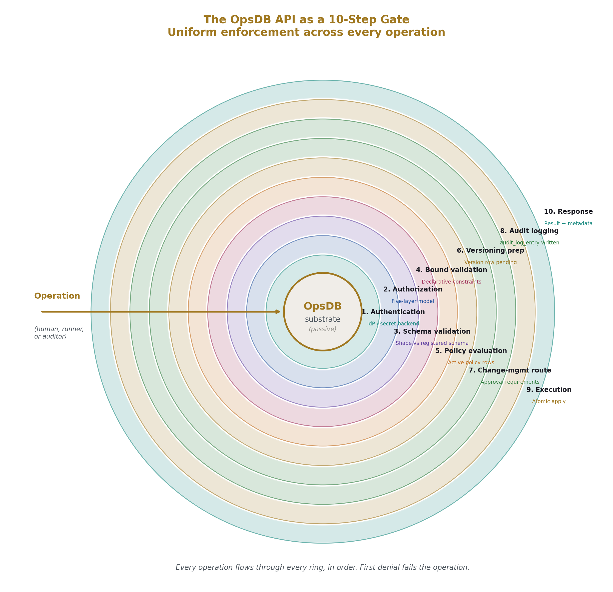
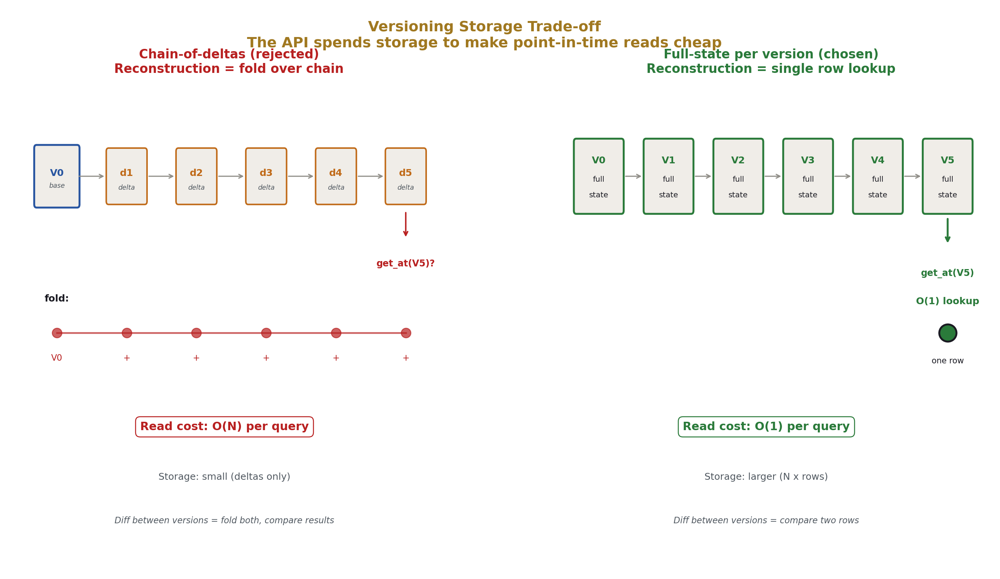
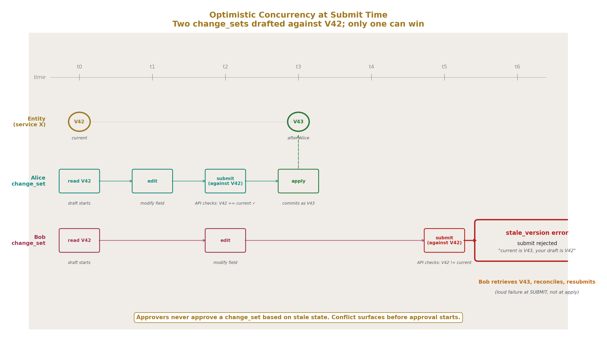
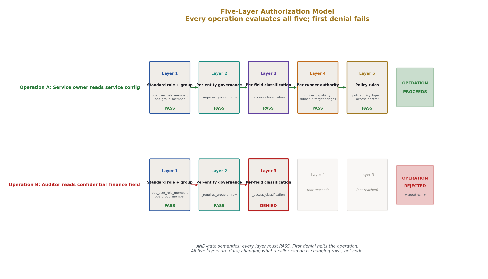
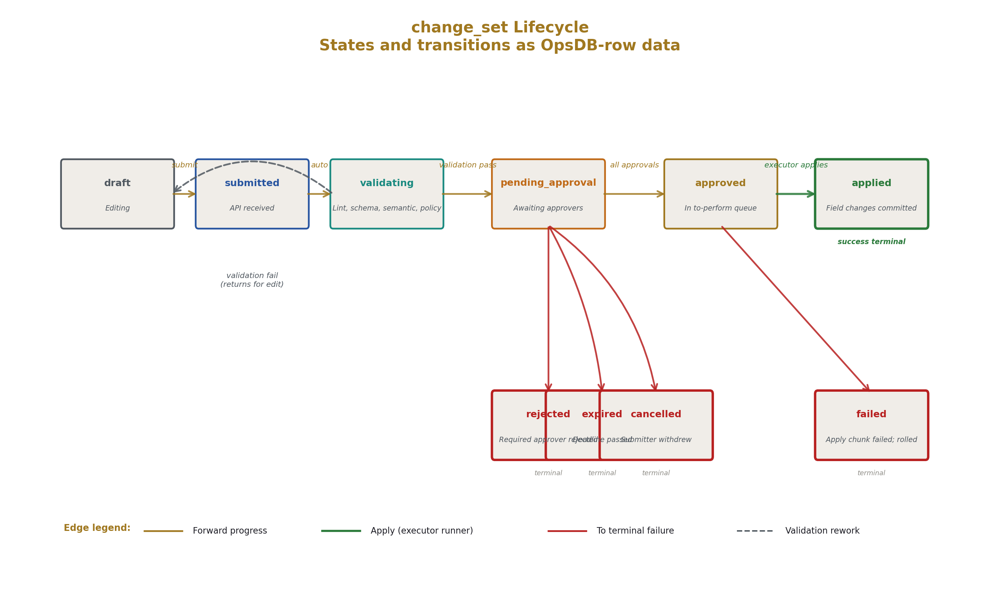
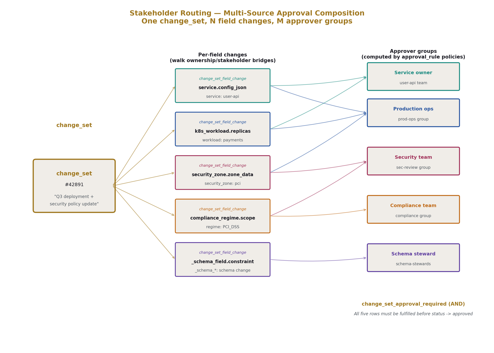
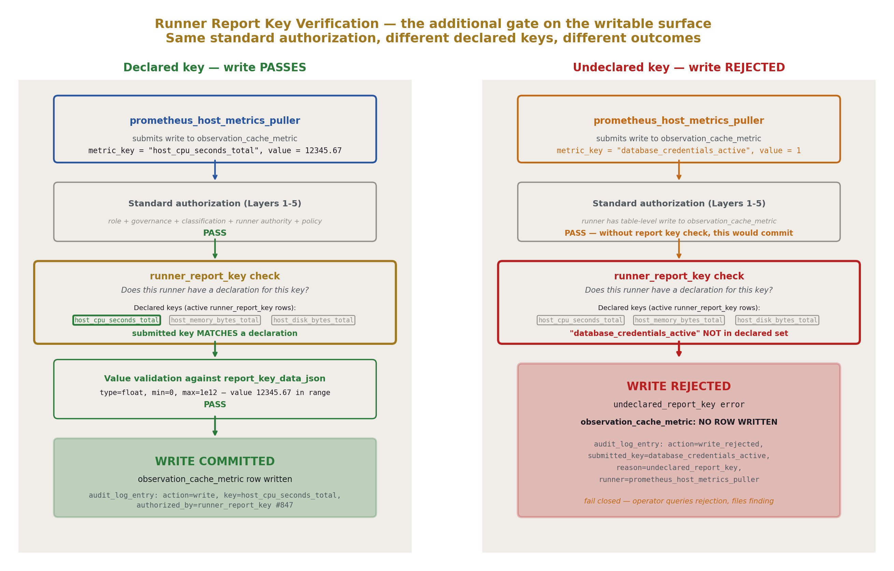
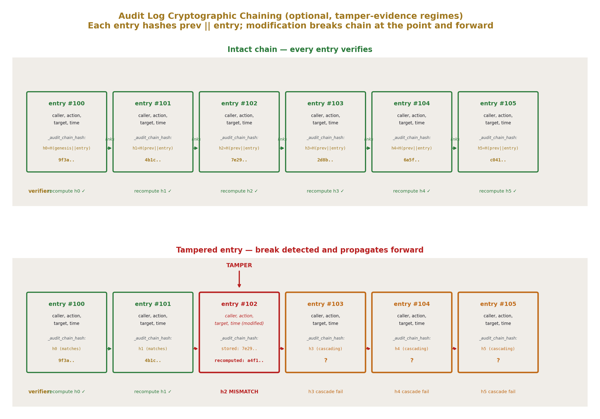

# OpsDB API Layer
## Authentication, Versioning, and Change Management Gating

**AI Usage Disclosure:** Only the top metadata, figures, refs and final copyright sections were edited by the author. All paper content was LLM-generated using Anthropic's Opus 4.7. 

---

## Abstract

The OpsDB API is the single gate through which all interactions with OpsDB data pass. It is self-contained operational software: it does not depend on Kubernetes, on a specific cloud, on any orchestrator, or on any system the OpsDB models. It calls out only to authoritative external systems for the authority those systems own — identity providers (LDAP, Active Directory, OIDC, SAML) for human authentication, secret backends (Vault and equivalents) for credential resolution. Every other governance concern — authorization, validation, change management routing, versioning, audit — is enforced at this gate, uniformly, against all entity types in the schema.

This paper specifies the API surface. The get-set operations work uniformly across all entity types. The search API supports filter predicates, named join paths through the schema, projection, ordering, and bounded pagination. Field-level versioning bundles per change_set, with full-state version rows that make point-in-time reconstruction a single lookup. Five layers of authorization (role, per-entity governance, per-field classification, per-runner authority, policy rules) all evaluate as data. Runner report keys gate every runner's writable surface, making the answer to "who can write this metric" a queryable declaration rather than implicit trust. Change_sets pass through a defined lifecycle as OpsDB rows; the to-perform queue is approved-not-yet-applied rows; the change-set executor that drains it is a runner per [@OPSDB-5], not the API. Notification dispatch is a runner concern. The API gates, validates, routes, records, and responds; runners do the world-side work.

What this paper does not specify: storage engine, wire protocol, deployment topology, identity provider integration specifics, UI design, specific runner implementations. The schema is the long-lived artifact per [@OPSDB-2]; the API surface specified here is stable across implementations of the schema.

---

## 1. Introduction

### 1.1 The role of the API

The OpsDB design [@OPSDB-2] commits to a passive substrate accessed only through the API. The schema [@OPSDB-4] specifies the data the substrate holds. Runners [@OPSDB-5] are the active layer that reads the data, acts in the world, and writes results back. This paper specifies the layer between runners (and humans, and auditors) and the substrate: the API gate where every interaction is validated, authorized, change-managed, versioned, and audited.

The API is where OPSDB-2's commitments become operational. The single source of truth requires a single gate enforcing it. Configuration as data requires the gate to interpret data uniformly. Three populations sharing one substrate requires the gate to scope access uniformly. Stable schema across logic churn requires the gate to absorb schema additions transparently. None of these properties exists without the API. With the API, all of them do.

### 1.2 The API is self-contained operational software

The API is itself a piece of operational software. It is not built on top of Kubernetes, not built on top of a specific cloud platform, not built on top of a workflow engine that the OpsDB also models. The reasoning is the same reasoning OPSDB-2 §3.10 gives for the OpsDB itself: independence from any single authority. Authorities come and go; the API outlives them.

What the API does call out to: identity authorities for authentication, secret backends for credential resolution. These are the unavoidable external dependencies because identity and secrets are fundamentally not the OpsDB's authority — the IdP is the source of truth for who exists in the organization, the secret backend is the source of truth for credential values. The API consumes assertions from these authorities and stores only what it owns: the operational identity rows that map external identities to OpsDB-side `ops_user` records, the pointers that say "this credential lives at this vault path."

Beyond these two delegations, the API is self-contained. Storage engine choice is an implementation decision per OPSDB-2 §4.3. Wire protocol is an implementation decision. Deployment topology — single instance, multi-region replicated, sharded — is an implementation decision. The API surface specified here transfers across all of these.

### 1.3 Three things runners do that the API does not

Three loadbearing clarifications upfront, because they shape every section that follows.

**The API does not invoke runners.** This is OPSDB-2 §4.1's passive-substrate commitment. Every operation is request-driven. When a change_set is submitted, no notification fires automatically; the API records the state transition and a notification runner picks up the row on its next cycle. When a metric should be scraped, the API does not summon the puller; the puller's scheduler runs on its own substrate.

**The API does not communicate with stakeholders.** Notification dispatch — sending pages to on-call, sending emails to approvers, posting to chat channels — is a runner concern. A notification runner reads `change_set` rows in `pending_approval` status, computes who needs to know per the approval requirements, and dispatches via configured channels using shared library calls. The API records that the change_set is pending approval; what happens next is the runner's job.

**The API does not apply approved change_sets.** When all approval requirements clear, the change_set's status transitions to `approved`. The API records that. It does not then write the field changes to the entity rows. A change-set executor runner [@OPSDB-5 §4.7] polls for approved-not-yet-applied change_sets, reads the `change_set_field_change` rows, and applies them through API write operations. The to-perform queue is OpsDB data; the executor is what drains it.

These three clarifications matter because they constrain what the API has to be. The API does not need an internal scheduler. The API does not need a notification dispatcher. The API does not need a transaction commit phase that fires when approvals clear. All of these would couple the API to delivery infrastructure, to timing concerns, to substrate-side action timing. By keeping the API to validate-route-record-respond, the API stays simple. The complexity that runners add is contained in runners; runners can be replaced without affecting the gate.

### 1.4 What this paper specifies and does not specify

Specified: the API surface (get, set, search, change-management, audit operations); the five-layer authorization model; the validation pipeline; the field-level versioning machinery; the change_set lifecycle as OpsDB-row state transitions; the runner report key system that gates runner write surfaces; the audit log structure with optional cryptographic chaining; the boundary discipline of what the API does not do.

Not specified: storage engine (Postgres, FoundationDB, Cassandra, CockroachDB are all valid); wire protocol (REST over HTTP, gRPC, structured JSON-RPC are all valid); deployment topology; specific identity provider integration; specific UI design; the implementation language of the API server; the schemas registered for typed payload validation (those are organization-specific data); specific runner implementations.

### 1.5 Document structure

Section 2 covers conventions inherited from the prior series. Section 3 specifies the API surface — the get-set operations and the gate's enforcement steps. Section 4 covers the search API in detail. Section 5 covers the versioning machinery. Section 6 covers authentication and authorization, including the five-layer model. Section 7 covers change management as a gate function. Section 8 covers runner report keys and the verification of runner write surfaces. Section 9 covers audit logging. Section 10 covers the boundary discipline — what the API explicitly does not do. Section 11 closes.

---

## 2. Conventions

This paper inherits the conventions established across the prior series. Brief recap; the prior papers are authoritative.

**DSNC.** All schema references use the Database Schema Naming Convention specified in OPSDB-4. Singular table names. Lower case with underscores. Hierarchical prefixes from specific to general. Foreign keys named `referenced_table_id` with role prefixes when multiple FKs to the same table coexist. Type suffixes (`_time`, `_date`, `_id`, `_data_json`). Boolean tense prefixes (`is_`, `was_`). Reserved fields (`id`, `created_time`, `updated_time`, `parent_id`).

**Underscore-prefix governance fields.** Fields whose purpose is governance, security, audit, or schema metadata carry a leading underscore: `_requires_group`, `_access_classification`, `_audit_chain_hash`, `_retention_policy_id`, `_observed_time`, `_authority_id`, `_puller_runner_job_id`, `_schema_version_introduced_id`. Visually distinct from the operational vocabulary the schema models. The API consults these fields during gate processing per OPSDB-4 Appendix B.

**Typed payload pattern.** Heterogeneous structured data uses paired fields `*_type` (a discriminator) and `*_data_json` (the typed payload). The API maintains a registry mapping each `*_type` value to a JSON schema with declarative constraints. Writes validate the payload against the registered schema. Invalid writes are rejected at the gate. The constraint language is declarative — numeric ranges, enum membership, FK constraints, simple anchored patterns — never embedded logic, never regex (regex is a performance attack vector and a complexity sink that constraint validation does not need).

**Bridge tables for polymorphic relationships.** Per OPSDB-4 §2.5, polymorphic FKs are forbidden. One bridge table per target type provides clean FK integrity. Stakeholder identification, change-set targeting, evidence record targeting, and runner targeting all walk bridges per entity type rather than through a polymorphic surface. The API resolves these walks at request time.

**Versioning sibling pattern.** Tables holding centrally-managed data have a sibling `*_version` table. The base table holds current state; the sibling holds historical states with `version_serial`, `parent_*_version_id`, and `change_set_id` linking back to the change_set that produced each version. Per OPSDB-4 §4.2.

**The 0/1/N rule applied to API resources.** Per OPSDB-9 §5.2, applied throughout. The API has one gate, not two; one authentication layer, not parallel auth systems; one audit log table, not per-domain audit tables; one set of write operations, not "the privileged path" plus "the regular path." Where N is genuine — many runners, many entity types, many concurrent change_sets in flight — the API supports N. Where 1 is correct, the API enforces 1.

**Forthcoming: OPSDB-7 schema construction.** OPSDB-7 will specify how schemas and their constraints are declared in hierarchical YAML or JSON files: each file self-contained, no smart logic, declarative bounds (numeric ranges like `0` to `100`, enum sets that act as FK constraints, simple presence/absence and length bounds), no regex, no embedded code. The API's bound validation step (§3.5 step 4, §7.6) consumes constraints in this form. The schema construction discipline keeps validation deterministic and inspectable; this paper specifies how the API uses the constraints, not how they are declared.

**Notation.** Operations appear in `code style` on first reference within a section. Schema entity types appear in *bold-italic* on first reference within a section. Field names appear in `code style`.

---

## 3. The API surface

The API exposes a uniform set of operations across all entity types. Callers specify what they want; the API resolves it against the schema, the policies, and the caller's authorization. Every operation flows through the same gate with the same enforcement steps.

### 3.1 Operation classes

Three classes of operation. Read operations retrieve data. Write operations modify data. Administrative operations manage the API itself (rate limits, quota inspection, health checks).

The read and write operations are specified below. Administrative operations are not detailed in this paper; they are implementation-specific and not part of the load-bearing surface.

### 3.2 Read operations

All reads return rows plus metadata. The metadata includes the row's current version stamp, last_updated_time, freshness annotation for cached observation data (the `_observed_time` and `_authority_id` carried per OPSDB-4 §16), and a summary of governance flags consulted (which `_requires_group` checks passed, which `_access_classification` levels were satisfied). Consumers use the metadata to decide whether the data is fresh enough and trusted enough for their purpose.

The `get_entity` operation fetches one row by primary key. Caller specifies entity type and id. Returns the row in current state with metadata.

The `get_entity_history` operation fetches the version chain for one entity. Caller specifies entity type, id, and optionally a time range or version range. Returns the `*_version` rows in order, each linked to the `change_set_id` that produced it.

The `get_entity_at_time` operation reconstructs the field values active at a specified timestamp. The API queries the version sibling for the version that was current at the given time and returns that row's field values. Because version rows record full post-change state (not just the delta), reconstruction is a single row lookup, not a replay of the version chain.

The `search` operation is the discovery surface. Caller specifies entity types, filter predicates, join paths, projection, ordering, pagination, and freshness requirements. The API translates the request into engine-appropriate operations, applies access policy per the five layers (§6.2), and returns a structured result with metadata about what was filtered. Detailed in §4.

The `get_dependencies` operation walks the substrate. Caller specifies a starting entity and a relationship pattern (`megavisor_instance.parent_megavisor_instance_id` for substrate ancestry, `service_connection` edges for service topology, `host_group_machine` for host membership). The API walks the schema and returns the resolved chain, bounded by depth and cycle detection. Used by runners that make decommission-aware, failure-domain-aware, capacity-aware decisions per OPSDB-5 §9.

The `resolve_authority_pointer` operation answers "where is X?" Given an `authority_pointer_id`, returns the underlying authority's connection details (from the `authority` row), the locator within that authority, the `last_verified_time`, and any pointer metadata. This is the API surface for OPSDB-4 §10's authority directory.

The `change_set_view` operation returns either a scoped view (only the field changes the viewer's groups have approval authority over) or a full view (all field changes the viewer is permitted to see, subject to `_access_classification` and `_requires_group`). Plus summary metadata: total field changes, breakdown by entity type, validation results, approvals received and pending. The view is a read; it does not commit anything. Detailed in §7.4.

### 3.3 Write operations

Writes split into two categories: direct writes (for observation, evidence, runner-coordination, and audit) and change_set submissions (for change-managed data).

The `write_observation` operation is the direct-write path. Caller is a runner with appropriate authority. Targets one of five tables: *observation_cache_metric*, *observation_cache_state*, *observation_cache_config*, *runner_job_output_var*, or *evidence_record*. The API validates the runner's report-key authorization per §8, validates the payload, records an `audit_log_entry`, and writes the row. No change management; observation is not change of intent.

The `submit_change_set` operation is the main write path for change-managed data. Caller submits a proposed transaction: N field changes across one or more entities, with a reason, optional ticket pointer, urgency level, and metadata. The API validates each field change against the schema, runs the validation pipeline (§7.6), computes required approvals from policy rows of type `approval_rule` (§7.3), records the change_set in `pending_approval` status (or `approved` if all approval requirements auto-fulfill), and returns the change_set id for tracking.

The `submit_change_set` operation supports `dry_run=true`. With dry_run, the API performs all validation and computes all approval requirements, then returns the validation outcome and the computed approval routing without recording the change_set. This is parallel to the runner-side dry-run pattern from OPSDB-5 §3.4: the proposer can verify what their submission will do before committing it.

The `approve_change_set` and `reject_change_set` operations record stakeholder actions. Caller is a human (or a runner with explicit approval authority per policy). The API verifies the caller is in a required approver group for this change_set, records the action in `change_set_approval` or `change_set_rejection`, re-evaluates whether all `change_set_approval_required` rows are fulfilled, and transitions the change_set's status if appropriate.

The `cancel_change_set` operation is withdrawal. The submitter (or sufficient authority per policy) cancels a pending change_set. Recorded in `change_set` with status `cancelled`.

The `emergency_apply` operation is the break-glass path. Caller has emergency authority per policy. The change_set commits with reduced approvals, is flagged with `is_emergency=true`, and a `change_set_emergency_review` row is queued in pending status. Detailed in §7.9.

The `bulk_submit_change_set` operation handles transactions touching many entities. Same shape as `submit_change_set` but with explicit bulk membership records and possibly different approval rules per `change_management_rule` (e.g., a fleet-wide rotation may require one approval for the bundle rather than per-entity). Detailed in §7.10.

The `apply_change_set_field_change` operation is the executor's apply-write. Caller is a change-set executor runner with authority over the targeted entity class. The API validates that the change_set is in `approved` status, that the field change has not yet been applied, and that the executor's authority covers the target. Then the API performs the entity update, writes a new `*_version` sibling row, marks the `change_set_field_change.applied_status='applied'`, and records the audit entry. When all field changes in the change_set have been applied, the executor calls `mark_change_set_applied` to transition the change_set's status. The split between per-field-change apply and final mark allows partial-application visibility for bulk change_sets and clean rollback semantics if any individual field change fails.

### 3.4 Operations the API does not provide

The API does not provide an "apply when approved" operation that fires automatically on status transition. Approval clearing is a status transition; the change-set executor runner picks up the row on its next cycle. The API's role at the approve/reject step is to record and re-evaluate, not to trigger downstream action.

The API does not provide a "notify stakeholders" operation. When a change_set transitions to `pending_approval`, the row exists; the notification runner reads it. The API does not call out to email systems, chat platforms, paging services, or any other communication channel.

The API does not provide a "schedule this runner" operation. The scheduler runner per OPSDB-5 §4.4 reads `runner_schedule` rows and enforces them on whatever substrate the target runner runs on. The API serves the read; the runner does the enforcement.

The API does not provide an "execute this command" operation against any external system. World-side actions are runner concerns. The API records intent (in change_sets), records observation (in cache tables), records evidence (in evidence_records). It does not perform.

### 3.5 The single API gate's enforcement steps

Every operation flows through the same gate. The gate handles, in order:

1. **Authentication.** Verify caller identity by validating the credentials presented against the appropriate identity authority (IdP for humans, secret backend for runner service accounts). Resolve to `ops_user` or `runner_machine` row. Record in the operation context.
2. **Authorization.** Evaluate the five-layer authorization model (§6.2) for the operation, target, and caller. First denial fails the operation; all five must pass for the operation to proceed.
3. **Schema validation.** Verify the operation's shape matches the registered schema for the affected entity types and fields. Reject malformed requests with structured error feedback.
4. **Bound validation.** Verify field values are within declared bounds: numeric ranges per OPSDB-7 declarative constraints, enum membership for fields with enumerated values, FK existence for referenced rows, simple anchored patterns where applicable. No regex evaluation. No embedded logic. The constraints are data; the validation is a lookup.
5. **Policy evaluation.** Consult `policy` rows for additional governance: data classification rules, retention rules, segregation-of-duties constraints, time-of-day restrictions where applicable. Reject operations that violate active policies.
6. **Versioning preparation.** For set operations on change-managed entities, prepare the version row that will be written. For change_set submissions, prepare the per-field-change records. The actual version write happens in the execution step.
7. **Change management routing.** For change_set submissions, evaluate `approval_rule` policies (§7.3), compute the required approver groups, write `change_set_approval_required` rows. Determine whether the change_set auto-approves, requires human approval, or is rejected by a blocking rule.
8. **Audit logging.** Record the operation in `audit_log_entry` with full attribution. Append-only; the entry is written atomically with the operation's outcome.
9. **Execution.** For direct writes, apply the row atomically. For change_set submissions, record the change_set and its field changes. For approval/rejection, record the action and re-evaluate requirements. For executor apply-writes, perform the entity update and version sibling write.
10. **Response.** Return the operation result with metadata (success or structured error, affected row identities, computed approval requirements where applicable, audit log entry id for correlation).

Every step is data-driven. The schema declares structure; policies declare governance; the API enforces both. Changing what the API enforces is changing data, not code. This is the *configuration as data* commitment from OPSDB-2 §4.6 made operational at the gate.

The 10-step gate is illustrated in Figure 1.



---

## 4. The search API

The search operation is the most flexible read path and warrants detailed specification because it serves all three populations with the same surface.

### 4.1 Request shape

A search request specifies, in structured form: one or more entity types to query (or a union across types), filter predicates over fields, named join paths to walk, the projection of fields to return, ordering, pagination, freshness requirements for cached observation data, and a view mode (`standard`, `with_history`, `at_time`).

The wire format for search requests is a structured JSON object with predicates, joins, and projection expressed as nested fields. Implementations may carry the structured shape over REST, gRPC, or any other transport — the structure is what matters; the encoding is organizational. The discipline is that the request is a tree of declarative specifications, not a string in a query language.

### 4.2 Filter predicates

Predicates are typed comparisons over entity fields. The API supports: equality (`field = value`), inequality (`field != value`), comparison (`field > value`, `field >= value`, `field < value`, `field <= value`), set membership (`field IN [values]`), pattern matching with simple anchored or unanchored patterns (`field LIKE 'prefix%'`, no regex), null checks (`field IS NULL`, `field IS NOT NULL`), range (`field BETWEEN low AND high`), and JSON path containment for typed payload fields (`field_data_json @> path = value`).

Predicates compose via `AND`, `OR`, `NOT` with explicit grouping. The composition tree is depth-bounded per query bounds (§4.6) to prevent runaway predicate construction.

Pattern matching is intentionally restricted. Regex is excluded both because it opens a denial-of-service vector (catastrophic backtracking on adversarial patterns) and because regex evaluation is logic, not data — OPSDB-9 *configuration as data* favors declarative bounds over evaluator-language fragments. Where prefix or suffix matching is genuinely needed, the simple anchored form covers the case; for richer matching, the runner-side application layer can perform full evaluation after retrieving a bounded result set.

### 4.3 Join paths

Joins are expressed as named relationships, not raw SQL. The API resolves them against the schema. Examples:

- `service.host_group` — join from service to its host_group via `host_group_id`.
- `service.connections` — walk `service_connection` edges from the source service.
- `machine.megavisor_instance.parent_chain` — recursive walk via `megavisor_instance.parent_megavisor_instance_id`, bounded by depth.
- `entity.audit_log` — join to recent `audit_log_entry` rows for this entity.
- `change_set.field_changes` — join to `change_set_field_change` rows for this change_set.
- `change_set.approvals_required` — join to `change_set_approval_required` rows.

Each join path is a schema-defined name registered with the API. The API knows how to translate the named path to the storage engine's join operations. New paths are added as schema metadata through `_schema_change_set` per OPSDB-4 §20.

The recursive paths are particularly important. The substrate hierarchy is a self-FK chain through `megavisor_instance.parent_megavisor_instance_id`; the search API exposes this as a named recursive path that runners use for the stack-walking decisions per OPSDB-5 §9 (decommission awareness, failure-domain analysis, pod ancestry). The runner does not write recursive SQL; it requests `parent_chain` and the API handles the walk with cycle detection and depth bounds.

### 4.4 Projection

The projection specifies which fields the response includes. Default projection returns the entity's standard view: operational fields, but not underscore-prefixed governance fields unless the caller has the authority to see them.

Special projections: `*` returns all fields the caller is permitted to see; `summary` returns a curated subset for list views (typically id, name, status, last-updated, primary classification fields); `full_with_history` returns the current row plus the version chain. Explicit field lists are also supported.

Projections are filtered by access policy. A caller with read access to entity types but not to specific underscore-prefixed governance fields receives the row with those fields omitted; the response metadata indicates which fields were omitted by access policy versus which were genuinely absent.

### 4.5 Ordering and pagination

Ordering is specified as a list of (field, direction) pairs. The API handles ordering deterministically; ties on the primary ordering key are broken by `id` to ensure cursor-based pagination is stable.

Pagination is cursor-based by default. Cursors are opaque; they encode enough state to resume the exact query position regardless of concurrent inserts to the underlying table. The cursor includes a snapshot reference (where the storage engine supports it) or a structured composite key (where it does not), plus the query's stable ordering key values for the last row returned.

Offset-based pagination is available for results under a configurable threshold (default 10,000 rows). Above the threshold, cursor pagination is required because deep-offset queries impose unbounded scan cost on the storage engine and produce inconsistent results under concurrent inserts. Operators querying small result sets get the offset convenience; runners querying large result sets get cursor stability.

### 4.6 Bounds

Searches are bounded. Maximum result size per query, maximum join depth, maximum query time, maximum predicate composition depth, rate limits per caller per time window. Bounds are policy data per OPSDB-4 §12.6, evaluated at the gate. A query that would exceed bounds is rejected with structured feedback so the caller can refine — narrower predicates, smaller projection, narrower time range.

Bounds prevent the API from becoming a denial-of-service vector against itself or against the underlying substrate. They also prevent the failure mode where a casual operator query against a high-cardinality table consumes the substrate's resources for hours. Bounds are configurable per role; auditors with broad read access may have higher bounds than casual operators, and analytical roles may have higher bounds still, with the trade-off that those roles are more carefully scoped and audited.

### 4.7 Freshness requirements

For queries that read cached observation data, the request can specify a freshness requirement: `max_staleness_seconds` indicating the oldest acceptable `_observed_time` for cache rows. The API filters out rows that exceed the staleness bound. If insufficient fresh data is available, the response indicates which rows were filtered for freshness; the caller can either accept the result, request a fresh pull (by triggering the relevant puller via a runner-coordination row), or query the authority directly using the `resolve_authority_pointer` operation.

This is OPSDB-9's *local cache plus global truth* principle made explicit at the API: callers express their freshness needs; the API serves them what meets the need; callers fall through to the authority when local cache is insufficient.

### 4.8 View modes

The view mode shapes how versioned data is presented:

- `standard` — current state of each matched entity.
- `with_history` — current state plus the full version chain.
- `at_time` — state of each matched entity as of a specified timestamp, reconstructed from the version chain.

The `at_time` mode is the audit-friendly query: "show me what production looked like at the time of the incident." One search with one timestamp parameter returns the historical state across many entities, joined and projected as the caller specified.

### 4.9 Result reporting

Search responses include the matching rows plus structured metadata: total count or estimated count for large results, pagination cursor for the next page, freshness summary indicating the age range of cached observation rows in the response, filtering disclosures (how many rows were filtered out due to access policy, without revealing which specific rows), and a query trace for privileged callers (which join paths were walked, how long each took, which storage engine indexes were used). The trace is useful for query optimization and for detecting cases where a join path is missing an index in the underlying engine.

---

## 5. Versioning machinery

Field-level versioning bundled per change_set. The mechanics for how the API produces and serves version history.

### 5.1 The per-field versioning model

When a change_set commits and updates an entity, three writes happen atomically:

1. The base table row is updated with the new field values.
2. A row is appended to the entity's `*_version` sibling table, recording the post-change full state of all fields (not just the changed fields).
3. The associated `change_set_field_change` rows are updated to `applied_status='applied'` with timestamps.

The version row contains all fields of the entity, not just the ones that changed. This is a deliberate space-time trade-off: storage is cheap, point-in-time reconstruction is expensive when implemented as version-chain replay. By storing full post-change state per version, reconstruction becomes a single row lookup at the target version. Diff between versions is a comparison of two rows, not a fold over a chain.



### 5.2 What gets versioned

Per OPSDB-4 Appendix D, the categorization is explicit:

**Change-managed entities** (have version siblings). Configuration, policies, schedules, metadata, ownership and stakeholder bridges, runner specs and capabilities, schema metadata. Every change to these flows through `submit_change_set` and produces a version sibling row on apply.

**Observation-only entities** (no version siblings). Cache tables, `runner_job`, `runner_job_output_var`, `evidence_record`, `alert_fire`, `on_call_assignment`. Writes are append-only or overwrite per the table's pattern, audit-recorded but not change-managed. These tables capture state that came from the world; the world does not consult version history of its own observation.

**Append-only** (no versioning, no updates). `audit_log_entry`. Detailed in §9.

**Computed by API tooling** (not directly written). `_schema_*` tables. Populated on `_schema_change_set` apply by the schema construction tooling that derives entity types, fields, and relationships from the new schema declarations.

The split is mechanical. Change-managed data goes through change_sets, which produce versions. Observation data does not. There is no third path; an entity is in one of these four categories, and the categorization is explicit in the schema metadata.

### 5.3 The version sibling structure

Each `*_version` sibling table carries:

- `id` — version row primary key
- `*_id` — FK to the base table (the entity this version belongs to)
- `version_serial` — INT, monotonic per entity
- `parent_*_version_id` — self-FK, the prior version for this entity
- `change_set_id` — FK to the change_set that produced this version
- `is_active_version` — BOOLEAN, true for the current version
- `created_time`, `updated_time`
- All fields from the base table, snapshotting post-change state.

The base table always reflects the current version. The sibling reconstructs history. Rollback is achieved by submitting a change_set whose field changes restore the values from a target version row (§5.5).

### 5.4 Sharding for high-frequency entities

Default: one `*_version` table per entity table. For entities with high change velocity (services in active organizations, configuration variables in dynamic environments), the version sibling can grow unbounded.

The schema accommodates sharding declaratively. The sharding scheme is recorded in `_schema_entity_type._schema_field_data_json` for the version sibling: by time range (one shard per quarter, one per year), by entity_id range (one shard per ID hash bucket), or hybrid. The API reads the sharding scheme and routes version-table reads and writes accordingly. Consumers of `get_entity_history` receive results merged across shards transparently.

This paper does not specify a sharding threshold. The trigger is organizational: when a single version sibling table's row rate exceeds the storage engine's preferred per-table operational envelope, sharding becomes appropriate. Different storage engines have very different envelopes; specifying a fixed number would be the *Best Practices* failure mode OPSDB-9 warns against.

### 5.5 Rollback as change_set

Rollback is never a side-channel operation. It is a change_set whose field changes restore prior version values. Reference OPSDB-2 §9.4.

The mechanics: an operator (or a runner with rollback authority per policy) reads the version history of the affected entities, identifies the target version, submits a `change_set` with `change_set_field_change` rows whose `after_value` fields are the values from the target version. The change_set passes through the standard validation and approval pipeline. On apply, the entity returns to the prior state, with a new version row in the sibling. The version chain shows: original state, intermediate state, intermediate state, rollback to original-equivalent state — each linked to the change_set that produced it.

This pattern preserves the *reversible changes* principle from OPSDB-9 §5.3 without introducing a side-channel rollback mechanism. Every change is a change_set; every change is auditable; rollback is just another change.

### 5.6 Optimistic concurrency on submit

Concurrent change_sets that would touch the same entities are an inevitable concern at scale. The API handles this through optimistic concurrency at submission time.

When a change_set is being drafted, each `change_set_field_change` carries the version stamp of the entity it was drafted against. On `submit_change_set`, the API checks each touched entity's current version against the drafted-against version. If any entity has advanced (because another change_set committed to it in the interim), the submit fails with `stale_version` error and lists the affected entities. The submitter retrieves current values, reconciles their proposed change against the new state, and resubmits.

This produces loud failure at submit time, before approval starts. Approvers never approve a change_set based on stale state. The cost is that submitters occasionally encounter conflicts and must reconcile; the benefit is that the alternative — silent overwrites of intermediate changes, or post-approval failure when the executor tries to apply against state that has moved — is far worse.

The version stamp is opaque to the submitter; it is just a token to carry through draft and submit. The API does the comparison.



### 5.7 Retention

Each entity type has a default retention policy and may carry an explicit `_retention_policy_id` per row to override. The reaper runner per OPSDB-5 §4.8 trims past-horizon version rows. Compliance-relevant entities typically retain 7+ years; ephemeral configuration may retain 90 days; some auditing regimes require retention for the lifetime of the organization.

The API does not reap. The API serves reads against whatever version history is present and accepts the reaper's deletes. The reaper, when applying retention, writes audit entries for the deletions; the audit log itself has its own retention policy with stricter floor (the audit log of deletions is not deleted before the underlying retention).

The version table sharding scheme (§5.4) interacts with retention: shards entirely past the retention horizon can be dropped wholesale rather than reaped row by row, which is operationally more efficient.

---

## 6. Authentication and authorization

The API delegates identity verification to authoritative external systems and enforces authorization through five layers of policy data.

### 6.1 Authentication

The API does not maintain its own user database. It does not store passwords. It does not duplicate the authority of identity providers or secret backends. Authentication is delegation; authorization is local.

**Human authentication.** Humans authenticate via the organization's identity provider — LDAP, Active Directory, OIDC, SAML, or whatever the org operates. The API receives an authenticated assertion: a token, a signed claim, a session reference. The API consumes the assertion, verifies its signature against the provider's public key or by callback to the provider, and resolves the asserted external identity to an `ops_user` row through a mapping table. The mapping is itself OpsDB data: each `ops_user` carries the external identifier from the IdP (or multiple, if the org federates).

If authentication fails — the assertion is invalid, expired, or maps to no `ops_user` — the API rejects the operation. The failure is recorded in the audit log with as much identifying information as is available without leaking the assertion's contents.

**Runner authentication.** Runners authenticate using credentials issued by the secret backend (Vault, AWS Secrets Manager, equivalent). Each `runner_machine` has an associated service account; the credentials for that account live in the secret backend. The runner's shared OpsDB API client (OPSDB-5 §5.1) acquires credentials at startup and refreshes them before expiration; the credentials accompany every API request as authentication headers.

The API validates the credentials by callback to the secret backend or by validating signed tokens that the secret backend issues. On valid credentials, the API resolves to the corresponding `runner_spec` and `runner_machine` rows. On invalid credentials, the operation is rejected and audited.

**Web-application-mediated human writes.** Some humans interact through web applications that don't run on the human's machine — internal portals, admin UIs, dashboards with action buttons. These applications use runners to mediate writes per OPSDB-2 §6.5. The pattern: the human authenticates to the web app via SSO, the web app calls a runner with the verified human identity, the runner authenticates to the API with its own credentials and includes the originating human identity in the request. The API records both attributions in `audit_log_entry`: `acting_service_account_id` for the runner that performed the call, `acting_ops_user_id` for the originating human. The audit trail preserves both: the chain of who authorized the action and the mechanism that performed it.

### 6.2 The five-layer authorization model

Every operation is evaluated against five layers of authorization. Each layer is data; none is hardcoded. Changing what a caller can do is changing rows.

**Layer 1: standard role and group.** The caller's `ops_user_role_member` and `ops_group_member` rows determine baseline access. Roles map to operation classes: read-only across the schema, write-observation for runners, propose-change for operators, approve-change for stakeholders, schema-evolve for schema stewards. Roles are operational positions per OPSDB-4 §5.5; groups are access-policy aggregates per OPSDB-4 §5.4.

**Layer 2: per-entity governance.** Some rows carry `_requires_group` set. Access to those rows requires the caller to be a member of the named group, in addition to layer 1 baseline access. This is the per-row escalation mechanism: a sensitive entity in an otherwise-readable namespace can require additional group membership without restructuring the namespace.

**Layer 3: per-field classification.** Some fields or tables carry `_access_classification` indicating data sensitivity. Access requires the caller's clearance level (recorded as group membership or role attribute) to meet or exceed the classification, regardless of layer 1 baseline. A finance auditor with read access to all entity rows may not have access to fields classified as `confidential_finance` because their classification clearance does not cover that level.

**Layer 4: per-runner authority.** For runners, the API verifies that the requested operation matches the runner's declared scope. The declaration is in `runner_capability` rows (what capabilities the runner can exercise) and `runner_*_target` bridges (which entities the runner is authorized to act on). A runner attempting an operation outside its declared scope is rejected. This is detailed further in §8 for runner write operations; the same principle applies to runner reads — a runner declared to act on services in namespace X cannot read sensitive fields of services in namespace Y unless its declarations cover that scope.

**Layer 5: policy rules.** `policy` rows of type `access_control` impose additional constraints not expressed in the prior four layers: time-of-day restrictions (no production changes between 0200 and 0600 local time without on-call approval), segregation of duties (the proposer of a change_set cannot also approve it), tenure-based escalation (a new operator's first 30 days require shadow approval on production changes). Policies are evaluated against the operation context and may inject additional approval requirements, deny outright, or impose other constraints.

The five layers compose. Every operation evaluates all five. First denial fails the operation; all five must pass for the operation to proceed. The denial response indicates which layer denied (without revealing the contents of the denying policy beyond what the caller is authorized to know about it). The audit log records the layer that denied and the policy or row that triggered the denial.

The five-layer model is illustrated in Figure 2.



### 6.3 Authority delegation and self-containment

The API delegates two concerns and only two: identity verification (to the IdP) and credential resolution (to the secret backend). Every other authorization decision is made by the API against OpsDB data.

This is OPSDB-9's *single source of truth* applied to the API's operational concerns. The IdP is the source of truth for who exists in the organization; the API does not duplicate this. The secret backend is the source of truth for credential values; the API does not duplicate this. But the OpsDB is the source of truth for what those identities are authorized to do operationally; the API enforces this directly without delegation.

The boundary holds because identity and authorization are different concerns at different lifecycles. Identity changes when employees join, leave, change roles in the org — a fast-moving HR-driven concern best handled by the IdP. Authorization changes when operational policies evolve — a slower, governance-driven concern best handled by data the API reads directly. Mixing them, by storing operational authorization in the IdP or by duplicating identity in the OpsDB, creates drift and complicates both stores.

### 6.4 Shared-library authentication for runners

Per OPSDB-5 §5.1, the OpsDB API client is a shared library. It handles, for runners:

- Credential acquisition from the secret backend on runner startup.
- Credential refresh before expiration.
- Adding authentication headers to every request.
- Retrying transient authentication failures with appropriate backoff.
- Surfacing validation errors and authorization denials to the runner cleanly.

A runner does not implement authentication. The library does. This is what makes "runners are valid writers" mechanical — the library and the API agree on the protocol; runners that use the library are inherently authenticated; runners that bypass the library do not exist within the OpsDB-coordinated operational reality (per OPSDB-5 §13's anti-patterns).

---

## 7. Change management as a gate function

Change management is enforced at the API gate. The API validates submissions, computes approval requirements, records change_set state transitions, and accepts the change-set executor's apply-writes. Communication with stakeholders and application of approved change_sets are runner concerns.

### 7.1 The API's role in change management

To restate the loadbearing clarification: the API does not communicate, and the API does not apply. The API's role is to gate and route.

When a change_set is submitted, the API validates it, computes who must approve, records the requirements, and transitions the change_set to `pending_approval` (or directly to `approved` if all requirements auto-fulfill). What happens after that is data; runners read the data and act on it.

A notification runner reads `change_set` rows in `pending_approval` status, computes who needs to know per the `change_set_approval_required` rows, walks the ownership and stakeholder bridges, and dispatches messages via configured channels using the shared notification library (OPSDB-5 §5.7). The API does not call email systems or chat platforms.

A change-set executor runner reads `change_set` rows in `approved` status with `applied_time IS NULL`, reads the associated `change_set_field_change` rows, and applies each field change via `apply_change_set_field_change` API calls. When all field changes have been applied, the executor calls `mark_change_set_applied` to transition the change_set to `applied` status. The API performs the entity updates and version writes; the executor drives the timing.

This split is the operational realization of the passive-substrate commitment. The API gates governance; runners drive action.

### 7.2 The change_set lifecycle

The `change_set.change_set_status` field walks through the lifecycle states defined in OPSDB-4 §18.1:

```
draft → submitted → validating → pending_approval → approved → applied
                                              ↘ rejected
                                              ↘ expired
                                              ↘ cancelled
```

- **draft** — under construction; not yet submitted. Submitter can edit field changes, reason, metadata.
- **submitted** — API received; transition to validating is automatic.
- **validating** — lint, schema, semantic, policy checks running. On success, transition to pending_approval. On failure, transition back to draft with errors recorded, or to rejected if the failure is unrecoverable.
- **pending_approval** — validation passed; awaiting stakeholder approvals per `change_set_approval_required`. Notification runner observes this state.
- **approved** — all required approvals received; ready for the to-perform queue. Change-set executor observes this state.
- **applied** — change-set executor has successfully applied all field changes; entity rows reflect the new state; version siblings have been written.
- **rejected** — a required approver rejected per the rule's rejection semantics; halt.
- **expired** — submission deadline passed without sufficient approvals; halt.
- **cancelled** — submitter or sufficient authority withdrew the change_set; halt.

The state machine is illustrated in Figure 3. State transitions are themselves API operations recorded in the audit log; the entire lifecycle of every change_set is queryable.



### 7.3 Stakeholder identification

When a change_set transitions through validating to pending_approval, the API computes which approvers are required.

The computation: for each `change_set_field_change`, the API looks up the target entity. It walks the ownership and stakeholder bridges for that entity type — `service_ownership`, `service_stakeholder`, `machine_ownership`, `k8s_cluster_ownership`, `cloud_resource_ownership`, and similar bridges for other entity types — to find the `ops_user_role` rows responsible for the entity. It evaluates `policy` rows of type `approval_rule` against the entity, namespace, fields touched, and metadata (data classification, security zone membership, compliance scope membership). For each rule that matches, the API computes one or more `change_set_approval_required` rows specifying which group must approve and how many approvers from that group are needed.

A change_set may produce multiple approval requirements:
- Service owner approval for changes touching that service.
- Security team approval if the change touches a `_security_zone` field or affects an entity in a security-sensitive namespace.
- Compliance team approval if the entity is in `compliance_scope_service` for any active regime.
- Schema steward approval if the change touches `_schema_*` tables.
- Production operations approval if the entity is in the production namespace and the change affects a runtime field.

Each requirement is independent. All must be fulfilled before the change_set can transition to `approved`. The API tracks per-requirement fulfillment in `change_set_approval_required.fulfilled_count` and `is_fulfilled`.

Stakeholder routing is illustrated in Figure 4.



### 7.4 Stakeholder views

Each stakeholder needs to see the proposed change to decide whether to approve. The API provides this through the `change_set_view` operation with two modes.

**Scoped view.** Only the field changes the stakeholder is being asked to approve. A service owner sees the changes affecting their service; they don't see unrelated changes in the same change_set unless they have broader authority. The scoped view filters `change_set_field_change` rows to those whose target entity falls under the viewer's approval scope.

**Full view.** The entire change_set, subject to per-row and per-field access restrictions. Useful for fast review when a stakeholder trusts the bundle's coherence and wants context, or for stakeholders with broad authority who can approve across the entire bundle.

Both modes return summary metadata: total field changes, breakdown by entity type, validation results, approvals received and pending. The view is a read; it does not commit anything. The stakeholder uses it to decide on `approve_change_set`, `reject_change_set`, or no action.

### 7.5 Approval and rejection

The `approve_change_set` operation records a stakeholder's approval. The API verifies the caller is in a required approver group for this change_set, records the approval in `change_set_approval` with caller identity and timestamp, increments `change_set_approval_required.fulfilled_count` for the satisfied requirement(s), checks whether all requirements are now fulfilled, and if so transitions the change_set to `approved` status. The transition is the trigger for the change-set executor's next cycle to pick it up.

The `reject_change_set` operation records a rejection. By default, a single rejection from a required approver halts the change_set (transitions to `rejected`). Some approval rules use a multi-rejection threshold (rare but valid for highly-collaborative governance models); the API evaluates the rule's rejection semantics and transitions accordingly. Rejection is recorded in `change_set_rejection` with reason text.

Both operations are recorded in the audit log with full attribution. A change_set's full approval and rejection trail is queryable via search joins.

### 7.6 The validation pipeline

Before approval routing, validation runs and records outcomes in `change_set_validation` rows. Five validation types per OPSDB-4 §18.6:

**Schema validation.** Every field change matches the entity's schema: the field exists, the value type matches the field's declared type, required fields are present on creates.

**Bound validation.** Numeric ranges are within bounds (per OPSDB-7 declarative constraints), enum values are in the declared enumeration set, FK references point to existing rows, simple anchored patterns match where applicable. The constraints come from the schema declarations; the validation is mechanical.

**Semantic validation.** Cross-field invariants the schema declares. If `min_replicas` exists on an entity, it must be `<= max_replicas`. If `status` is `running`, certain dependent fields must be set. Semantic rules are themselves data, declared in the entity type's metadata.

**Policy validation.** The change does not violate active policies. A change touching a `regulated_pci` entity must include compliance approver requirements. A change to a `production` entity must originate from an authorized actor. Policy violations either block (the rule is fail-closed) or warn (the rule allows proceeding with explicit acknowledgement).

**Lint validation.** Organizational style and naming rules: required metadata fields populated, naming conventions followed, comments or descriptions present where the org's style guide demands them. Lint warnings allow proceeding; lint errors block.

**Dependency check.** Walking `service_connection` to verify the change does not break downstream contracts. If a service is being modified and its interface signatures change, dependent services must either be tolerant of the change or be modified in the same change_set as part of a coordinated bundle.

Failures block the change_set's progression. Warnings allow proceeding with explicit acknowledgement recorded in `change_set_validation.validation_data_json`. The submitter is notified (via the notification runner reading the validation results) and can either resubmit with corrections or acknowledge the warnings and proceed.

### 7.7 The to-perform queue and the executor

When a change_set transitions to `approved`, the row sits with `change_set_status='approved'` and `applied_time IS NULL`. This is the to-perform queue. It is OpsDB data, not a separate queue system.

The change-set executor runner per OPSDB-5 §4.7 polls for these rows. Its query is roughly: `SELECT change_set rows WHERE status='approved' AND applied_time IS NULL ORDER BY priority, created_time LIMIT N`. For each such row, the executor reads the associated `change_set_field_change` rows in `apply_order`, applies each via `apply_change_set_field_change`, and on completion calls `mark_change_set_applied`.

The API's role at this stage is to accept the executor's writes. `apply_change_set_field_change` validates that the change_set is in `approved` status (not already `applied`, not `rejected`, not in some other state), validates the executor's authority over the target entity class (a specialized executor for K8s workloads cannot apply changes to cloud resources), performs the entity update atomically, writes the version sibling row, marks the field change as `applied`, and records audit. `mark_change_set_applied` validates that all field changes have been applied successfully and transitions the change_set's status with timestamp.

For change_sets that require coordinated world-side action — a Kubernetes workload version change_set that needs the helm git exporter to publish the new values, a cloud resource change_set that needs Terraform-like apply against the cloud control plane — specialized executors per entity class handle the coordination. The helm executor (OPSDB-5 §10's Runner 1) is the canonical example: it applies the OpsDB-side change, writes a `runner_job_output_var` indicating the new version is ready, and the helm git exporter (Runner 2) reads the output var and performs the world-side action. The chain composes through OpsDB rows; the API gates each write.

The to-perform queue is illustrated in Figure 5.

### 7.8 Direct path: auto-approved change_sets

Some change_sets do not require human approval. The API determines this by evaluating `approval_rule` policies; if all matching rules auto-approve, the change_set transitions through `validating → pending_approval → approved` without human intervention. The `pending_approval` state may be skipped entirely for fully-auto-approved change_sets (the transition is atomic from `validating` to `approved`).

Auto-approval policies are themselves change-managed; modifying them requires approval, typically from the governance team. Policies typically auto-approve:
- Drift corrections in non-production environments.
- Cached observation writes (these don't go through change_set at all; they use `write_observation` directly).
- Routine credential rotations within their declared schedule.
- Low-risk reconciler outputs against entities in their declared scope.

The same change-set discipline applies whether the approval is human or automatic. The audit trail is identical in shape: who proposed, what was proposed, who approved (the policy, in the auto case), what was applied, when, by which executor.

### 7.9 Emergency changes

Emergencies require breaking the change-management rules to act quickly. The API supports this with the `emergency_apply` operation.

The caller has emergency authority per policy — typically an on-call engineer with elevated rights, or a designated emergency response role. The change_set commits with reduced approvals (often single-approver, sometimes self-approved). The change_set is flagged with `is_emergency=true`. A `change_set_emergency_review` row is created in `pending` status, scheduled for review.

After 72 hours without review, the API (or, more precisely, a verifier runner that monitors emergency reviews) files an `emergency_review_overdue` finding in `compliance_finding` and continues to escalate via notification every 24 hours until reviewed. The change is not auto-rolled-back: the emergency change might be load-bearing, and reverting it without review would create a worse problem. Auto-finding-with-escalation keeps the unreview visible without removing organizational judgment.

The 72-hour window is organizationally configurable; the policy data carries the threshold and the escalation cadence. What is non-negotiable is that emergency changes are reviewed eventually and that the trail of unreviewed emergency changes is queryable.

### 7.10 Bulk operations

`bulk_submit_change_set` handles transactions touching many entities. Same shape as `submit_change_set` but with explicit bulk membership records (`change_set_bulk_membership` per OPSDB-4 §18.8) and possibly different approval rules per `change_management_rule`.

The validation runs in chunks. Default chunk size is 1000 field changes; the API validates one chunk, returns interim feedback, then validates the next. Submitters get early feedback on bad submissions without waiting for full validation to complete. The change_set remains coherent as one unit: either all chunks validate and the change_set transitions to pending_approval as one, or it fails as one with the failure reason indicating which chunk failed why.

Apply phase is similarly chunked. The executor (or specialized bulk executor) applies field changes in chunks, with the change_set in `applying` substate until all chunks complete. If any chunk fails during apply, the executor rolls all completed chunks (using the version sibling rows to restore prior state), the change_set transitions to `failed`, and a finding is filed for review. Atomicity is preserved at the change_set boundary, not at the chunk boundary; partial application is never visible externally.

Bulk operations are common for: fleet-wide credential rotation (touching N services that use the credential), policy rollouts (applying a new approval rule to N namespaces), schema-coordinated migrations (renaming a field across N entity rows). Reference OPSDB-2 §9.13 for use case rationale.

### 7.11 Runner-proposed change_sets

Runners propose change_sets the same way humans do. A runner that detects drift submits a change_set with `proposed_by_runner_job_id` set (and `proposed_by_ops_user_id` null, or set to the human under whose authority the runner acts in web-mediated cases). The change_set goes through the standard validation, approval routing, and apply pipeline.

Approval rules are agnostic to whether the proposer is human or runner. A rule may auto-approve runner proposals for specific entity classes (the policy explicitly trusts the runner for that scope), route them to humans for higher-stakes scopes, or require additional review. The runner does not have a privileged path; it submits through the same gate, governed by the same policies.

This pattern keeps automation governed by the same discipline as human action. A runner that has "admin rights" beyond the scope its declarations grant is a runner that violates the OpsDB design per OPSDB-5 §13. Every runner's authority is data the policies enforce.

---

## 8. Runner report keys

The runner report key system gates every runner's writable surface against five specific tables: *observation_cache_metric*, *observation_cache_state*, *observation_cache_config*, *runner_job_output_var*, and *evidence_record*. Without it, a runner with any write authority to one of these tables can write any key. With it, the writable surface is explicit, declarative, and auditable.

This section specifies a small but critical schema addition. Adoption of OPSDB-6 entails a `_schema_change_set` introducing the new tables.

### 8.1 The problem

Runners write into shared tables that hold heterogeneous data keyed by name:

- `observation_cache_metric.metric_key` — the identifier for what was measured (e.g., `host_cpu_seconds_total`, `pod_memory_bytes`).
- `observation_cache_state.state_key` — the identifier for what state was observed (e.g., `pod_phase`, `disk_pct_used`).
- `observation_cache_config.config_key` — the identifier for what configuration was pulled (e.g., `kubelet_max_pods`, `nginx_worker_connections`).
- `runner_job_output_var.var_name` — the identifier for what coordination output the runner emitted (e.g., `drift_detected_count`, `failover_target`).
- `evidence_record.evidence_record_type` — the identifier for what evidence was produced (e.g., `backup_verification`, `compliance_scan`).

A runner with broad write authority to any of these tables can write any value to any key. A puller that should only write CPU metrics could, if compromised or misconfigured, write a value to `database_credentials_active` and that value would be accepted because the table-level write authority does not distinguish between legitimate keys and arbitrary keys.

The audit trail records what was written, but cannot retroactively distinguish authorized writes from misconfigured or malicious writes. The trail is correct but the semantic is unclear: was this a legitimate puller doing its job, or a runner straying outside its declared scope?

### 8.2 The mechanism

Each runner declares its writable surface in `runner_report_key` rows. Each declaration specifies, for one of the five target tables, one key the runner is authorized to write, plus optional value validation rules.

The schema:

```
runner_report_key
  id
  runner_spec_id           -- which runner spec this declaration covers
  report_target_table      -- ENUM: observation_cache_metric,
                           --   observation_cache_state,
                           --   observation_cache_config,
                           --   runner_job_output_var,
                           --   evidence_record
  report_key               -- the key value the runner is authorized to write
  report_key_data_json     -- type and value validation rules
                           --   (per OPSDB-7 declarative constraints)
  is_active
  created_time
  updated_time

runner_report_key_version  -- versioning sibling
  id
  runner_report_key_id
  version_serial
  parent_runner_report_key_version_id
  report_target_table
  report_key
  report_key_data_json
  change_set_id
  is_active_version
  created_time
  updated_time
```

The table is change-managed; declarations evolve through change_sets like any other governance configuration. New keys, new constraints, retirement of obsolete declarations all flow through the same pipeline.

Declarations are at the `runner_spec` level, not the `runner_machine` level. All runner instances of a given spec share the same declared surface. This is consistent with OPSDB-4 §14 — runner specs are the kind, runner machines are the instances; capabilities and declarations belong to the kind.

### 8.3 The verification flow

When a runner submits a write to one of the targeted tables, the API performs an additional check beyond the standard authorization layers:

1. The API looks up the runner's `runner_report_key` rows for the target table (the runner's identity is established at authentication; the table is determined by the operation).
2. The API checks whether the submitted key is in the declared set. If not, the write is rejected with `undeclared_report_key` error and the runner identity, target table, and submitted key are recorded in the audit log.
3. If the key is in the declared set, the API validates the submitted value against `report_key_data_json` constraints (numeric range, enum membership, structural validation per OPSDB-7). If validation fails, the write is rejected with `invalid_report_key_value` error and full detail recorded.
4. If validation passes, the API performs the write, records audit, and responds.

The verification flow is illustrated in Figure 6.



### 8.4 What this prevents

A puller declared with allowed `metric_key` values `host_cpu_seconds_total`, `host_memory_bytes_total`, `host_disk_bytes_total` can write those metrics. It cannot, due to misconfiguration or compromise, write a metric named `database_credentials_active` or any other key not in its declaration. The write is rejected at the gate; the audit log records the rejection.

An evidence-producing runner declared with allowed `evidence_record_type` values `backup_verification` and `restore_test` can produce those evidence types. It cannot suddenly emit `compliance_scan` evidence; that's a different runner's authority.

A reconciler declared with allowed `var_name` outputs `drift_detected_count`, `services_corrected`, `services_skipped` can emit those coordination outputs. It cannot emit `secret_exposed` or any other unrelated key.

The point is not that legitimate runners are constrained from doing their jobs — they declare what they need. The point is that the declared scope is the writable surface, and writes outside it are mechanically prevented. The system fails closed (OPSDB-9 §5.3) on the runner write surface; legitimacy is declarative, not implicit.

### 8.5 What this enables

The audit trail strengthens. Every metric, every state observation, every config snapshot, every output variable, every evidence record has not just a writer (the runner) but a declared authorization (the report key). Querying "where did this data come from" returns not just the runner job that wrote it but the change_set that authorized the runner to write that key.

Investigation of unexpected data becomes structured. An operator finding an unexpected metric value can query: which runner is declared to write this key? When was the declaration last modified? Was there a change_set that authorized this key? The answer is in OpsDB rows, not in tribal knowledge.

Compliance scopes tighten. A compliance regime that requires demonstrable provenance for evidence records gets it directly: every `evidence_record` row is traceable to the runner that produced it and the declaration that authorized it. The chain composes through standard search joins.

### 8.6 Worked example

A Prometheus host-metrics puller is deployed. The puller's `runner_spec` declares allowed metric keys via a change_set:

```
change_set: "Add Prometheus host-metrics puller declarations"
proposed_by_ops_user: alice@org
field_changes:
  create runner_report_key:
    runner_spec_id: prometheus_host_metrics_puller_v1
    report_target_table: observation_cache_metric
    report_key: host_cpu_seconds_total
    report_key_data_json: {"type": "float", "min": 0, "max": 1e12}
  create runner_report_key:
    runner_spec_id: prometheus_host_metrics_puller_v1
    report_target_table: observation_cache_metric
    report_key: host_memory_bytes_total
    report_key_data_json: {"type": "int", "min": 0, "max": 1e15}
  create runner_report_key:
    runner_spec_id: prometheus_host_metrics_puller_v1
    report_target_table: observation_cache_metric
    report_key: host_disk_bytes_total
    report_key_data_json: {"type": "int", "min": 0, "max": 1e18}
```

The change_set is approved by the security team (per the approval rule for runner declarations) and applied. The puller is now authorized for those three keys with those value bounds.

In normal operation, the puller submits writes for these keys; they pass verification and are recorded. An operator sees normal metric data flowing.

A misconfiguration occurs: the puller's source code is modified to also emit `database_credentials_active` (perhaps an over-eager developer thought to add visibility for credential rotation). The puller starts attempting to write this key. The API rejects each write with `undeclared_report_key`; the audit log records the rejections with the runner identity and submitted key. An operator queries recent rejections and finds the misconfiguration.

The operator decides whether the new key is legitimate. If yes, a change_set proposes adding a declaration for it; security review approves or rejects per policy; on approval the puller can begin emitting the key. If no, the misconfiguration is corrected at the runner code level and a finding is filed for the over-reach.

The system handled the situation correctly: the unauthorized write was rejected; the trail was visible; the response was a normal change_set discussion. No data leaked into `observation_cache_metric` that shouldn't have been there.

---

## 9. Audit logging

Every API operation produces an `audit_log_entry`. The audit log is the system's queryable memory of who did what, when, with what attribution. It is append-only at the strictest level the schema supports: the storage engine enforces it via DDL permissions, and the API is the only authorized writer.

### 9.1 What every entry captures

Each `audit_log_entry` row records:

- **Operation identity.** Which API endpoint was called, which method (read vs write, get vs search vs submit). The `action_type` field per OPSDB-4 §19.1 carries the structured operation class.
- **Caller identity.** `acting_ops_user_id` for human callers, `acting_service_account_id` for runner callers, both populated for web-application-mediated human writes (the runner that made the call and the originating human).
- **Target identity.** `target_entity_type` and `target_entity_id` for operations affecting specific entities. For multi-target operations (search, bulk submission), the audit log entry references the operation root and additional bridge tables capture per-target detail.
- **Operation detail.** A structured summary in `request_data_summary` and `response_data_summary`. The summary captures fields touched, before/after value summaries (full values are stored elsewhere — in version siblings for change-managed data, in the cache tables for observation), validation outcomes, approval routing computed.
- **Result.** Success, validation_failed, authorization_denied, rate_limited, internal_error. Structured enough to query "show me all authorization denials in the last hour."
- **Context.** Client IP, user agent, request ID for correlation, change_set_id where applicable.
- **Timestamp.** High-precision, monotonic, set by the API. The API's clock is the audit clock; client-supplied timestamps are recorded in `request_data_summary` but not used for the audit row's `acted_time`.
- **Optional `_audit_chain_hash`.** For tamper-evidence regimes; covered in §9.3.

### 9.2 Append-only enforcement

`audit_log_entry` is the strictest table in the schema. The DDL grants no UPDATE or DELETE permission on it for any role, including substrate operators (DBAs, infrastructure engineers responsible for the OpsDB itself). The API is the only writer.

This is stricter than the rest of the schema. Other tables tolerate updates and (for non-version-managed data) deletes; the audit log does not. Even in cases where corruption appears in the log — a partial write, an invalid timestamp, a malformed entry — the response is to mark the anomaly in a separate `audit_log_anomaly` table, not to modify the original row. The integrity of history is preserved by refusing to permit any modification.

Direct database access for substrate operators (per OPSDB-2 §4.2) is the documented exception elsewhere; for `audit_log_entry`, the exception is also disallowed. If the storage engine permits emergency direct access for catastrophic recovery, that access is itself audited in a separate audit-of-audit trail.

### 9.3 Cryptographic chaining

For regimes that require tamper-evidence — financial services compliance, certain government certifications, high-assurance environments — the optional `_audit_chain_hash` field provides cryptographic verification that history has not been altered.

Each `audit_log_entry` includes a hash that covers the entry's contents plus the prior entry's hash. The chain links every entry to the one before. Modification of any historical entry (which is already disallowed by DDL, but might happen through compromise of the substrate) breaks the chain at that point and at every subsequent entry.

Verification tooling reads the chain forward, recomputing each hash, and detects breaks. Detected breaks are themselves a finding: the audit log has been tampered with (or, in benign cases, the substrate had a fault that corrupted the chain).

Chaining is opt-in per the regime's requirements. Without chaining, the audit log still provides attribution and append-only history; with chaining, it additionally provides tamper-evidence. Implementation cost is a hash computation per write; query cost is unchanged.



### 9.4 Retention

Audit log retention is policy-driven through `_retention_policy_id`. Compliance regimes typically require 7+ years; some require longer (PCI 1+ year minimum, SOX 7+ years, HIPAA 6+ years for some scopes, FedRAMP up to indefinite for some control families). The reaper runner does not touch `audit_log_entry` rows past retention without an explicit retention policy granting it, and even then deletion is logged in a separate audit-of-audit table.

The audit log of deletions is itself audited. The retention floor of the audit-of-audit log is at least as long as the audit log itself, often longer. This recursion bottoms out at the organization's compliance horizon — typically the longest retention requirement across all applicable regimes plus a margin.

### 9.5 Query access

Auditors query the audit log through the standard search API. The auditor role grants read access to `audit_log_entry`, version sibling tables, change-management records, evidence records, and policy data, with read-only authority across the relevant scopes.

Common audit query patterns:

- "Every change touching service X in Q3" — filter on target_entity_type and target_entity_id, time range.
- "Every authorization denial for a specific runner" — filter on acting_service_account_id, result type.
- "Every emergency change in the last six months" — filter on operation type and the change_set's `is_emergency` flag, joined to audit entries.
- "Every approval action by a specific user" — filter on acting_ops_user_id and operation type.
- "Every write to a specific entity, with caller identity and value summary" — filter on target identity, action type write.

These queries resolve through the search API's join paths. The auditor does not write SQL against the audit table directly; the search API translates declarative queries into engine operations, applying the auditor's access scope and bounds.

### 9.6 The audit log is the sole append-only table

To restate: only `audit_log_entry` is append-only at the DDL level. Other tables that look append-only at first glance — observation cache tables, evidence records, runner_job — actually permit updates and deletes (controlled by retention reapers, by overwrites for the cache pattern). The audit log is uniquely strict because the audit log is the witness for everything else; if it could be modified, every other claim the system makes about its history would be unreliable.

This is the *integrity* property from OPSDB-9 §4.1 applied at the strongest practical level. The substrate enforces what the API enforces, and the substrate's enforcement is the floor below which compromise must not go.

---

## 10. What this API does not do

Boundary discipline. The API inherits the OpsDB's boundary commitments per OPSDB-2 §13. The list, in API-specific form:

**Not an orchestrator.** The API does not invoke runners. Every operation is request-driven; runners poll, runners react, runners coordinate through OpsDB rows. When a change_set transitions to a state that requires action (approved → executor pickup, pending_approval → notification), the row exists; runners read it. The API does not push, fire triggers, or initiate.

**Not a notification system.** When a change_set requires stakeholder notification, when a verification fails, when an emergency review is overdue, the API records the state transition. A notification runner reads the transition rows and dispatches via configured channels using shared library calls. The API does not send email, post to chat, page on-call, or deliver any communication itself. Notification channels evolve over time (the org switches chat platforms, paging providers, email systems); the runner that handles dispatch evolves with them; the API stays stable.

**Not a change-set applier.** When a change_set reaches `approved`, the API records the transition. The change-set executor runner per OPSDB-5 §4.7 polls for approved-not-yet-applied rows and applies the field changes through API write operations. The API gates the apply-writes (validating that the executor has authority, that the change_set is in the right state, that no field change is being double-applied), but the API does not drive the timing. The executor's polling cadence determines the lag between approval and application.

**Not a workflow engine beyond change management.** The change_set lifecycle is the only workflow the API enforces. Other operational workflows — incident response, deployment pipelines, capacity planning, on-call escalation — are runner concerns coordinating through OpsDB rows. The API serves the reads and writes that those workflows compose; it does not drive them.

**Not a code distribution path.** Runner code, package code, container images, helm charts — none of these are stored in the OpsDB or transferred through the API. The API holds pointers (`runner_image_reference` in `runner_spec`, `package_data_json` in `package_version`, helm chart references in `k8s_helm_release_version`) that direct callers to the actual artifact registries. Code distribution happens through CI/CD, container registries, and package repositories with their own well-developed tooling.

**Not a secrets store.** The API resolves authentication credentials from secret backends; it does not store secret values. `k8s_secret_reference` rows and configuration variables of type `secret_reference` are pointers to the backend, not values. Even at runtime, when a runner needs a secret to perform an action, the runner uses the shared secret-access library to fetch the secret directly from the backend — the API is not in the secret-retrieval path.

**Not a status page or public-facing API.** The API serves humans, automation, and auditors who are operationally inside the organization. External users — customers, partners, the public — do not call the OpsDB API. Status pages, customer-facing dashboards, and external integrations are separate systems that may consume from the OpsDB through curated runner-mediated paths, but the API itself is not exposed externally.

**Not a search engine.** The search API supports structured filter predicates and named join paths over the schema. It does not support free-text search, full-document indexing, semantic search, or vector embeddings. For text-heavy content, the OpsDB points at the wiki or documentation system that hosts the prose; full-text search happens in those systems with their own query interfaces.

**Not a dashboard system.** The API serves reads that dashboards may consume, but the API does not build dashboards, render graphs, or maintain user-facing UI state. Dashboard systems sit on top of the API; they are separate concerns with their own tooling.

Each boundary kept makes the API better at what it does. Adding orchestration would compromise the passive-substrate commitment. Adding notification would couple the API to delivery infrastructure that evolves at a different pace. Adding application would couple the API to the world-side action timing of executor runners. Adding workflow would expand the API's responsibility beyond what its design supports. The discipline is part of the design; refusing to expand the API's scope is what keeps it stable across decades.

---

## 11. Closing

### 11.1 What this paper specified

The OpsDB API as the single gate through which all interactions with OpsDB data pass. The 10-step gate sequence — authentication, authorization, schema validation, bound validation, policy evaluation, versioning preparation, change-management routing, audit logging, execution, response — applied uniformly across every operation. The five-layer authorization model, all layers as data: standard role/group, per-entity governance, per-field classification, per-runner authority, policy rules.

The get-set surface uniform across all entity types: `get_entity`, `get_entity_history`, `get_entity_at_time`, `search`, `get_dependencies`, `resolve_authority_pointer`, `change_set_view`, `write_observation`, `submit_change_set`, `approve_change_set`, `reject_change_set`, `cancel_change_set`, `emergency_apply`, `bulk_submit_change_set`, `apply_change_set_field_change`, `mark_change_set_applied`. The search API's filter predicates, named join paths, projection, ordering, cursor-based pagination, freshness requirements, and view modes.

Field-level versioning bundled per change_set. Full-state version sibling rows for one-lookup point-in-time reconstruction. Sharding for high-frequency entities. Optimistic concurrency through version-checks at submit. Rollback as change_set; never a side channel.

The change_set lifecycle as OpsDB-row state transitions. The API gates and routes; runners communicate and apply. The to-perform queue as approved-not-yet-applied rows. The change-set executor as a runner that drains the queue. Auto-approved direct path. Emergency changes with post-hoc review. Bulk operations chunked with all-or-nothing atomicity.

The runner report key system gating every runner's writable surface against five tables. Declarations as change-managed data. Verification at write time. Audit trail strengthened by declared provenance.

Audit logging append-only at DDL level, with optional cryptographic chaining for tamper-evidence regimes. The audit log as the witness for all other history.

The boundary discipline of what the API does not do. Not orchestrator, not notification system, not change-set applier, not workflow engine, not code distribution, not secrets store, not status page, not search engine, not dashboard. Each boundary kept makes the API better at what it does.

### 11.2 What the API enables

The disciplines OPSDB-2 committed to become operational. Every change has a queryable trail composed from OpsDB rows. Every runner's writable surface is explicit and declarative. Every approval has attribution. Every rollback is just another change_set. Every read by humans, automation, and auditors goes through the same gate against the same data with scoped access. Every operation is recorded; every record is queryable; every query returns structured results.

The trail composition that OPSDB-5 §10's GitOps deployment example demonstrated — change_set → executor job → git exporter job → deploy watcher job → digest verifier evidence, all linked by IDs through audit log entries — works because the API records every link as data. The audit query "show me every production deployment in the last quarter and its outcome" returns a structured result, not a scattered set of CI logs and Slack threads, because the API was the gate at every step.

The compliance posture that OPSDB-2 §10 described as continuous rather than periodic works because the audit log is queryable on demand. Auditors do not request evidence; they query directly. The team sees the same view auditors see. Audit becomes verification of mechanism, not assembly of binders.

The runner-coordination patterns OPSDB-5 specifies — pullers writing observation, reconcilers reading desired and observed state, change-set executors draining the queue, drift detectors proposing change_sets — all compose because the API gates each interaction with the same disciplines. Runners do not need to coordinate directly; they coordinate through OpsDB rows the API has accepted, validated, and audited.

### 11.3 The structural claim

The API is the active layer where governance happens. The substrate is passive (OPSDB-2 §4.1). The runners are active in the world (OPSDB-5 §2). The API is active in governance. The three layers compose: substrate stores, runners do, API gates. Without the gate, the disciplines are advisory. With the gate, the disciplines are mechanically enforced.

This is the operational realization of "data is king, logic is shell" at the architectural level. The schema is the long-lived center (OPSDB-4); the runners and the API are the logic that operates on it (OPSDB-5, OPSDB-6); both layers churn over years while the schema absorbs change additively. The API can be reimplemented, redeployed, ported across storage engines, ported across wire protocols — and the schema, the data, the runners written against the API, the operational reality the OpsDB describes — remain intact.

### 11.4 What this paper asks of the organization

The same discipline OPSDB-2 asked for, instantiated at the gate. The commitment to put all governance at one place. The commitment to not build side channels. The commitment to express access control as data, change management as data, audit as data, runner authority as data. The commitment to invest in the API's quality, knowing that the API earns its complexity because the substrate and the runners stay simple by absorbing none of it.

For organizations that bring the discipline, the API delivers what fragmented governance cannot: a single place where every operational fact is recorded with attribution, where every change passes through the same review pipeline, where every runner's authority is declarative and revisable, where every audit query returns structured results.

### 11.5 Forward references

OPSDB-7 will specify the schema construction system that declares schemas and constraints in hierarchical YAML or JSON files: each file self-contained, no smart logic, declarative bounds (numeric ranges, enum sets as FK constraints, simple presence and length bounds), no regex, no embedded code. The API consumes these constraints in its bound validation step (§3.5 step 4, §7.6); OPSDB-7 specifies how the constraints are authored and version-managed, while this paper specifies how the API uses them.

Subsequent papers in the series may specify particular runner archetypes in detail — the change-set executor's pickup and apply discipline, the notification runner's dispatch and retry patterns, specific puller and verifier patterns for common operational domains. The API surface specified here is stable across those evolutions; new runner archetypes use the existing operations against the existing schema.

The structural commitments of the series — passive substrate, single gate, governance as data, decentralized work through shared substrate, comprehensive scope, schema as the long-lived artifact — hold across these forward extensions. OPSDB-6 is the realization of those commitments at the API; future papers extend the surrounding logic without disturbing the gate.

---

*End of OPSDB-6.*
