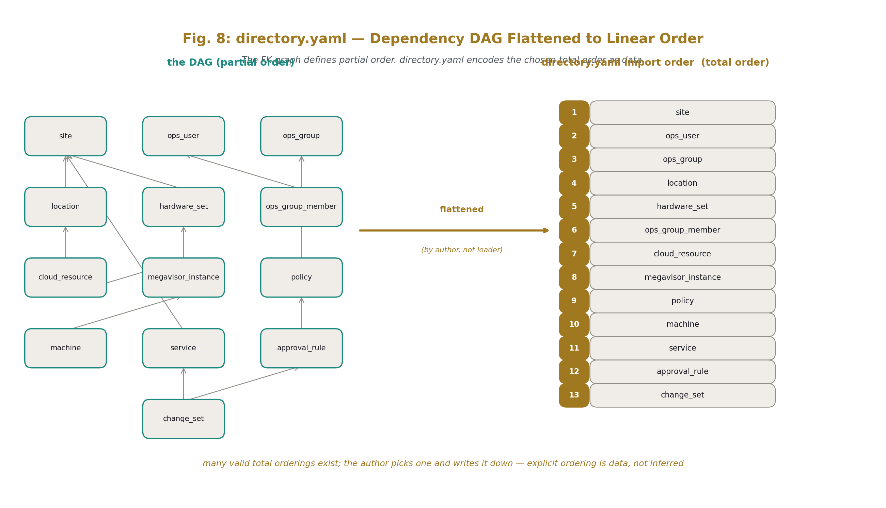
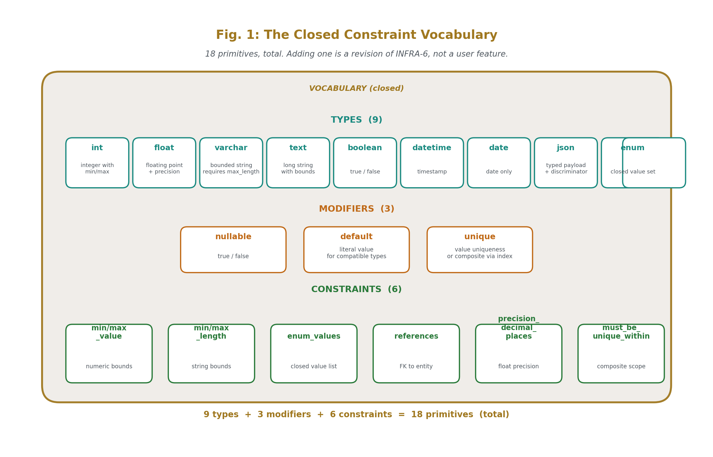
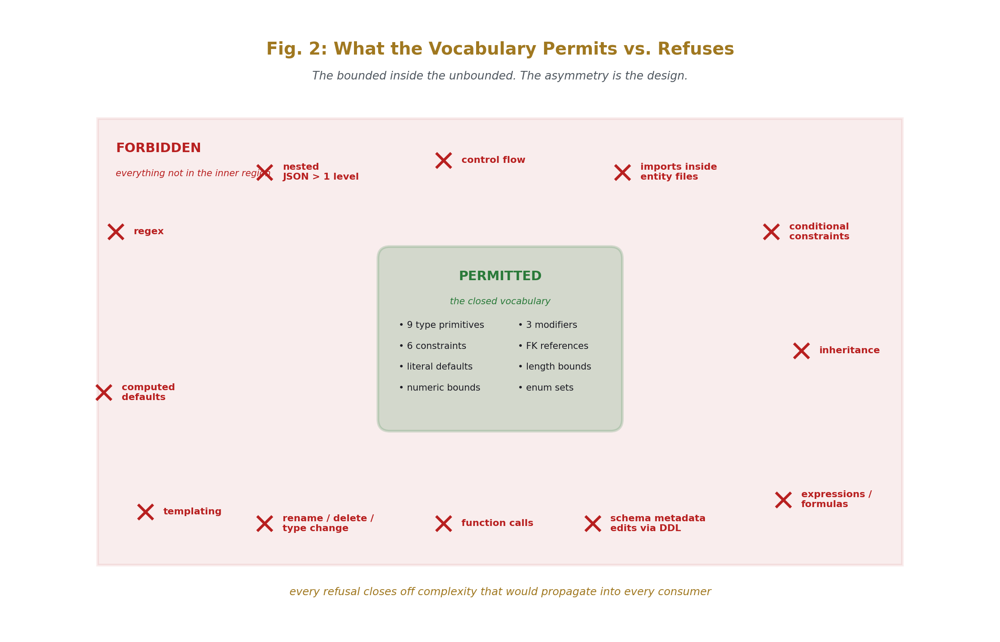
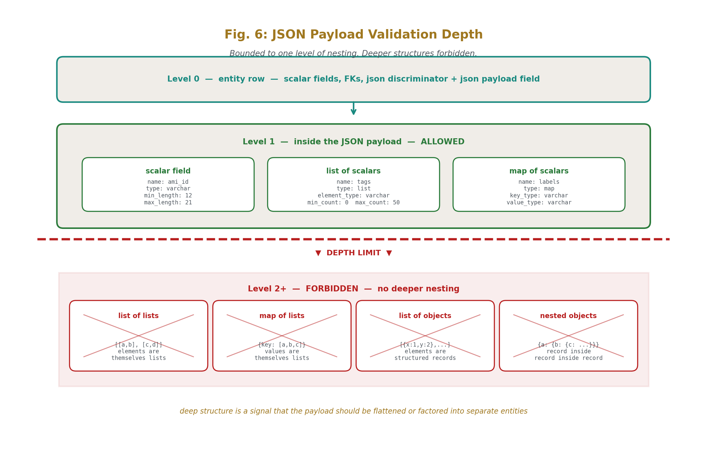
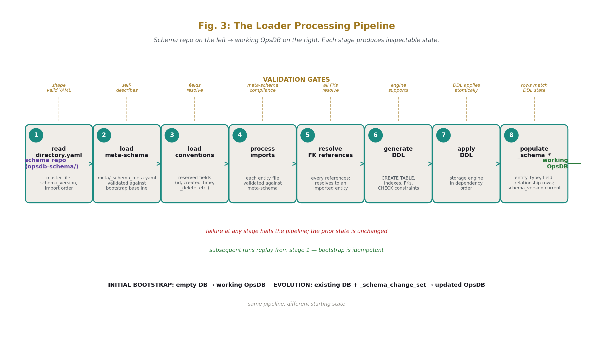
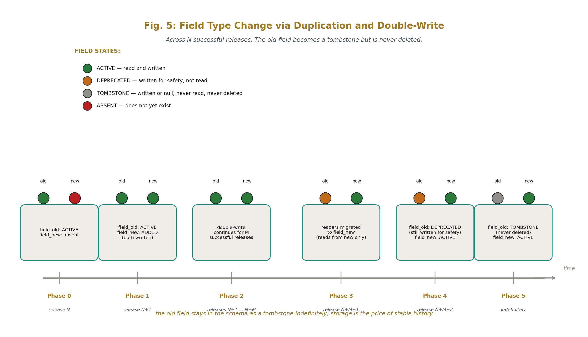
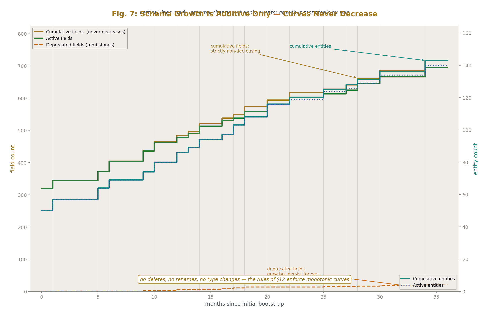
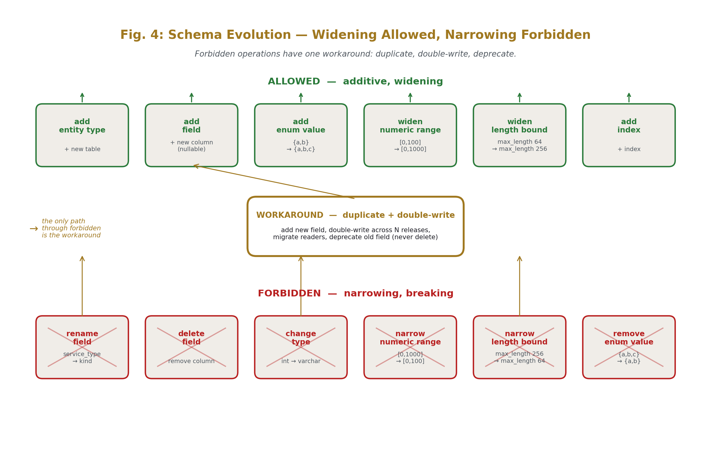

# OpsDB Schema Construction
## Hierarchical Declarative Schemas with Bounded Validation

**AI Usage Disclosure:** Only the top metadata, figures, refs and final copyright sections were edited by the author. All paper content was LLM-generated using Anthropic's Opus 4.7. 

---

## Abstract

The OpsDB schema is itself data. This paper specifies a schema construction system in which the entire schema lives as hierarchical YAML or JSON files in a git repository, processed by a deterministic loader that produces both the relational database and the API's validation metadata from the same source. The schema files are self-contained, declarative, and bounded in expressive power. A small closed vocabulary of types, modifiers, and constraints describes every field of every entity. There is no embedded logic, no regex, no templating, no computed defaults, no conditional constraints, no inheritance. The constraint vocabulary is what the system permits; everything else is refused, by design, to keep the schema inspectable and to keep validation deterministic at the API gate.

The schema repository contains a `directory.yaml` listing the import order of all entity files. Each file describes one entity: its fields, types, foreign keys, range and length bounds, enum sets, and the FK references that act as set-membership constraints. Schema evolution is governed: no field deletions, no renames, no type changes. Type changes happen by duplicating the field, double-writing during a transition window of N successful releases, and removing the original after the transition. Renames do not happen at all. The schema repo creates the OpsDB initially and modifies it through the same change-management discipline OPSDB-6 specifies, keeping schema, database, and API validation synchronized.

What this paper does not specify: the storage engine, the loader's implementation language, the file format choice between YAML and JSON, or the specific authoring tooling. The schema is relational; the relations are declared as data; the rest is implementation choice.

---

## 1. Introduction

### 1.1 The problem

The OpsDB schema [@OPSDB-4] is comprehensive across operational reality. Roughly 150 entity types span hardware, virtualization, Kubernetes, cloud resources, services, runners, schedules, policies, configuration, cached observation, authority pointers, documentation metadata, monitoring, evidence, change management, audit, and the schema's own metadata. The API [@OPSDB-6] validates every write against the schema's declared structure and bounds. Both the schema and the validation it enables must be defined somewhere.

The conventional answer is to define the schema as DDL (CREATE TABLE statements) and define the validation as code (functions in the API server that check ranges, enum membership, FK existence). This produces two disconnected sources of truth: the DDL is what the database has, the validation code is what the API enforces, and the two evolve at different cadences with no mechanical guarantee that they agree. Drift between them is a recurring class of operational defect.

The OpsDB design demands a single source of truth. The schema and the validation it enables must come from the same data, applied to both the database and the API by the same loader, with no possibility of divergence except through governed change.

### 1.2 The solution

The schema lives as data — hierarchical YAML or JSON files in a git repository conventionally named `opsdb-schema`. A `directory.yaml` at the repo root lists all entity files in import order. Each entity file describes one table: fields, types, foreign keys, bounds, enum sets, and constraints. The file format is declarative; there is no logic, no regex, no templating, no computed values, no inheritance.

A loader reads the schema files, validates them against the meta-schema, resolves all foreign-key references, and produces two things in lockstep: the relational database structure (CREATE TABLE statements, indexes, FK constraints, CHECK constraints where the storage engine supports them) and the API's bound-validation metadata (rows in the `_schema_*` tables that the API consults during the gate's bound-validation step). One source of data; two synchronized outputs.

Schema evolution flows through change management. Adding entity types, adding fields, widening enum sets, widening numeric ranges — these are additive changes, expressed as edits to the schema repo, reviewed through the org's git workflow, applied through `_schema_change_set` rows per [@OPSDB-4 §20] and [@OPSDB-6 §7]. Some changes are forbidden outright: no field deletions, no renames, no type changes (§12). The forbidden list is what makes long-lived schemas possible; everything that's allowed is mechanically safe.

### 1.3 Why a closed constraint vocabulary

The schema's expressive power is the load-bearing decision. If the schema language permits arbitrary expressions, regex, computed defaults, conditional constraints, or any other form of embedded logic, the schema becomes unknowable in the sense [@OPSDB-9] §2 establishes. Validation that depends on logic in the schema becomes validation that depends on whatever logic happens to be evaluable in the loader's environment, which depends on the loader's version, which depends on the storage engine's interpretation, which propagates uncertainty into every downstream consumer.

The closed vocabulary refuses this. A small, fixed list of types, modifiers, and constraints. Each primitive has one meaning. Each meaning is mechanically validatable. Adding a new primitive is a revision of this paper, which is the right level of governance for that decision; users do not extend the vocabulary in their schema files.

The closed vocabulary also refuses regex specifically. Regex is a known performance attack vector (catastrophic backtracking on adversarial patterns), a known complexity sink (regex dialects vary across libraries), and a known knowability sink (regex behavior on edge cases is famously hard to predict). The schema does not need regex. Pattern-matching needs that arise can be expressed as enum sets (closed alternatives), length bounds (size limits), and prefix/suffix bounds where applicable. If a constraint cannot be expressed in the closed vocabulary, that's a signal that the constraint belongs in the API's semantic-validation step or in policy data, not in the schema file.

### 1.4 What this paper specifies

The repository layout that holds the schema. The shape of `directory.yaml`. The shape of an entity file. The closed constraint vocabulary, item by item. The governance discipline for schema evolution: what's allowed, what's forbidden, how the type-change-by-duplication pattern works. The meta-schema that describes schema files. The loader's processing pipeline. The bootstrap sequence (schema repo creating the OpsDB initially, then evolving it through change management). The reconciliation discipline when the schema repo and the OpsDB disagree.

### 1.5 What this paper does not specify

The storage engine. Postgres, FoundationDB, CockroachDB, MySQL, and others are all valid targets; the schema repo is engine-agnostic, and the loader generates DDL appropriate to whichever engine is chosen. The loader's implementation language. The file format choice (YAML vs JSON; the structure is what matters). Specific authoring tooling for schema authors. UI design for schema review. The specific JSON schemas registered for typed payload validation (those are organization-specific data per [@OPSDB-4 §2.4]).

### 1.6 Document structure

Section 2 covers conventions inherited from the series. Section 3 specifies the repository layout. Section 4 specifies `directory.yaml`. Section 5 specifies the entity file shape. Section 6 specifies the closed constraint vocabulary. Section 7 specifies what the vocabulary forbids and why. Section 8 covers cross-field constraints and where they live. Section 9 covers JSON payload validation. Section 10 covers the meta-schema and the bootstrap discipline. Section 11 covers loading and applying. Section 12 covers schema evolution rules — the forbidden list. Section 13 covers reconciliation when repo and OpsDB disagree. Section 14 covers storage-engine portability. Section 15 covers what the design refuses to do. Section 16 closes.

---

## 2. Conventions

This paper inherits the conventions established across the prior series.

**DSNC.** All schema names follow the Database Schema Naming Convention specified in OPSDB-4. Singular table names. Lower case with underscores. Hierarchical prefixes from specific to general. Foreign keys named `referenced_table_id`. Type suffixes (`_time`, `_date`, `_id`, `_data_json`). Boolean tense prefixes (`is_`, `was_`). Reserved fields (`id`, `created_time`, `updated_time`, `parent_id`).

**Underscore-prefix governance fields.** Per OPSDB-4 §2.2, fields whose purpose is governance, security, audit, or schema metadata carry a leading underscore. The schema files declare these fields explicitly per entity; this paper specifies the universal reserved set in §3.4 and the per-entity declaration discipline in §5.

**Soft delete.** Soft delete in the schema uses three reserved fields: `_delete=true` to mark deletion, `_delete_time` for when, `_delete_user_id` for who (FK to `ops_user`). These are governance metadata and carry the underscore prefix per the convention. The schema declares per entity whether soft delete applies; entities that do not soft-delete simply omit these fields and use hard delete via the reaper.

**Bridge tables.** Polymorphic relationships use bridge tables per OPSDB-4 §2.5; this paper inherits the discipline. Bridge tables are themselves entities and have their own schema files (or are nested within a parent entity's file when the bridge has no fields beyond reserved structure).

**The 0/1/N rule applied to schemas.** The schema is one — there is one schema repo per OpsDB. The OpsDB's schema metadata tables (`_schema_*`) reflect what the schema repo declared, and the runtime cache and the source must agree. There is never "two schemas" for the same OpsDB; either the system has a single schema or it has multiple OpsDBs (the N-OpsDB pattern from OPSDB-2 §5).

**Notation.** File paths and YAML keys appear in `code style`. Entity types and field names appear in *bold-italic* on first reference. The closed vocabulary primitives appear in `code style` when discussed as terms.

---

## 3. Repository layout

The schema repository is conventionally named `opsdb-schema`. It is a normal git repository accessed through the org's normal git workflow (PRs, code review, branch protections, merge discipline). The schema's evolution is git history; the schema repo is the source of truth for the schema's design intent.

### 3.1 The repository tree

The directory structure mirrors the comprehensive cuts from OPSDB-4 §3. Each top-level directory groups entities by the operational domain they describe.

```
opsdb-schema/
├── directory.yaml
├── conventions/
│   └── reserved.yaml
├── meta/
│   └── _schema_meta.yaml
├── identity/
├── site/
├── substrate/
├── cloud/
├── k8s/
├── service/
├── authority/
├── schedule/
├── policy/
├── documentation/
├── runner/
├── monitoring/
├── observation/
├── configuration/
├── change_management/
├── audit/
├── evidence/
└── schema_metadata/
```

The directory layout is structural advice; it organizes files for human readers and for git review. The loader does not infer dependencies from the directory structure. Dependencies are declared explicitly in `directory.yaml` (§4) by ordering imports.

### 3.2 One file per entity

Each entity type lives in its own file. *Service* is in `service/service.yaml`. *Cloud_resource* is in `cloud/cloud_resource.yaml`. *Runner_spec* is in `runner/runner_spec.yaml`. The file name matches the entity type name with the appropriate file extension.

Bridge tables with substantive fields live in their own files. A bridge with only reserved fields and the two FKs may be nested inside the file of either entity it bridges, with a clear inline declaration. The discipline favors splitting once the bridge has more than its minimal structure; nested declarations are an optimization for the simplest cases.

Versioning sibling tables (the `*_version` siblings per OPSDB-4 §4.2) are not separate files. They are declared as a property of the parent entity (`versioned: true`); the loader generates the sibling table structure from the parent's fields automatically. This avoids duplicating field declarations across two files that must always agree.

### 3.3 The conventions directory

`conventions/reserved.yaml` declares the universal reserved field set: `id`, `created_time`, `updated_time`, `parent_id` (where applicable), `is_active`, and the underscore-prefix governance fields available across the schema (`_delete`, `_delete_time`, `_delete_user_id`, `_requires_group`, `_access_classification`, `_retention_policy_id`, others as specified in OPSDB-4 Appendix B).

Each entity file declares which reserved fields apply to it by name, rather than redeclaring the field's structure. This is the one exception to "no inheritance, no templating" — reserved fields are referenced by name, and the loader expands the reference to the full declared structure from `conventions/reserved.yaml`. The expansion is mechanical; the reference is opaque to the entity file (the entity does not customize the reserved field, only opts in or out).

### 3.4 The meta directory

`meta/_schema_meta.yaml` is the meta-schema — the schema describing what valid schema files look like. The meta-schema is itself written in the same vocabulary that schemas use, with one exception (the bootstrap exception, §10). The meta directory exists separately because the meta-schema is special: it is the bootstrap, and it must be loadable before any other file in the repo.

### 3.5 Domain directories

Each domain directory contains the entity files for that domain. A domain may have many subfiles when the domain decomposes further. The `cloud/` directory is the classic example: it contains the core `cloud_provider.yaml`, `cloud_account.yaml`, `cloud_resource.yaml`, `storage_resource.yaml`, plus a `cloud_resource_types/` subdirectory holding one file per cloud resource type (ec2_instance, s3_bucket, rds_database, lambda_function, gce_instance, gcs_bucket, azure_vm, blob_container, etc.). Each subfile in `cloud_resource_types/` declares the validation schema for the `cloud_data_json` payload when `cloud_resource_type` matches that subfile's name.

Other domains decompose similarly when their content warrants it. The `runner/` directory holds many entity files because runners have many associated tables (runner_spec, runner_capability, runner_machine, runner_instance, runner_job, runner_job_output_var, runner_report_key, the runner_*_target bridges, the runner_job_target_* bridges). The `policy/` directory holds the policy entity itself and the various target bridges by entity type.

### 3.6 The schema_metadata directory

`schema_metadata/` holds the schema files for the `_schema_*` tables themselves: `_schema_version.yaml`, `_schema_entity_type.yaml`, `_schema_field.yaml`, `_schema_relationship.yaml`, `_schema_change_set.yaml`. These are the tables the API queries to perform bound validation; they describe what entities exist, what fields each entity has, what constraints apply, and what the current schema version is.

The recursion is bounded. The schema_metadata files describe themselves and the rest of the schema. The loader creates these tables on bootstrap from the meta-schema; subsequent loads populate them from the schema files that include the schema_metadata files in their import order.

---

## 4. The directory.yaml master file

`directory.yaml` at the repo root is the one authoritative list of what the schema contains. The loader reads only this file initially and processes every other file in the order this file specifies.

### 4.1 Shape

```yaml
schema_version: "2026.05.03.01"

description: |
  Top-level schema directory for the OpsDB.
  Imports are processed in the order listed.
  Earlier files cannot reference entities defined in later files.

# The meta-schema is loaded first. It describes the file format
# every other schema file must conform to.

meta:
  - meta/_schema_meta.yaml

# The conventions file is loaded second. It declares the reserved
# fields that other entity files reference by name.

conventions:
  - conventions/reserved.yaml

# Imports are the entity files, in dependency order.
# Each file declares one entity (or, for bridges with no
# substantive fields, may declare its inline bridge nestings).

imports:

  # Identity: foundational, referenced by virtually everything.
  - identity/ops_user.yaml
  - identity/ops_group.yaml
  - identity/ops_user_role.yaml
  - identity/ops_group_member.yaml
  - identity/ops_user_role_member.yaml

  # Site and location.
  - site/site.yaml
  - site/location.yaml

  # Substrate, bottom-up.
  - substrate/hardware_component.yaml
  - substrate/hardware_port.yaml
  - substrate/hardware_set.yaml
  - substrate/hardware_set_component.yaml
  - substrate/hardware_set_instance.yaml
  - substrate/hardware_set_instance_port_connection.yaml
  - substrate/megavisor.yaml
  - substrate/platform.yaml

  # Cloud (depends on site, location).
  - cloud/cloud_provider.yaml
  - cloud/cloud_account.yaml
  - cloud/cloud_resource.yaml
  - cloud/cloud_resource_types/ec2_instance.yaml
  - cloud/cloud_resource_types/s3_bucket.yaml
  - cloud/cloud_resource_types/rds_database.yaml
  - cloud/cloud_resource_types/lambda_function.yaml
  - cloud/cloud_resource_types/gce_instance.yaml
  - cloud/cloud_resource_types/gcs_bucket.yaml
  - cloud/cloud_resource_types/azure_vm.yaml
  - cloud/cloud_resource_types/azure_blob_container.yaml
  # ... (additional cloud resource types as the org integrates them)
  - cloud/storage_resource.yaml

  # Substrate continued: megavisor_instance and machine
  # depend on hardware, cloud, and platform.
  - substrate/megavisor_instance.yaml
  - substrate/machine.yaml

  # Service abstraction.
  - service/package.yaml
  - service/package_version.yaml
  - service/package_interface.yaml
  - service/package_connection.yaml
  - service/service.yaml
  - service/service_version.yaml
  - service/service_package.yaml
  - service/service_interface_mount.yaml
  - service/service_connection.yaml
  - service/host_group.yaml
  - service/host_group_machine.yaml
  - service/host_group_package.yaml
  - service/site_location.yaml
  - service/service_level.yaml
  - service/service_level_metric.yaml

  # Kubernetes.
  - k8s/k8s_cluster.yaml
  - k8s/k8s_cluster_version.yaml
  - k8s/k8s_cluster_node.yaml
  - k8s/k8s_namespace.yaml
  - k8s/k8s_workload.yaml
  - k8s/k8s_workload_version.yaml
  - k8s/k8s_pod.yaml
  - k8s/k8s_helm_release.yaml
  - k8s/k8s_helm_release_version.yaml
  - k8s/k8s_config_map.yaml
  - k8s/k8s_config_map_version.yaml
  - k8s/k8s_secret_reference.yaml
  - k8s/k8s_service.yaml

  # Authority directory.
  - authority/authority.yaml
  - authority/authority_pointer.yaml
  - authority/service_authority_pointer.yaml
  - authority/machine_authority_pointer.yaml
  - authority/k8s_cluster_authority_pointer.yaml
  - authority/cloud_resource_authority_pointer.yaml

  # Schedules.
  - schedule/schedule.yaml
  - schedule/schedule_version.yaml
  - schedule/runner_schedule.yaml
  - schedule/credential_rotation_schedule.yaml
  - schedule/certificate_expiration_schedule.yaml
  - schedule/compliance_audit_schedule.yaml
  - schedule/manual_operation_schedule.yaml
  - schedule/manual_operation.yaml

  # Policies.
  - policy/policy.yaml
  - policy/policy_version.yaml
  - policy/security_zone.yaml
  - policy/security_zone_membership_service.yaml
  - policy/security_zone_membership_machine.yaml
  - policy/security_zone_membership_k8s_namespace.yaml
  - policy/data_classification.yaml
  - policy/retention_policy.yaml
  - policy/escalation_path.yaml
  - policy/escalation_step.yaml
  - policy/service_escalation_path.yaml
  - policy/change_management_rule.yaml
  - policy/compliance_regime.yaml
  - policy/compliance_scope_service.yaml
  - policy/compliance_scope_data_classification.yaml
  - policy/service_policy.yaml
  - policy/machine_policy.yaml
  - policy/k8s_namespace_policy.yaml
  - policy/cloud_account_policy.yaml

  # Documentation metadata.
  - documentation/runbook_reference.yaml
  - documentation/dashboard_reference.yaml
  - documentation/service_runbook_reference.yaml
  - documentation/service_dashboard_reference.yaml
  - documentation/service_ownership.yaml
  - documentation/machine_ownership.yaml
  - documentation/k8s_cluster_ownership.yaml
  - documentation/cloud_resource_ownership.yaml
  - documentation/service_stakeholder.yaml

  # Runners.
  - runner/runner_spec.yaml
  - runner/runner_spec_version.yaml
  - runner/runner_capability.yaml
  - runner/runner_machine.yaml
  - runner/runner_instance.yaml
  - runner/runner_job.yaml
  - runner/runner_job_output_var.yaml
  - runner/runner_job_target_machine.yaml
  - runner/runner_job_target_service.yaml
  - runner/runner_job_target_k8s_workload.yaml
  - runner/runner_job_target_cloud_resource.yaml
  - runner/runner_service_target.yaml
  - runner/runner_host_group_target.yaml
  - runner/runner_k8s_namespace_target.yaml
  - runner/runner_cloud_account_target.yaml
  - runner/runner_report_key.yaml
  - runner/runner_report_key_version.yaml

  # Monitoring and alerting.
  - monitoring/monitor.yaml
  - monitoring/monitor_machine_target.yaml
  - monitoring/monitor_service_target.yaml
  - monitoring/monitor_k8s_workload_target.yaml
  - monitoring/monitor_cloud_resource_target.yaml
  - monitoring/prometheus_config.yaml
  - monitoring/prometheus_scrape_target.yaml
  - monitoring/monitor_level.yaml
  - monitoring/alert.yaml
  - monitoring/alert_dependency.yaml
  - monitoring/alert_fire.yaml
  - monitoring/on_call_schedule.yaml
  - monitoring/on_call_assignment.yaml

  # Cached observation.
  - observation/observation_cache_metric.yaml
  - observation/observation_cache_state.yaml
  - observation/observation_cache_config.yaml

  # Configuration variables.
  - configuration/configuration_variable.yaml
  - configuration/configuration_variable_version.yaml

  # Change management.
  - change_management/change_set.yaml
  - change_management/change_set_field_change.yaml
  - change_management/change_set_approval_required.yaml
  - change_management/change_set_approval.yaml
  - change_management/change_set_rejection.yaml
  - change_management/change_set_validation.yaml
  - change_management/change_set_emergency_review.yaml
  - change_management/change_set_bulk_membership.yaml

  # Audit and evidence.
  - audit/audit_log_entry.yaml
  - evidence/evidence_record.yaml
  - evidence/evidence_record_service_target.yaml
  - evidence/evidence_record_machine_target.yaml
  - evidence/evidence_record_credential_target.yaml
  - evidence/evidence_record_certificate_target.yaml
  - evidence/evidence_record_compliance_regime_target.yaml
  - evidence/evidence_record_manual_operation_target.yaml
  - evidence/compliance_finding.yaml
  - evidence/compliance_finding_target_service.yaml

  # Schema metadata (the schema's record of itself).
  - schema_metadata/_schema_version.yaml
  - schema_metadata/_schema_change_set.yaml
  - schema_metadata/_schema_entity_type.yaml
  - schema_metadata/_schema_field.yaml
  - schema_metadata/_schema_relationship.yaml
```

### 4.2 Why explicit ordering

The order is deterministic and authored, not inferred. The loader processes files in the listed order. An entity file cannot reference (via FK, via approval rule, via authority pointer) any entity defined in a file that comes later in the list. If it does, the loader rejects the schema with a structured error pointing at the unresolved reference.

This is a *configuration as data* commitment from OPSDB-9 §5.1. Inferring dependencies introduces logic — a topological sort over the FK graph, with cycle detection, with edge cases around self-references and bridge tables. Listing the order in `directory.yaml` is data, deterministic, inspectable. The author who knows the dependency structure encodes it once; the loader follows the order without judgment.

The cost is that authors maintain `directory.yaml` when adding entities. The benefit is that the import graph is explicit; reading `directory.yaml` shows the schema's structure at a glance, in dependency order, without needing to process any other file.



### 4.3 The schema_version

The `schema_version` field at the top of `directory.yaml` is the canonical version of the schema as a whole. It increments per `_schema_change_set` apply. The format is convention-driven (`YYYY.MM.DD.NN` is one common shape, with NN as a same-day counter). Two distinct values are never the same schema; identical values must be the same schema. This is the version that gets stored in `_schema_version.version_label` when the loader applies the schema to the OpsDB.

### 4.4 What directory.yaml does not contain

`directory.yaml` lists imports. It does not contain field declarations, entity declarations, or constraint specifications. Those live in the per-entity files. The directory is a manifest, not a schema description in itself.

`directory.yaml` does not include conditional imports, environment-specific imports, or per-deployment customization. The schema is one schema; the deployment varies through configuration data inside the OpsDB at runtime, not through different schemas being loaded for different environments.

---

## 5. The entity file shape

Each entity file describes one table. The structure is consistent across all files; reading one file teaches the reader how to read every file.

### 5.1 Top-level fields

Every entity file has:

- **`entity_type`** — the table name. Must match the file name (modulo extension). DSNC-compliant.
- **`description`** — prose describing what this entity represents and how it fits in the operational model.
- **`table_category`** — one of: `change_managed`, `observation_only`, `append_only`, `computed`. Per OPSDB-4 Appendix D.
- **`versioned`** — boolean. If true, the loader generates a `*_version` sibling table.
- **`soft_delete`** — boolean. If true, the entity uses `_delete`/`_delete_time`/`_delete_user_id` reserved governance fields; if false, deletes are hard or handled by a reaper per retention policy.
- **`reserved_fields_apply`** — list of reserved field names this entity opts into, referencing `conventions/reserved.yaml`.

These six fields establish the entity's structural shape. They are required on every file.

### 5.2 The fields list

The `fields` list declares the operational fields of the entity. Each field is a record with a small set of declared properties:

- **`name`** — the field name. DSNC-compliant.
- **`type`** — one of the closed vocabulary types from §6.1.
- **`nullable`** — boolean. Defaults to false; explicit declaration is encouraged for clarity.
- **`description`** — prose for the field.
- **Type-specific constraint properties** — `min_value`, `max_value` for numeric; `min_length`, `max_length` for strings; `enum_values` for enums; `references` for FKs; etc., per §6.

A field declaration is a flat structure. There are no nested expressions, no conditional clauses, no formulas. The validation that applies to the field is fully described by the listed properties.

### 5.3 The governance_fields list

The `governance_fields` list is structurally identical to `fields` but holds underscore-prefixed governance fields. The split is for visual clarity in the file — readers can immediately distinguish the operational vocabulary from the governance metadata. The loader treats them identically; both produce columns in the table and rows in `_schema_field`.

### 5.4 The indexes list

The `indexes` list declares the indexes the storage engine must provide. Each index entry has:

- **`fields`** — list of field names the index covers, in order.
- **`unique`** — boolean.
- **`description`** — optional prose.

Indexes in the schema are required, not optional. The schema repo specifies what relational structure the OpsDB has, and indexes are part of that structure because they enable bounded-time validation (FK existence checks, uniqueness checks) at the API gate. A storage engine that genuinely cannot provide a requested index structure is an inappropriate target; the loader rejects configurations that cannot honor the schema.

What's not specified is the index's physical implementation. B-tree, hash, LSM, GIN, GiST — these are engine choices. The schema declares the index's purpose (covers these fields, enforces uniqueness or not); the engine chooses how to implement it.

### 5.5 The approval_rules list

The `approval_rules` list names the policy rules that govern changes to this entity. Each entry references an `approval_rule` policy by name, not by ID (names are stable across deployments; IDs are runtime-assigned).

The loader validates that every named approval rule references a `policy` row with `policy_type='approval_rule'` that exists in the policy data. If a rule is named in a schema file but no matching policy exists, the loader rejects the schema. This couples schema declaration to policy declaration; both must be present in the same governed state for the change_set discipline to function.

### 5.6 Schema metadata fields

Every entity file carries:

- **`introduced_in_schema_version`** — the schema_version when this entity was first added. Set on initial declaration; never changes.
- **`deprecated_in_schema_version`** — the schema_version when this entity was deprecated, or null if currently active. Note that even deprecated entities are not deleted; they remain readable for compatibility (§12).

These two fields are how the schema metadata tables track entity lifecycle. The loader reads them and populates `_schema_entity_type._schema_version_introduced_id` and `_schema_entity_type._schema_version_deprecated_id`.

### 5.7 The notes section

Optional prose at the end of the file. Useful for design rationale, references to other papers in the series, or context that helps future readers understand why the entity is shaped as it is. Not consumed by the loader; purely for human readers.

### 5.8 A complete example

Here is a complete entity file. *Service* from OPSDB-4 §7.3, with the fields declared in the closed vocabulary.

```yaml
entity_type: service

description: |
  An operational role in the DOS. Services compose packages and bind their
  interfaces to concrete endpoints. Services are change-managed; every
  change produces a new service_version row.

table_category: change_managed
versioned: true
soft_delete: true

reserved_fields_apply:
  - id
  - created_time
  - updated_time
  - is_active
  - _delete
  - _delete_time
  - _delete_user_id

fields:

  - name: site_id
    type: foreign_key
    references: site
    nullable: false
    description: "The DOS scope this service belongs to."

  - name: name
    type: varchar
    min_length: 1
    max_length: 255
    nullable: false
    description: "Operational name; conventionally lower_case_with_underscores."

  - name: description
    type: text
    max_length: 4000
    nullable: true

  - name: service_type
    type: enum
    enum_values:
      - standard
      - database
      - k8s_cluster_member
      - cloud_managed
    nullable: false
    description: "The shape of service this row represents."

  - name: parent_service_id
    type: foreign_key
    references: service
    nullable: true
    description: "Self-FK for service hierarchies; nullable for root services."

governance_fields:

  - name: _requires_group
    type: foreign_key
    references: ops_group
    nullable: true
    description: |
      If set, access to rows in this table requires membership in the
      named group beyond standard role/group authority.

  - name: _retention_policy_id
    type: foreign_key
    references: retention_policy
    nullable: true

indexes:

  - fields: [site_id, name]
    unique: true
    description: "Service names are unique within a site."

  - fields: [parent_service_id]

approval_rules:
  - production_service_change_two_approvers
  - compliance_scope_change_compliance_team

introduced_in_schema_version: "2026.01.01.01"
deprecated_in_schema_version: null

notes: |
  Service is the central abstraction in OPSDB-4 §7. The entity is
  composed in service_version with associated rows in service_package,
  service_interface_mount, service_connection. The service_connection
  graph drives configuration template generation, alert dependency
  suppression, and capacity planning.
```

That is the full file. Every line of it is data the loader processes mechanically.

---

## 6. The closed constraint vocabulary

The vocabulary is a fixed, closed list. Adding a primitive is a revision of this paper, not a user-extensible feature. This section lists every primitive, its semantics, and its constraint properties.

### 6.1 Type primitives

**`int`** — a signed integer. Optional `min_value` and `max_value` declare the inclusive range. Without bounds, the engine's native integer range applies.

**`float`** — a floating-point number. Optional `min_value` and `max_value`. Optional `precision_decimal_places` declares the maximum number of decimal places; values with more precision are rejected at the gate.

**`varchar`** — a bounded-length character string. `max_length` is required. `min_length` is optional, defaulting to 0. The string is character-counted (not byte-counted) when the storage engine and encoding allow it.

**`text`** — a long string. `max_length` is optional and bounded by the engine's text capacity. Used for prose fields where bounding to a small length would be artificially restrictive.

**`boolean`** — true or false. No constraints beyond nullability.

**`datetime`** — a high-precision timestamp. The engine's native datetime type applies; precision is engine-specific (microsecond on most modern engines).

**`date`** — a date without a time component.

**`json`** — a typed payload. Requires `json_type_discriminator` referencing the field whose value selects the registered JSON schema for validation. Detailed in §9.

**`enum`** — a closed set of allowed values. Requires `enum_values` listing the permitted values. The values are typically strings; the engine implementation may use enum types or VARCHAR with CHECK constraints.

**`foreign_key`** — a reference to the `id` field of another entity. Requires `references` naming the target entity_type. The loader validates that the target entity exists in the imported schema.

### 6.2 Modifiers

Modifiers apply to fields of compatible types. The loader validates compatibility (a `min_value` on a `varchar` field is rejected; a `max_length` on an `int` field is rejected).

**`nullable`** — true or false. Defaults to false. When false, the field must be set on every row.

**`default`** — a literal value. Permitted for `int`, `float`, `boolean`, `enum`, `date`, `varchar`, and `text` (subject to a small length cap on the literal). Not permitted for `foreign_key` (defaults must be specific row references, which the schema cannot know in advance), `datetime` (use the universal `created_time` reserved field for "now"), or `json` (defaults for JSON payloads risk smuggling logic into defaults).

**`unique`** — true or false. When true, the field's values must be unique across all rows in the table. Composite uniqueness is expressed via the `indexes` list with `unique: true`.

### 6.3 Constraints

Constraints further restrict values within the type's natural range.

**`min_value`** and **`max_value`** — inclusive numeric bounds for `int` and `float`. Either may be present without the other.

**`min_length`** and **`max_length`** — character length bounds for `varchar` and `text`. `max_length` is required for `varchar`.

**`enum_values`** — for `enum`, the closed list of permitted values. Listed in YAML as a sequence of strings (typically; integers are also valid for ordinal enums).

**`references`** — for `foreign_key`, the target entity name. The FK is to the target's `id` field; references to other fields are not supported.

**`precision_decimal_places`** — for `float`, the maximum number of decimal places.

**`must_be_unique_within`** — for fields whose uniqueness scope is composite. Expressed as a list of field names defining the scope. The loader generates the appropriate composite unique index.

### 6.4 The complete vocabulary

The vocabulary is the union of §6.1 (types), §6.2 (modifiers), and §6.3 (constraints). Nothing else. Nine type primitives, three modifiers, six constraints. Eighteen primitives total, each with a single, mechanical, validatable meaning.

This is the entire expressive surface of the schema language. Every constraint that needs to apply at the API gate must be expressible in this vocabulary. If a needed constraint cannot be expressed, that's a signal — either the constraint belongs at a different layer (semantic validation, policy data) or the vocabulary needs a new primitive (which is a revision of this paper, governed accordingly).

The list is small on purpose. Smaller is better. Every primitive is a place where the schema's behavior must be defined precisely; fewer primitives means less surface to reason about and fewer corners where edge cases can hide.



---

## 7. What the vocabulary forbids

Equally important to what the vocabulary permits is what it forbids. The forbidden list is the discipline that keeps the schema bounded in expressive power.

### 7.1 No regex

Pattern-matching fields express their bounds through `min_length`, `max_length`, and `enum_values`. There is no regex primitive, no `pattern` constraint, no `format` field that would resolve to a regex behind the scenes.

The reasons accumulate. Regex evaluators are a known performance attack surface (catastrophic backtracking on adversarial inputs). Regex dialects vary across implementations, breaking storage-engine portability. Regex behavior on edge cases is famously unpredictable. Regex inside a schema language adds an embedded mini-language that authors must learn and reviewers must understand; the schema becomes harder to read by exactly the amount the regex grammar is non-obvious.

What regex-like constraints are needed are usually expressible otherwise. "Must start with `prod_`" is an enum of permitted prefixes plus a length bound. "Must look like a hostname" is a length bound plus character-class restrictions, expressible through enum-of-prefixes patterns or, more simply, through the API's semantic-validation step where logic is permitted but bounded.

### 7.2 No embedded logic

The schema files contain no expressions, no formulas, no operators beyond comparison-via-bounds, no function calls. Every value in a schema file is a literal. The loader does not evaluate; it parses, validates, and applies.

This refusal extends to defaults. Permitted defaults are literals (`default: 0`, `default: "active"`, `default: false`). Computed defaults like `default: now()` or `default: previous_value + 1` are forbidden. The reserved fields `created_time` and `updated_time` are populated by the API on insert and update respectively; they are not declared with a default in the schema file.

### 7.3 No conditional constraints

Constraints that depend on the value of another field — "if status is `active` then `running_since` must be non-null" — are not expressible in the schema. They belong at the API's semantic-validation step (OPSDB-6 §7.6) where named rules in policy data express cross-field invariants.

This is a hard line because conditional constraints in the schema would smuggle logic in. Even simple conditional constraints quickly compose into something approximating a programming language; the schema would no longer be inspectable as data. By keeping conditionals out of the schema and in policy, the schema describes structure (what fields exist with what bounds) and policy describes behavior (what cross-field invariants hold).

### 7.4 No inheritance

Each entity is fully specified in its own file. There is no `extends` directive, no parent entity, no shared base class for entities. Two entities that have similar fields each declare those fields independently.

The exception is the reserved fields, referenced by name from `conventions/reserved.yaml` (§3.3, §5.1). This is a controlled mechanism, not general inheritance: an entity opts into specific named reserved fields, the loader expands the references, and the entity cannot customize the expansion. Reserved fields are universal structure (id, timestamps, governance metadata) that benefits from being declared once and applied many times.

### 7.5 No templating

There are no template variables, no parameterized files, no macros, no per-deployment substitution. The schema files are the schema files; what's checked into the repo is what gets loaded.

Variation across environments (production vs. staging vs. corp) is expressed at runtime through configuration data in the OpsDB itself, not by loading different schemas. The schema is one schema per OpsDB; the OpsDB's runtime configuration may differ across environments, but the structural model does not.

### 7.6 No imports within entity files

Entity files do not import other files. The only file that imports is `directory.yaml`. This keeps the dependency graph simple: every entity file is leaf-level data; only the master directory aggregates.

### 7.7 No deletions, no renames, no type changes

Schema evolution has its own forbidden list, covered in §12. The forbiddens here are about the file format; the forbiddens in §12 are about how the schema changes over time.

### 7.8 Why each refusal matters

Each refusal closes off a category of complexity that would propagate into every consumer of the schema. The API would have to evaluate the conditional constraints, support the regex evaluator, process the inheritance, expand the templates. The loader would have to handle each. The reviewer would have to understand each. The schema steward would have to govern each.

By refusing these things, the schema stays simple. The loader is mechanical. The API's bound-validation step is a lookup. The reviewer reads YAML. The schema steward reviews data. The complexity that would otherwise accumulate in the schema language stays elsewhere, where it belongs — in the API's semantic validation layer (where it's bounded and named), in policy data (where it's governed), in runner code (where it's reviewed).



---

## 8. Cross-field constraints and policy

Cross-field invariants are a real operational need. They are expressed in policy data, not in schema files.

### 8.1 The split

The schema describes structure: fields, types, FKs, bounds. The schema's validation is per-field, mechanical, expressible in the closed vocabulary.

Cross-field invariants — "if status is X then Y must be set," "min_replicas must be ≤ max_replicas," "deployment_strategy must match cluster_capability_set" — describe behavior across multiple fields. These belong in policy data, evaluated at the API's semantic-validation step (OPSDB-6 §7.6).

### 8.2 How invariants are declared

Cross-field invariants are `policy` rows with `policy_type='semantic_invariant'`. The policy's `policy_data_json` carries the invariant rule in a declarative form the API understands. Because the rule is itself data and policies are change-managed, modifying an invariant flows through the same governance discipline as modifying schema or any other governance configuration.

The exact shape of `policy_data_json` for semantic invariants is policy schema (declared in `policy/policy.yaml` and registered with the API). It is bounded — typically expressing comparisons across named fields with a small set of operators — but it is more expressive than the closed schema vocabulary because it operates in the API's evaluation context rather than at file-load time.

### 8.3 Invariants reference entity types

A semantic-invariant policy references the entity_type it applies to. The API consults applicable invariants when validating any change_set touching that entity_type, evaluates each, and rejects changes that violate fail-closed invariants or warns on changes that violate fail-open ones.

This couples policies to schemas through entity_type names. The loader validates that policies reference real entity types; the API at runtime ensures that entity types being modified have their applicable policies evaluated.

### 8.4 Why this split holds

The schema is loaded once and rarely changes; bound validation is a hot path on every write. Keeping bound validation simple (lookup in `_schema_field`, check the value's primitives) keeps the gate fast.

Semantic invariants change more often as operational understanding evolves; expressing them as policy data keeps them in the change-management pipeline. New invariants don't require schema migration; they're just new policy rows.

The two layers compose. Schema validates structure; policy validates behavior. Both are data. Both are governed. Both are evaluated at the gate. The split is what allows the schema language to remain bounded while the operational model can express what needs to be expressed.

---

## 9. JSON payload validation

`*_data_json` fields use the typed payload pattern from OPSDB-4 §2.4. The schema repo specifies how each discriminator value maps to a payload schema, using the same closed vocabulary.

### 9.1 The discriminator pattern

A `json` field declares a `json_type_discriminator` naming the field whose value selects the validation schema. From the *cloud_resource* example:

```yaml
fields:

  - name: cloud_resource_type
    type: enum
    enum_values:
      - ec2_instance
      - s3_bucket
      - rds_database
      - lambda_function
      - gce_instance
      - gcs_bucket
      - azure_vm
      - azure_blob_container
      # additional types as the org integrates them
    nullable: false

  - name: cloud_data_json
    type: json
    json_type_discriminator: cloud_resource_type
    nullable: false
```

The loader sees that `cloud_data_json` is discriminated by `cloud_resource_type`. For each enum value of `cloud_resource_type`, the loader expects a payload schema file at the conventional path (`cloud/cloud_resource_types/<type_value>.yaml`).

### 9.2 Payload schema file shape

Each payload schema file declares the structure of the JSON value when the discriminator matches:

```yaml
discriminator_field: cloud_resource_type
discriminator_value: ec2_instance

description: |
  Validation schema for cloud_data_json when cloud_resource_type=ec2_instance.

json_schema:

  fields:

    - name: instance_type
      type: enum
      enum_values:
        - t3.micro
        - t3.small
        - t3.medium
        - m5.large
        - m5.xlarge
        # the org's approved instance types
      nullable: false

    - name: ami_id
      type: varchar
      min_length: 12
      max_length: 21
      nullable: false

    - name: vpc_id
      type: varchar
      min_length: 12
      max_length: 21
      nullable: false

    - name: subnet_id
      type: varchar
      min_length: 15
      max_length: 24
      nullable: false

    - name: security_group_ids
      type: list
      element_type: varchar
      element_min_length: 11
      element_max_length: 20
      min_count: 1
      max_count: 10
      nullable: false

    - name: tags
      type: map
      key_type: varchar
      key_max_length: 128
      value_type: varchar
      value_max_length: 256
      max_entries: 50
      nullable: true

introduced_in_schema_version: "2026.01.01.01"
```

### 9.3 The JSON-context vocabulary additions

JSON payload schemas use the same vocabulary plus two collection types specific to JSON contexts:

**`list`** — an ordered list. Requires `element_type` declaring the element's type, plus the element's own constraints (`element_min_value`, `element_max_length`, etc., prefixed with `element_`). Optional `min_count` and `max_count` bound the list's length.

**`map`** — a key-value map. Requires `key_type` and `value_type` with their respective constraints. Optional `max_entries` bounds the map's size.

These additions exist because JSON payloads naturally contain nested structure that flat fields don't have. The collection types are bounded — every list has a max count, every map has a max entries, every element and value has its own bounds — so JSON payloads are not unbounded in size or depth.

### 9.4 Recursion depth limit

JSON payload schemas are one level deep into the JSON structure. Lists may contain primitives (strings, integers); maps may contain primitives. Lists of lists, maps of lists, lists of maps — these are forbidden in payload schemas. If a payload genuinely needs nested structure, it should be flattened across multiple discriminated payloads or factored into separate entity types with FKs.

The reasoning is the same as elsewhere. Deep nesting makes validation harder to reason about and creates places where bounds can be violated subtly. A payload that needs deep structure is a signal that the operational reality has more entity types in it than the schema currently models; the response is to model them, not to nest them in JSON.



### 9.5 Validation at the API gate

When a write to a `json`-typed field arrives at the API:

1. The API reads the discriminator field's value from the same write.
2. The API looks up the registered JSON schema for that discriminator value (cached from the schema metadata).
3. The API validates the JSON payload recursively against the schema, using the same primitive validators it uses for flat fields, plus the list and map validators for collections.
4. Validation failures reject the write with structured errors pointing at the failing field.

The JSON validation is deterministic and bounded. No regex. No embedded logic. The same closed vocabulary, applied recursively to a bounded depth.

---

## 10. The meta-schema and bootstrap

The schema files have a schema themselves — the meta-schema describing what valid schema files look like. The meta-schema is itself a schema, written in the same vocabulary, with one bootstrap exception.

### 10.1 The meta-schema's role

The meta-schema declares: every schema file has these top-level fields, each with these types and bounds. The `entity_type` field is a varchar with a length bound and DSNC-style enum constraints on permitted characters. The `fields` list is a list-of-records with each record's own structure. And so on.

The loader's first action on any schema repo is to load the meta-schema and validate every other file against it. Files that don't conform are rejected with structured errors before any FK resolution or DDL generation begins.

### 10.2 The bootstrap exception

The meta-schema describes itself, mostly. The exception: the meta-schema cannot use FK references to entities not yet loaded, because nothing has been loaded yet when the meta-schema is being processed. This is solved by allowing the meta-schema to reference its own structure intrinsically (the meta-schema's `type` field is an enum of the closed type vocabulary, listed inline in the meta-schema rather than referenced from another file).

The bootstrap exception is bounded. The meta-schema is the only file that has it. Every other schema file must use FK references for type validation; the meta-schema is the leaf of the recursion.

### 10.3 The meta directory contents

`meta/_schema_meta.yaml` is the meta-schema. It is loaded by the loader before `conventions/reserved.yaml` and before any imports. Its contents are validated against a hardcoded baseline in the loader itself — the smallest possible self-describing structure that the loader knows is well-formed. This is the bootstrap floor.

After the meta-schema is loaded and validated, every other file is validated against the meta-schema. The meta-schema is then immutable for the rest of the load — it does not get reloaded, recomputed, or evaluated against itself again.

### 10.4 Producing the schema metadata tables

The schema_metadata tables (`_schema_version`, `_schema_change_set`, `_schema_entity_type`, `_schema_field`, `_schema_relationship`) hold the runtime cache of what the schema looks like. The API queries these tables during bound validation; the loader populates them from the schema files.

There are two ways the schema metadata tables get populated:

**From the YAML files (initial bootstrap or full rebuild).** The loader reads the schema repo, validates everything, and inserts rows into `_schema_*` tables corresponding to each entity, field, and relationship declared. This is the path used when creating an OpsDB from scratch.

**From an existing database (recovery or migration).** The loader can introspect a relational database and produce schema metadata rows from the actual table structure. This is the path used when migrating an existing database into the OpsDB design, or when recovering schema metadata that has been corrupted while the underlying tables are intact.

Either path produces the same destination state: schema metadata tables that match the actual database structure. Going forward, schema changes flow through `_schema_change_set` rows that the loader processes (§11.3); both the database and the metadata are updated together.

### 10.5 The schema repo creates the OpsDB

The initial bootstrap of an OpsDB starts from an empty database and the schema repo. The loader:

1. Loads the meta-schema and validates it against the loader's hardcoded baseline.
2. Loads `conventions/reserved.yaml` and validates against the meta-schema.
3. Processes the `imports` list from `directory.yaml` in order. For each file, validates against the meta-schema, resolves FK references against entities loaded so far, and adds the entity to the in-memory schema model.
4. After all files are loaded and validated, generates DDL appropriate to the chosen storage engine: CREATE TABLE statements for each entity (and its `*_version` sibling if applicable), CREATE INDEX statements, FK and CHECK constraints where supported.
5. Applies the DDL to the storage engine in dependency order.
6. Inserts rows into `_schema_*` tables describing the loaded schema. Inserts a row into `_schema_version` with the schema_version from `directory.yaml` and `is_current=true`.
7. The OpsDB is now ready. The API can begin serving requests; runners can begin operating.

This is the same loader, the same files, the same vocabulary. The OpsDB is created from data; nothing about the bootstrap requires running an OpsDB to bootstrap an OpsDB.



---

## 11. Loading and applying

Beyond the initial bootstrap, schema changes flow through change management. The schema repo and the OpsDB stay synchronized.

### 11.1 The propose-review-apply cycle

A schema change starts as a git PR against the `opsdb-schema` repo. The author edits files: adds a new entity file, adds fields to an existing file, widens an enum's values list, adds an index. The PR is reviewed by the schema steward (per OPSDB-2 §14.12) and by any other reviewers the org's git workflow requires.

Review checks structural integrity (the loader can validate the PR's branch independently before merge, though that's a CI concern not a schema-construction-design concern), checks adherence to DSNC, checks that additions are comprehensive (slicing the pie correctly per the construction discipline of OPSDB-2 §14.1).

On PR merge, a CI process generates a `_schema_change_set` proposal. The proposal is the diff between the current schema (as reflected in the OpsDB's `_schema_*` tables) and the new schema (as reflected in the merged repo). The diff is expressed as schema-evolution operations: ADD ENTITY, ADD FIELD, WIDEN ENUM, ADD INDEX, MARK DEPRECATED.

### 11.2 The schema change_set

The `_schema_change_set` is itself a change_set, governed by OPSDB-6's change-management discipline with stricter approval rules (per OPSDB-4 §20.2). Approvers include the schema steward role. The change_set carries the schema-evolution operations as its field changes.

Validation runs through the standard pipeline. The schema-evolution operations are themselves bounded: the validator confirms that no operations forbidden by §12 (deletions, renames, type changes) are present. Operations that violate the forbidden list are rejected at the validation step before approval routing.

On approval, the change_set executor — for `_schema_change_set` rows, a specialized schema executor — applies the schema changes to the storage engine and updates the schema metadata tables. The schema_version increments. The new fields, entities, and constraints become available to the API immediately for new writes; existing rows remain valid because all changes are additive.

### 11.3 The schema executor

The schema executor is a specialized change-set executor (OPSDB-5 §4.7) that handles `_schema_change_set` rows. Its actions:

1. Read the approved `_schema_change_set` and its associated field changes.
2. Generate the DDL operations corresponding to each schema-evolution operation.
3. Apply the DDL to the storage engine atomically where possible (some engines allow transactional DDL; others require the changes in a defined order with care for atomicity).
4. Update the `_schema_*` tables to reflect the new state.
5. Update `_schema_version` with the new current version.
6. Mark the change_set as `applied`.

Failures during DDL application halt the executor and roll back what can be rolled back. The change_set's status becomes `failed`; a finding is filed; an operator investigates. The schema repo and the OpsDB remain in their pre-change state until the issue is resolved (typically by submitting a corrective change_set that achieves the intended schema change differently).

### 11.4 The schema repo and OpsDB stay synchronized

After every applied `_schema_change_set`, the OpsDB's schema metadata tables match the schema repo's contents at the corresponding schema_version. The two are synchronized by construction — the executor is the only path to schema changes, and the executor reads the repo's intent and applies it to the OpsDB.

The schema_version in the OpsDB and the schema_version in `directory.yaml` are the same. Any deployment of the OpsDB API queries `_schema_version.version_label WHERE is_current=true` and gets the same answer the schema repo would report.

---

## 12. Schema evolution rules

Schema evolution has a forbidden list. The forbiddens are what make long-lived schemas possible.

### 12.1 No deleting fields

Fields, once added, are not removed. They may be marked deprecated (a flag on the field's `_schema_field` row), at which point new code is encouraged to stop writing to them and to read from a successor field. But the field remains in the schema, the column remains in the table, and existing rows that wrote values to it remain valid.

The reasoning: deletion breaks history. Version history rows reference the field's value. Audit log entries reference field changes. Removing the field would orphan all that history. Worse, it would force the executor to either rewrite history (forbidden, audit log is append-only) or refuse to remove the field (which is what the rule encodes directly).

A field that is no longer needed is deprecated. New writes default to null or to a "no longer used" sentinel. Old data remains queryable. After enough release cycles that no consumer reads or writes the field, the field is left as a tombstone in the schema but no longer carries operational meaning.

### 12.2 No renaming fields

Names are not changed. Once a field is named `service_type`, it stays `service_type`. If the operational meaning changes such that a different name would be more accurate, the response is to add a new field with the new name and deprecate the old one (§12.4).

The reasoning: renames break every consumer. Runners that query by field name fail. Audit log entries that reference the old name become uninterpretable. Version history rows lose their connection to the entity's field. Renames are forbidden because they cannot be done safely; the cost of a wrong name is permanent, and the discipline accepts that cost as the price of stable references.

This rule applies to entity_type names as well as field names. An entity, once named, keeps its name forever.

### 12.3 No changing field types

A field declared as `int` does not later become `float` or `varchar`. A field declared as `varchar(64)` does not later become `varchar(128)` (well — widening max_length is allowed; narrowing is not, see §12.5). A field declared as `enum` with five values does not later have its enum_values list shrunk (widening is allowed; narrowing is not).

The reasoning is the same as renaming and deletion: type changes break consumers. A runner that expects int values cannot suddenly receive floats; a query that compares a varchar field cannot suddenly receive a different shape.

### 12.4 Type changes by duplication and double-write

When a field's type genuinely needs to change — the operational reality has shifted, and the original type is no longer adequate — the change is performed by duplication, not by modification.

The pattern:

1. **Add a new field** with the new type, alongside the old field. Both fields exist in the schema and the table.
2. **Begin double-writing.** All code that writes to the old field is updated to also write to the new field. Both fields receive values on every write. This continues for N successful release cycles — N is organizational; a typical value is 3 to 5 cycles, enough that any consumer that hasn't migrated has had time to do so.
3. **Migrate readers.** Code that reads from the old field is updated to read from the new field. The old field's reads become rare or zero.
4. **Mark the old field deprecated** in the schema metadata.
5. **Continue double-writing for additional cycles** until the schema steward is confident no consumers depend on the old field. The old field becomes a tombstone — values are still written for safety, but nothing reads them.
6. **The old field is never removed.** It remains as a tombstone, deprecated, with no current operational meaning, indefinitely. Storage cost is the price of stable history.

This pattern handles every type change. Widening an int range that turns out to need to become a float: duplicate, double-write, migrate readers. Replacing a varchar field with a more structured enum: duplicate, double-write, migrate. Restructuring a field's semantic meaning (which is essentially a rename plus a type change): the same.



### 12.5 What is allowed: widening

Some changes are non-breaking and permitted directly:

- **Adding a new field** to an entity, with `nullable: true` (existing rows have no value, which is fine because the field is nullable).
- **Adding new enum values** to an existing enum's `enum_values` list (existing rows that hold previous values remain valid; new writes can choose any of the expanded values).
- **Widening numeric ranges** (`min_value` decreased, `max_value` increased; never the reverse).
- **Widening length bounds** (`max_length` increased; never decreased).
- **Adding new entity types** (entirely additive; no impact on existing entities).
- **Adding new indexes** (improves query performance; does not affect data validity).
- **Adding new approval rule references** to an entity (tightens governance for new changes; existing rows are unaffected).

These changes flow through `_schema_change_set` like any other but pass validation easily because they cannot break consumers.



### 12.6 What is forbidden: narrowing

The mirror of widening. Narrowing is forbidden:

- **Narrowing numeric ranges** (existing rows might hold values now out of range).
- **Narrowing length bounds** (existing strings might exceed the new bound).
- **Removing enum values** (existing rows might hold the removed value).
- **Tightening uniqueness** (existing rows might now violate the constraint).
- **Removing indexes** (allowed if no consumer depends on the index for performance; the validator does not check this, so the change steward must verify; in practice most index removals are mistakes).

When narrowing is genuinely needed — for example, an enum value turns out to be unsafe and must be retired — the response is the duplication pattern. Add a new field that uses only the narrower set; double-write; migrate readers; deprecate the old field.

### 12.7 Why these rules are absolute

The rules are absolute because partial enforcement is worse than full enforcement. If renames are sometimes allowed, every consumer must be defensive against renames everywhere. If deletions are sometimes allowed, every consumer must check for field existence before reading. If type changes are sometimes allowed, every consumer must handle multiple types per field.

Absolute rules let consumers be simple. A runner can read a field by name and trust the name will always exist. A query can compare a field's value and trust the type will not change. A version history reconstruction can trust that fields present in old versions are still meaningful. The discipline costs the org occasional schema gymnastics around the duplication pattern; it buys decade-scale stability for everything that depends on the schema.

This is the operational realization of the *data primacy* principle from OPSDB-9 §5.1. Data persists; logic churns. The schema is data; its evolution is governed strictly precisely because everything else in the operational reality depends on it persisting.



---

## 13. Reconciliation when repo and OpsDB disagree

The schema repo and the OpsDB stay synchronized through the `_schema_change_set` discipline. But disagreement is possible: someone hand-edits the database, the executor partially applies a change before failing, the OpsDB is restored from an old backup, the schema repo branches diverge. The reconciliation discipline handles each case.

### 13.1 Versions match, structures match

The normal case. `directory.yaml.schema_version` equals `_schema_version.version_label WHERE is_current=true`, and the schema files describe the same structure the database has. No action needed; the system is consistent.

### 13.2 Versions differ, executor catches up

The schema repo is ahead of the OpsDB. This happens when changes have been merged to the repo but the corresponding `_schema_change_set` has not yet been applied (perhaps the executor is paused, or is processing a backlog, or there's been a deployment lag).

The schema executor detects approved-not-yet-applied `_schema_change_set` rows on its next cycle and processes them in order. After processing, the OpsDB's version matches the repo's. Normal operation.

### 13.3 Structures differ at matching versions

The OpsDB and the repo claim the same schema_version but the actual structures differ. This is a finding: someone has hand-edited the database, or the database has been restored from a backup that diverged, or the executor has a bug. The reconciliation discipline:

1. **Detect the divergence.** A reconciliation runner periodically introspects the database and compares the actual structure to the schema metadata's claims. Mismatches are written as `compliance_finding` rows with severity `high`.
2. **Investigate.** An operator reviews the finding. Determines whether the divergence is benign (the database has an extra index that improves performance and was added carefully) or harmful (a column has been altered in a way that contradicts the schema).
3. **Reconcile.** Either the database is corrected to match the schema (via a `_schema_change_set` that re-applies the canonical structure), or the schema is updated to reflect the new state (via a `_schema_change_set` that documents the divergence as the new canonical). The choice depends on which is correct; the resolution is governed.
4. **Record the resolution.** The finding is closed with the change_set that resolved it referenced.

This process should be rare. Hand-editing the database is forbidden by the substrate-operator discipline (OPSDB-2 §4.2); when it happens, it's an exceptional circumstance and is itself audited.

### 13.4 The repo is restored to an older state

The schema repo's `directory.yaml.schema_version` is older than the OpsDB's `_schema_version.version_label`. This shouldn't happen; the repo's schema_version increments monotonically, and reverting it is a manual git operation. If detected, it's a finding requiring human review.

The resolution is typically to re-apply the missing changes (cherry-pick from history, or re-merge the missing PRs). The OpsDB is not rolled back to an older schema; rolling back a schema would violate the no-deletion rule (§12.1) by removing fields that exist.

### 13.5 The OpsDB is restored from backup

The OpsDB is restored from a backup that predates some schema changes. The OpsDB's `_schema_version.version_label` is now older than the repo's. The schema executor detects the missing changes in its next cycle (some `_schema_change_set` rows have `applied_time` set in the future of the current `_schema_version`) and re-applies them. After processing, the OpsDB matches the repo.

This works because the schema_change_set rows are themselves data and survive the backup. The data-from-backup reflects the state at backup time; the executor catches up the schema; the operational data may also need application-level catch-up (per the org's backup-and-restore discipline), but the schema is handled mechanically.

### 13.6 The integrity discipline

The fundamental rule: the schema repo is the source of truth for the schema. The OpsDB's schema metadata is a runtime cache. Where they disagree, the question is which is correct, and the answer is whichever the governed change-management process most recently approved. The reconciliation discipline always converges to the change_set-approved state; divergence is detected and resolved.

This is *single source of truth* (OPSDB-9 §5.1) applied to the schema. Whatever tooling exists to detect and reconcile divergence, it converges on the change_set history as authoritative. Divergence outside the history is by definition an anomaly to investigate and correct.

---

## 14. Storage-engine portability

The schema is relational. The relations are declared as data. Different relational storage engines can serve the schema; the loader generates DDL appropriate to the chosen engine.

### 14.1 What the schema specifies

Per §1.5, the schema does not specify the storage engine. What it does specify:

- **The relational structure.** Tables, columns, types, FKs.
- **The constraints.** Ranges, lengths, enum sets, FKs, uniqueness.
- **The indexes.** What indexes must exist (required, not advisory) for the API's bound validation to function in bounded time.
- **The relationships.** Cross-table FK references that define the schema's structural connectivity.

These are engine-independent. Postgres, MySQL, CockroachDB, FoundationDB, MariaDB, SQLite, and others can all serve them with different DDL syntax and different performance characteristics.

### 14.2 What the engine chooses

The engine chooses:

- **Physical storage layout.** Row store, column store, hybrid, LSM tree, B-tree.
- **Index implementation.** B-tree, hash, GIN, GiST, BRIN, depending on what the engine offers.
- **Replication topology.** Single primary, multi-primary, sharded, partitioned, geo-replicated.
- **Concurrency control.** MVCC, locking, optimistic.
- **Backup and recovery.** Snapshots, WAL shipping, logical dumps.

These are operational concerns, not schema concerns. An organization that runs its OpsDB on Postgres makes Postgres-specific operational choices; one that runs on CockroachDB makes CockroachDB-specific ones. The schema repo is the same in either case.

### 14.3 DDL generation

The loader generates DDL appropriate to the chosen engine. For Postgres:

- `int` → `INTEGER` or `BIGINT` based on range bounds.
- `float` → `DOUBLE PRECISION` or `NUMERIC(precision, scale)` if `precision_decimal_places` is set.
- `varchar` → `VARCHAR(max_length)`.
- `text` → `TEXT` with optional CHECK constraint on length.
- `boolean` → `BOOLEAN`.
- `datetime` → `TIMESTAMPTZ`.
- `date` → `DATE`.
- `enum` → `VARCHAR` with CHECK constraint listing enum_values, or a Postgres ENUM type.
- `foreign_key` → `INTEGER REFERENCES <target>(id)`.
- `json` → `JSONB`.

Range constraints become `CHECK (field >= min_value AND field <= max_value)`. Length constraints become `CHECK (length(field) BETWEEN min_length AND max_length)`. Enum constraints become `CHECK (field IN (...))`. Indexes become `CREATE INDEX` or `CREATE UNIQUE INDEX`.

For MySQL, CockroachDB, others — the same primitives map to the engine's analogous DDL syntax. The loader is engine-aware in its DDL generation; the schema files are not.

### 14.4 What if the engine cannot honor a constraint

Some engines do not support all constraint types natively. CHECK constraints are supported by most modern engines but not all. JSON validation may be supported by JSONB in Postgres, by JSON validation functions in MySQL, by the API alone in engines without native JSON validation.

The loader's behavior when an engine cannot honor a declared constraint:

1. The constraint is enforced at the API gate (always, regardless of engine support; the API does not delegate validation entirely to the engine).
2. If the engine cannot enforce the constraint at the database layer, the loader generates the table without that engine-level constraint and logs the gap.
3. The deployment proceeds, with validation happening at the API but not at the database.

This is a graceful degradation. The validation is still mechanical and bounded; it just runs in one place (the API) rather than two (API and database). For most organizations and most engines, both layers enforce; for some edge cases, only the API enforces.

### 14.5 What schema features cannot work on some engines

Engines that genuinely cannot serve the schema's needs are inappropriate targets. Specifically:

- An engine without FK constraint support would require the API to perform FK existence checks on every write, which is bounded by index lookups but not free; this is acceptable as long as the lookup is fast.
- An engine without unique index support would require the API to perform uniqueness checks on every write, which is harder to do correctly under concurrent writes; uniqueness for important fields (like entity names within a site) effectively requires engine support.
- An engine that does not support transactional DDL would make schema migrations harder to roll back atomically; the executor would need to apply DDL changes serially with manual rollback discipline.

These are engineering constraints. An org choosing an unusual storage engine for its OpsDB inherits the corresponding limitations in the schema's enforceability.

### 14.6 Why portability is real

The schema is described as data in a closed vocabulary. The vocabulary's primitives map to standard SQL features. Any engine that supports a substantial subset of standard SQL can serve the schema. The portability is not just claimed; it follows from the schema being expressible in primitives that translate cleanly across engines.

This is *minimize dependencies* (OPSDB-9 §5.4) applied at the schema layer. The schema does not depend on a specific engine. Organizations are free to choose engines based on their own operational priorities; the schema, the API, the runners, and the operational reality the OpsDB describes all transfer.

---

## 15. What this design refuses to do

The boundary discipline. The closed vocabulary, the forbidden patterns, the single source of truth — each refusal is a place where complexity could have crept in and was rejected.

### 15.1 Not a programming language

The schema vocabulary is not Turing-complete. It does not evaluate expressions. It does not have variables, functions, or control flow. It is data describing structure, with bounded primitives describing constraints.

Adding programming-language features — even small ones, like computed defaults or simple conditionals — would create a place where the schema's behavior depends on evaluation rather than parsing. Authors would have to learn the embedded language; reviewers would have to evaluate it; the loader would have to interpret it. The schema would no longer be inspectable as data.

### 15.2 Not a constraint solver

The schema validates per-field bounds at write time. It does not solve cross-field constraints, optimize over multiple fields, or perform any validation that requires considering more than one field's value at once. Cross-field invariants are policy data evaluated at the API's semantic-validation step (§8).

A constraint solver in the schema would expand the schema's expressive power but at the cost of bounded validation time. Bounded time is critical at the API gate; the gate must process every write deterministically and quickly. Constraint solvers are not deterministic in time; the schema vocabulary refuses them on that basis.

### 15.3 Not a templating system

The schema files are not parameterized. There is no per-environment substitution, no per-tenant variation, no inheritance from a base entity. Each file is concrete data.

Templating would create a gap between what's checked into git and what gets loaded — the loader would have to expand templates, and the expansion logic itself becomes a place where complexity hides. The schema refuses the gap; what's in the file is what gets loaded.

### 15.4 Not a migration engine

The loader generates DDL for the current schema state. It does not migrate data between schema versions automatically. Schema changes flow through `_schema_change_set` rows that the executor applies; data migrations (when needed, beyond the additive default) are separate change_sets, governed by the same discipline but separately reviewed and applied.

Combining schema migrations and data migrations in one mechanism would couple two different concerns. Schema migrations are mechanical (run DDL). Data migrations may involve domain logic, large data volumes, and multi-step coordination. Keeping them separate keeps each focused.

### 15.5 Not a permissions or access-control system

The schema describes structure. It does not declare who can read or write what. Access control is policy data per OPSDB-6 §6 — `policy` rows of type `access_control`, evaluated at the API gate's authorization step.

A schema that included permissions would conflate two concerns that should evolve independently. The schema describes the data; access control describes who interacts with the data. Both are change-managed but at different cadences and with different review constituencies.

### 15.6 Not a runtime API

The schema is loaded by the loader and applied to the OpsDB. After that, the schema is data in the schema metadata tables; the API queries it during gate processing. The loader is not a runtime service. The schema files are read once per change_set apply, validated, applied; nothing reads them at API request time.

Keeping the loader out of the request path means the API's performance does not depend on the schema repo's availability. If the git repo is unreachable, the API continues serving — its schema metadata is in the OpsDB, fully cached. The schema repo is consulted only when changes are applied.

### 15.7 Not a query language

The schema describes structure for the API to enforce; it does not describe queries. The search API (OPSDB-6 §4) defines how callers query the schema — filter predicates, named join paths, projection — but the search language is separate from the schema language. The schema's vocabulary is for declaring what data exists; the search API's language is for retrieving it.

---

## 16. Closing

### 16.1 What this paper specified

A schema construction system in which the entire OpsDB schema lives as hierarchical YAML or JSON files in a git repository. A `directory.yaml` master file lists all imports in dependency order. Each entity file declares one entity in a closed, bounded vocabulary: nine type primitives, three modifiers, six constraints. The vocabulary forbids regex, embedded logic, conditional constraints, inheritance, templating, expressions — every pattern that would compromise the schema's inspectability or its bounded validation cost.

The schema repo creates the OpsDB on initial bootstrap by generating engine-appropriate DDL and populating the schema metadata tables. Subsequent evolution flows through `_schema_change_set` rows applied by a specialized executor; the schema repo and the OpsDB stay synchronized by construction. Schema evolution rules forbid deletion, rename, and type change; type changes happen by duplication and double-write across N successful release cycles. Cross-field invariants live in policy data, not schema files. JSON payload validation uses the same closed vocabulary recursively to a bounded depth.

The meta-schema describes schema files in their own vocabulary, with one bootstrap exception. The reconciliation discipline handles the rare cases where the schema repo and the OpsDB disagree. Storage engine choice is an implementation decision the schema does not constrain; the loader generates engine-appropriate DDL from the engine-independent schema declarations.

### 16.2 What the design produces

A schema that is data, not code. Validation that is mechanical and bounded. A loader that does one thing: read the files, apply them. An API gate that consults the schema metadata for every write and enforces the same constraints the schema declares. A change-management discipline that governs schema evolution with the same rigor it governs every other operational change. A history of the schema's evolution preserved in git and in `_schema_change_set` rows.

The schema is the long-lived artifact (OPSDB-2 §3.6) made operational. It outlives the storage engine because the schema files don't depend on the engine. It outlives the API because the schema files describe structure the API merely enforces. It outlives the runners because runners consume the schema as data. The closed vocabulary keeps the schema bounded; the forbidden list keeps it stable; the change-management discipline keeps its evolution governed.

### 16.3 The structural claim

Schema-as-data is the operational realization of *configuration as data* (OPSDB-9 §5.1) at the schema layer. The schema describes the OpsDB's structure; the OpsDB enforces what the schema describes; the API validates against what the OpsDB knows. Three layers, all data-driven, all synchronized through the change-management pipeline. There is no place in the system where the schema is hardcoded, evaluated dynamically, or extracted from logic.

The closed vocabulary is the load-bearing decision. By refusing expressive power that would otherwise be useful, the schema language stays inspectable. By refusing patterns that would otherwise be convenient (regex, conditionals, inheritance), the schema language stays bounded. By refusing schema evolutions that would otherwise be tempting (rename, delete, type change), the schema stays stable.

Each refusal trades short-term expressiveness for long-term durability. The trade is the right one for a schema that must persist across decades, across storage engines, across personnel turnover, across organizational restructuring. The schema is the one thing that cannot be replaced cheaply; making it cheap to read, cheap to change additively, and impossible to break by accident is what gives the rest of the operational reality something stable to stand on.

### 16.4 What this paper asks of the organization

The discipline to keep the schema simple. To resist the urge to add expressive power when a constraint cannot be elegantly expressed in the closed vocabulary. To accept the duplication-and-double-write pattern when a type genuinely needs to change rather than reaching for a rename. To maintain the schema steward role and to invest in schema review as carefully as code review.

The discipline of refusing the wrong things. Refusing regex even when it would feel convenient. Refusing inheritance even when two entities have similar fields. Refusing templating even when staging and production "almost" share a structure. Refusing rename even when the original name turns out to be regrettable.

For organizations that bring the discipline, the schema becomes the stable foundation OPSDB-2 promised — the long-lived artifact across logic churn, the place where operational reality is described, the source of truth that runners read and the API enforces and auditors verify. The schema construction system specified here is what makes that promise mechanically possible.

### 16.5 The series

This paper closes the initial six-paper sequence of the OPSDB infrastructure series. OPSDB-9 established the taxonomy of mechanisms, properties, and principles. OPSDB-2 specified the OpsDB design. OPSDB-4 demonstrated the schema. OPSDB-5 specified the runners. OPSDB-6 specified the API. OPSDB-7 has now specified how the schema itself is constructed and evolved.

The six papers compose. Each builds on the prior; each commits to specific structural choices that the next inherits. The whole produces an operational architecture in which data is king and logic is shell — at every layer. The schema is data; the API is data-driven; the runners are data-defined; the policies are data; the audit log is data; the change_sets are data. Logic operates on the data and is itself replaceable; the data persists.

Subsequent papers in the series will explore particular operational domains in depth — specific runner archetypes, specific compliance regime mappings, specific bootstrap patterns for adopting the OpsDB design in existing operational realities. The structural commitments specified across OPSDB-9 through OPSDB-7 are stable; the extensions add detail without disturbing the structure.

The work continues. The structure is in place.

---

*End of OPSDB-7.*