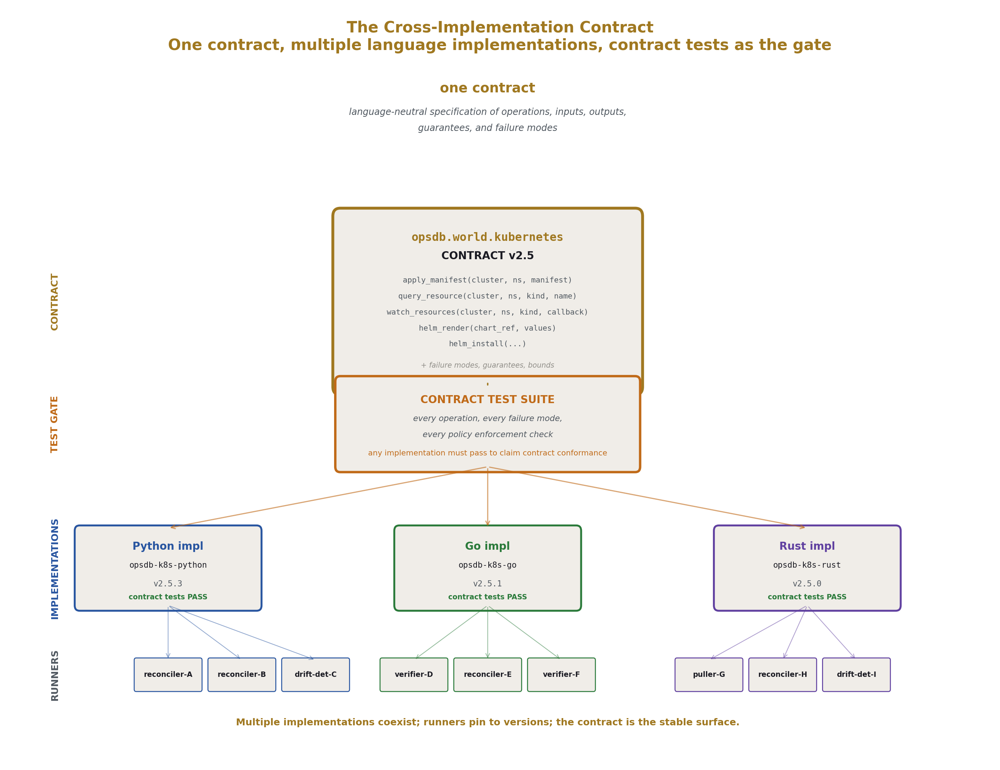
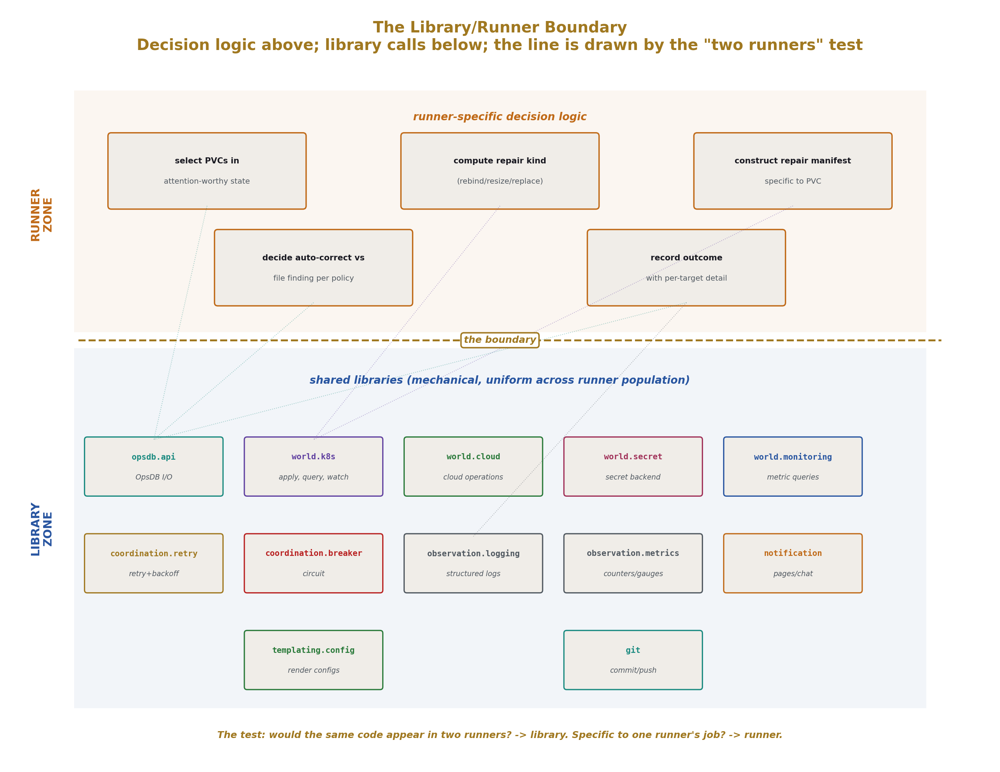
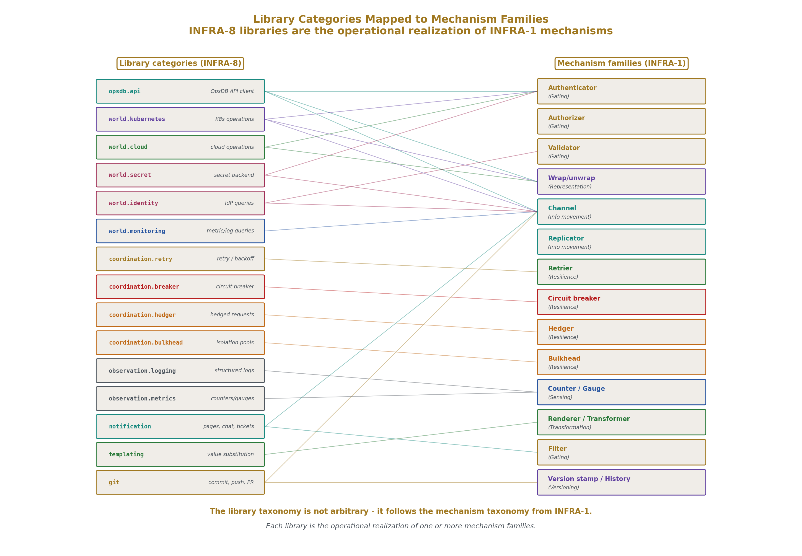
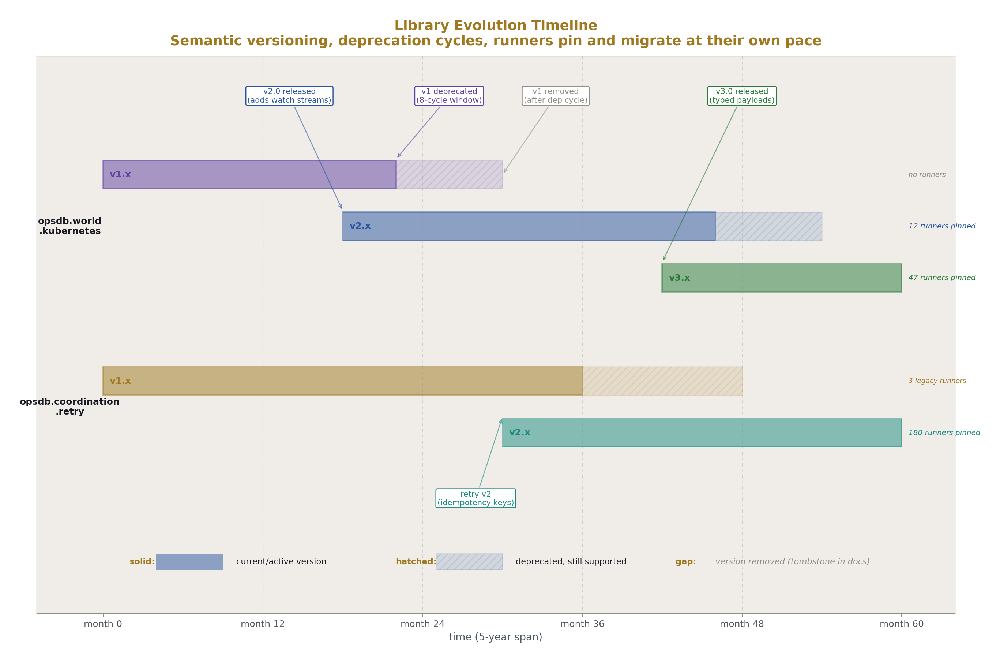
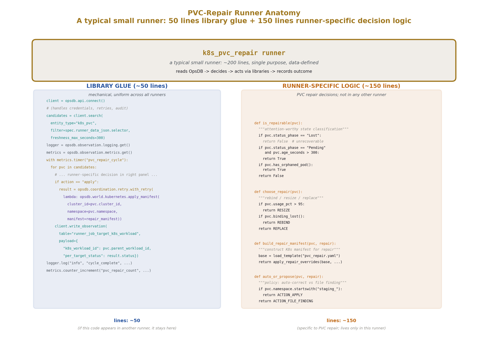
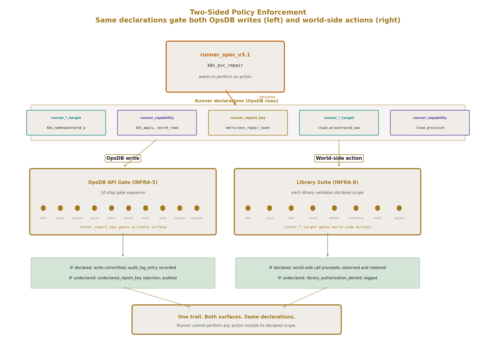
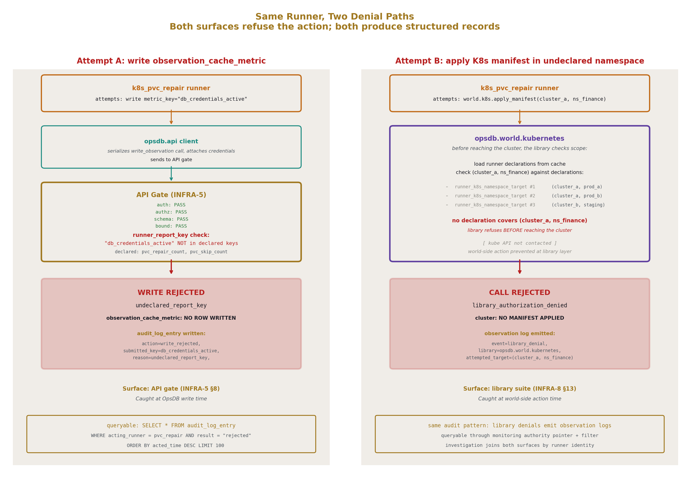

# The OpsDB Shared Library Suite
## The Operational Logic Framework Around the OpsDB

**AI Usage Disclosure:** Only the top metadata, figures, refs and final copyright sections were edited by the author. All paper content was LLM-generated using Anthropic's Opus 4.7. 

---

## Abstract

The shared library suite is the framework that keeps OpsDB-coordinated runners small and consistent. OPSDB-5 introduced the suite as a category and made the case that runners stay small because the libraries do the heavy lifting; this paper specifies what the libraries are, what contracts they expose, what the library/runner boundary looks like, and how the suite enforces policy at world-side action time. The suite is a contract specification, not an implementation; multiple implementations of the same library can coexist (different languages, different transports), but they expose the same contract that runners are written against.

The paper specifies the contract for each library category: the OpsDB API client (the mandatory client every runner uses), world-side substrate libraries (Kubernetes operations, cloud operations, host operations, container/registry operations, secret backend access, identity provider operations, monitoring authority operations, authority pointer resolution), coordination and resilience libraries (retry, circuit breaker, hedger, bulkhead, failover routing), observation libraries (logging, metrics, tracing — mandatory and uniform across the runner population), notification libraries (email, chat, page, ticket creation), templating and rendering libraries (deliberately dumb), git and version-control libraries.

The structural payoff is two-sided policy enforcement. The API gate (OPSDB-6) enforces policy at OpsDB write time. The library suite enforces policy at world-side action time. Runner declarations — `runner_*_target` bridges, `runner_capability` rows, `runner_report_key` rows — are the input to both. A runner cannot, through any path, perform an action outside its declared scope: OpsDB writes are caught at the gate, world-side actions are caught at the library. The library suite is the operational realization of "one way to do each thing" applied to runner-world interaction.

What this paper does not specify: implementation languages, specific function signatures, deployment topologies for the libraries themselves, or specific runner implementations that consume them.

---

## 1. Introduction

### 1.1 What this paper completes

OPSDB-5 specified the runner pattern. Runners read from the OpsDB, act in the world through shared libraries, write results back. The paper enumerated the library categories at a high level and argued that runners stay small because the libraries do the heavy lifting. OPSDB-5 §11.6 estimated the difference: a runner against the library suite is perhaps 200 lines; without it, perhaps 1500, with most of the additional lines being reinvented basics.

What OPSDB-5 did not specify: what the libraries actually are, what contracts they expose, how the library/runner boundary is drawn in practice, how the libraries themselves are governed and evolved, and what role they play in policy enforcement. These are the gaps OPSDB-8 fills.

The shared library suite is the framework that makes the runner pattern viable at scale. Without the suite, every runner reinvents basics inconsistently — the same fragmentation problem the OpsDB exists to solve, recurring at the runner layer. With the suite, runners differ only in their specific job; how they interact with the world is uniform. This paper specifies the suite.

### 1.2 The contract-not-implementation framing

The library suite is a contract specification, not an implementation. The contract describes what each library does, what inputs it accepts, what outputs it produces, what guarantees it makes, what failure modes it surfaces. Multiple implementations of the same contract can coexist — different languages (Python, Go, Rust, others), different transport choices (REST, gRPC, native client SDKs), different optimization tradeoffs.

A runner is written against a contract. The implementation it loads at deploy time is a packaging concern. The same runner code can run against different implementations of the same contract; the contract is the stable surface, the implementation is replaceable.

This commitment is structural. OPSDB-9's *minimize dependencies* principle applies: each library implementation is a dependency the runner takes, but the contract is the only dependency that's load-bearing. By specifying the contract precisely, the paper makes implementations interchangeable; by allowing multiple implementations, organizations can adopt the suite in their preferred language without forking the contract.

### 1.3 The structural claim

The library suite has two load-bearing structural roles. First, it keeps runners small by absorbing the world-side complexity that would otherwise live in every runner. Second, it enforces policy at world-side action time, making the runner's declared scope mechanical at the boundary where actions actually happen.

The first role is what OPSDB-5 promised. The second role is new structural ground in this paper. OPSDB-6 §8 introduced runner report keys to gate the OpsDB write surface. OPSDB-8 §13 introduces the equivalent at the library layer: the library suite consults the runner's declarations and refuses calls outside the declared scope. The two surfaces compose. A runner cannot, through any path, perform an action outside its declared scope. OpsDB writes are caught at the gate; world-side actions are caught at the library.

This two-sided enforcement is what makes "runner authority is data" (OPSDB-5 §8.5) hold across every action a runner takes. Every authority is data, every check is mechanical, every failure is fail-closed.

### 1.4 What this paper specifies

The library categories: API client, world-side substrate libraries, coordination and resilience, observation, notification, templating, git. For each: the contract surface, the inputs and outputs, the guarantees and failure modes, the policy enforcement integration. The library/runner boundary discipline. The library evolution discipline (versioning, testing, deprecation). The library_steward role.

### 1.5 What this paper does not specify

Implementation languages. Specific function signatures or method names. Deployment topologies for the libraries themselves. The exact wire format of any RPC the library implementations use to reach authorities. UI design. Specific runner implementations.

The paper specifies what every library implementation must provide and what every runner can rely on. How a particular implementation provides those guarantees is left to implementers.

### 1.6 Document structure

Section 2 covers conventions inherited from the prior series. Section 3 specifies what a shared library is and what the library/runner boundary is. Section 4 specifies the OpsDB API client — the mandatory, foundational library. Section 5 covers world-side substrate libraries. Section 6 covers coordination and resilience. Section 7 covers observation. Section 8 covers notification. Section 9 covers templating and rendering. Section 10 covers git operations. Section 11 covers library implementation discipline. Section 12 covers the library/runner boundary in worked examples. Section 13 covers two-sided policy enforcement — the structural payoff. Section 14 covers what the library suite is not. Section 15 covers adoption and growth. Section 16 closes.

---

## 2. Conventions

This paper inherits the conventions established across the prior series. Brief recap.

**DSNC.** All schema references use the Database Schema Naming Convention from OPSDB-4. Singular table names. Lower case with underscores. Hierarchical prefixes from specific to general.

**Mechanism vocabulary.** Mechanism, property, and principle terms come from OPSDB-9's taxonomy.

**Library naming.** Library categories follow a hierarchical naming pattern: `opsdb.api`, `opsdb.world.kubernetes`, `opsdb.world.cloud`, `opsdb.coordination.retry`, `opsdb.observation.logging`, etc. The `opsdb.` prefix marks the library as part of the suite. The second-level segment indicates the family (api, world, coordination, observation, notification, templating, git). The third-level segment indicates the specific library.

**Contract specification.** Each library is specified by its contract: the operations it exposes, the inputs each operation accepts, the outputs it produces, the guarantees it makes (idempotency, ordering, freshness), and the failure modes it surfaces. The specification is language-neutral; implementation idioms vary across languages.

**Version semantics.** Library versions follow semantic versioning with the prior series' discipline applied: backward-compatible additions are minor or patch versions, breaking changes are major versions and rare, deprecation precedes removal by multiple release cycles.

**The 0/1/N rule applied to libraries.** Within an organization's runner population, there is one canonical library suite. Multiple language-specific implementations of the same contract are valid (the N case where structural reasons require it); two parallel suites for the same language are forbidden. The discipline of refusing fragmentation applies at the library layer as much as at the OpsDB layer.

**Notation.** Library names appear in `code style`. Contract operations appear in `code style` on first reference. Mechanism terms from OPSDB-9 appear in *bold-italic* on first reference within a section.

---

## 3. What a shared library is

The library/runner boundary is load-bearing. This section specifies what goes in libraries, what stays in runners, and why each.

### 3.1 The library is a contract

A library specifies what callers can rely on. It does not specify how the library does what it does. A runner imports the library and calls its operations; the library handles the world-side work.

The contract has the following components:

**Operations.** What can be called. Each operation has a name, a description of what it does, structured inputs, structured outputs, declared guarantees, declared failure modes.

**Inputs.** Typed parameters with bounds. The library validates inputs at the call boundary and rejects malformed calls before reaching the world.

**Outputs.** Typed return values with structured metadata. Outputs include success/failure status, structured error information for failures, observation data (latency, retry count) for callers that need it.

**Guarantees.** What the library promises. Idempotency where applicable. Ordering where applicable. Freshness annotations where the library reads from caches. Bounded execution time where the library implements its own bounds.

**Failure modes.** What the library surfaces when things go wrong. Authentication failures. Authorization failures (including library-layer policy denials, §13). Network errors with retry classification. World-side errors with structured detail. Timeout exceeded. Bound exceeded.

The contract is what the library promises to its callers. The implementation is what the library does to keep that promise.

### 3.2 The library/runner boundary

The boundary is drawn by a simple test: does this code do something that two runners would otherwise reimplement?

Authentication to the OpsDB API: every runner needs this; it goes in the library. Authentication to a cloud provider: every runner that touches that cloud needs this; it goes in the library. Retry with exponential backoff: every runner that calls anything unreliable needs this; it goes in the library. Logging in the org's standard format: every runner needs this; it goes in the library.

The runner-specific job logic stays in the runner. A PVC-repair runner needs to know what counts as a broken PVC and how to repair it; that logic is specific to PVC repair and stays in the runner. A drift detector needs to know what counts as drift for its target entity class and how to construct the corrective change_set; that's specific to the runner.

The test is mechanical. If the same code would appear in two runners, it belongs in the library. If the code is specific to one runner's job, it stays in the runner.

### 3.3 What goes in a library

The categories that consistently meet the test:

**OpsDB API access.** Every runner reads from and writes to the OpsDB. The client library is mandatory; no runner accesses the OpsDB any other way.

**World-side substrate access.** Calls to Kubernetes, to cloud control planes, to monitoring authorities, to identity providers, to secret backends, to hosts via SSH, to ticketing systems. Each has its own library wrapping the substrate's native client.

**Resilience patterns.** Retry, backoff, jitter. Circuit breaker. Hedger. Bulkhead. Failover. These are mechanism patterns from OPSDB-9's resilience family; each gets a library because each is needed by many runners.

**Observation.** Structured logging, metrics emission, distributed tracing. Mandatory; every runner uses these. Inconsistent observation across the runner population is the failure mode the suite exists to prevent.

**Notification.** Email, chat, paging, ticket creation. Used by runners that interact with humans.

**Templating and rendering.** Helm value rendering, configuration template rendering, report generation. Deliberately dumb; the libraries enforce that templates substitute concrete values rather than computing.

**Git operations.** Clone, commit, push, tag, PR creation. Used by GitOps integration runners and by schema-evolution tooling.

### 3.4 What stays in the runner

Runner-specific logic. The decision of when to act. The transformation of inputs into actions. The interpretation of authority responses for the runner's specific purpose.

Concretely:

A PVC-repair runner has runner-specific logic for: querying the OpsDB for PVCs in attention-worthy state, computing whether a given PVC needs repair (based on status, on age, on associated pod state), choosing the repair action (rebind, resize, replace), applying the action via the K8s operations library, recording the outcome.

The runner does not have logic for: how to authenticate to the OpsDB (library), how to authenticate to K8s (library), how to retry a failed K8s call (library), how to log structured output (library), how to construct change_sets if needed (library). All of those are mechanical and uniform across the runner population.

The runner has, perhaps, 200 lines: 150 lines of PVC-repair-specific logic, 50 lines of glue invoking libraries. OPSDB-5 §5.10's number is realistic.

### 3.5 The boundary changes over time

As new patterns become common across runners, they migrate from runner code into library code. A pattern that appears in one runner stays in the runner. A pattern that appears in three runners is a candidate for library extraction. A pattern that appears in ten runners is a confirmed library candidate; not extracting it produces the inconsistency the suite exists to prevent.

This is library evolution by accretion. The suite grows as the runner population's needs grow. The library_steward (§11) reviews extraction candidates; the suite's release cadence handles the additions.

The reverse — pulling logic out of a library back into runners — is rare. Once a pattern is in the library, runners depend on it; removing it would force every consumer to reimplement. The discipline favors keeping patterns in the library and adding new patterns rather than removing existing ones.

### 3.6 The suite is one suite

Within an organization, there is one library suite. Multiple language implementations of the same contract are valid; multiple parallel suites in the same language are forbidden. The discipline of refusing fragmentation applies at the library layer.

A team that wants "their own version of the K8s library" is solving a real problem. The right response is usually to absorb their use case into the standard library — add a capability, expand an interface, accommodate a new authentication pattern. Granting the parallel library begins library fragmentation, and library fragmentation produces runner inconsistency, which is the failure mode the suite exists to prevent.

Like the schema, the library suite has a steward (§11) responsible for its coherence. The steward reviews contract additions, resists feature creep, and enforces the discipline that the suite stays one thing rather than becoming a federation of nominally-related libraries.

---

## 4. The OpsDB API client

The most important library. Every runner uses it; no runner accesses the OpsDB any other way. This section specifies the contract.

### 4.1 The mandatory client

The OpsDB API client (`opsdb.api`) is the only path through which runner code touches the OpsDB. Direct database access is forbidden for runners (per OPSDB-2 §4.2). HTTP calls bypassing the client are forbidden by the discipline.

The client handles, on every call:

- Credential acquisition from the secret backend at runner startup
- Credential refresh before expiration
- Adding authentication headers to every request
- Retrying transient authentication failures with appropriate backoff
- Surfacing validation errors and authorization denials to the runner cleanly
- Propagating audit correlation IDs through the call chain
- Stale-version retry handling for change_set submissions
- Serialization of structured payloads to the API's wire format

The runner does not implement any of this. The library does. The runner calls operations like `client.get_entity(entity_type, id)` and receives structured results.

### 4.2 Read operations

Read operations retrieve OpsDB data. Each returns a structured result with metadata about freshness, authorization, and version.

**`get_entity(entity_type, id)`.** Fetch one row by primary key. Returns the row's current state plus metadata: the row's version stamp, last_updated_time, freshness annotation for cached observation data, governance flags consulted (which `_requires_group` checks passed, which `_access_classification` levels were satisfied).

**`get_entity_history(entity_type, id, time_range)`.** Fetch the version chain for one entity. Returns the version sibling rows in order, each linked to the change_set_id that produced it.

**`get_entity_at_time(entity_type, id, timestamp)`.** Reconstruct the field values active at the specified timestamp. Returns the row's state as it was at that time. Implemented via single lookup against the version sibling per OPSDB-6 §5.1's full-state versioning.

**`search(query)`.** The discovery surface. Caller specifies entity types, filter predicates, named join paths, projection, ordering, pagination, freshness requirements, view mode. Returns structured results with pagination cursor, freshness summary, filtering disclosures.

**`get_dependencies(starting_entity, relationship_pattern)`.** Walk the substrate. The library translates the named pattern (e.g., `megavisor_instance.parent_chain`, `service_connection`) to API search calls and returns the resolved chain. Used by runners making decommission-aware, failure-domain-aware, capacity-aware decisions per OPSDB-5 §9.

**`resolve_authority_pointer(authority_pointer_id)`.** Given a pointer, returns the underlying authority's connection details, the locator within that authority, the last_verified_time, and any pointer metadata. The library does not fetch from the authority; it returns the coordinates the runner needs to do so via the appropriate world-side library.

**`change_set_view(change_set_id, view_mode)`.** Returns either a scoped view (only field changes the viewer's groups can approve) or a full view (everything the viewer is permitted to see), plus summary metadata.

### 4.3 Write operations

Write operations modify OpsDB data. Each goes through the API's gate (OPSDB-6 §3.5's 10-step sequence); the library handles the request construction and response parsing.

**`write_observation(target_table, key, value, payload)`.** The direct-write path for observation. The library validates that the runner's report-key authorization (per OPSDB-6 §8) covers the submitted key before sending the call; mismatches surface as `undeclared_report_key` errors locally without round-tripping to the API. This is library-side fail-fast.

**`submit_change_set(field_changes, reason, metadata)`.** Submit a proposed transaction. The library handles the structured construction of `change_set_field_change` records, the inclusion of optimistic concurrency version stamps, the dry-run support, the routing of the response to either pending state or approved state. Returns the change_set_id for tracking.

**`approve_change_set(change_set_id, comment)`.** Record an approval. Library handles caller identity verification through the API.

**`reject_change_set(change_set_id, reason)`.** Record a rejection.

**`cancel_change_set(change_set_id)`.** Withdraw a pending change_set.

**`emergency_apply(field_changes, reason, justification)`.** The break-glass path. Library handles the `is_emergency=true` flag and the queueing of the post-hoc review record.

**`apply_change_set_field_change(change_set_id, field_change_id)`.** The executor's apply-write. Library handles the serialization and the per-field-change apply protocol.

**`mark_change_set_applied(change_set_id)`.** Final commit transition after all field changes have been applied.

### 4.4 Watch streams

For runners that need to react to changes rather than poll, the library exposes watch streams.

**`watch(entity_type, filter, resume_token)`.** Subscribe to changes matching the filter. The library handles the stream connection, automatic reconnection with resume tokens, and delivery of events to the runner's callback. Reactor runners (OPSDB-5 §4.5) use this; the library handles the stream mechanics.

The library always delivers events level-triggered when the runner reconnects: on resumption, the library fetches the current state of all matching entities, then begins streaming changes from the resume_token. Pure edge-triggered subscriptions are not supported because they would let runners depend on event delivery without a level-triggered backstop, which violates OPSDB-5 §7.2.

### 4.5 Stale-version retry handling

The optimistic concurrency model from OPSDB-6 §5.6 is exposed as library behavior. When a `submit_change_set` fails with `stale_version`, the library can either:

- Surface the error to the runner so the runner can fetch current state and reconcile
- Automatically refetch the affected entities and retry, if the runner has explicitly opted in to auto-reconciliation for the change_set

Auto-reconciliation is bounded: the library will retry at most N times (default 3, configurable per call), and only if the retry merge does not introduce conflicts the runner has not authorized to resolve. For runners that propose simple drift corrections, auto-reconciliation is appropriate; for runners proposing complex bundles, the runner handles reconciliation itself.

### 4.6 Audit correlation

The library propagates correlation IDs through every call. A runner_job's id becomes the root correlation; every API call from that runner_job carries the correlation in the request headers; every audit_log_entry produced by the API includes the correlation. Joining audit entries to runner_job rows is a query on the correlation field.

The library handles correlation generation, propagation through retry, and inclusion in any nested calls (when one runner triggers another's behavior through OpsDB rows, the correlation chains).

### 4.7 Failure surfacing

The library surfaces structured errors. Runners see:

- `validation_failed(field, reason)` — schema or bound validation rejected the call
- `authorization_denied(layer, policy_or_rule)` — one of OPSDB-6 §6.2's five layers denied
- `stale_version(entities)` — optimistic concurrency conflict
- `not_found(entity_type, id)` — the targeted entity does not exist
- `bound_exceeded(bound_name)` — query bounds, search bounds, or rate limits exceeded
- `network_error(retry_class)` — transport-level failure with retry classification
- `internal_error(detail)` — the API itself failed; rare and itself a finding

Runners handle these errors using the runner-side patterns from OPSDB-5 §3 — most errors result in the runner_job recording the failure and the next cycle picking up. The library does not hide errors; it surfaces them in a form the runner can act on.

### 4.8 Why this library is mandatory

If runners could bypass the API client and reach the OpsDB another way, the disciplines OPSDB-6 specifies would become advisory. Authentication might use different mechanisms in different runners; audit correlation might be inconsistent; stale-version handling might be reinvented each time, with subtle bugs. The mandatory library is what makes the API gate's claims hold across the runner population.

The library is the runner-side enforcement of "the API is the only path." Runners cannot easily bypass it because there is no other path that's been built; the alternative paths are what would have to be built, and not building them is the discipline.

---

## 5. World-side substrate libraries

Each external substrate the runner population touches gets its own library. This section specifies the contract for each major substrate category.

### 5.1 Kubernetes operations

The `opsdb.world.kubernetes` library wraps the Kubernetes client. Operations:

**`apply_manifest(cluster_id, namespace, manifest)`.** Apply a manifest (deployment, configmap, service, etc.) to a cluster. The library handles the cluster connection, authentication, three-way merge against existing state, and structured error surfacing. The library validates that the runner's `runner_k8s_namespace_target` declarations cover the targeted cluster and namespace; calls outside scope are rejected before reaching the cluster (§13).

**`query_resource(cluster_id, namespace, resource_type, name)`.** Fetch a K8s resource's current state. Used by reconcilers and verifiers.

**`query_resources(cluster_id, namespace, selector)`.** List resources matching a label selector or name pattern.

**`watch_resources(cluster_id, namespace, resource_type, callback)`.** Subscribe to resource events. Used by deploy watchers (OPSDB-5 §10's Runner 4) and by event-triggered reactors. Like the OpsDB watch streams, the library delivers level-triggered events on reconnect and edge-triggered changes during connection.

**`helm_render(chart_reference, values)`.** Render a helm chart with given values; return the rendered manifest. Used by the helm git exporter (OPSDB-5 §10's Runner 2).

**`helm_install(cluster_id, namespace, chart_reference, values, release_name)`.** Install or upgrade a helm release. Subject to namespace target validation.

**`exec_in_pod(cluster_id, namespace, pod, container, command)`.** Execute a command in a pod. Subject to namespace target validation; subject to additional command authorization per policy (some commands may require elevated authority).

**`get_pod_logs(cluster_id, namespace, pod, container, since, lines)`.** Fetch pod logs. Used by investigation-supporting runners.

The library handles K8s API authentication via the cluster's configured method (in-cluster service account, kubeconfig file, OIDC, certificate). Credentials come from the secret backend through the secret library; the runner does not manage K8s credentials directly.

The library wraps the K8s client's errors in structured form: `cluster_unreachable`, `namespace_not_found`, `resource_not_found`, `validation_failed`, `permission_denied` (when K8s itself rejects), `conflict` (when the resource has changed since the runner read it).

### 5.2 Cloud operations

The `opsdb.world.cloud` library is provider-agnostic. It exposes operations that work across cloud providers, with provider-specific backends. Operations:

**`provision_resource(cloud_account_id, resource_type, parameters)`.** Provision a new cloud resource. The library validates that the runner's `runner_cloud_account_target` declarations cover the targeted account; calls outside scope are rejected.

**`query_resource(cloud_account_id, resource_id)`.** Fetch a cloud resource's current state. The library translates the OpsDB-side `cloud_resource_type` to the provider's native API.

**`query_resources(cloud_account_id, filter)`.** List resources matching the filter. Used by pullers populating `observation_cache_state` for cloud resources.

**`modify_resource(cloud_account_id, resource_id, changes)`.** Modify an existing resource. Subject to account target validation; subject to per-field policy validation (some fields may require elevated authority).

**`decommission_resource(cloud_account_id, resource_id)`.** Decommission a resource. Subject to account target validation and to additional policy (decommission is a destructive action; many environments require explicit elevated authority).

**`watch_resource_events(cloud_account_id, callback)`.** Subscribe to cloud resource lifecycle events from the provider's event stream where supported (CloudWatch Events, Azure Event Grid, GCP Pub/Sub).

The library has provider-specific backends for AWS, GCP, Azure, and others as the organization integrates them. Each backend handles authentication via the provider's native mechanism (IAM roles, service accounts, managed identities) with credentials from the secret backend. The runner sees a uniform interface; the library translates to the provider's native API.

Provider-specific resource payloads pass through as `cloud_data_json` per OPSDB-4 §6.8. The library validates the payload shape against the registered JSON schema for the resource type before calling the provider.

### 5.3 Host operations

The `opsdb.world.host` library handles operations against hosts that don't have a richer API. Operations:

**`exec_command(host_id, command, timeout)`.** Run a command on a remote host via SSH. The library handles SSH authentication via keys retrieved from the secret backend, connection pooling per host, structured output capture. Subject to runner machine target validation (the runner must be authorized to act on the targeted host).

**`copy_file(host_id, local_path, remote_path)`.** Transfer a file. Subject to host authorization.

**`apply_config(host_id, config_payload)`.** Apply a structured configuration to a host. The library translates the OpsDB-side configuration into the host-side mechanism (systemd unit, cron entry, file write, package install) per the configuration's declared method.

The host operations library is used sparingly — preferred only when no API alternative exists. For most modern infrastructure (containers, cloud-managed services), the host operations library is rarely needed. For legacy substrate (bare-metal hosts, VMs running traditional services), it is the path through which configuration management runners act.

### 5.4 Container and registry operations

The `opsdb.world.registry` library handles operations against artifact registries and container registries. Operations:

**`pull_image(registry_id, image_reference, target_path)`.** Pull an image from a registry. Used by bootstrap runners and by image-verification runners.

**`query_image_metadata(registry_id, image_reference)`.** Fetch image metadata: digest, layers, labels, signing information.

**`list_tags(registry_id, repository)`.** List tags in a repository. Used by tag-tracking deployment runners (OPSDB-5 §10's variation).

**`verify_signature(registry_id, image_reference, trust_policy)`.** Verify image signature against a trust policy. Used by image digest verifiers (OPSDB-5 §10's Runner 5).

The library authenticates to registries via credentials in the secret backend. Different registries (ECR, GCR, Docker Hub, internal Harbor, internal Artifactory) have different authentication patterns; the library hides them behind the uniform interface.

### 5.5 Secret backend access

The `opsdb.world.secret` library accesses secret backends. The library is unique in its discipline: it never persists secret values. Operations:

**`fetch_secret(authority_pointer_id)`.** Given a pointer to a secret backend path, fetch the secret value. The library returns the value in memory only; it does not log it, does not write it to OpsDB, does not persist it in any runner state. Subject to runner secret access target validation (the runner must be authorized to read this secret path).

**`store_secret(authority_pointer_id, value)`.** Store a secret value in the backend. Used by credential-rotation runners. The new value is supplied by the runner and passed to the backend; the library does not persist intermediate copies.

**`rotate_credential(authority_pointer_id, rotation_metadata)`.** Atomic rotation: generate a new value, store it in the backend, return the new identifier. Used by automated rotation runners. The library handles the rotation atomicity and the metadata recording.

**`list_secrets(authority_id, path_prefix)`.** List secret paths under a prefix. Returns paths only, not values. Used by secret inventory verifiers.

The library has backends for Vault, AWS Secrets Manager, GCP Secret Manager, Azure Key Vault, and others. Each backend uses its native authentication; credentials for the runner's access to the backend come from the runner's environment (a chicken-and-egg case where the runner has bootstrap credentials to reach the secret backend, then uses the backend for everything else).

The library's discipline is mechanical: secret values exist only in memory during the call, are passed to the immediate consumer, and are not retained. Logging the call records the path accessed, the identity of the caller, the timestamp, and the success/failure — never the value.

### 5.6 Identity provider operations

The `opsdb.world.identity` library accesses the identity provider for operational queries. Operations:

**`get_user(external_id)`.** Look up a user by their external identifier (email, username, IdP ID). Used by reconcilers that need to verify a user exists before referencing them.

**`get_group_members(group_id)`.** List members of a group. Used by access review runners and by approval-routing logic.

**`check_membership(user_id, group_id)`.** Quick check whether a user is in a group.

**`watch_identity_changes(callback)`.** Subscribe to user/group lifecycle events where the IdP supports it. Used by the identity sync puller that maintains `ops_user` and `ops_group_member` rows.

The library does not handle authentication (that's the API client's concern); it handles operational identity queries. The IdP is the source of truth for who exists; the OpsDB caches the relevant subset; this library is what populates that cache and answers ad-hoc queries.

### 5.7 Monitoring authority operations

The `opsdb.world.monitoring` library accesses monitoring systems. Operations:

**`prometheus_query(server_id, query, time_range)`.** Execute a PromQL query. Returns structured results.

**`prometheus_query_range(server_id, query, start, end, step)`.** Execute a range query for time series.

**`datadog_query(account_id, query, time_range)`.** Execute a Datadog query.

**`log_query(aggregator_id, query, time_range)`.** Execute a log aggregator query (Elasticsearch, Loki, CloudWatch Logs, Datadog Logs).

**`fetch_recent_alerts(monitoring_id, since)`.** Fetch alert state from monitoring system.

The library has backends per monitoring authority. Pullers use this library to populate `observation_cache_metric` and `observation_cache_state`. Verifiers use it to check live conditions. The library returns structured data that the runner translates into OpsDB-side rows.

### 5.8 Authority pointer resolution

The `opsdb.world.pointer` library is a thin coordination library: given an `authority_pointer_id`, it resolves the pointer through the API client, dispatches to the appropriate world-side library based on the pointer's type, and returns the result.

**`resolve_and_fetch(authority_pointer_id, fetch_parameters)`.** The integrated operation. The library calls the API client to get the pointer details, identifies the appropriate world-side library based on `authority_type`, calls that library to fetch, returns the result.

This library is convenience rather than load-bearing — runners can call the API client and the world-side library directly — but it captures the common pattern of "I have a pointer; give me the data" so it doesn't get reimplemented across runners.

### 5.9 Why each substrate gets its own library

Substrates evolve at different cadences. Kubernetes API changes are quarterly. Cloud provider APIs change continuously. Vault upgrades happen on the operator's schedule. Monitoring stack changes happen when the org migrates between vendors.

By giving each substrate its own library, the suite isolates change. A K8s API version change is a `opsdb.world.kubernetes` update; runners that depend on it absorb the change via library version bump. Runners that don't touch K8s are unaffected. A cloud provider migration (e.g., AWS account restructuring) is a `opsdb.world.cloud` change in the AWS backend; other clouds are unaffected.

The substrate-per-library structure also matches the policy enforcement structure (§13). Each library knows what scope it's operating in; each library validates that scope against the runner's declarations before calling the substrate.

---

## 6. Coordination and resilience libraries

Patterns from OPSDB-9's resilience family applied at the library layer. Each pattern gets a library because each is needed by many runners.

### 6.1 Retry, backoff, jitter

The `opsdb.coordination.retry` library handles retry logic. Operations:

**`with_retry(operation, retry_policy)`.** Execute the operation, retrying on transient failures per the policy. The retry_policy specifies max attempts, backoff strategy (immediate, exponential, exponential with jitter, custom), per-attempt timeout, total budget.

**`with_idempotency_key(operation, key_generator)`.** Execute the operation with an idempotency key. The library generates the key, includes it in the operation's request, and uses it for deduplication on retry.

The library distinguishes retryable from non-retryable failures based on the structured error type. Network errors with `retry_class=transient` are retried; validation failures and authorization denials are not. Runners can configure custom retry classification when needed.

The retry library composes with every other library that makes outbound calls. The K8s library, the cloud library, the secret library, and others all use the retry library internally for their own outbound calls; runners using those libraries get retry behavior automatically. Runners can wrap their own logic in `with_retry` for retry semantics around their specific actions.

### 6.2 Circuit breaker

The `opsdb.coordination.circuit_breaker` library prevents cascading failures by stopping calls to unhealthy targets. Operations:

**`call_with_breaker(target_id, operation, breaker_policy)`.** Execute the operation; the library tracks success/failure rates per target and trips open when the failure rate exceeds the policy's threshold. While open, calls fast-fail without reaching the target. After a cooldown, the breaker enters half-open and probes recovery.

The library's breaker state is per-runner-instance by default; for distributed coordination, the library can sync state through OpsDB cached observation (writing breaker state to `observation_cache_state` per target). The choice is per-target.

The circuit breaker integrates with OpsDB cached health state. When a target's health state in `observation_cache_state` indicates degradation, the library can pre-trip the breaker without waiting for local failures. This couples breaker behavior to the operational picture rather than requiring each runner instance to learn about target health independently.

### 6.3 Hedger

The `opsdb.coordination.hedger` library reduces tail latency by issuing redundant requests. Operations:

**`hedge_call(targets, operation, hedge_policy)`.** Issue the operation against multiple targets with staggered timing per the policy. Return the first successful response; cancel pending requests once a winner is determined.

Used for read operations against authorities with high tail latency. A runner querying a Prometheus federation can hedge across replicas; the library returns the first response. Idempotency is required (per OPSDB-9 §3.13's Hedger boundary); the library validates that the operation is marked idempotent before allowing hedge.

### 6.4 Bulkhead

The `opsdb.coordination.bulkhead` library isolates failure domains. Operations:

**`with_bulkhead(domain_key, operation, bulkhead_policy)`.** Execute the operation within a bounded resource pool tied to the domain key. Different domain keys get separate pools; one domain's exhaustion does not affect others.

Common usage: a runner that calls multiple cloud accounts uses the cloud account ID as the domain key, so an unhealthy account's slow responses don't exhaust the pool for healthy accounts. The library handles pool sizing, queuing when the pool is exhausted, and timeout enforcement.

### 6.5 Failover routing

The `opsdb.coordination.failover` library handles routing between primary and replica targets. Operations:

**`call_with_failover(primary_id, replica_ids, operation, failover_policy)`.** Execute the operation against the primary; on failure (per the policy's failure classification), fall through to replicas in order. The library handles the failover detection, the replica selection, and the recording of failover events.

Used by runners that target authorities with multiple replicas: a Prometheus query against a federation, a Vault read against an HA cluster, an identity lookup against federated providers. The library hides the topology from the runner; the runner specifies primary and replicas, the library handles routing.

### 6.6 Why these patterns are libraries, not runner code

Each pattern is non-trivial. Retry with exponential backoff and jitter has subtle correctness concerns: the backoff formula, the jitter distribution, the max-attempts vs. total-budget tradeoff, the per-attempt timeout. A runner that implements retry correctly is several dozen lines of careful code; a runner that implements it incorrectly is a source of incidents (thundering herd, retry storms, infinite retry loops).

By moving these patterns into libraries, the suite ensures consistent correctness. Every retry uses the same algorithm. Every circuit breaker uses the same state machine. Every bulkhead uses the same pool semantics. The patterns are reviewed once, tested once, and used many times.

---

## 7. Observation libraries

Logging, metrics, tracing. Mandatory; every runner uses these. Inconsistent observation across the runner population is the failure mode OPSDB-5 §5.10 warns about.

### 7.1 Structured logging

The `opsdb.observation.logging` library provides the standard log format. Operations:

**`log(level, message, fields)`.** Emit a structured log line. The library handles the format (typically JSON or logfmt), the timestamp, the inclusion of correlation IDs, the runner_job_id from the runtime context, the runner_spec_id, the runner_machine_id.

**`log_event(event_type, fields)`.** Emit a structured event with a typed event type. Used for high-cardinality observations where the event type itself is the primary key for downstream filtering.

The library writes to the org's log aggregation pipeline (stdout in containerized environments, syslog in host environments, direct shipping to log aggregators where applicable). The runner does not configure the destination; the library reads it from the runtime environment.

Every log line includes:

- Timestamp (the library's clock, monotonic and high-precision)
- Severity level
- The runner_job_id from the runtime context
- The correlation ID propagated from the API call chain
- The runner_spec name and version
- The runner_machine_id (where this instance is running)
- Source code location (file, line) where the log was emitted

Runners that bypass the library produce inconsistent logs. The discipline is mechanical: use the library or the log line is not a first-class log line.

### 7.2 Metrics emission

The `opsdb.observation.metrics` library emits metrics in the org's standard format. Operations:

**`counter_increment(metric_name, labels, amount)`.** Increment a counter.

**`gauge_set(metric_name, labels, value)`.** Set a gauge to a current value.

**`histogram_observe(metric_name, labels, value)`.** Record an observation in a histogram.

**`timer(metric_name, labels)`.** Time-block helper; returns a context manager that records the duration as a histogram observation on exit.

The library handles metric registration, label enforcement (against pre-declared label sets to prevent label cardinality explosion), and shipping to the org's metrics destination (Prometheus scrape endpoint, Datadog agent, statsd, etc.).

Runners declare which metrics they emit in their `runner_capability` rows. The library validates that the emitted metric name matches a declaration; metrics not in the declaration are rejected. This is the metrics-side analog of `runner_report_key` for observation_cache_metric writes — declaration is the writable surface for outbound metrics.

### 7.3 Distributed tracing

The `opsdb.observation.tracing` library handles trace context propagation. Operations:

**`start_span(name, attributes)`.** Start a new span. Returns a span context that the runner uses for subsequent operations.

**`with_span(name, attributes, operation)`.** Execute the operation within a span; auto-close on exit.

**`inject_trace_context(headers)`.** Inject the current trace context into outbound request headers. Used by other libraries when making outbound calls.

**`extract_trace_context(headers)`.** Extract trace context from inbound request headers. Used by reactor runners receiving webhooks.

The library handles trace shipping to the org's tracing backend (Jaeger, Tempo, Datadog APM, others). Trace IDs are correlated with audit_log_entry rows and runner_job rows; an investigation can pivot from a trace to the surrounding OpsDB data structure.

### 7.4 Why observation is mandatory

The library is mandatory because consistent observation is the precondition for operational visibility into the runner population. If different runners use different log formats, a query for "all log lines for runner X in the last hour" requires N parsing rules. If different runners emit metrics with different label conventions, dashboards cannot compose across the population. If different runners propagate trace context differently, traces break at runner boundaries.

By making the library mandatory and uniform, the suite produces a runner population whose observation can be queried, aggregated, and correlated as a single dataset. This is "make state observable" (OPSDB-9 §5.6) applied to the runners themselves.

---

## 8. Notification libraries

Used by runners that interact with humans. The library is what lets the API stay out of the notification business per OPSDB-6 §10.

### 8.1 Channel abstraction

The `opsdb.notification` library exposes channel-agnostic notification operations:

**`send_notification(channel_id, content, recipients, urgency)`.** Send a notification through the specified channel. The library translates to the channel's native API (email via SMTP/SES, chat via Slack/Teams API, page via PagerDuty/Opsgenie, ticket creation via Jira/Linear).

**`send_to_role(role_id, content, urgency)`.** Send a notification to whoever is currently in the specified role. The library resolves the role through the OpsDB (calling `on_call_assignment` if relevant) and dispatches via the role's configured notification channel.

**`page(role_id, severity, content)`.** Page on-call. The library handles the integration with the org's paging system and the escalation policy lookup from `escalation_path` rows.

**`create_ticket(ticketing_authority_id, ticket_payload)`.** Create a ticket in the org's ticketing system. Used by runners that surface findings or that need human follow-up tracked formally.

**`post_to_thread(authority_pointer_id, content)`.** Post to an existing thread (Slack channel, Teams chat). Used during incidents to update status.

### 8.2 Channel configuration

Channel configurations live in the OpsDB. Each channel is an `authority` row of an appropriate `authority_type` (chat_platform, ticketing_system, paging_provider). The notification library reads channel configuration from the OpsDB at startup and at runtime.

Adding a new channel — adopting a new chat platform, integrating a new ticketing system — is a change_set adding the authority row and (where needed) extending the library's backend support. Existing notification calls work against the new channel once the configuration is in place.

### 8.3 Routing through OpsDB data

The library resolves recipients through OpsDB data. A page to "the database SRE on-call" is resolved by:

1. Looking up the `ops_user_role` named "database_sre"
2. Looking up the current `on_call_assignment` for that role
3. Resolving to the current `ops_user`
4. Reading the user's contact information (email, paging ID, chat handle)
5. Dispatching via the appropriate channel

The runner does not handle any of this resolution; the library does. The runner's call is "page the database SRE on-call about this incident"; the library handles the lookup chain.

### 8.4 Notification authorization

The library validates that the runner is authorized to send notifications through the specified channel. A runner declared with notification target `slack_incidents_channel` cannot send to `slack_executive_channel`. This is the notification-side enforcement per §13.

Some notification operations (paging) require additional authority because pages have operational consequences (waking people up at 03:00). The library validates against the runner's declared paging authority before dispatching pages; runners without paging authority can send notifications but cannot page.

### 8.5 Why notification is a runner concern, not API concern

OPSDB-6 §10 was explicit: the API does not communicate with stakeholders. The reasoning is that notification channels evolve over time (the org switches chat platforms, paging providers, email systems), and coupling the API to delivery infrastructure would force the API to evolve at the channel's cadence rather than at the schema's cadence.

By making notification a library concern, the suite contains the channel evolution. Channel changes are library updates; the API stays stable. The notification runner reads change_set state from the OpsDB and dispatches accordingly; if the org switches from Slack to Teams, the runner code is mostly unchanged, the library backend changes, the channel configuration in the OpsDB updates.

---

## 9. Templating and rendering libraries

The templating libraries are deliberately dumb. Templates substitute concrete values; logic that depends on template-time computation belongs in upstream runners that produce concrete values.

### 9.1 The discipline

OPSDB-5 §13's anti-pattern: "embedding logic in template variables." The discipline is enforced at the library layer: the templating libraries do not provide expression evaluation, conditional logic, loops, function calls, or any feature that would smuggle logic into templates.

What the libraries do provide: variable substitution, structural composition (one template including another), and deterministic rendering given inputs.

### 9.2 Helm value rendering

The `opsdb.templating.helm_values` library renders helm values from OpsDB configuration. Operations:

**`render_values(helm_release_version_id)`.** Read the configuration variables for the helm release version, resolve any secret references through the secret library, and produce the values dict that helm install expects.

The library does not evaluate expressions in values. If a value needs to be computed (e.g., concatenate two other values), that computation happens upstream as a separate configuration variable, computed by a runner before the helm executor runs.

### 9.3 Configuration template rendering

The `opsdb.templating.config` library renders configuration templates for hosts, services, and other targets. Operations:

**`render_template(template_id, variable_scope)`.** Render the template with the variables in scope. The template language supports:

- Variable substitution: `{{ variable_name }}` is replaced with the variable's value
- Inclusion: `{{ include "other_template" }}` includes another template's content
- Iteration over lists (bounded): `...` for fixed list iteration

The template language does NOT support:

- Expressions: no `{{ a + b }}`, no `{{ var | filter }}`
- Conditionals beyond inclusion: no `` over arbitrary expressions
- Function calls: no `{{ format_date(time) }}`
- Embedded code: no `` or equivalent

If logic is needed beyond simple substitution, the logic happens upstream. A runner computes the formatted date, stores it as a configuration variable, and the template substitutes the variable. The discipline is consistent with OPSDB-9 *configuration as data* — templates are data; logic is upstream.

### 9.4 Report rendering

The `opsdb.templating.report` library generates structured reports for human consumption. Operations:

**`render_report(template_id, query_results, output_format)`.** Render a report combining a template with query results. Output formats: HTML, PDF, plain text, structured Markdown.

Used by reporting runners that produce daily/weekly summaries of operational state, by audit-supporting runners that produce evidence summaries, by capacity-planning runners that produce trend analyses.

The library follows the same dumb-template discipline: substitution and inclusion only. Computed values come from upstream queries; the template assembles them into reader-friendly form.

### 9.5 Why templates are dumb

A template language with logic becomes a place where logic accumulates over time. Authors find it easier to add a conditional in the template than to add a runner that computes the value. The template grows. Reviewers can no longer tell what the template will produce without running it. The template becomes opaque code embedded in what's supposed to be data.

By keeping templates dumb at the library layer, the suite refuses this drift. Logic stays in runners; templates stay in declarative config. The cost is occasional duplication (a value computed in two slightly different ways for two different templates); the benefit is that templates are inspectable as data.

---

## 10. Git and version-control libraries

Git is a substrate the OpsDB design uses in two places: as the schema repo (OPSDB-7) and as the GitOps integration target (OPSDB-5 §10). The library wraps git operations for runner consumption.

### 10.1 Operations

The `opsdb.git` library:

**`clone(repo_url, target_path, ref)`.** Clone a repo to a path at the specified ref. Used by bootstrap runners and by schema-evolution tooling.

**`commit(repo_path, message, files)`.** Commit changes to the specified files with the given message. The library handles the commit attribution (the runner's identity).

**`push(repo_path, remote, ref)`.** Push to a remote. The library handles authentication via the secret backend.

**`tag(repo_path, tag_name, ref, message)`.** Create a tag.

**`create_pull_request(repo_url, source_branch, target_branch, title, body)`.** Create a PR via the git provider's API (GitHub, GitLab, Bitbucket).

**`fetch_file(repo_url, ref, file_path)`.** Fetch a specific file from a repo at a specific ref. Used when the runner needs file content but doesn't need a full clone.

### 10.2 Authentication and authorization

The library authenticates to git providers via credentials in the secret backend. SSH keys, deploy tokens, OAuth tokens — the library handles whichever the provider requires.

Authorization is dual: the runner's declared scope (which repos it can act on) is validated at the library layer; the git provider's own permissions are enforced at the provider. Both must permit the operation.

### 10.3 The structured commit message

When the helm git exporter (OPSDB-5 §10's Runner 2) commits, the commit message is structured. The library provides a helper:

**`structured_commit_message(change_set_id, summary, references)`.** Produces a commit message including the change_set_id, the change_set's reason text, and references to the OpsDB entities affected. The structure makes the commit traceable back to the OpsDB-side intent.

The helm git exporter calls this helper rather than constructing messages ad hoc. Consistent commit messages across the runner population mean that anyone reading git history can pivot back to the OpsDB-side trail.

---

## 11. Library implementation discipline

The suite is software. It evolves through normal software practices, with discipline analogous to but distinct from the schema's evolution discipline.

### 11.1 Versioning

Libraries follow semantic versioning: MAJOR.MINOR.PATCH.

- **PATCH** versions are bug fixes that don't change the contract.
- **MINOR** versions add new operations or extend existing operations in backward-compatible ways. New optional parameters, new return fields, new capability declarations are MINOR.
- **MAJOR** versions break the contract. Removing operations, changing input shapes, changing return shapes, changing failure mode classification are MAJOR. MAJOR versions are rare; they require deprecation cycles.

Runners pin to a major version of each library they depend on. A runner pinned to `opsdb.world.kubernetes 2.x` continues working when 2.5, 2.6, 2.7 are released; migration to 3.x is a deliberate runner-side change.

### 11.2 Deprecation cycles

Breaking changes follow the duplication pattern from OPSDB-7 §12.4 applied at the library layer:

1. The new version of the operation (or the replacement library) is introduced alongside the old.
2. Both are supported for N release cycles (typically 3-5).
3. Deprecation warnings are emitted by the old version's calls.
4. Runners migrate to the new version at their own pace.
5. The old version is removed only after the steward confirms no consumer depends on it.
6. Even after removal, a tombstone documenting the removal remains in the library's documentation.

Removal is rare. Most "deprecated" operations remain available indefinitely as legacy paths; the cost is supporting them, the benefit is not breaking consumers.

### 11.3 Testing

Every contract has a test suite. Any implementation of the contract must pass the suite. The test suite is the operational definition of "implements the contract."

The test suite covers:

- All operations with their declared inputs and expected outputs
- All declared failure modes, triggered by appropriate inputs
- All policy enforcement (§13) — calls outside the runner's declared scope must be rejected
- Idempotency where the contract claims it
- Bounded behavior where the contract claims bounds

A new implementation (e.g., porting `opsdb.world.kubernetes` from Python to Go) is gated by passing the test suite. Implementations that pass are interchangeable from the runner's perspective.

### 11.4 Release pipeline

Library releases go through the org's normal software release pipeline: code review, automated testing, staged rollout. Runners do not auto-update to new library versions; they pin and update deliberately through their own release cycle.

The library_steward role coordinates release timing. A new library version with a critical security fix may have an accelerated rollout; a new library version with optional capabilities can have a normal cadence.

### 11.5 Change-management for libraries vs. for the OpsDB

Library evolution is software change management; OpsDB schema evolution is OpsDB change management. The two are separate, with separate review constituencies.

Some library changes touch OpsDB schema (adding a new operation that requires a new schema field). Those changes are coordinated: the schema change_set lands first, the library version that uses it is released after, runners migrate to the new library version after that. The order matters because the library cannot use schema fields that don't yet exist.

### 11.6 The library_steward role

A defined role parallel to the schema_steward (OPSDB-2 §14.12). The library_steward reviews:

- New library proposals (does this need to be a library, or does it belong in a runner?)
- Contract additions (are these operations the right shape?)
- Contract removals (have all consumers migrated?)
- Cross-library coherence (do libraries compose well?)
- Implementation quality (do all implementations of the contract pass the tests?)

The library_steward also resists fragmentation. Every team that wants "their own version of library X" is solving a real problem; the right response is usually to absorb their use case into the standard library. The steward holds the discipline that the suite stays one suite.

The role is not full-time in most orgs but is continuous responsibility. Senior engineer or architect reviewing library changes regularly; full-time investment for the largest organizations or during periods of major library evolution.

---

## 12. The library/runner boundary in practice

Worked examples showing what belongs where.

### 12.1 A PVC-repair runner

The runner's job: detect PVCs in attention-worthy state and repair them when possible.

**In the runner:**

- The selector for "attention-worthy" PVC state (specific status conditions, age thresholds, associated pod state). This is repair-specific logic.
- The decision tree for "what kind of repair?" (rebind vs. resize vs. replace). Specific to PVC repair.
- The construction of the repair manifest. Specific to PVC repair.
- The recording of the repair outcome in `runner_job_target_*` rows with appropriate per-target detail.

**In libraries:**

- API client: reading PVC state from `observation_cache_state`, querying live K8s state when the cache is stale, submitting change_sets for centrally-managed configurations affected.
- K8s operations: applying the repair manifest, watching for completion, fetching events.
- Retry: handling transient K8s API failures during apply.
- Logging, metrics, tracing: all uses of the standard observation libraries.
- Notification (rarely): if a repair fails non-recoverably, notifying the on-call SRE.

Lines of code: perhaps 200 in the runner, 50 of which are glue invoking libraries. The library calls do most of the work; the runner makes the decisions.

### 12.2 A drift detector

The runner's job: compare desired and observed state for a target entity class and propose corrections via change_set.

**In the runner:**

- The query that fetches desired state for the target entity class.
- The query that fetches observed state.
- The diff computation, which may be entity-class-specific (some fields ignored, some normalized).
- The decision of which drifts to act on (some are routine corrections, some require human review per policy).
- The construction of the change_set's field changes.

**In libraries:**

- API client: all OpsDB reads and the change_set submission.
- Diff helpers (in a future shared `opsdb.utility.diff` library if the pattern becomes common): structural diff between dicts.
- Logging, metrics, tracing.

Lines of code: perhaps 250 in the runner. The diff and proposal logic is the runner's core; the I/O is library calls.

### 12.3 A backup verifier

The runner's job: verify that scheduled backups happened and produce evidence records.

**In the runner:**

- The reading of the backup schedule from the OpsDB.
- The decision of which backups should have happened in the verification window.
- The construction of the evidence record's payload.
- The interpretation of the storage company's response (did the backup ID exist? when was it created? does the size match expectations?).
- The interpretation of the confirmation email content.

**In libraries:**

- API client: reading schedule, writing evidence record.
- Storage operations (a custom backend in `opsdb.world.cloud` or a separate `opsdb.world.storage_provider` library): querying the storage company's API.
- IMAP operations (a small `opsdb.world.email` library): fetching confirmation emails.
- Standard observation: logging, metrics.

Lines of code: perhaps 300 in the runner. The verification logic is specific; the I/O is library.

### 12.4 The pattern

Across all three examples, the same shape: the runner contains the runner-specific decision logic; libraries contain the world-side I/O, the OpsDB I/O, and the resilience patterns. The runner is small because the libraries are good.

A runner that is much larger than 500 lines is either doing more than one thing (and should be split) or reinventing what libraries provide (and should use them). The discipline is the test: when reviewing a runner, ask "what here would I find in another runner?" If the answer is much, refactor into libraries.

---

## 13. Two-sided policy enforcement

The structural payoff. The library suite enforces policy at world-side action time, mirroring the API gate's enforcement at OpsDB write time. Together they make the runner's declared scope mechanical at every action boundary.

### 13.1 The two surfaces

Every action a runner takes is one of two kinds:

**OpsDB writes.** Calls through the API client to write to the OpsDB. OPSDB-6 §3.5's 10-step gate validates these. Runner report keys (OPSDB-6 §8) gate the writable surface against `runner_report_key` declarations.

**World-side actions.** Calls through world-side libraries to act on Kubernetes, cloud resources, hosts, secrets, registries, identity providers, monitoring authorities. Until OPSDB-8, no specification described how these were gated.

The library suite gates them. Each world-side library validates the runner's declared scope against the action's target before calling the substrate. Calls outside scope are rejected at the library layer, before the action reaches the world.

### 13.2 What the library validates

For each world-side library, the validation is mechanical:

**Kubernetes operations.** The library checks that the targeted (cluster, namespace) is covered by the runner's `runner_k8s_namespace_target` declarations. A runner declared with target `(cluster_a, namespace_x)` cannot apply manifests to `(cluster_b, namespace_y)` or to `(cluster_a, namespace_z)`.

**Cloud operations.** The library checks that the targeted `cloud_account_id` is covered by the runner's `runner_cloud_account_target` declarations. A runner declared with target `production_aws` cannot provision resources in `staging_aws`.

**Host operations.** The library checks that the targeted host is covered by the runner's machine-target declarations or host-group-target declarations.

**Secret access.** The library checks that the targeted secret path is covered by the runner's secret access declarations.

**Notification.** The library checks that the targeted channel is in the runner's notification scope; paging requires explicit paging authority.

**Registry operations.** The library checks that the targeted registry is covered by the runner's registry access declarations.

In every case, the validation is data-driven. The runner's declarations are OpsDB rows; the library reads them through the API client at startup (and refreshes periodically); the validation is a lookup.

### 13.3 The validation flow

When a runner calls a world-side library operation:

1. The library extracts the target (cluster+namespace, cloud account, host, secret path, etc.) from the operation's parameters.
2. The library looks up the runner's relevant declarations from its cached copy of OpsDB data.
3. The library checks whether any declaration covers the target.
4. If covered: the library proceeds with the world-side call.
5. If not covered: the library rejects the call with `library_authorization_denied`, includes the runner identity, the target, and the missing declaration in the structured error.
6. The rejection is logged to the standard observation library and emitted as a metric.

The runner sees the rejection as a structured error. It cannot bypass the check because the check is in the library, before the substrate-side call is made.

### 13.4 Why this is fail-closed

The validation fails closed: if the library cannot determine whether the runner is authorized (e.g., the OpsDB is unreachable to refresh declarations), it refuses the call rather than allowing it. This is OPSDB-9 §5.3 *fail closed* applied to the library layer.

For runners that must operate during partition (reaching cached or templated data when the OpsDB is unreachable), the library uses its last-known-good cache of declarations. The cache is bounded in age — after some staleness threshold, the library begins refusing calls because the declarations can no longer be trusted. The staleness threshold is per-library and policy-driven; for security-sensitive operations (secret access, paging, cloud provisioning), the threshold is short; for benign operations, it can be longer.

### 13.5 The composition with the API gate

The two surfaces compose without overlap:

- The API gate (OPSDB-6 §3.5) enforces against OpsDB writes. Validation, authorization, change-management routing, audit.
- The library suite enforces against world-side actions. Scope validation, channel authorization, command authorization.

A runner cannot, through any path, perform an action outside its declared scope. OpsDB writes are caught at the gate; world-side actions are caught at the library. Both surfaces use the same input — the runner's declarations as OpsDB rows — and produce the same fail-closed result.

The composition is what makes "runner authority is data" hold across every action. Every authority is data. Every check is mechanical. Every violation is fail-closed and audit-logged.

### 13.6 What this prevents

The same failure modes the API-side enforcement prevents, applied to world-side actions:

A misconfigured K8s reconciler that should only act on `(cluster_a, namespace_x)` but has a bug causing it to attempt writes to `(cluster_b, namespace_y)` is rejected at the library layer. The bug is visible in the rejection log; an operator investigates and fixes the runner code or the declaration, depending on which is wrong.

A compromised cloud provisioner that should only operate in `production_aws` but is induced by an attacker to provision resources in `staging_aws` is rejected. The attack is visible in the rejection log; an operator responds.

A notification runner with a configuration error that points it at `slack_executive_channel` instead of `slack_incidents_channel` is rejected. The error is visible.

In each case, the system fails closed and the failure is observable. Legitimacy is declarative; declarations are data; data is governed; governance produces the trail.

### 13.7 The audit trail composes

Library-layer rejections produce structured logs that can be queried alongside API-layer rejections. The query "show me every authorization denial for runner X in the last hour" returns both gate denials (from `audit_log_entry`) and library denials (from observation logs and metrics).

When a denial is investigated, the answer is structured: which surface denied, which declaration was missing, which target was attempted. The investigator pivots from the denial to the runner_spec to the change_set that defined its declarations to the approver who authorized them.

The full chain — from the world-side action attempted, through the library's check, through the OpsDB declaration, through the change_set that created the declaration, through the approver — is a queryable join. This is the audit trail OPSDB-6 §11 promised, extended through the library layer to cover world-side actions.

---

## 14. What the library suite is not

Boundary discipline. The suite covers specific ground; expanding beyond it would compromise its properties.

### 14.1 Not a runner framework

The library suite is a set of clients, not a controlling shell. Runners are written in the org's preferred languages using the org's preferred patterns; the suite provides callable operations the runner uses.

A "framework" that owns the runner's main loop, dispatches events to handlers, manages lifecycle — that's not what the suite is. Such a framework would couple every runner to the framework's evolution; the suite refuses that coupling.

The runner's structure (its main loop, its event dispatching, its lifecycle) is the runner's responsibility. The library helps the runner do its world-side work; it does not run the runner.

### 14.2 Not a workflow engine

Coordination between runners happens through OpsDB rows, not through library-mediated calls. Runner A writes a row; runner B reads it on its next cycle. The library does not mediate runner-to-runner messaging.

Adding workflow capabilities to the library would make the suite an orchestrator (which the OpsDB design refuses per OPSDB-2 §4.1) by another path. Runners coordinate through shared data; the library serves the data; the data is the rendezvous.

### 14.3 Not a code distribution system

Library implementations are distributed through the org's normal package mechanisms (PyPI, container registries, language-native package repositories, internal artifact stores). The suite does not handle distribution; runners pin to library versions through their own dependency management.

Putting library distribution in the OpsDB would conflate code with data. The OpsDB holds operational data; code lives in repositories. The boundary holds at the suite layer too.

### 14.4 Not a secrets store

The secret library accesses secret backends; it does not persist secret values. The boundary from OPSDB-4 §13.8 applies recursively: the OpsDB doesn't hold secret values; the library doesn't either; the secret backend is the source of truth.

A runner that needs a secret fetches it through the library at use time. The library does not cache the value; it fetches fresh on each call (with library-internal connection caching to the backend, not value caching). The discipline keeps secret exposure bounded: secrets exist in memory only during the call; lost runner state cannot leak persisted secrets because the library doesn't persist them.

### 14.5 Not a service mesh

The library makes outbound calls; it does not intercept other components' traffic. Service mesh capabilities (mTLS between services, traffic shaping, request retries at the L7 layer) belong in service-mesh products that operate at the network layer.

The suite operates at the application layer. A runner using the suite makes specific outbound calls to specific authorities; the library handles the call. Whatever traffic management exists between the runner's host and the authority is the network's concern, not the library's.

### 14.6 Not a UI

The suite has no UI. Runners are not visualized through the library; they're observed through the standard observation libraries plus dashboards built on top of OpsDB queries. UI is a downstream concern that consumes from the OpsDB.

Adding UI to the library would expand its scope into territory better served by separate tools. The suite is operational logic; UI is human-facing presentation; the two layers are distinct.

### 14.7 Not a database

The OpsDB is the database. The suite does not maintain its own data store. Library state (cached declarations for policy enforcement, retry counters for circuit breakers, breaker state) is either ephemeral (per-instance) or written to the OpsDB through the API client.

A library that maintained its own persistent state would create a parallel source of truth, which the OpsDB design refuses. The library either uses the OpsDB or operates ephemerally.

---

## 15. Adoption and growth

The suite is built incrementally. This section covers how an organization grows the suite as the runner population grows.

### 15.1 The minimum starting set

The smallest viable suite is two libraries:

- The OpsDB API client (`opsdb.api`)
- The standard logging library (`opsdb.observation.logging`)

With these two, a runner can read and write OpsDB data and emit structured logs. Many simple runners — small pullers, simple verifiers — need nothing more. The org can start the OpsDB with these two libraries and add others as the runner population's needs grow.

### 15.2 Adding world-side libraries as domains arrive

As new operational domains are added to the OpsDB, the corresponding world-side libraries get added.

When the org adds Kubernetes coordination, `opsdb.world.kubernetes` is built. When the org adds cloud resource governance, `opsdb.world.cloud` is built (typically with one provider's backend first, then adding others as the org integrates them). When the org integrates a monitoring system into operational reasoning, `opsdb.world.monitoring` is built.

Each library is built once. Once it exists, runners across all domains that need it can use it. The investment in `opsdb.world.kubernetes` is paid back many times by the runners that subsequently consume it.

### 15.3 Adding coordination libraries as patterns emerge

Coordination libraries (retry, circuit breaker, hedger, bulkhead, failover) are typically added as patterns emerge in the runner population. The first runner that needs retry implements it locally. The second runner that needs retry sees the pattern and either reuses the first runner's code or notices the duplication. By the third or fourth runner, extracting `opsdb.coordination.retry` is the obvious move.

The pattern of "extract once you've seen it three times" is reasonable. Premature extraction (writing the library before any runner needs it) builds capability the runner population may never use; deferred extraction (waiting until ten runners have reinvented it) leaves the inconsistency in the population for too long. The library_steward calibrates.

### 15.4 Cross-implementation portability

If the org adopts the suite in multiple languages, the contracts must be portable. The first language is the canonical reference; subsequent languages are ports.

Porting follows the discipline:

1. Port the OpsDB API client first. Without it, no runner in the new language can interact with the OpsDB.
2. Port the standard observation libraries. Inconsistent logs across languages defeat the suite's purpose.
3. Port world-side libraries as runners in the new language need them. The most common world-side library (Kubernetes operations, typically) is usually the second world-side library to port after the API client.
4. Port resilience libraries as patterns appear in the new language's runner population.

Each port is gated by passing the contract test suite. Once gated, runners in the new language are first-class citizens; they coexist with runners in the canonical language; the OpsDB-side trail is identical regardless of which language a particular runner is written in.

### 15.5 The library_steward's investment

The library_steward role grows as the suite grows. A small suite (two libraries) is a small responsibility. A mature suite (twenty libraries across multiple language implementations) is substantial.

For most organizations, the steward is a senior engineer or architect with the role as a portion of their responsibility (perhaps 10-25% of their time, depending on suite maturity and rate of change). For the largest organizations with hundreds of runners and multiple language implementations, the steward is full-time and may have a small team.

The investment compounds. A well-stewarded suite is what makes the next runner cheap. The team that adds a runner to the OpsDB-coordinated environment finds that the library calls they need already exist, are well-documented, are tested, and integrate with the rest of the suite. Their runner is small because the suite is good. The good suite came from the steward's continuous attention.

### 15.6 What this asks of the organization

The same discipline patterns from earlier papers in the series, applied to the library suite:

- Resist library fragmentation. Each team that wants their own version is solving a real problem; absorb it into the suite.
- Resist feature creep. Each pressure to expand the suite's scope into adjacent territory has a real motivation; refuse it.
- Invest in the suite continuously. Library quality determines runner quality.
- Maintain the library_steward role.
- Treat the suite as a long-lived artifact. Libraries deprecate slowly. Contracts persist.

For organizations that bring this discipline, the suite delivers what fragmented runner populations cannot: consistent operational logic, mechanical policy enforcement at world-side action time, and a runner population that scales additively as new operational domains are added.

---

## 16. Closing

### 16.1 What this paper specified

The shared library suite that surrounds the OpsDB-coordinated runner population. The contract-not-implementation framing. The library/runner boundary. Each library category specified by its contract: the OpsDB API client (mandatory; the only path runners use to touch the OpsDB), world-side substrate libraries (Kubernetes, cloud, host, container/registry, secret, identity, monitoring, authority pointer resolution), coordination and resilience libraries (retry, circuit breaker, hedger, bulkhead, failover), observation libraries (logging, metrics, tracing — mandatory and uniform), notification libraries, templating libraries (deliberately dumb), git libraries.

The library implementation discipline: semantic versioning, deprecation cycles paralleling the schema's discipline, cross-implementation contracts, the library_steward role. The library/runner boundary in worked examples. Two-sided policy enforcement: the structural payoff that runner declarations gate both OpsDB writes (at the API gate) and world-side actions (at the libraries), making "runner authority is data" hold across every action. The boundary discipline of what the suite is not.

### 16.2 What the suite produces

A runner population that is consistent in how it interacts with the world and with the OpsDB, while remaining diverse in the specific work each runner does. A library layer that absorbs world-side complexity so runners stay small. A policy enforcement surface that catches misconfigurations and compromises at world-side action time, fail-closed and observable. A trail that composes through both surfaces, queryable as one dataset.

The trail is the structural realization. Every action a runner takes is gated against its declarations. Every gate has a record. Every record joins to the runner_spec, the change_set that defined the declaration, the approver who authorized it. The audit trail OPSDB-6 promised at the OpsDB write surface extends through the library layer to cover world-side actions. The trail is complete.

### 16.3 The structural claim

The library suite is the operational realization of "one way to do each thing" applied to runner-world interaction. Within the OpsDB-coordinated environment, runners interact with the OpsDB through one client, with Kubernetes through one library, with cloud through one library, with each substrate through one library. Inconsistency in how runners interact with the world is the failure mode the suite exists to prevent.

The two-sided enforcement is what makes runner authority comprehensive. A runner cannot perform any action outside its declared scope: not by writing to the OpsDB (caught by the gate), not by acting on Kubernetes (caught by the K8s library), not by provisioning cloud resources (caught by the cloud library), not by sending notifications (caught by the notification library), not by accessing secrets (caught by the secret library). Every action is gated. Every check is data-driven. Every failure is fail-closed and observable.

This is what completes the runner pattern. OPSDB-5 specified what runners do; OPSDB-6 specified how the OpsDB enforces governance on their writes; OPSDB-7 specified how the schema is governed; OPSDB-8 specifies how their world-side actions are framed and enforced. The runner population is now fully covered: small because of the libraries, consistent because of the contracts, governed because of the two-sided enforcement, observable because of the standard observation libraries.

### 16.4 What this paper asks of the organization

Investment in the library suite. The discipline of refusing parallel libraries. The library_steward role maintained continuously. The patience to extract patterns into libraries when they appear in the runner population, neither prematurely nor belatedly. The willingness to evolve libraries through deprecation cycles rather than breaking changes.

For organizations that bring this discipline, the suite delivers the operational property the OpsDB design has been building toward across eight papers: the entire runner population operates as one coordinated active layer around the substrate, with mechanical consistency in how it touches the world and how it's governed.

### 16.5 The series

OPSDB-9 established the taxonomy. OPSDB-2 specified the OpsDB design. OPSDB-4 demonstrated the schema. OPSDB-5 specified the runners. OPSDB-6 specified the API gate. OPSDB-7 specified schema construction. OPSDB-1 introduced the design to new readers. OPSDB-8 has now specified the shared library suite.

The eight papers compose into a complete operational architecture. The schema is data; the API is data-driven; the runners are data-defined; the libraries are contract-specified and policy-enforcing; the policies are data; the audit log is data; the change_sets are data. Logic operates on the data and is itself replaceable; the data persists.

Subsequent papers in the series can address particular operational domains in depth — specific runner archetypes for compliance regimes, specific bootstrap patterns for adopting OpsDB in existing operational realities, specific migration patterns from fragmented operations. The structural commitments specified across OPSDB-9 through OPSDB-8 are stable; extensions add detail without disturbing the structure.

The architecture is in place. The discipline produces it. The library suite is what makes the active layer's behavior consistent at every boundary.

---

*End of OPSDB-8.*
