# OpsDB Application Architecture

## A Governed Data Substrate for General Application Development

---

### 1. Introduction

Most application backends are assembled from separate concerns: a database, an API layer, authentication, authorization, validation, versioning, audit logging, background jobs, and notification dispatch. Each is built or integrated independently. Over time they drift apart. The authentication system does not integrate cleanly with the audit log. The version history does not connect to the approval workflow. The validation rules live in application code that diverges from the database constraints. The background jobs have their own retry logic, their own error handling, their own logging format.

OpsDB is a system that unifies these concerns into a single governed data substrate. It was designed to manage operational environments — production infrastructure, cloud resources, Kubernetes clusters, on-call schedules, compliance evidence — where every piece of state must be validated, versioned, attributed, and auditable. The properties required for that domain — schema-driven validation, mandatory audit logging, change management with approval routing, five-layer authorization, point-in-time state reconstruction, bounded automation with declared scope — turn out to be the same properties that every application of sufficient maturity eventually needs.

This paper describes how OpsDB functions as a general-purpose application backend. It is not a web framework. It does not render pages or serve static assets. It is the data substrate beneath your application: the layer that stores your entities, validates your writes, manages your versions, enforces your access control, logs your audit trail, runs your background logic, and provides a single API that every consumer — human, automation, and auditor — shares.

The term **OpsDB Application Architecture** refers to the practice of using OpsDB as this substrate for general application development, not limited to operational use cases.

---

### 2. Core Concepts

**Schema-driven data model.** Every entity in OpsDB is defined in a YAML file that declares the entity's fields, types, constraints, and relationships. A schema loader reads these files, generates database structure, and populates metadata tables that the API consults at runtime. Adding a new entity type to your application means writing a YAML file and running the loader. The schema is the source of truth for what data exists, what shape it takes, and what constraints apply.

The schema uses a closed constraint vocabulary: nine types (int, float, varchar, text, boolean, datetime, date, json, enum, foreign\_key), three modifiers (nullable, default, unique), and a small set of constraints (numeric ranges, string lengths, enum value sets, foreign key references). No regex, no embedded logic, no conditional constraints, no inheritance, no templating. Every value in a schema file is a literal. The loader does not evaluate expressions. This keeps validation mechanical and bounded — the API can validate any write in predictable time without executing arbitrary logic.

**The API gate.** Every interaction with OpsDB data passes through a single API. There is no direct database access for operational purposes, no out-of-band path, no shadow tools. The API enforces a ten-step pipeline on every operation: authentication, authorization (five layers), schema validation, bound validation, policy evaluation, versioning preparation, change management routing, audit logging, execution, and response construction. Steps are sequential. First failure halts the pipeline. Audit logging runs on both success and rejection paths, so every interaction is recorded regardless of outcome.

**Change sets.** Mutations to governed data are expressed as change sets — bundles of one or more proposed field changes with a stated reason. A change set passes through validation, routes to approvers based on configurable policy rules, and commits atomically when all required approvals are received. The approval routing is computed from data: which entity types are affected, which ownership and stakeholder bridges apply, which approval rule policies match. Changing who needs to approve what means changing policy rows, not deploying new code.

For low-stakes changes, policy rules can auto-approve without human intervention. The change set is still created, validated, and audited — but it transitions through the approval states automatically. For high-stakes changes, the change set routes to the appropriate human approvers. An emergency path exists for break-glass situations: reduced approvals, mandatory flag in the audit log, and required post-incident review within a configurable window.

**Versioning.** Every change-managed entity has a versioning sibling table that stores full-state version rows. Each version contains all fields, not just the ones that changed. This means reconstructing the state of any entity at any point in time is a single row lookup, not a chain replay. The version history is linked to the change set that produced it, the identity that proposed it, and the identities that approved it.

**Audit logging.** Every API action produces an append-only audit log entry recording the caller's identity, the operation performed, the target entity, the outcome, and contextual metadata. The audit log table has no UPDATE or DELETE permission for any role, enforced at the database level. Optional cryptographic chaining hashes each entry over its own contents plus the prior entry's hash, making tampering detectable.

**Runners.** Backend logic is expressed as runners — small, single-purpose programs that follow a three-phase pattern: read from OpsDB (the get phase), act in the world through shared libraries (the act phase), and write results back to OpsDB (the set phase). Every runner write goes through the API and produces an audit trail. Runners do not invoke each other directly. They coordinate through shared data: runner A writes a result, runner B reads it on its next cycle.

Runners are bounded by configuration data: retry budgets, execution time limits, scope per cycle, memory bounds. Their authority is declared in OpsDB as data — which entities they can read, which tables they can write to, which external systems they can access. The API and the shared library suite both validate runner operations against these declarations and reject anything outside the declared scope.

**Shared library suite.** Runners interact with the outside world through a standardized library suite that wraps common operations: OpsDB API access (mandatory), Kubernetes operations, cloud provider operations, secret backend access, logging and metrics (mandatory), notification dispatch, templating, and git operations. Each library enforces the runner's declared scope, handles retry and circuit-breaking, propagates correlation IDs for audit trail composition, and provides structured error handling. The library suite is what keeps runners small — typically 150-300 lines of domain-specific logic plus library calls.

**Authorization.** The API enforces five layers of authorization, composed via AND — all must pass, first denial halts. Layer 1 checks standard role and group membership. Layer 2 checks per-entity governance fields (`_requires_group`). Layer 3 checks per-field access classification (`_access_classification`). Layer 4 checks per-runner authority declarations. Layer 5 evaluates policy rules for additional constraints such as separation of duty, time-of-day restrictions, or tenure-based access. Access policies are themselves OpsDB data, versioned and change-managed.

---

### 3. OpsDB as Application Backend

When OpsDB serves as the backend for an application, the architecture has three layers.

**The frontend and web layer.** Whatever serves your users — a React application, a mobile app, a server-rendered web application. This layer handles presentation, session management, and user interaction. It translates user actions into OpsDB API calls. It does not have its own database. It does not implement its own validation or authorization logic. It is a consumer of the OpsDB API, authenticated via SSO delegation to an identity provider.

**The OpsDB substrate.** The schema, the API, the gate pipeline, the versioning system, the change management system, the audit log. This is the backend. Your domain entities are defined in schema YAML. The API serves them. Validation, authorization, versioning, and audit happen at the gate without application code.

**Runners.** Your backend logic. A notification runner watches for state transitions and dispatches messages through configured channels. A billing runner reads usage data and computes invoices. An integration runner pulls data from external services and writes observations. A report runner generates periodic summaries. Each is a small program that reads from OpsDB, does its specific job, and writes results back.

#### What your application gets without building it

Every entity you define in the schema immediately has: validated writes against declared types and constraints, five-layer access control, full version history with point-in-time reconstruction, change management with configurable approval routing, append-only audit logging with attribution, optimistic concurrency control, a search API with filtering, joins, projection, ordering, and pagination, retention policies configurable per entity type, and self-describing metadata queryable through the same API.

A typical application development effort builds these concerns incrementally, often incompletely, usually inconsistently. Authentication doesn't integrate with audit. Versioning doesn't connect to change management. Validation in the API layer diverges from validation in the database. OpsDB provides all of them through a single pipeline where each concern is aware of every other.

#### Concrete example: a project management backend

Define entity types: `project`, `task`, `task_assignment`, `comment`, `label`, `project_label`, `project_member`. Each is a YAML file declaring fields, types, constraints, and relationships. Run the schema loader. The API now serves these entities.

Your web layer calls `search` with filter predicates to list tasks for a project. It calls `get_entity` to fetch a single task. When a user updates a task's status, the web layer calls `submit_change_set` with the field change. For a task status update, the approval rule auto-approves — the change set is created, validated, and applied within the same request cycle. The user experiences it as immediate. But it is versioned, audited, and reversible.

For sensitive operations — changing project access controls, modifying billing configuration, altering compliance-relevant fields — the change set routes to human approvers. Your web layer renders the pending change, the required approvals, and the current status. The approval workflow is not custom code. It is the change management system operating on policy data you defined.

The activity feed for a project is a call to `get_entity_history` across the project's entities. The admin dashboard is search queries filtered by entity type, time range, and caller identity. The compliance report queries the same audit log and version history that serves the operational interface.

A notification runner reads state transitions — task assigned, deadline approaching, approval needed — and dispatches through configured channels. The channel configuration is OpsDB data: authority rows pointing to email, Slack, or webhook endpoints. Switching notification channels means changing data, not code.

---

### 4. The Data-Driven Behavior Model

In a conventional backend, application behavior is encoded in logic: API endpoint handlers, middleware, background job code, database triggers. Changing behavior means changing code, deploying it, and hoping it integrates correctly with the rest of the system.

In OpsDB Application Architecture, behavior is encoded in data. The following are all data, stored as OpsDB entities, versioned, change-managed, and auditable:

Validation rules. The schema declares per-field constraints. Cross-field invariants are policy rows evaluated at the API semantic validation step. Adding a new validation rule — "if status is active then start\_date must be set" — means creating a policy row, not modifying application code.

Approval routing. Which changes require approval, from whom, and how many approvers are needed. Approval rules are policy rows that match against entity types, fields, namespaces, data classifications, and security zones. Changing the approval workflow means changing policy data.

Access control. Which roles can access which entities, which fields, under which conditions. Access policies are OpsDB rows consulted by the authorization layers at gate time.

Notification routing. Which state transitions trigger notifications, through which channels, to which recipients. Channel configuration, recipient resolution through on-call assignments, and escalation paths are all data.

Retention policies. How long version history, cached observations, and audit entries are retained per entity type. Retention rules are data. A reaper runner reads them and enforces them.

Scheduling. When runners execute, when backups happen, when certificates expire, when compliance audits are due. Schedules are entities with typed payloads (cron expression, rate-based, event-triggered, calendar-anchored, deadline-driven, manual).

Runner configuration. What each runner does, what it is authorized to access, what bounds it operates within, what report keys it can write. Runner specs are versioned entities with typed JSON payloads.

Every one of these is changeable through the standard change set pipeline. Every change is attributed, approved, and auditable. You can query "who changed the approval rules for this entity type, when, and what was the prior configuration" the same way you query any other data.

This means your application can change its behavior without deployment. And every behavioral change has the same governance properties as every data change: validation, attribution, approval, versioning, and audit.

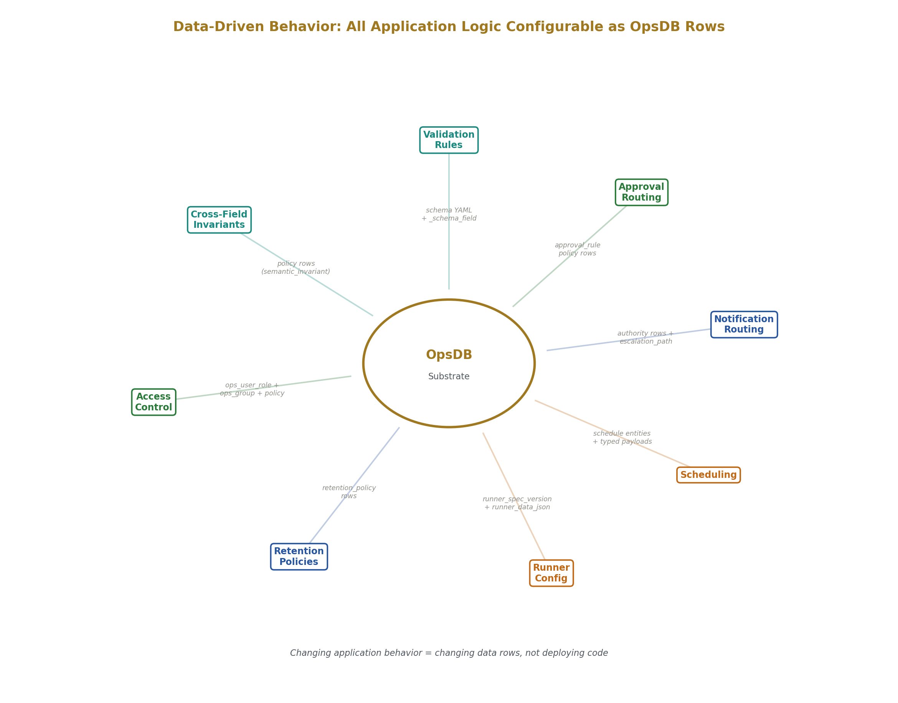

---

### 5. The Draft Mode Extension

The default governance model creates a new version on every write, routes consequential changes through approval, and logs every action to the audit trail. This is appropriate for data where every change matters — configuration, policies, financial records, compliance-relevant state.

For interactive editing use cases — writing a document, drafting a note, iterating on a configuration value — this default creates friction. Every keystroke would produce a version row. The audit log would fill with trivial save events. The user experience would feel heavy.

Three governance flags, declared per table in the schema, address this without changing the gate pipeline logic:

`_autoversion_disabled` tells the API to skip creating a new version row on each write. The current row is mutable. The user is working in a draft state.

`_edit_latest_version` tells the API to apply writes directly to the current row rather than routing through a change set. Authentication, schema validation, bound validation, and access control still run. The change management and versioning steps are skipped for interim saves.

`_audit_logs_disabled` tells the API to skip audit log entries for interim saves, preventing thousands of trivial entries from cluttering the audit trail.

When the user explicitly commits a version — a deliberate action, not an autosave — all ten gate steps run. A version row is created with the full state. A change set records the delta from the prior committed version. The audit log records the commit event. From that point forward, the committed version is immutable and protected by the same governance as any other versioned data.

The result is a clean separation between working state and committed state. Working state is continuously persisted — if the browser crashes, the user loses at most a few seconds. Committed state is governed — full version history, attribution, audit trail, and clean diffs between intentional versions rather than autosave snapshots.

Different tables can have different configurations. A `document` table might have draft mode enabled for fluid editing. A `budget` table might have full governance so every change to a financial number is versioned and attributed. A `recipe` table might use draft mode for the instructions text but full governance for ingredient quantities. The decision is expressed as data in the schema.

The flags themselves are changeable through change sets. Enabling or disabling draft mode on a table is a governed decision, versioned and auditable like any other schema change.

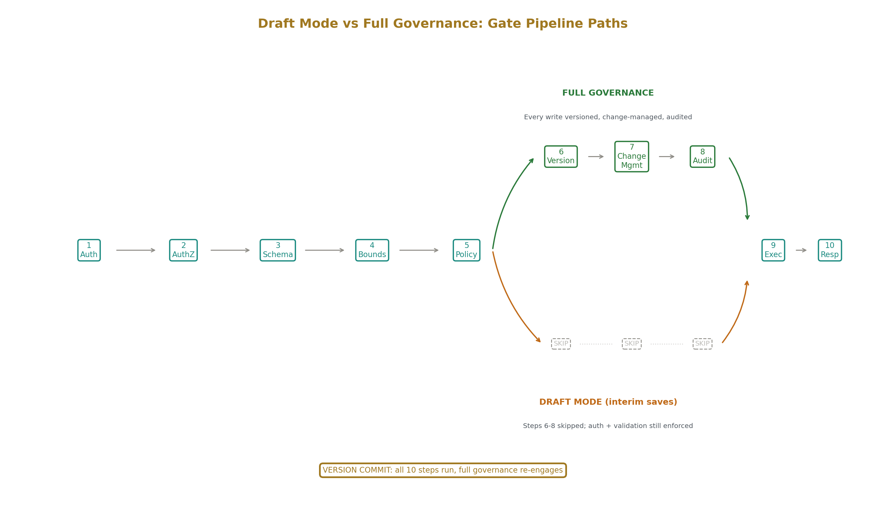

---

### 6. Application Types and Architecture Position

The relationship between OpsDB and an application depends on the application's processing characteristics. Every application has governed state — entities that need validation, versioning, access control, and audit. Some applications also have a hot path — processing that requires latency or throughput beyond what the gate pipeline provides. The architecture position depends on the ratio.

#### Governed-state-dominant applications

Business SaaS products, internal tools, case management systems, compliance platforms, healthcare record systems, financial services backends, education platforms, research data management, personal data platforms. These applications are fundamentally about managing entities through their lifecycles with appropriate governance. The entire application is governed state management with a frontend on top. OpsDB is the backend. There is no separate hot path.

This is the largest category of software by count. CRM systems, HR platforms, project management tools, inventory systems, procurement tools, invoicing systems, customer portals, admin dashboards — all are governed-state-dominant. The typical development pattern for these applications involves building authentication, authorization, validation, versioning, and audit incrementally over months or years, usually incompletely. OpsDB provides all of them from the first entity definition.

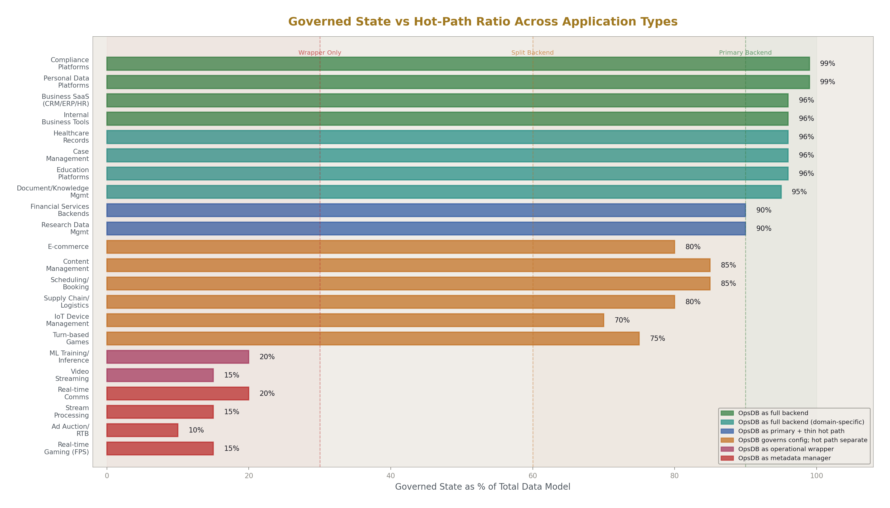

#### Applications with specialized processing

E-commerce systems, IoT platforms, gaming backends, trading systems, streaming services, machine learning platforms, advertising systems. These have a processing component — checkout flow, telemetry ingestion, game simulation, order execution, media delivery, model inference, bid resolution — that requires characteristics the gate pipeline does not provide: sub-millisecond latency, high-frequency writes, specialized consistency models, or compute-intensive processing.

In every one of these systems, the specialized processing is a small fraction of the total data model. A trading system executes orders in microseconds, but the account management, trading rules, compliance policies, position limits, instrument definitions, fee schedules, counterparty records, and regulatory reporting configuration are governed state that changes at human pace through approval workflows. A game server runs physics at 60Hz, but the player accounts, matchmaking parameters, ranking configuration, reward tables, tournament definitions, moderation policies, and abuse reports are governed state.

The ratio of governed state to hot-path processing is typically 90/10 or higher. The architecture for these applications has OpsDB managing the governed state and a specialized system handling the hot path. Runners bridge the two: configuration runners push governed state to the specialized system in its native format, observation runners pull results back into OpsDB as cached observations. The specialized system reads from OpsDB-managed configuration at startup or on a cache refresh cycle. It writes results back as observations. It never depends on OpsDB availability at runtime. If OpsDB is unavailable, the specialized system continues operating with its current configuration. When OpsDB returns, the runners catch up.

This connection pattern uses two existing OpsDB mechanisms. The local replica pattern provides the specialized system with a cached copy of its configuration that survives partition. The passive substrate commitment means OpsDB answers queries and accepts writes but never invokes work, so the specialized system's availability is not coupled to OpsDB's.

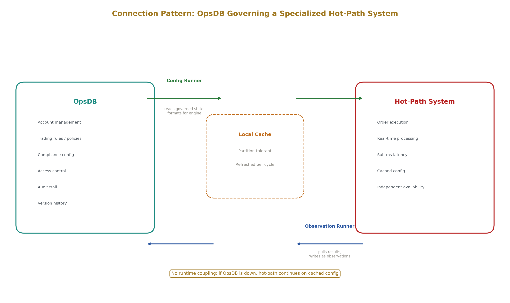

#### Applications where OpsDB manages the operational wrapper

Real-time communication, stream processing, high-performance computing, embedded systems. These are dominated by their specialized processing. OpsDB does not sit in the data path. But even here, the deployment configuration, access control policies, monitoring thresholds, audit requirements, and operational metadata around the specialized system are governed state. OpsDB manages this wrapper. The specialized system is the subject of OpsDB's governance, not a consumer of OpsDB's API at runtime.

---

### 7. Multi-Tenancy

The five authorization layers provide multi-tenancy without additional implementation. Layer 1 (role and group membership) gives you role-based access — admin, member, viewer. Layer 2 (per-entity governance via `_requires_group`) gives you entity-level access scoping — this project is visible only to members of this group. Layer 3 (per-field classification via `_access_classification`) gives you field-level access control — salary data is visible only to HR roles. Layers 4 and 5 add runner scoping and policy-driven constraints.

Your web layer does not implement any of this. It passes the authenticated user's identity to the API. The gate pipeline evaluates access for every read and write. Search results exclude entities the caller cannot access. Responses omit fields the caller cannot see, with metadata indicating the omission. The web layer renders what the API returns.

Changing access configuration is a change set. Adding a user to a group, modifying a role's permissions, changing an entity's required group, adjusting a field's access classification — all are governed changes through the standard pipeline. "Who had access to this data on March 15th" is a query against the version history of the access policy entities.

The read scaling layer — a tenant-aware cache between the API and the database — keys cache entries by access scope. Two users with different permissions querying the same entity type get separate cache entries, preventing cross-tenant data leakage through the cache.

---

### 8. The Search API as Query Layer

The search API provides: filter predicates (equality, inequality, comparison, set membership, anchored pattern matching, null checks, range, JSON containment), composable via AND/OR/NOT with explicit grouping and bounded depth. Named join paths registered as schema metadata allow traversal across entity types — `service.host_group`, `change_set.field_changes`, `machine.megavisor_instance.parent_chain`. Projection controls which fields are returned. Ordering by multiple fields with stable cursor-based pagination. Freshness annotations for cached observation data, filtering out rows older than a specified threshold.

Every query is bounded: maximum result size, maximum join depth, maximum query time, maximum predicate composition depth, and rate limits per caller. Bounds are configurable per role as policy data. Queries exceeding bounds are rejected with structured feedback identifying which bound was hit.

View modes support different access patterns: standard (current state), with\_history (current state plus version chain), and at\_time (state reconstructed at a specified timestamp). The at\_time mode uses the full-state version rows, making reconstruction a single row lookup per entity.

For applications requiring read patterns beyond what the search API provides — aggregations, denormalized views, materialized computations — a runner can read from governed entities and write denormalized results to observation cache tables optimized for the specific read pattern. The cache is rebuildable from the governed source. The search API serves both the governed entities and the cache tables through the same interface.

---

### 9. Schema Evolution

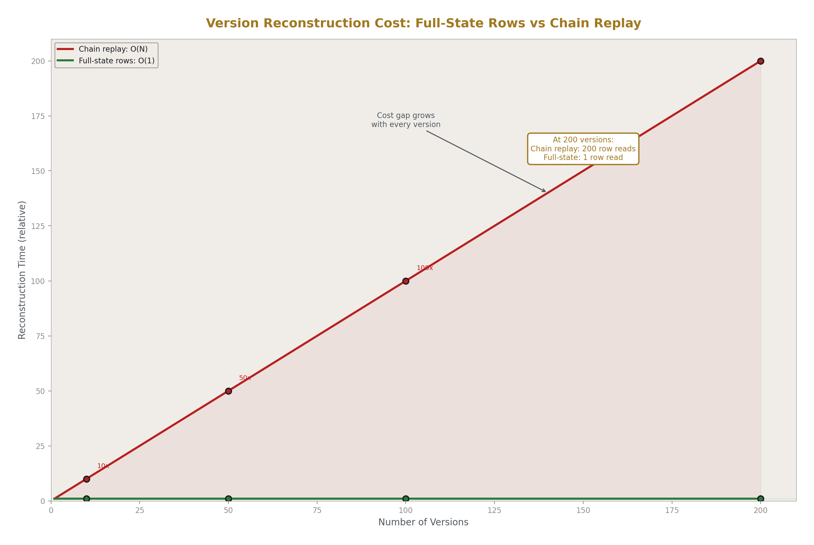

The schema evolves through additive changes governed by strict rules. Allowed changes: adding new fields (nullable), adding new enum values, widening numeric ranges, widening string length bounds, adding new entity types, adding new indexes. Forbidden changes: deleting fields, renaming fields or entities, changing field types, narrowing ranges, removing enum values, tightening uniqueness constraints.

The forbidden changes are absolute. A field that exists in the schema exists forever, even if deprecated. This means version history, audit log entries, and runner logic that reference a field by name never break. Consumers can be simple because the schema never removes what they depend on.

When a type change is needed — converting an int field to a float, restructuring an enum — a six-step pattern applies: add the new field alongside the old, begin writing to both, migrate readers to the new field, mark the old field deprecated, continue writing to both for a safety period, and never remove the old field. The old field becomes a tombstone: present in the schema, queryable in history, but no longer operationally active.

Schema changes flow through a specialized change management path with stricter approval rules than normal data changes. The schema steward role reviews structural integrity, naming consistency, and comprehensive coherence. A CI process can run the schema loader on a proposed change independently before merge. A specialized schema executor runner applies approved schema changes to the database atomically, generates appropriate DDL, and updates the schema metadata tables.

The schema metadata tables — `_schema_entity_type`, `_schema_field`, `_schema_relationship`, `_schema_version` — make the schema itself queryable as data. Your application can discover at runtime what entity types exist, what fields they have, what constraints apply, and when each was introduced or deprecated. This self-describing property enables tooling that adapts to schema changes without hardcoded knowledge of the data model.

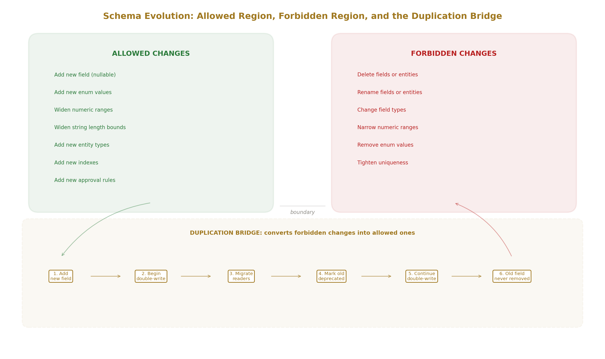

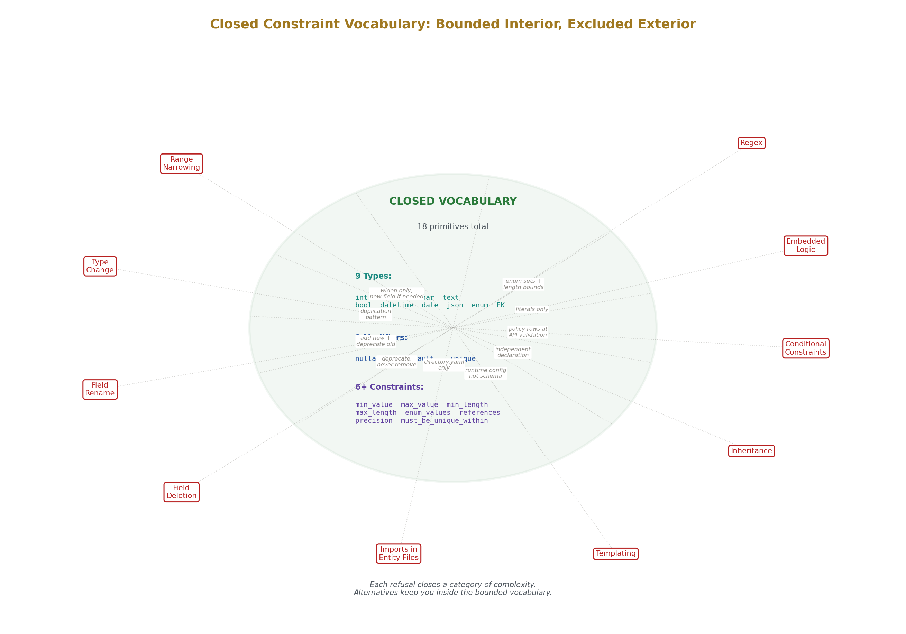

---

### 10. Runners as Backend Logic

Every runner follows the same three-phase pattern: get (read from OpsDB and external sources, no side effects), act (perform work through shared libraries, bounded and scoped), set (write results to OpsDB through the API, producing audit entries).

Ten runner kinds cover the common patterns:

**Pullers** read from external systems — cloud APIs, Kubernetes, identity providers, monitoring systems — and write observations to OpsDB cache tables. They bridge the gap between external authorities and OpsDB's governed data model.

**Reconcilers** compare desired state (from OpsDB entities) with observed state (from cache tables or external queries), compute the difference, and either correct it directly or propose a change set for approval.

**Verifiers** check that scheduled work happened or that state meets expectations, and write structured evidence records. A backup verifier confirms today's backup completed. A certificate scanner checks expiration dates. A compliance scanner evaluates policies against entity configurations.

**Change-set executors** drain approved change sets by applying each field change through the API, then marking the change set as applied. They close the loop between approval and execution.

**Reapers** enforce retention policies by removing or soft-deleting data past its configured retention horizon.

Additional kinds — schedulers, reactors, drift detectors, bootstrappers, failover handlers — handle specific operational patterns.

Three disciplines constrain every runner. **Idempotency**: every action is safely retryable; running the same inputs against the same state produces the same end state. **Level-triggered**: runners react to current state, not event streams; if an event is missed, the next cycle's state comparison catches it. **Bounded**: every runner has explicit limits on retry count, execution time, scope, and resource consumption, declared in its configuration data.

The gating mode determines whether a runner's writes go through change management. Direct writes (for observations and evidence) bypass change sets but are still authenticated, validated, and audited. Auto-approved change sets are recorded and audited but transition through approval automatically per policy. Approval-required change sets route to human approvers. The same runner can have different gating modes for different targets — auto-approve for low-risk changes, require approval for high-risk changes — controlled by policy data.

---

### 11. Compliance as Native Property

The governance properties of OpsDB — validated writes, attributed changes, approval workflows, version history, append-only audit logging, segregation of duties, access review support, configurable retention, continuous evidence production — are the same properties that compliance frameworks require.

SOC2 asks for access control records, scheduled maintenance documentation, validation and change approval evidence, data classification, and residency and retention policies. ISO 27001 asks for information security policies, organizational accountability, asset management, access control, operations security, and incident management records. PCI-DSS asks for need-to-know access restriction, access tracking and monitoring, and regular security testing evidence. HIPAA asks for technical safeguards including access controls, audit logging, and operational records.

In a conventional application, preparing for a compliance audit is a project: assembling evidence from scattered sources, reconstructing access histories from incomplete logs, demonstrating that controls operated continuously when they were only checked periodically.

In an OpsDB-backed application, these properties exist from the first entity definition because the gate pipeline produces them on every operation. The audit log is the evidence. The version history is the change record. The approval trails are the authorization documentation. The evidence records produced by verifier runners are the control effectiveness proof. An auditor queries the same system that operators and automation use. Compliance is not a separate activity — it is a consequence of using the system normally.

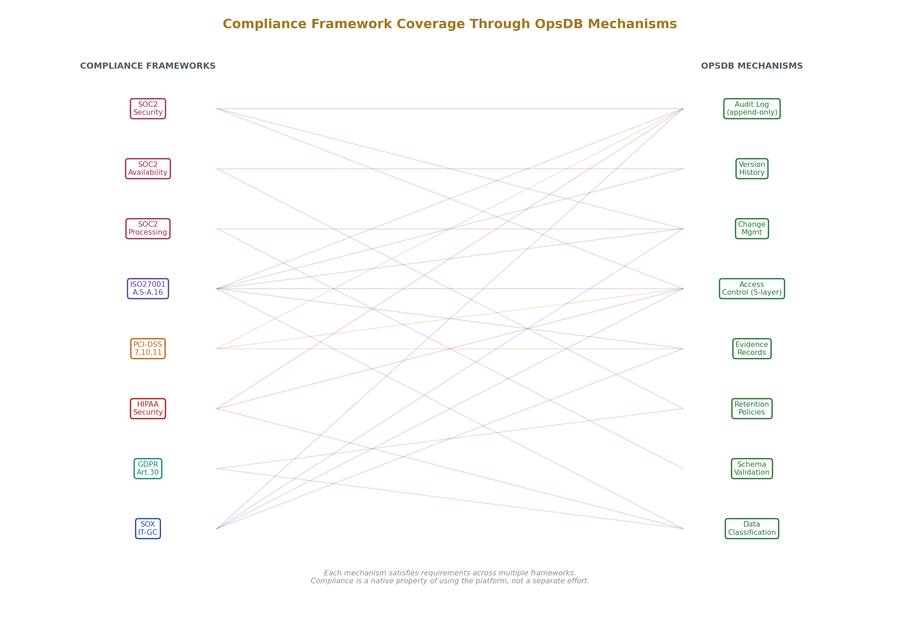

---

### 12. The Personal Scale

The same architecture operates at personal scale. A single OpsDB instance on modest hardware — a Raspberry Pi, a small VPS, a home server — serves as a personal data platform.

Define schemas for whatever you want to track. A recipe collection: `recipe`, `ingredient`, `recipe_ingredient`, `tag`, `recipe_tag`. A book tracker: `book`, `reading_session`, `book_note`, `shelf`, `book_shelf`. A home inventory: `room` (hierarchical), `item`, `item_location`. A personal finance tracker: `account`, `transaction`, `category`, `budget`. Each is a handful of YAML files. The schema loader runs and the API serves them.

For casual tracking where specialized schemas are unnecessary, a generic pattern works: a `collection` entity with a discriminated JSON payload and a `collection_item` entity with its own discriminator. The JSON validation system validates each item's payload against the schema registered for its type. Your recipe items have different fields than your book items, but both are queryable through the same search API. When something graduates from casual tracking to something you care about, you write a proper schema and a runner migrates the data.

At personal scale, the governance features simplify rather than burden. Change management auto-approves everything — you are the only user. Authorization is a single role. The compliance properties are invisible. But the structural properties remain valuable: versioning means you never lose data and can recover any prior state, the search API means you can query across all your data with structured filters and joins, the schema means your data stays validated and relationally consistent, and you own everything on hardware you control.

Personal runners provide automation over data you own. A weather runner pulls forecasts and writes observations — your garden journal frontend shows weather alongside your planting notes. A fitness API runner pulls workout data from your watch. A bank API runner pulls transactions and categorizes them based on rules you defined as policy data. A reminder runner reads schedules — vehicle maintenance, subscription renewals, library due dates — and sends notifications to your phone.

A household extends this naturally. Multiple users with their own identities and role memberships. Shared data — recipes, household inventory, shared budget — accessible to both. Personal data scoped via `_requires_group`. The authorization layers that are invisible for a single user become useful the moment two people share a dataset with different roles.

---

### 13. Construction Guidance

**Designing your schema.** Start with the top-level taxonomy: what are the major entity categories and how do they relate? Pick a domain that is both painful and valuable — not a greenfield experiment but something with real operational stake. Slice that domain into entities, relationships, schedules, and policies. Build a runner or two to force the schema to be useful, not just structurally elegant. Do another domain. The second domain refines the top-level taxonomy. Each subsequent domain refines the schema further.

The schema uses singular names, lowercase with underscores, hierarchical prefixes from specific to general, foreign keys named `referenced_table_id`, datetime fields suffixed `_time`, date fields suffixed `_date`, boolean fields prefixed `is_` or `was_`, and underscore-prefixed governance fields. Bridge tables handle polymorphic relationships — one bridge table per source-target pair with clean foreign key integrity.

**Designing your runners.** Identify the inputs: what OpsDB rows does the runner read, what external sources does it consult. Identify the outputs: what OpsDB rows does it write, what side effects does it produce. Choose the gating mode based on what it writes and the stakes involved. Choose the trigger: scheduled, event-driven, or long-running. Specify bounds: retry budget, execution time, scope per cycle. Define idempotency: what does "same end state" mean for this runner, what uniqueness keys are needed. Write the runner spec as an OpsDB entity with a typed JSON payload. Build the runner small, using shared libraries for all I/O.

**Building your web layer.** It is a thin consumer of the OpsDB API. It authenticates users via SSO. It translates user actions into API calls. It renders what the API returns. It does not implement its own validation, authorization, versioning, or audit logic. It does not have its own database.

**When to use draft mode.** Enable the draft governance flags on tables where interactive editing is the primary use pattern and versioning every keystroke would create noise: documents, notes, configuration drafts, iterative design work. Do not enable them on tables where every change matters independently: financial records, compliance-relevant data, access control configuration.

**When to add a specialized system.** When your application has a processing requirement that cannot tolerate the gate pipeline's latency — real-time communication, high-frequency transactions, stream processing, compute-intensive workloads. Connect the specialized system to OpsDB through runners: configuration runners push governed state to the specialized system, observation runners pull results back. The specialized system operates independently of OpsDB availability, using cached configuration.

---

### 14. Boundaries

OpsDB Application Architecture is not a web framework. You still need a frontend and a presentation layer. OpsDB is the data substrate beneath them.

It is not a replacement for specialized databases. Time-series databases, graph databases, vector databases, and stream processing systems exist because they provide capabilities — high-frequency ingestion, graph traversal, semantic similarity, ordered event processing — that a relational governed data substrate does not. OpsDB manages the governed state around these systems and integrates with them through runners.

It is not a workflow engine. The change set lifecycle — draft, submitted, validating, pending approval, approved, applied — is one specific workflow. General-purpose workflow orchestration with arbitrary branching, parallel execution, and conditional routing is a different system. OpsDB can be the state backend for a workflow engine, but it is not the engine.

It is not an orchestrator. Runners coordinate through shared state in OpsDB, not through direct invocation. OpsDB does not trigger runners, schedule them, or manage their lifecycle. Runners are independent programs with their own scheduling.

It is not optimal for discovery-phase prototyping. The strict schema evolution rules — no deletions, no renames, no type changes — impose costs during the phase when you are still discovering what your data model is. Starting in a less rigid system and migrating to OpsDB once the domain stabilizes is a reasonable approach. The migration path is a set of schema YAML files and a runner that transforms existing data into OpsDB entities through change sets.

---

### 15. Summary

OpsDB Application Architecture provides a governed data substrate for general application development. The schema engine defines your data model with strict, evolvable contracts. The API gate validates, authorizes, versions, and audits every interaction through a uniform ten-step pipeline. Change sets provide atomic, approval-routed mutations with full attribution. Runners implement backend logic as small, bounded, idempotent programs connected through shared libraries. The authorization model provides multi-tenancy through five composable layers. The versioning system provides point-in-time reconstruction of any entity. The audit log provides a complete, append-only record of every action.

These properties exist on every entity from the moment it is defined in the schema. They are not bolted on incrementally as the application matures. They are not separate systems that must be integrated. They are a single pipeline where each concern is aware of every other.

The architecture scales from a personal data platform on a single machine to an enterprise backend serving multiple consumer populations under regulatory oversight. The schema is the long-lived artifact that survives across storage engines, API versions, runner rewrites, and organizational changes. The governance model adapts through data — policy rows, approval rules, access classifications, retention policies, draft mode flags — not through code changes.

For governed-state-dominant applications, OpsDB is the backend. For applications with specialized processing, OpsDB governs everything around the hot path. For personal use, the governance features simplify to invisibility while the structural properties — versioning, search, validation, and data ownership — remain valuable.

The architecture rests on a single structural observation: validated, versioned, attributed, and auditable data management is not a feature to be added later. It is the substrate on which applications are built.

---

### Addendum: AppDB Naming Convention and Application Isolation

Each application built on OpsDB Application Architecture should be named as its own Distributed Operating System instance and referred to as an **AppDB**. A project management application becomes the Project Management AppDB. A personal recipe tracker becomes the Recipe AppDB. A SaaS billing platform becomes the Billing AppDB.

This is not a metaphor. It is the same DOS concept from the operational design applied to applications. A DOS is an environment operated as one coordinated system across heterogeneous nodes. An application is exactly that: a schema defining the data model, an API gate enforcing governance, runners implementing backend logic, shared libraries mediating world-side operations, and one or more frontends consuming the API. Each AppDB is a self-contained operational unit with its own schema, its own policies, its own runners, its own audit trail, and its own versioned state.

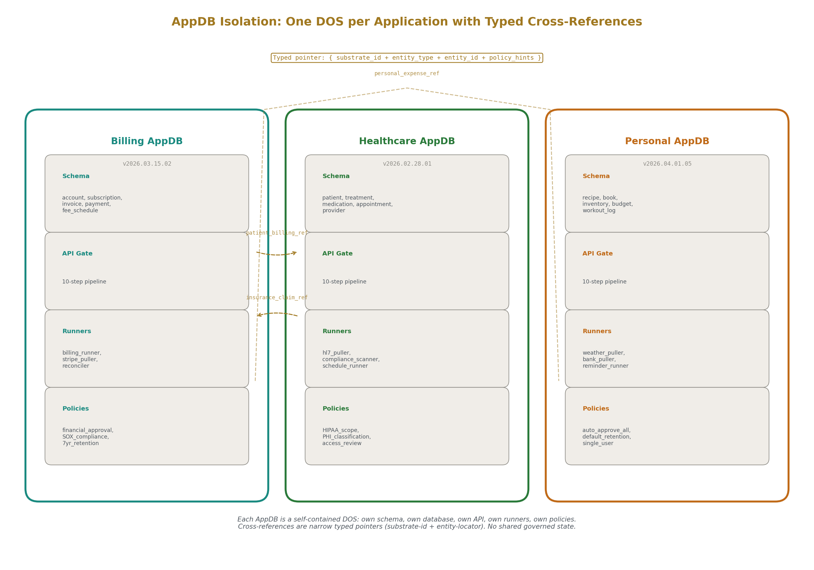

#### One DOS per application

Each AppDB hosts exactly one DOS. The project management application does not share a DOS with the billing application. They are separate OpsDB instances with separate schemas, separate databases, separate API deployments, and separate runner populations. They may reference each other through cross-OpsDB typed pointers if needed, but they do not share governed state.

This follows the 0/1/N cardinality rule. Each application is one DOS. An organization with five applications has five AppDBs. They are not consolidated into a single OpsDB instance, because each application has its own schema evolution lifecycle, its own approval policies, its own retention requirements, and its own deployment cadence. Consolidation creates coupling between unrelated domains.

#### Enumerating application-specific mechanisms, principles, and properties

Each AppDB defines not just its schema but its operational vocabulary. The mechanisms, principles, and properties relevant to the application type can be enumerated and declared as part of the AppDB's design documentation.

A billing AppDB declares the mechanisms it uses: change sets for invoice adjustments, approval routing for refunds above a threshold, evidence records for payment processing verification, observation cache for external payment provider state. It declares the principles it enforces: segregation of duties on refund approval, mandatory audit trail on all financial state changes, retention policies aligned with tax reporting requirements. It declares the properties it claims: atomicity of invoice line items within a change set, auditability of every balance-affecting operation, reversibility of charges through governed change sets.

A healthcare records AppDB declares different mechanisms, principles, and properties: per-field access classification for patient data sensitivity, compliance scope bridges to HIPAA regime, evidence records for access review verification, retention policies aligned with medical record retention law.

By enumerating these per AppDB, application teams make their governance model explicit and inspectable. The enumeration is data — it can live in the AppDB's documentation metadata entities, referenced from the schema, and queried by auditors and operators. New applications of the same type can start from a prior AppDB's enumeration and adapt it rather than discovering the requirements from scratch.

#### AppDB as prototype for distributed applications

When an application is intended for distribution — shipped as a binary, container image, or deployable package that others run externally — the AppDB serves as the prototype. The development team's AppDB is the canonical instance. It contains the reference schema, the reference policies, the reference runner specifications, and the reference approval rules.

Released versions of the application are versioned instances of the prototype AppDB. Each deployment is its own DOS — its own OpsDB instance with its own database, its own API, its own runners. The schema version tracks which release the deployment corresponds to. Schema evolution between releases follows the same additive rules: new fields, new entities, widened constraints, no deletions, no renames. Deployments upgrade by applying the schema changes between their current version and the target release version through the standard schema change set mechanism.

This means every deployment of a distributed application has the same governance properties as the prototype: validated writes, versioned state, attributed changes, audit trail, and configurable policies. The deploying organization configures their own approval rules, their own access policies, their own retention settings, and their own runner schedules. The schema and the structural governance are inherited from the prototype. The operational policies are local.

The prototype AppDB's documentation — its enumerated mechanisms, principles, and properties — ships with the release as the application's operational specification. Deploying organizations know what governance the application provides, what policies they need to configure, and what properties they can claim to auditors. The specification is not prose. It is structured data that their AppDB instance can import and query.

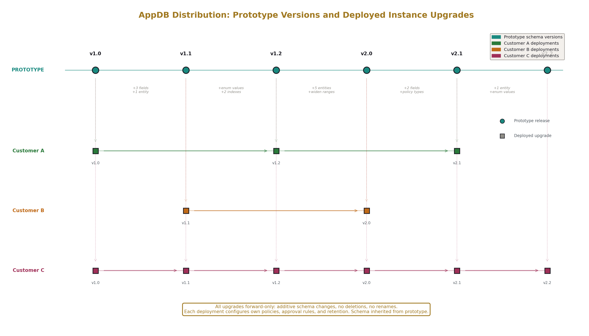

---

### Addendum II: Governance Flag Engineering and Property-Aware Customization

The draft mode governance flags described in Section 5 — `_autoversion_disabled`, `_edit_latest_version`, `_audit_logs_disabled` — are one instance of a general pattern. OpsDB Application Architecture permits the introduction of additional governance flags as application requirements demand them. This addendum describes the discipline for doing so.

#### Introduce Flags When Needed, Not Before

Governance flags should not be designed speculatively. A flag earns its place when a concrete use case encounters friction from the default governance model and the friction cannot be resolved by adjusting policy data alone.

The draft mode flags emerged from a specific use case: interactive document editing where per-keystroke versioning and audit logging created noise without value. The flags were not designed as a general "relaxation framework." They were designed to solve one problem. That the solution generalized is a consequence of the architecture, not a design goal.

New flags follow the same path. A team building a logging dashboard discovers that high-frequency observation writes from a metrics puller are creating audit entries that dwarf the operational audit trail in volume. The response is not to design a comprehensive audit filtering framework. The response is to introduce a specific flag — perhaps `_audit_log_sampling_rate` — that allows a table to declare that only a configurable fraction of observation writes produce audit entries. The flag is declared in the schema, versioned, change-managed, and auditable like any other governance field. It solves the concrete problem. If the pattern recurs across other AppDBs, it becomes a candidate for inclusion in the standard governance field set.

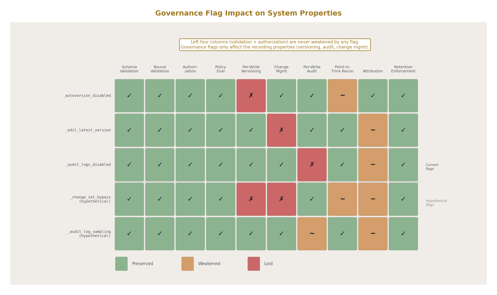

#### Slice the Pie Before Adding a Flag

Every governance flag modifies how the gate pipeline behaves for a specific table. Each modification changes which properties the system provides for data in that table. Before introducing a flag, enumerate which properties are affected and whether the application can afford to lose them.

The draft mode flags illustrate this. When `_autoversion_disabled` is set, the versioning property weakens: interim states between committed versions are not individually recoverable. The application accepts this because the editing use case values fluidity over per-keystroke recovery. When `_audit_logs_disabled` is set, the auditability property weakens: interim saves are not individually attributable. The application accepts this because the noise of per-keystroke audit entries reduces the audit trail's usefulness for its actual purpose.

The discipline is: for each proposed flag, identify every property it affects, determine whether each affected property is required for the table's role in the application, and document the tradeoff explicitly. This is the book's "slicing the pie" applied to governance: subdivide the property space comprehensively, examine each slice, and make the tradeoff with full knowledge of what is being traded.

A concrete example. A team wants to introduce `_change_set_bypass` to allow certain high-frequency automated writes to skip change set creation entirely while still producing audit entries. The property analysis:

Versioning is lost for bypassed writes. If the table holds configuration data that needs point-in-time reconstruction, this is unacceptable. If the table holds ephemeral coordination state that is overwritten every cycle, this is acceptable.

Change management attribution is lost. If the data is compliance-relevant and an auditor needs to see the approval chain for every value, this is unacceptable. If the data is operational telemetry that no approval workflow governs, this is acceptable.

Audit logging is preserved. Every write still produces an audit entry. The trail of who wrote what and when remains intact.

Schema validation is preserved. Every write still passes through field-level validation. Malformed data is still rejected.

Authorization is preserved. Every write still passes through the five-layer authorization check. Unauthorized writes are still denied.

The result: `_change_set_bypass` is acceptable for observation-like tables where versioning and change management are not required, and unacceptable for governed entities where those properties are load-bearing. The flag's documentation states which properties it weakens and under which conditions its use is appropriate.

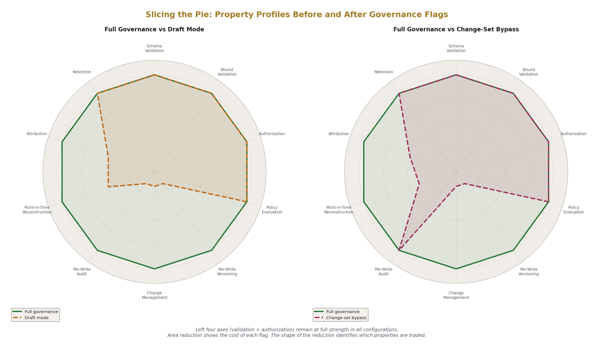

#### Property Loss is Per-Table, Not Global

A governance flag set on one table does not affect any other table. The billing AppDB can have draft mode on its `invoice_note` table while maintaining full governance on its `invoice` table. The healthcare AppDB can have audit sampling on its `telemetry_cache` table while maintaining full audit on its `patient_record` table. Each table's governance configuration is independent.

This means the property analysis is local. The question is not "does this AppDB have auditability" but "does this table have auditability, and does this table need auditability for the application's purposes." The system's properties are the composition of its per-table properties. A compliance auditor examining the system asks about specific tables holding specific data, not about the platform in general.

#### Document the Tradeoff in the Schema

When a governance flag is set on a table, the schema file's `notes` field should document which properties are weakened and why the tradeoff is acceptable for this table's role. This documentation is not enforced by the loader — the `notes` field is prose for human readers — but it is part of the schema steward's review responsibility.

The pattern:

```
notes: |
  Draft mode enabled (_autoversion_disabled, _edit_latest_version,
  _audit_logs_disabled). Interim editing states are not individually
  versioned or audited. Version commits engage full governance.
  Acceptable because: document content is iterative drafting work
  where per-keystroke versioning creates noise. Point-in-time
  reconstruction is available at committed version granularity,
  which matches the application's recovery requirements.
  Properties weakened: per-write versioning, per-write audit.
  Properties preserved: schema validation, authorization,
  committed-version history, committed-version audit.
```

This documentation survives in the schema repository. When a future maintainer encounters the flags, the rationale is present. When the schema steward reviews a proposed flag addition, the property analysis is part of the review material.

#### The Discipline is Engineering, Not Policy

The decision to introduce a governance flag is an engineering decision, not an administrative one. It follows the same method as any other architectural tradeoff: identify the axes, evaluate each axis for the specific context, make the tradeoff explicitly, and document the reasoning.

The book's axiomatic engineering framework applies directly. The relevant axes are the properties from the infrastructure taxonomy: auditability, versioning, atomicity, consistency, boundedness, and the others. Each governance flag shifts the system's position on one or more of these axes for the affected table. The engineer's job is to verify that the resulting position is acceptable for the table's role in the application, not to apply a universal policy about which flags are allowed.

Different AppDBs will make different tradeoffs. A compliance-heavy AppDB may never use draft mode on any table because per-write auditability is a regulatory requirement for all data it holds. A personal AppDB may use draft mode on most tables because the single user values fluidity and has no external audit requirements. A SaaS AppDB may use draft mode on user-facing editing tables and full governance on billing and access control tables. Each decision is local, explicit, and documented.

The common discipline across all cases is: understand which properties the flag affects, verify that the affected properties are not required for the table's purpose, and document the tradeoff in the schema. The pie is sliced. The tradeoff is inspectable. The decision is engineering.

---

### Appendix A: Application Type Suitability Matrix

| id | application\_type | position | governed\_state\_ratio | hot\_path\_present | hot\_path\_nature | opsdb\_role | notes |
|---|---|---|---|---|---|---|---|
| AT01 | Business SaaS (CRM/ERP/HR) | primary backend | 95%+ | no | none | full backend | sweet spot; every entity governed |
| AT02 | Internal business tools | primary backend | 95%+ | no | none | full backend | lighter approval policies than customer-facing |
| AT03 | Compliance and regulatory platforms | primary backend | 99% | no | none | full backend | compliance properties are the product |
| AT04 | Operational platforms | primary backend | 95%+ | no | none | full backend | original design domain |
| AT05 | Case management systems | primary backend | 95%+ | no | none | full backend | change set lifecycle maps to case state machine |
| AT06 | Healthcare record systems | primary backend | 95%+ | no | none | full backend | per-field access classification handles sensitivity |
| AT07 | Financial services backends | primary backend | 90% | yes | transaction processing | governance layer | OpsDB governs accounts/rules/policies; separate engine processes transactions |
| AT08 | Document/knowledge management | primary backend | 95%+ | no | none | full backend | draft mode for editing; structured metadata governed |
| AT09 | Personal data platforms | primary backend | 99% | no | none | full backend | single user; auto-approve; own your data |
| AT10 | Education platforms | primary backend | 95%+ | no | none | full backend | versioned assignments; attributed grades |
| AT11 | Research data management | primary backend | 90% | yes | compute/analysis | governance layer | OpsDB governs metadata/protocols; compute is separate |
| AT12 | E-commerce | split | 80% | yes | checkout/cart | catalog backend | catalog governed; cart/checkout separate fast path |
| AT13 | Content management | split | 85% | yes | content delivery | editorial backend | editorial governed; CDN/cache for delivery |
| AT14 | IoT device management | split | 70% | yes | telemetry ingestion | fleet management | fleet governed; time-series DB for telemetry |
| AT15 | API gateway configuration | split | 85% | yes | request routing | config management | config governed; gateway caches locally |
| AT16 | Workflow/approval systems | split | 80% | yes | workflow execution | state backend | state governed; workflow engine separate |
| AT17 | Turn-based games | split | 75% | yes | real-time sync | persistent state | game state governed; real-time layer separate |
| AT18 | Scheduling/booking systems | split | 85% | yes | concurrent reservation | booking backend | moderate scale direct; high contention separate |
| AT19 | Supply chain/logistics | split | 80% | yes | real-time tracking | supply chain data | governed entities; streaming for live tracking |
| AT20 | Real-time communication | wrapper | 20% | yes | message delivery | operational metadata | user accounts/config governed; message bus separate |
| AT21 | Stream processing | wrapper | 15% | yes | event processing | operational metadata | pipeline config governed; processing separate |
| AT22 | High-frequency trading | wrapper | 10% | yes | order execution | governance layer | rules/accounts/compliance governed; engine separate |
| AT23 | Real-time gaming (FPS/MMO) | wrapper | 15% | yes | game simulation | player/match management | accounts/config governed; game server separate |
| AT24 | ML training/inference | wrapper | 20% | yes | compute | operations metadata | experiment tracking/model registry governed |
| AT25 | Video streaming | wrapper | 15% | yes | media delivery | content catalog | catalog/licensing governed; CDN/transcode separate |
| AT26 | Ad auction/real-time bidding | wrapper | 10% | yes | bid resolution | campaign management | campaigns/policies governed; auction separate |
| AT27 | Time-series databases | not backend | 5% | yes | high-freq ingestion | pointer/summary holder | OpsDB holds summaries and authority pointers |
| AT28 | Search engines | not backend | 10% | yes | index/query | metadata source | OpsDB holds structured metadata; search indexes built from it |
| AT29 | Large-scale media storage | not backend | 10% | yes | blob storage/delivery | metadata management | OpsDB holds media metadata; object store holds files |
| AT30 | Operating systems/embedded | not applicable | 0% | yes | bare-metal/RTOS | none | different domain entirely |
| AT31 | Compilers/dev tools | not applicable | 5% | yes | compilation/analysis | none | standalone tools with own data models |
| AT32 | HPC/scientific computing | not applicable | 5% | yes | simulation/numerical | none | compute-bound; not a governance problem |

---

### Appendix B: Gate Pipeline Step Applicability by Operation Class

| step | name | read | write\_direct | write\_change\_set | change\_mgmt\_action | draft\_mode\_write | version\_commit |
|---|---|---|---|---|---|---|---|
| AG1 | Authentication | yes | yes | yes | yes | yes | yes |
| AG2 | Authorization (5 layers) | yes | yes | yes | yes | yes | yes |
| AG3 | Schema Validation | no | yes | yes | yes | yes | yes |
| AG4 | Bound Validation | no | yes | yes | yes | yes | yes |
| AG5 | Policy Evaluation | yes (access) | yes | yes | yes | yes | yes |
| AG6 | Versioning Preparation | no | no | yes | no | no | yes |
| AG7 | Change Mgmt Routing | no | no | yes | yes | no | yes |
| AG8 | Audit Logging | yes | yes | yes | yes | no | yes |
| AG9 | Execution | yes (query) | yes | yes | yes | yes | yes |
| AG10 | Response | yes | yes | yes | yes | yes | yes |

---

### Appendix C: What Each Entity Gets From the Platform

| property | mechanism | code\_required | notes |
|---|---|---|---|
| schema validation | gate step 3; declared in YAML | none | every field validated on every write |
| numeric/string/enum bounds | gate step 4; declared in YAML | none | mechanical lookup; no regex |
| cross-field invariants | gate step 5; policy rows | policy row creation | evaluated at semantic validation step |
| foreign key integrity | gate step 4; declared in YAML | none | FK existence check on every write |
| role-based access | gate step 2 layer 1; role/group membership rows | role/group row creation | standard RBAC |
| per-entity access control | gate step 2 layer 2; \_requires\_group field | field declaration in schema | per-row governance |
| per-field classification | gate step 2 layer 3; \_access\_classification field | field declaration in schema | field-level sensitivity |
| per-runner scoping | gate step 2 layer 4; capability/target rows | target row creation | declared authority |
| policy-driven constraints | gate step 2 layer 5; policy rows | policy row creation | SoD, time-of-day, tenure |
| version history | gate step 6; versioning sibling table | versioned:true in schema | full-state per version |
| point-in-time reconstruction | get\_entity\_at\_time operation | none | O(1) lookup against version sibling |
| change management | gate step 7; approval rule policies | approval rule row creation | configurable routing |
| auto-approval | gate step 7; auto-approve policy match | policy row creation | no human intervention |
| approval-required | gate step 7; approval rule match | approval rule row creation | human approval routing |
| emergency path | emergency\_apply operation | none | break-glass with post-review |
| bulk changes | bulk\_submit operation | none | atomic multi-entity |
| audit logging | gate step 8; append-only table | none | every action recorded |
| tamper evidence | optional \_audit\_chain\_hash | configuration flag | cryptographic chaining |
| optimistic concurrency | version stamp check at submit | none | stale version fails loud |
| search with filters | search operation | none | predicates, joins, projection, pagination |
| retention policies | reaper runner; retention\_policy rows | retention row creation | configurable per entity type |
| self-describing metadata | \_schema\_\* tables | none | queryable schema introspection |
| draft mode editing | governance flags per table | flag declaration in schema | continuous persistence without version noise |

---

### Appendix D: Data-Driven Behavior Categories

| id | behavior | stored\_as | changed\_via | versioned | example |
|---|---|---|---|---|---|
| DB01 | field validation rules | schema YAML → \_schema\_field rows | schema change set | yes | max\_length=255 on name field |
| DB02 | cross-field invariants | policy rows (type=semantic\_invariant) | standard change set | yes | if status=active then start\_date required |
| DB03 | approval routing | approval\_rule policy rows | standard change set | yes | production changes require two approvers |
| DB04 | access control | ops\_user\_role + ops\_group + policy rows | standard change set | yes | only hr\_group can see salary fields |
| DB05 | notification routing | authority rows + escalation\_path + on\_call\_assignment | standard change set | yes | page database SRE on-call for critical alerts |
| DB06 | retention policies | retention\_policy rows | standard change set | yes | 30-day retention for observation cache |
| DB07 | scheduling | schedule entities with typed payloads | standard change set | yes | credential rotation every 90 days |
| DB08 | runner configuration | runner\_spec\_version with runner\_data\_json | standard change set | yes | retry budget=3, timeout=300s |
| DB09 | runner authority | runner\_capability + runner\_\*\_target rows | standard change set | yes | runner can write to observation\_cache\_metric |
| DB10 | report key declarations | runner\_report\_key rows | standard change set | yes | puller can write host\_cpu\_seconds\_total |
| DB11 | security zones | security\_zone + membership bridge rows | standard change set | yes | production zone requires MFA |
| DB12 | data classification | data\_classification rows + \_access\_classification fields | standard change set | yes | salary data classified restricted |
| DB13 | change management rules | change\_management\_rule rows | standard change set | yes | emergency review window 72 hours |
| DB14 | escalation paths | escalation\_path + escalation\_step rows | standard change set | yes | page on-call → wait 15m → page manager |
| DB15 | compliance scope | compliance\_regime + scope bridge rows | standard change set | yes | SOC2 applies to service X |
| DB16 | draft mode | \_autoversion\_disabled + related flags | schema change set | yes | document table allows draft editing |

---

### Appendix E: Runner Kind to Application Pattern Mapping

| runner\_kind | operational\_example | application\_example | reads | writes | gating |
|---|---|---|---|---|---|
| Puller | AWS resource state scraper | Stripe payment status sync | external API + runner spec | observation\_cache\_\* | direct write |
| Puller | Kubernetes pod status | GitHub repository metadata sync | external API + runner spec | observation\_cache\_\* | direct write |
| Puller | Identity provider group sync | Salesforce contact import | external API + runner spec | observation\_cache\_\* | direct write |
| Reconciler | K8s manifest drift corrector | Subscription→provisioning sync | desired entities + observed cache | entity rows or change\_set | auto-approve or approval |
| Reconciler | Certificate renewer | Account balance reconciliation | desired + observed + policies | entity rows or change\_set | auto-approve or approval |
| Verifier | Backup completion checker | SLA compliance checker | schedule + target + prior evidence | evidence\_record | direct write |
| Verifier | Credential rotation verifier | Payment processing audit | schedule + target + prior evidence | evidence\_record | direct write |
| Verifier | Compliance scanner | Data retention compliance | policies + entity configs | evidence\_record + compliance\_finding | direct write |
| Change-set executor | Approved config change applier | Approved order fulfillment | approved change\_sets | entity rows + version rows | post-approval direct |
| Change-set executor | Schema migration applier | Approved price change applier | approved change\_sets | entity rows + version rows | post-approval direct |
| Reaper | Observation cache trimmer | Expired session cleaner | retention\_policy rows | deletes/soft-deletes | direct write |
| Reaper | Old runner job cleanup | Archived notification cleanup | retention\_policy rows | deletes/soft-deletes | direct write |
| Drift detector | Cloud resource drift finder | Pricing inconsistency finder | desired + observed | change\_set (proposal) | approval required |
| Drift detector | Config drift detector | Inventory discrepancy finder | desired + observed | change\_set (proposal) | approval required |
| Reactor | Webhook event processor | Payment webhook handler | event + runner spec | observation or change\_set | varies |
| Reactor | K8s event watcher | Email bounce processor | event + runner spec | observation or change\_set | varies |
| Scheduler | Cron entry deployer | Report generation scheduler | schedules + targets | runner\_job + side effects | auto-approve |
| Bootstrapper | New VM provisioner | New tenant provisioner | templated config + host group | entity rows + observations | auto-approve or approval |
| Failover handler | Database failover | Payment processor failover | observed state + failover policy | change\_set + evidence | emergency or approval |

---

### Appendix F: Compliance Property Mapping

| id | compliance\_requirement | framework | opsdb\_mechanism | automatic |
|---|---|---|---|---|
| CP01 | Access control records | SOC2-Security | authorization layers + audit log + change mgmt | yes |
| CP02 | Scheduled maintenance records | SOC2-Availability | schedule entities + observed state history | yes |
| CP03 | Validation and change approval | SOC2-Processing-Integrity | gate validation + approval records | yes |
| CP04 | Data classification and access policies | SOC2-Confidentiality | policy data + \_access\_classification + authorization | yes |
| CP05 | Residency and retention | SOC2-Privacy | substrate location + retention\_policy | yes |
| CP06 | Information security policies | ISO27001-A.5 | policy entities | yes |
| CP07 | Organizational accountability | ISO27001-A.6 | ownership + stakeholder bridges | yes |
| CP08 | Asset management | ISO27001-A.8 | entity registry (all governed entities) | yes |
| CP09 | Access control | ISO27001-A.9 | authorization layers + audit log | yes |
| CP10 | Operations security | ISO27001-A.12 | change mgmt + monitoring | yes |
| CP11 | Incident management | ISO27001-A.16 | incident records + response actions | yes |
| CP12 | Need-to-know access | PCI-DSS-7 | \_access\_classification + \_requires\_group | yes |
| CP13 | Access tracking and monitoring | PCI-DSS-10 | audit log (append-only, attributed) | yes |
| CP14 | Regular security testing evidence | PCI-DSS-11 | scheduled scan records + evidence\_record | yes |
| CP15 | Technical safeguards | HIPAA-Security | data classification + access controls + audit + ops records | yes |
| CP16 | Privacy safeguards | HIPAA-Privacy | same as CP15 | yes |
| CP17 | Records of processing activities | GDPR-Article-30 | entity records: data + purpose + systems + retention + jurisdiction | yes |
| CP18 | Change mgmt + SoD + control evidence | SOX-IT-General-Controls | change records + SoD rules + enforcement + audit | yes |

---

### Appendix G: Draft Mode Flag Behavior

| flag | gate\_step\_affected | behavior\_when\_set | behavior\_when\_unset | scope |
|---|---|---|---|---|
| \_autoversion\_disabled | AG6 (Versioning Preparation) | skip version row creation on write | create version row on every write | per-table |
| \_edit\_latest\_version | AG7 (Change Mgmt Routing) | write directly to current row; skip change set | route through change set pipeline | per-table |
| \_audit\_logs\_disabled | AG8 (Audit Logging) | skip audit log entry for interim saves | log every operation | per-table |
| (version commit action) | all steps | all ten steps run; version row created; change set recorded; audit logged | n/a | per-action |

| combination | use\_case | still\_enforced | skipped |
|---|---|---|---|
| all three flags set | fluid document editing with autosave | auth + authz + schema validation + bound validation + policy | versioning + change mgmt + audit on interim saves |
| autoversion only | editable entities that still audit every save | auth + authz + validation + policy + audit + change mgmt | version row creation |
| edit\_latest only | direct edits that still version and audit | auth + authz + validation + policy + versioning + audit | change set routing |
| none set | full governance (default) | all ten steps | nothing |

---

### Appendix H: Architecture Position by Hot Path Ratio

| ratio\_band | governed\_state | hot\_path | opsdb\_position | connection\_pattern | examples |
|---|---|---|---|---|---|
| 95-100% | entire application | none | primary backend | web layer → OpsDB API | SaaS, internal tools, compliance, personal |
| 80-95% | most entities + config + policies | checkout, content delivery, booking | split backend | web layer → OpsDB API + specialized service; runners bridge | e-commerce, CMS, scheduling |
| 60-80% | fleet mgmt + config + audit | telemetry, real-time sync, tracking | managed backend | OpsDB governs config; specialized ingests; runners bridge | IoT, supply chain, turn-based games |
| 15-30% | accounts + config + policies + compliance | message delivery, stream processing, ML | operational wrapper | runners push config to specialized; pullers pull results | chat, streaming, ML platforms |
| 5-15% | deployment config + monitoring config | game sim, bid resolution, media delivery | metadata manager | runners manage operational lifecycle | FPS games, ad auction, video streaming |
| 0-5% | none meaningful | entire system | not applicable | none | OS, embedded, compilers, HPC |

---

### Appendix I: Schema Convention Summary

| convention | rule | applies\_to | example |
|---|---|---|---|
| singular names | all table and field names singular | all | task not tasks; user not users |
| lowercase underscore | all names lowercase with underscores | all | task\_assignment not TaskAssignment |
| hierarchical prefix | specific-to-general ordering | composite names | web\_site then web\_site\_widget |
| FK naming | referenced\_table\_id | all foreign keys | project\_id references project |
| role prefix | when multiple FKs to same target | disambiguating FKs | vendor\_company\_id, client\_company\_id |
| \_time suffix | datetime fields | all datetimes | created\_time, approved\_time |
| \_date suffix | date fields | all dates | due\_date, birth\_date |
| is\_ prefix | present-state booleans | booleans | is\_active, is\_running |
| was\_ prefix | past-event booleans | booleans | was\_approved, was\_escalated |
| \_ prefix | governance/admin/schema fields | governance | \_requires\_group, \_access\_classification |
| bridge tables | one per source-target pair | polymorphic relationships | service\_ownership, monitor\_machine\_target |
| discriminator pattern | \*\_type + \*\_data\_json | heterogeneous typed data | cloud\_resource\_type + cloud\_data\_json |
| versioning sibling | \*\_version table generated | change-managed entities with versioned:true | service\_version, policy\_version |
| soft delete | is\_active=false | soft-deletable entities | rows persist; reaper handles retention |

---

### Appendix J: Forbidden Pattern Reference

| id | forbidden | reason | alternative | applies\_in |
|---|---|---|---|---|
| SF01 | Regex in schema | DoS via catastrophic backtracking; dialect variation; embedded mini-language | enum sets; length bounds; anchored patterns at API semantic validation | schema files |
| SF02 | Embedded logic | expressions, formulas, function calls | all values are literals; computed defaults forbidden | schema files |
| SF03 | Conditional constraints | cross-field invariants in schema | policy rows at API semantic validation step | schema files |
| SF04 | Inheritance | extends, parent entity, base class | each entity declares independently; reserved fields via opt-in | schema files |
| SF05 | Templating | template variables, macros, per-deployment substitution | one schema per OpsDB; variation via runtime config | schema files |
| SF06 | Imports within entity files | entity files importing other files | only directory.yaml imports; entity files are leaf-level | schema files |
| SF07 | Field/entity deletion | breaks version history, audit log, all consumers | deprecate; column remains; data queryable forever | schema evolution |
| SF08 | Field/entity rename | breaks every consumer by name | add new field + deprecate old; names absolute forever | schema evolution |
| SF09 | Type change | breaks consumers expecting prior type | six-step duplication pattern; old field becomes tombstone | schema evolution |
| SF10 | Range narrowing | existing rows may violate new bound | widening only; add new field with narrower bound if needed | schema evolution |
| SF11 | Enum value removal | existing rows may hold removed value | add new field with narrower set + deprecate old | schema evolution |
| SF12 | Uniqueness tightening | existing rows may violate constraint | add new field with uniqueness + duplication pattern | schema evolution |
| SF13 | Runner invoking runner | creates orchestrator; coupling; cascading failure | coordination through shared OpsDB state | runner design |
| SF14 | State outside OpsDB | other runners/queries cannot see | persistent state in OpsDB; in-memory for one cycle only | runner design |
| SF15 | Reinventing shared libraries | divergent failure modes across runners | use standard library suite | runner design |
| SF16 | Logic in templates | templates become opaque code | logic in upstream runner; templates substitute values only | templating |
| SF17 | Secrets in OpsDB | OpsDB not designed for need-to-know + audit-on-read | authority pointers to vault; library accesses at runtime | data boundaries |
| SF18 | OpsDB as runtime dependency | services fail if OpsDB unreachable | runners cache; local replicas; graceful degradation | architecture |
| SF19 | Side tables | first step toward fragmentation | absorb into schema via new entity types | schema discipline |
| SF20 | Side channels | bypasses API; governance becomes advisory | API is only path; no exceptions | architecture |
| SF21 | Shared accounts | defeats attribution | one identity per human; scoped service accounts per runner | identity |

---

### Appendix K: Versioning Classification

| classification | behavior | writer | gated | examples |
|---|---|---|---|---|
| change-managed | every write produces version row; routes through change set pipeline | humans + runners via change\_set | yes | entities, policies, schedules, runner specs, schema metadata |
| observation-only | overwritten or appended by pullers/runners; authority is source of truth | pullers/runners with scoped credentials | no (audited) | observation\_cache\_\*, runner\_job, alert\_fire, on\_call\_assignment |
| append-only | no UPDATE or DELETE at DDL level | API only | no | audit\_log\_entry |
| computed-by-tooling | populated on schema change set apply | schema executor | via \_schema\_change\_set | \_schema\_entity\_type, \_schema\_field, \_schema\_relationship |
| draft-mode | mutable current row; explicit commit creates version | humans via web layer | on commit only | entities with draft governance flags enabled |

---

### Appendix L: Connection Patterns for Specialized Systems

| id | pattern | opsdb\_role | specialized\_system | config\_flow | result\_flow | availability\_coupling |
|---|---|---|---|---|---|---|
| LP01 | Config push | governs configuration | trading engine | config runner reads rules from OpsDB → formats for engine → pushes | execution runner pulls trade results → writes as observations | none; engine caches config |
| LP02 | Config push | governs configuration | game server | config runner reads reward tables/match params → pushes at match start | match result runner pulls outcomes → writes as observations | none; server operates on cached params |
| LP03 | Config push | governs configuration | API gateway | config runner reads route definitions → pushes to gateway config | access log puller reads gateway logs → writes as observations | none; gateway caches routes |
| LP04 | Catalog sync | governs catalog | checkout service | catalog runner syncs product/pricing to checkout cache | order puller reads completed orders → writes as observations | none; checkout reads from own cache |
| LP05 | Fleet management | governs fleet | telemetry pipeline | fleet config runner syncs device list/thresholds | telemetry puller aggregates → writes summaries to observation cache | none; pipeline operates independently |
| LP06 | Model registry | governs ML operations | inference service | deployment runner pushes model config | inference puller reads prediction metrics → writes as observations | none; service loads model at startup |
| LP07 | Editorial backend | governs content | CDN/delivery | content runner syncs published content to delivery origin | delivery puller reads access logs → writes as observations | none; CDN caches content |
| LP08 | Campaign management | governs campaigns | auction engine | campaign runner syncs targeting rules/budgets | auction puller reads bid results → writes as observations | none; engine caches campaigns |

---

### Appendix M: Personal vs Team vs Enterprise Feature Utilization

| feature | personal | small\_team | enterprise | mechanism |
|---|---|---|---|---|
| Schema validation | active | active | active | always; gate step 3-4 |
| Version history | active | active | active | always for change-managed entities |
| Point-in-time reconstruction | active | active | active | get\_entity\_at\_time |
| Search API | active | active | active | always |
| Self-describing schema | active | active | active | \_schema\_\* tables |
| Authentication | single user / trivial | SSO | SSO + federated IdP | gate step 1 |
| Authorization layers 1-3 | single role | role-based | full five layers | gate step 2 |
| Authorization layers 4-5 | unused | light use | full enforcement | gate step 2 |
| Change set approval routing | auto-approve all | selective approval | full routing with stakeholders | gate step 7 |
| Emergency path | unused | rare | active with review window | emergency\_apply operation |
| Bulk change sets | unused | occasional | active for fleet operations | bulk\_submit operation |
| Segregation of duties | unused | light | enforced | change\_management\_rule policies |
| Audit logging | background (queryable if needed) | active for team visibility | mandatory; compliance-grade | gate step 8 |
| Tamper evidence (crypto chain) | unused | unused | per compliance regime | \_audit\_chain\_hash |
| Retention policies | simple defaults | per-type configuration | regulatory-driven; 7+ year audit | retention\_policy rows + reaper |
| Runner report keys | unused (trusted single user) | light enforcement | full enforcement; fail-closed | runner\_report\_key declarations |
| Draft mode flags | frequent (notes, documents) | selective (collaborative editing) | rare (most data fully governed) | per-table governance flags |
| Multi-tenancy | n/a | group-based | full scope isolation | authorization layers + cache keying |
| Cross-OpsDB references | n/a | n/a | active in N-substrate pattern | typed pointers with federated reads |
| Compliance evidence | unused | light | continuous production | verifier runners + evidence\_record |
| Data classification | unused | light | per-field enforcement | \_access\_classification |
| Security zones | unused | unused | active | security\_zone + membership bridges |
