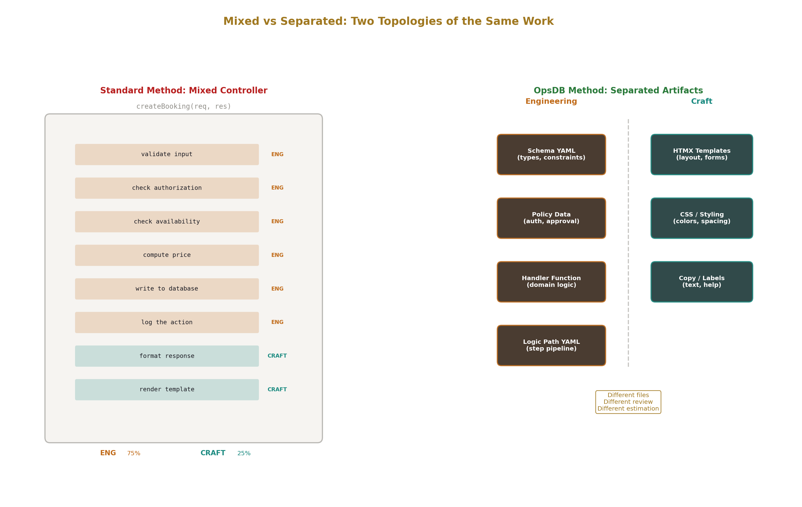
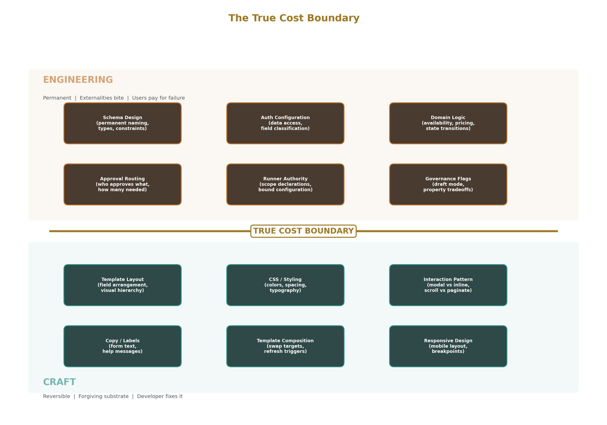
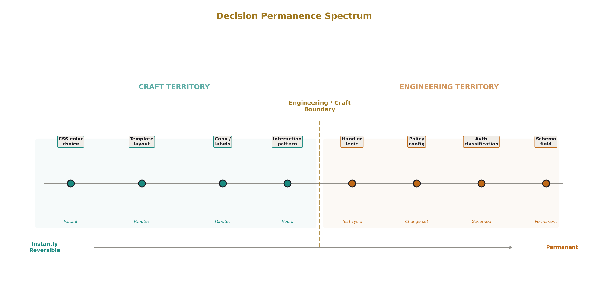
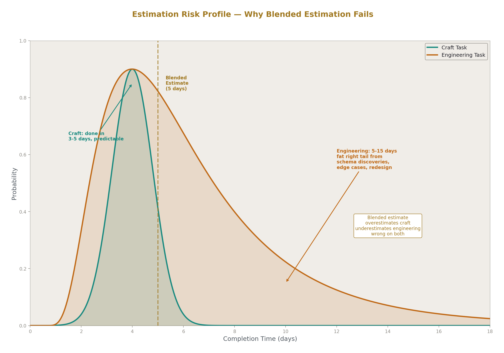
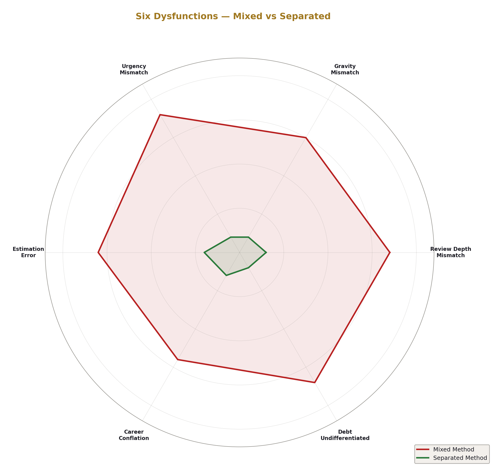
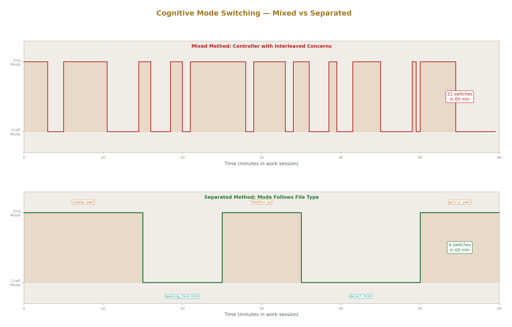
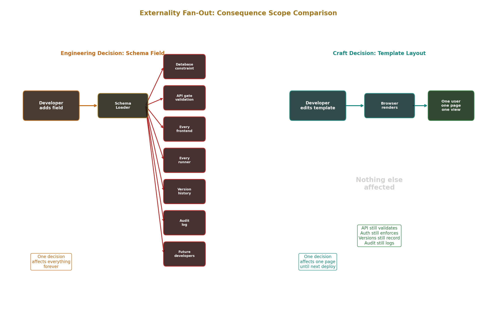
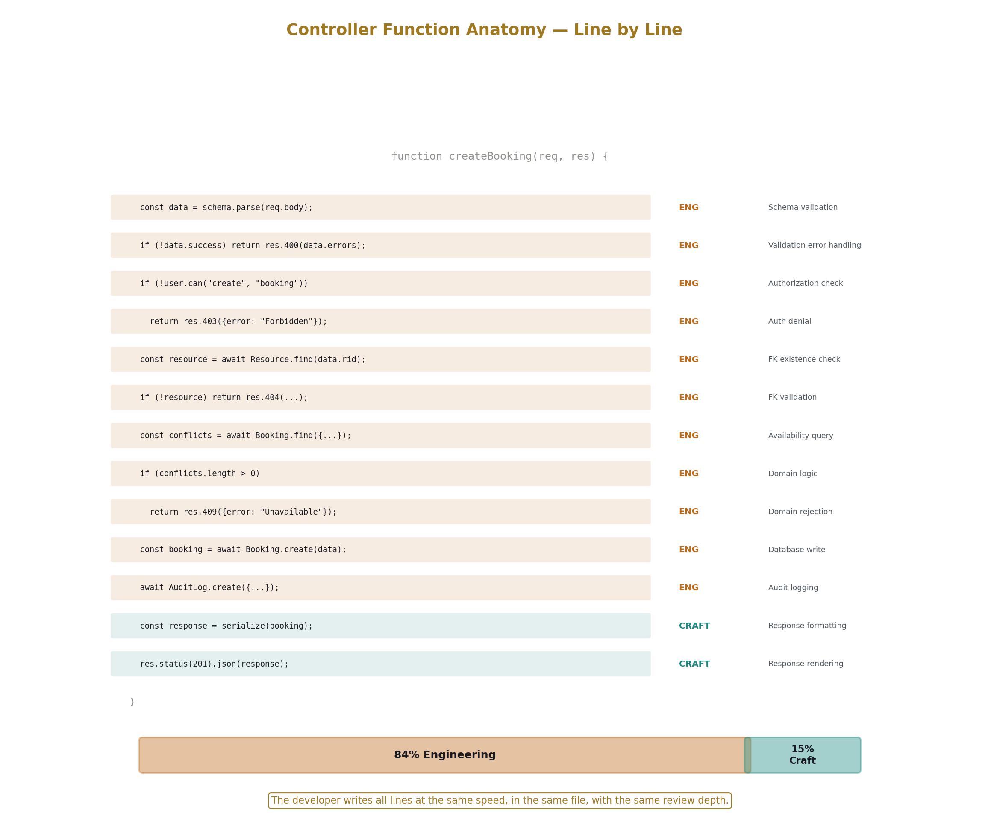

# Explicit Engineering and Craft Separation

## Always Knowing What You Are Doing in Software Development

---

## 1. Two Activities, One Job Title

Software development contains two structurally different activities performed by the same people, in the same sprints, under the same job title, evaluated by the same rubrics, estimated with the same story points.

The first activity is engineering. Evaluating trade-offs to find alignment of variables and constants that efficiently meet goals against externalities where failure has a True Cost — harm borne by goal-seekers and users when the system fails. The decisions are permanent or expensive to reverse. The substrate pushes back with real consequences. The people who pay for mistakes are not the people who made them.

The second activity is craft. Skilled execution against forgiving substrates where failure is reversible, consequences are bounded, and the same people who made the decision can fix it. The work requires skill, taste, experience, and judgment. It is valuable. It is not engineering. It is a different activity with different characteristics, different risk profiles, and different optimal processes.

Both activities are present in every software project. Both are necessary. Both require skill. They are not the same activity. The distinction matters because they require different quality of attention, different review depth, different estimation approaches, and different organizational treatment. When they are mixed — when the developer doesn't know which activity they're doing at any given moment, when the organization treats them identically — specific, identifiable dysfunctions result.

The standard development method mixes them in every file, every function, every pull request, every sprint. A Rails controller action that validates input, checks authorization, computes availability, writes to the database, logs the action, and formats the response contains engineering decisions and craft decisions interleaved in the same function body. The developer cannot slow down for the engineering and speed up for the craft because they're in the same code block. The reviewer cannot apply deep scrutiny to the engineering and light scrutiny to the craft because they're in the same diff. The estimation cannot treat the engineering conservatively and the craft normally because they're in the same story.

This paper names the distinction, shows its consequences, and describes what happens when the two activities are structurally separated into different artifacts that signal to the developer, the reviewer, and the organization which activity is in play.



---

## 2. How to Tell Which You Are Doing



Three diagnostic questions. Apply them to the task in front of you, not to your role or your title or your project.

**Is this decision permanent or reversible?** A schema that declares a field as an integer with min 1 and max 5 is permanent — the field cannot be deleted, renamed, or have its type changed. A template that renders that field as a number input with min and max attributes is reversible — change the template, the next response uses the new one. A policy row that routes changes to a specific approver group is durable but changeable through a governed change set. An authorization configuration that classifies a field as "restricted" is durable and consequential — wrong classification means unauthorized access or legitimate users blocked.

**Does the substrate push back with consequences beyond your own codebase?** A schema constraint enforced by the gate pipeline pushes back against every consumer of the API — every frontend, every runner, every integration, every future developer. A CSS rule pushes back against the browser's rendering engine, which is forgiving — wrong CSS shows wrong layout, not wrong data. A handler function that checks booking availability pushes back against real-world resources — a wrong check means two people in the same room at the same time.

**Does failure harm goal-seekers and users in ways they cannot fix themselves?** A schema mistake produces a deprecated tombstone field that every consumer must work around — the users of the API bear the cost and cannot fix the schema themselves. A template mistake produces an ugly page — the user is inconvenienced but the data is correct and the developer can fix the template in minutes. A domain logic error in an invoice calculator produces incorrect charges — the customer bears the cost and cannot correct their own invoice.

If all three answers are yes: engineering. Slow down. Think carefully. The decision matters and it persists.

If any answer is no: craft. Move at normal speed. Iterate based on feedback. The decision is fixable.

The gray zone exists inside handler functions. A function that formats data for display is craft. A function that decides what data to show based on business rules is engineering. A function that validates a booking request against availability is engineering. A function that renders the booking confirmation is craft. The line runs through the function at the point where decisions go from "how to present" to "what to allow." When both are present in the same function, the developer needs to know where the line is — which lines of code are permanent decisions with True Cost and which are reversible presentation choices.



---

## 3. What Happens When They Are Mixed

When engineering and craft occupy the same artifacts, the same review processes, the same estimation, and the same organizational treatment, six specific dysfunctions emerge. Each is predictable, identifiable, and structurally caused by the failure to distinguish the activities.

**Dysfunction 1: Engineering decisions get craft review depth.**

A pull request contains a schema change and a template change. The schema change adds an entity with twelve fields, three foreign keys, two governance flags, and a versioning configuration. This decision is permanent. The field names, types, constraints, and relationships will live in the schema forever. A naming mistake requires the six-step duplication pattern. A missing relationship requires a bridge table added later. A wrong type requires a new field alongside the old one and a migration runner.

The template change redesigns the task list page with new filter controls and a different column layout. This decision is reversible. If the layout doesn't work, change it tomorrow.

The reviewer spends equal time on both, or more time on the template because it's visual and they have opinions about column ordering. The schema YAML "looks fine" — the fields have reasonable names, the types seem right, the reviewer approves in three minutes. The template gets fifteen minutes of discussion about whether the status filter should be a dropdown or a radio group.

The permanent decision got three minutes. The reversible decision got fifteen. The review process treated both as the same activity because the artifacts didn't signal which was which.

**Dysfunction 2: Craft decisions get engineering gravity.**

The team spends two hours debating the color of a status badge. Green for active, red for inactive, or blue for active and gray for inactive. This is a craft decision. It is reversible. The substrate is forgiving — wrong color means the badge looks off, not that data is corrupted. There is no True Cost.

But because the team doesn't distinguish engineering from craft, every decision gets the same process. The meeting that should have been "pick one, we'll change it if users are confused" becomes a trade-off evaluation as if the decision were permanent and consequential. Engineering gravity applied to a craft decision. Two hours of five people's time spent on a decision that could be made in five minutes and reversed in five more.

**Dysfunction 3: Engineering decisions get craft urgency.**

"Just ship the schema, we'll fix it later." In craft, this is correct — ship the template, observe how users interact with it, iterate based on feedback. The fast-iteration-with-feedback loop is the optimal process for craft decisions because the decisions are reversible and the feedback is informative.

In engineering, this is wrong. The schema is permanent. "Fix it later" means the six-step duplication pattern: add a new field alongside the old one, begin writing to both, migrate readers, deprecate the old field, continue writing to both for a safety period, accept that the old field remains forever as a tombstone. "Fix it later" for a schema decision costs 10-50x more than getting it right now. But because the team doesn't distinguish the activities, the urgency appropriate for craft — "ship and iterate" — gets applied to engineering — "this decision is permanent, take the time to get it right."

**Dysfunction 4: Estimation is systematically wrong.**

A story contains three tasks: design the entity schema (engineering — needs careful thought about naming, relationships, and constraints against the externality that these decisions are permanent), write the handler function for domain logic (engineering — needs domain reasoning about availability rules and edge cases), and build the HTMX template for the booking form (craft — routine, bounded, reversible).

The team estimates the story at 5 points. They're averaging two different activities with different risk profiles into a single number. The engineering tasks take 3 days because schema design reveals a relationship that wasn't in the requirements and the domain logic has edge cases around timezone-adjusted blackout dates. The craft task takes half a day because the schema defines the fields and the template renders them mechanically.

The estimate was wrong not because the team is bad at estimating but because they estimated a blend of engineering and craft as if it were one activity. Engineering estimates should be conservative — permanent decisions with real consequences carry risk. Craft estimates should be normal — reversible decisions with forgiving substrates are predictable. Blending them produces estimates that are too aggressive for the engineering and too conservative for the craft.



**Dysfunction 5: Career development conflates different skills.**

A developer who produces beautiful templates, smooth interactions, and polished user experiences gets high visibility because their work is visible. The team demos the UI. Stakeholders see the UI. The developer's craft skill is evident in every meeting.

A developer who designs clean schemas with well-chosen names, complete constraints, correct relationships, and appropriate governance flags produces work that is invisible. Schema YAML doesn't demo well. Nobody shows a YAML file in a stakeholder meeting. The developer's engineering skill is evident only to the few people who review schema pull requests.

The organization promotes the first developer because their output is visible. The second developer's schema decisions — which will determine the application's structural quality for years — are treated as routine work that anyone could do. The organization optimized for visible craft skill when it needed invisible engineering skill.

The inverse also occurs. A developer who is excellent at schema design but produces functional-but-ugly templates gets tagged as "not detail-oriented" because their visible output lacks polish. Their engineering skill — the skill that produces permanent structural quality — is evaluated on the same rubric as their craft skill.

**Dysfunction 6: Technical debt is undifferentiated.**

"We have technical debt" could mean: our templates need cleanup (craft debt — cheap to fix, reversible, no True Cost), or our schema has five deprecated tombstone fields from early naming mistakes and our authorization model doesn't support the per-field access classification our enterprise customers require (engineering debt — expensive to fix, True Cost on users who can't access their data or see data they shouldn't).

Both get the same label in the backlog. Both compete for the same "tech debt sprint." The engineering debt is more important (True Cost on users), more expensive (months of retrofit), and more urgent (the gap widens with every new entity). The craft debt is less important (cosmetic), cheap (a few days of template cleanup), and stable (it doesn't compound). But they look the same in the issue tracker because the organization doesn't distinguish them.

The team addresses the craft debt first because it's easier and produces visible results. The engineering debt stays in the backlog, growing, compounding, waiting for the compliance audit or the data incident that forces the organization to address it at emergency pace.



---

## 4. What Separation Looks Like

When engineering and craft are structurally separated into different artifacts, different review processes, different estimation categories, and different organizational tracks, each dysfunction resolves.

The OpsDB method separates them by file type. Schema YAML files are where engineering decisions live — entity names, field types, constraints, relationships, governance flag configurations. These decisions are permanent, consequential, and deserve engineering-quality attention. HTMX templates are where craft decisions live — layout, styling, interaction patterns, visual hierarchy. These decisions are reversible, forgiving, and can be iterated quickly. Handler functions are where domain logic lives — engineering decisions about business rules, with any formatting or presentation being craft. Route manifests and logic paths are lightweight engineering — they declare the processing pipeline, and the composition decisions matter, but they're changeable through the governed pipeline.

The artifacts signal which activity is in play. The developer knows what they're doing because the file they're editing tells them.

**Review adapts.** Schema changes get deep review from the schema steward. The review checks naming convention compliance — singular names, lowercase underscore, hierarchical prefixes, FK naming, datetime suffix, boolean prefix. It checks constraint completeness — are the bounds reasonable, are the enum values comprehensive, are the foreign key targets correct. It checks governance configuration — is the access classification appropriate for each field, are the governance flags documented with their property tradeoffs, is the versioning configuration correct. The review takes as long as it takes because the decision is permanent.

Template changes get light review. Does it render correctly. Is the UX reasonable. Does it handle the API's error responses and change management states (auto-approved vs pending approval). Does it work on mobile. The review is fast because the decision is reversible and the stakes are cosmetic.

Handler function review splits by concern. The domain logic gets engineering review — does the availability check handle all edge cases, does the computation produce correct results, is the validation complete. Any presentation formatting gets craft review — does the response look right.

**Estimation adapts.** The team estimates schema stories and handler stories separately from template stories. Schema stories carry explicit risk acknowledgment — "this is a permanent decision, if we discover a missing relationship mid-implementation, the story expands." Template stories are estimated normally — "the schema defines the fields, the template renders them, the work is bounded."

The sprint plan shows the engineering-to-craft ratio explicitly. A sprint heavy on schema design and domain logic is an engineering sprint — expect careful thought, expect some stories to expand as design reveals complexity. A sprint heavy on template work and UI polish is a craft sprint — expect predictable velocity and visible output.

**Staffing adapts.** The developer who is excellent at domain modeling — careful with naming, thorough with constraints, precise with relationships, thoughtful about governance configuration — is assigned to schema design and handler implementation. The developer who is excellent at interaction design — smooth transitions, clear visual hierarchy, intuitive navigation, responsive layouts — is assigned to template implementation. Neither is better. They are doing different activities that require different skills.

Some developers are strong at both. They switch modes as they switch files. The structural separation supports this — the file change is the mode change signal.

**Career development adapts.** Engineering skill is evaluated on schema design quality, domain logic correctness, governance configuration appropriateness, and handler function robustness. Craft skill is evaluated on template quality, interaction design, visual polish, and user experience. Both tracks lead to seniority. They lead to different kinds of seniority because they are different activities.

A senior engineer in the engineering track designs schemas that future developers thank them for — clean names, complete constraints, correct relationships, well-documented governance decisions. A senior engineer in the craft track designs interfaces that users never notice — because the interaction is so smooth that the UI becomes invisible. Both are excellent. They're excellent at different things.

**Technical debt is differentiated.** Engineering debt — schema mistakes, missing authorization coverage, policy gaps, handler logic that doesn't handle edge cases — is tracked separately and prioritized higher. It has True Cost. It compounds. It gets worse with every new entity that builds on the flawed foundation. Craft debt — template inconsistencies, styling cleanup, UX improvements, accessibility gaps — is tracked separately and addressed during normal development. It's real work that matters for quality. It doesn't have True Cost. It doesn't compound structurally. It gets addressed when there's bandwidth, which is the correct priority for reversible decisions against forgiving substrates.

---

## 5. The Quality of Attention

The deepest benefit of separation is cognitive. The developer's attention calibrates to the activity.

Engineering requires a specific kind of thinking — focused, careful, consequence-aware. The developer designing a schema is thinking about permanence: will this name make sense in three years? Will this constraint be wide enough for future use cases but narrow enough to prevent invalid data? Will this relationship structure support the queries the application needs? Will this governance flag configuration provide the right balance between fluidity and governance for this table's role? Every question is evaluated against externalities that push back over long time horizons.

Craft requires a different kind of thinking — fluid, iterative, feedback-driven. The developer building a template is thinking about experience: does this layout communicate the information hierarchy? Does this interaction feel natural? Will the user understand what to do next? Is this accessible? Every question is evaluated against immediate user response and can be revised based on what the developer sees.

These are different cognitive modes. Engineering mode is deliberate, slow, and thorough. Craft mode is responsive, fast, and adaptive. Both are demanding. Both produce excellent work when the developer is in the right mode for the right activity.

When the activities are mixed in the same function, the same file, the same task, the developer is forced to context-switch between modes without a signal for when to switch. They're writing a controller action: the authorization check is engineering (wrong check means unauthorized access with True Cost on users), the next line is database write (engineering — wrong data means corrupt state), the next line is response formatting (craft — wrong format means the response looks odd). The developer either applies engineering attention to all three lines (slow, wasteful on the craft line) or craft attention to all three lines (fast, dangerous on the engineering lines). The modes don't blend well. The developer who is "in flow" writing code fast is in craft mode — and the engineering decisions in the same code block get craft-mode attention, which is insufficient.

When the artifacts separate the activities, the developer's mode switches with the artifact. Open a schema YAML file — shift to engineering mode. The file itself signals: these decisions are permanent, this is structure, slow down and think. Open an HTMX template — shift to craft mode. The file signals: this is presentation, this is reversible, iterate and refine. Open a handler function — the function is domain logic, engineering mode, but the function is short (150-300 lines with libraries handling infrastructure) so the mode is sustained for a small scope rather than interleaved with craft in a 500-line controller action.

Every experienced developer already does this intuitively. They slow down on database schema decisions and speed up on CSS tweaks. They think harder about authorization rules than about button styling. They agonize over API design and iterate quickly on form layout. The intuition is correct. The separation makes it structural, explicit, and shared across the team rather than individual, implicit, and inconsistent.



---

## 6. Engineering Decisions in the OpsDB Method

Each of these is a trade-off evaluation against externalities where failure has a True Cost. Each deserves engineering-quality attention.

**Schema design.** Which entities exist. What fields they have. What types and constraints apply. How entities relate through foreign keys. What naming conventions apply. Externality: the schema is permanent — additive-only evolution means every decision persists. True Cost: wrong entity names confuse every future developer. Wrong field types require the six-step duplication pattern. Missing relationships require bridge tables added later. Over-constrained fields reject valid data. Under-constrained fields admit invalid data. Each cost is borne by future developers and users, not by the developer making the decision today.

**Governance flag configuration.** Whether a table uses draft mode or full governance. Which of the three flags are set. Which properties are weakened by each flag. Whether the weakened properties are acceptable for the table's role in the application. Externality: draft mode on a table that should be fully governed means interim writes are not versioned or audited. True Cost: when an auditor asks "who changed this field on this date," the answer is "we don't know because draft mode was enabled and interim saves weren't logged." The gap in the audit trail is permanent and cannot be retroactively filled.

**Authorization configuration.** Role and group structure. Per-entity access scoping through `_requires_group`. Per-field classification through `_access_classification`. Policy rules for separation of duty, time-of-day restrictions, tenure-based access. Externality: authorization operates on every read and every write through the five-layer gate pipeline. True Cost: wrong authorization means unauthorized data access (users harmed by exposure of their data) or legitimate users blocked from their work (users harmed by inability to access data they need). Both costs are borne by users.

**Domain logic in handler functions.** The booking validator's availability computation. The invoice calculator's charge computation. The state machine's transition validation. The eligibility checker's rule evaluation. Externality: the real-world consequences of domain decisions — double bookings, incorrect charges, invalid state transitions, wrongful eligibility determinations. True Cost: users experience the wrong outcome. A customer is overcharged. Two patients are scheduled for the same slot. An application is approved that should have been rejected. The user cannot fix it themselves.

**Approval routing policy.** Which changes require human approval. From which groups. How many approvers. What triggers auto-approval. What constitutes an emergency. Externality: approval routing determines the governance applied to every change set. True Cost: too-loose routing means unapproved changes reach production — an untested configuration change causes an outage, affecting users. Too-tight routing means legitimate work is blocked — a critical fix waits for approval from someone who is unavailable, extending the outage, affecting users. Both directions have True Cost.

**Runner authority declarations.** Which entity types each runner can read. Which tables it can write to. Which external systems it can access. What bounds constrain its operation. Externality: the authority declarations are enforced by both the API gate and the library suite — two-sided enforcement on every runner operation. True Cost: an over-provisioned runner that can write to tables it shouldn't touch means a bug in the runner can corrupt data across entity types it was never intended to affect. The corruption is borne by users who trusted the system to protect their data.

Each of these decisions has the structure the engineering definition requires: trade-offs evaluated against externalities where failure has a True Cost borne by goal-seekers and users. Each deserves the review depth, the estimation conservatism, and the cognitive attention that engineering requires.



---

## 7. Craft Decisions in the OpsDB Method

Each of these is skilled work against a forgiving substrate where failure is reversible and consequences are bounded. Each is valuable. Each requires skill. Each is not engineering.

**HTMX template layout.** How fields are arranged on the form. What visual hierarchy presents the information. Whether related fields are grouped. How the list view organizes columns. Whether the detail view uses tabs or sections. Reversible: change the template, the next response uses it. Substrate: the browser renders HTML forgivingly — wrong layout shows misarranged content, not corrupt data. True Cost: none beyond user inconvenience, which the developer can fix in minutes.

**CSS and styling.** Colors, spacing, typography, responsive behavior, transitions, hover states, focus indicators. Reversible: change the stylesheet, the next page load uses it. Substrate: CSS is forgiving to the point of absurdity — invalid rules are ignored, not error-producing. True Cost: none.

**Copy and labels.** What the form labels say. What the help text explains. What the empty-state message communicates. What the success confirmation says. Reversible: change the text, the next render shows it. True Cost: poor copy confuses users but the data layer is unaffected. The user's data is still valid, authorized, versioned, and audited regardless of what the label says.

**Interaction patterns.** Whether a form uses inline editing or a modal. Whether a list uses infinite scroll or pagination buttons. Whether a status change uses a dropdown or a set of action buttons. Whether a filter panel is a sidebar or an expandable section. Reversible: change the pattern, the next visit uses it. True Cost: a suboptimal interaction pattern slows the user down but doesn't corrupt their data or bypass governance.

**Template composition.** Which HTMX fragments are swapped into which targets. How the page is divided into independently refreshable panels. What triggers a refresh — page load, timer, user action. Whether a panel polls for updates or waits for user action. Reversible: change the hx-trigger and hx-target attributes, the next interaction uses the new configuration. True Cost: a poorly composed page makes too many requests or refreshes too aggressively, but the API handles each request through the same gate pipeline regardless.

Every one of these requires skill. Good craft produces a user experience that feels effortless — the user focuses on their task, not on the interface. Poor craft produces friction — the user struggles with layout, is confused by labels, fights the interaction pattern. The difference between good craft and poor craft is significant for user satisfaction and productivity. It is not significant for data integrity, governance, or system correctness. The gate pipeline enforces governance regardless of template quality. The schema validates regardless of form layout. The audit trail records regardless of CSS.

---

## 8. The Organizational Implication

When engineering and craft are explicitly separated, the organization gains a tool for making better decisions about where to invest attention, time, and skill.

**Sprint planning uses the separation.** Engineering stories — schema design, policy configuration, domain logic — are planned with explicit risk acknowledgment. "This story involves schema decisions. Schema decisions are permanent. If we discover a missing relationship or a naming problem, the story expands. Estimate conservatively." Craft stories — template implementation, styling, interaction design — are planned at normal velocity. "This story is template work. The schema defines the fields. The template renders them. The work is bounded and reversible."

A sprint with 70% engineering stories will be slower and less predictable than a sprint with 70% craft stories. This is not a problem — it is accurate estimation based on the actual risk profile of the work. The organization that doesn't distinguish them will estimate both sprints the same way and be surprised when the engineering-heavy sprint takes longer.

**Review processes differentiate.** Engineering reviews are deep and slow. The schema steward examines naming, relationships, constraints, governance configuration, and property tradeoff documentation. The domain expert examines handler logic for correctness and edge case coverage. The review takes hours if necessary because the decisions are permanent.

Craft reviews are light and fast. The template renders correctly. The UX is reasonable. The interaction handles error states. The accessibility basics are covered. The review takes minutes because the decisions are reversible and the stakes are cosmetic.

**Hiring evaluates both skills explicitly.** The interview for schema design skill asks the candidate to design an entity model for a domain — what entities, what fields, what types, what constraints, what relationships, what governance configuration. The evaluation criteria are domain modeling quality, naming precision, constraint completeness, and ability to reason about permanent decisions.

The interview for craft skill asks the candidate to build a template for a given data model — what layout, what interaction patterns, what visual hierarchy, what responsive behavior. The evaluation criteria are user experience quality, interaction design taste, and ability to iterate quickly based on feedback.

These are different interviews testing different skills. Running both through a single "build a CRUD app" exercise evaluates neither well because the exercise mixes the activities.

**Technical debt is triaged by type.** Engineering debt is labeled as such: "this schema has a field that should have been an enum instead of a varchar — requires six-step duplication pattern to fix, estimated 2 weeks, affects data quality on every write." Craft debt is labeled as such: "this template's mobile layout is broken on small screens — estimated 2 hours, affects user experience on mobile." Both are in the backlog. The engineering debt gets priority because it has True Cost (invalid data entering the system on every write) and compounds (every new record with a freeform string where an enum should be is a data quality problem that grows). The craft debt gets addressed when there's bandwidth because it's a bounded problem with a cheap fix.

---

## 9. Why "Just Writing Code" Obscures This

The standard development method — controller-per-resource, mixed-concern functions, infrastructure interleaved with domain logic — makes it structurally impossible to know which activity you're doing.

A typical controller action in Rails or Express:

```
function createBooking(request, response):
    validate input          ← engineering (constraint decisions)
    check authorization     ← engineering (access control decisions)  
    check availability      ← engineering (domain logic)
    compute price           ← engineering (domain logic)
    write to database       ← engineering (data integrity)
    log the action          ← engineering (audit trail)
    format response         ← craft (presentation)
    render template         ← craft (presentation)
```

Six engineering steps and two craft steps in the same function. The developer writes all eight in sequence without shifting cognitive mode. The reviewer reviews all eight with the same depth. The estimation treats all eight as the same kind of work.

The "just write code" philosophy says: don't overthink it, write the function, ship it, iterate. This is correct advice for the craft steps — format the response, render the template, ship it, iterate based on user feedback. It is incorrect advice for the engineering steps — the validation constraints, the authorization decisions, the domain logic, the data integrity assumptions. Those are permanent or consequential decisions being made at craft speed because the code doesn't signal which is which.

The OpsDB method forces the separation by putting the engineering decisions in different files:

```
Schema YAML:        ← engineering (constraints, types, relationships)
Policy data:        ← engineering (authorization, approval routing)
Handler function:   ← engineering (domain logic only, 20-40 lines)
HTMX template:      ← craft (presentation, layout, interaction)
```

The developer's cognitive mode shifts with the file. The reviewer's depth shifts with the artifact. The estimation shifts with the story type. The separation is not a discipline the team must maintain through willpower. It is a structural property of the method that persists regardless of team discipline because the artifacts are physically different files with different formats serving different purposes.

The developer who opens a schema YAML file knows they are doing engineering. The file is YAML with field declarations and constraints. The decisions in this file are permanent. The developer slows down, thinks about naming, thinks about relationships, thinks about governance configuration. The developer who opens an HTMX template knows they are doing craft. The file is HTML with presentation attributes. The decisions in this file are reversible. The developer moves at normal speed, iterates, refines based on what they see in the browser.

The separation is always present, always visible, always signaling which activity is in play. The developer always knows what they are doing. The organization always knows what kind of work is being reviewed, estimated, and prioritized. The distinction between engineering and craft — which every experienced developer feels intuitively — is made structural, explicit, and shared.


