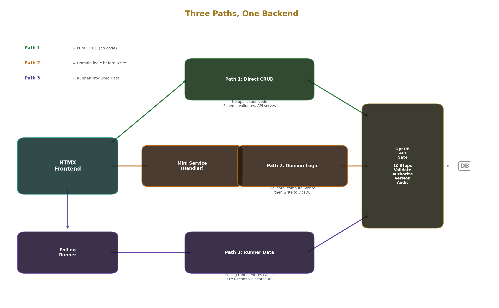
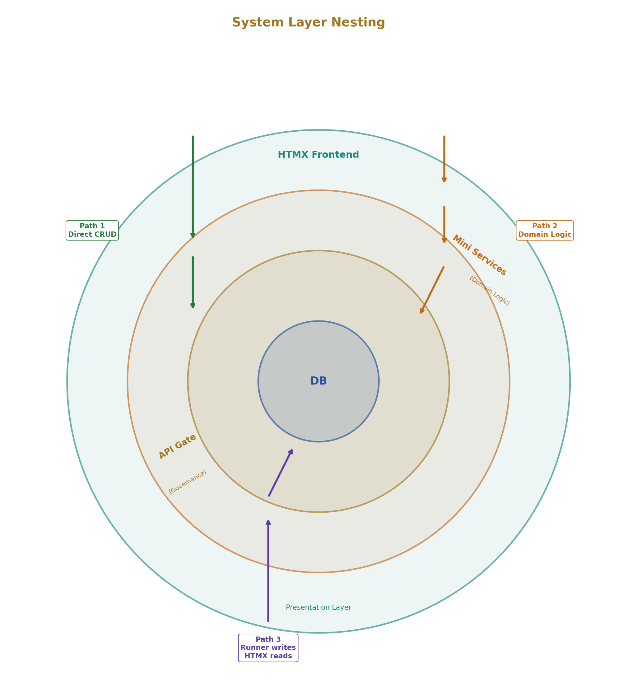
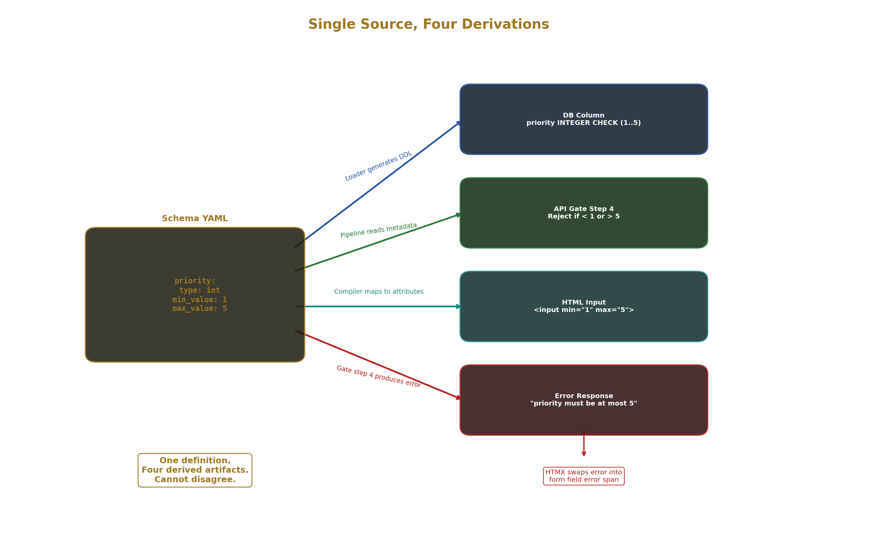
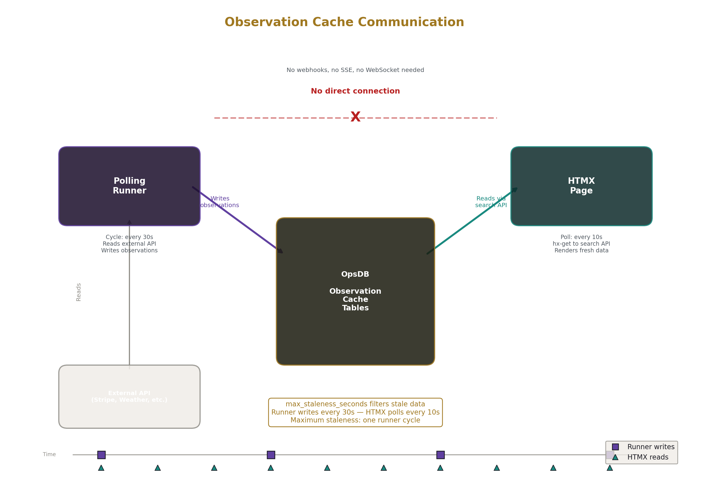
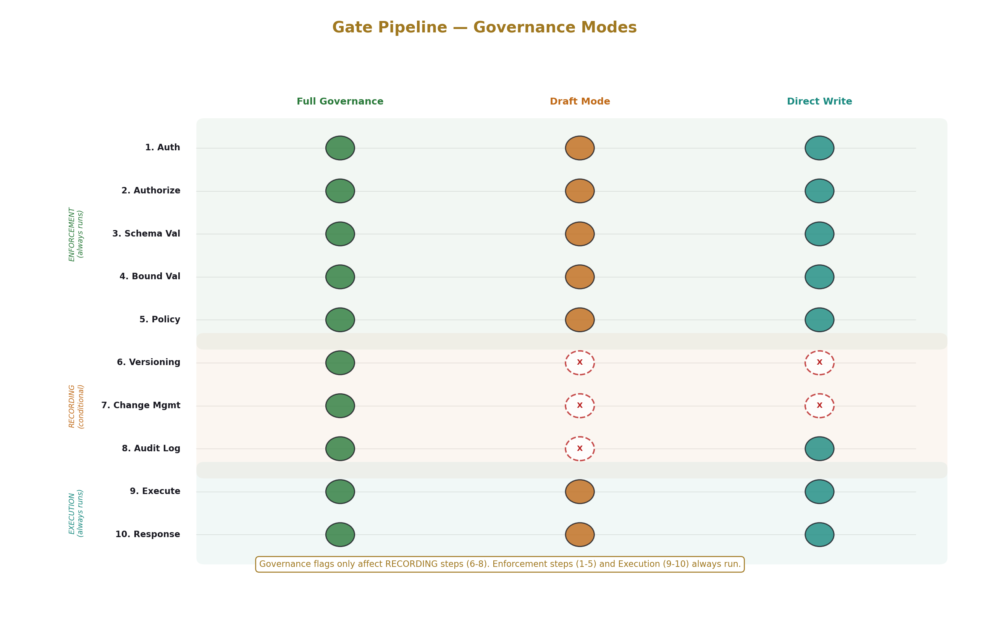
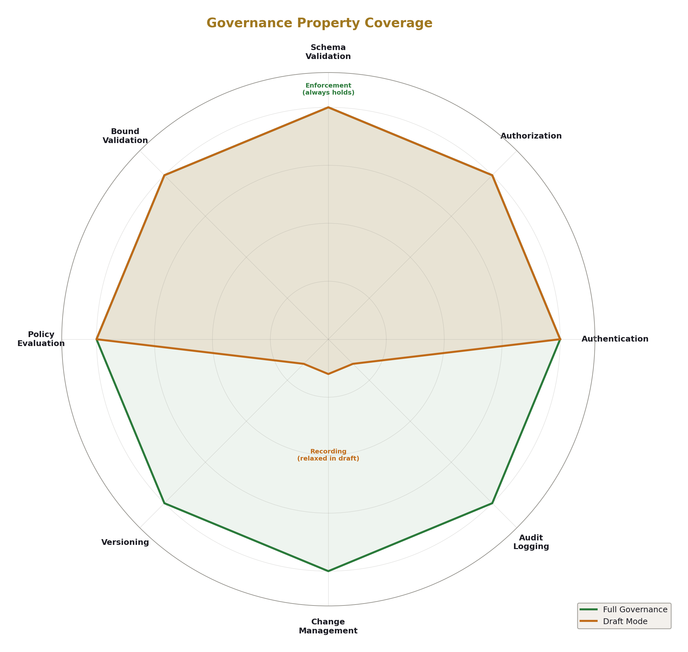
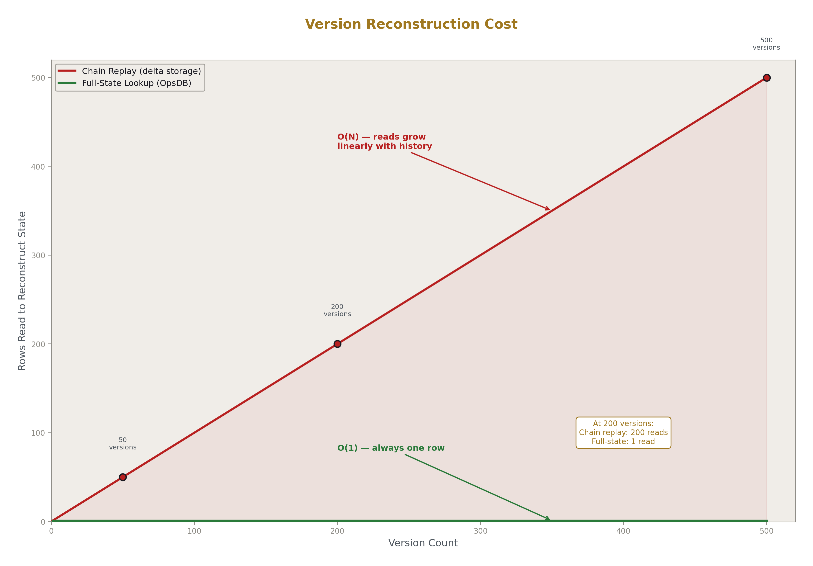
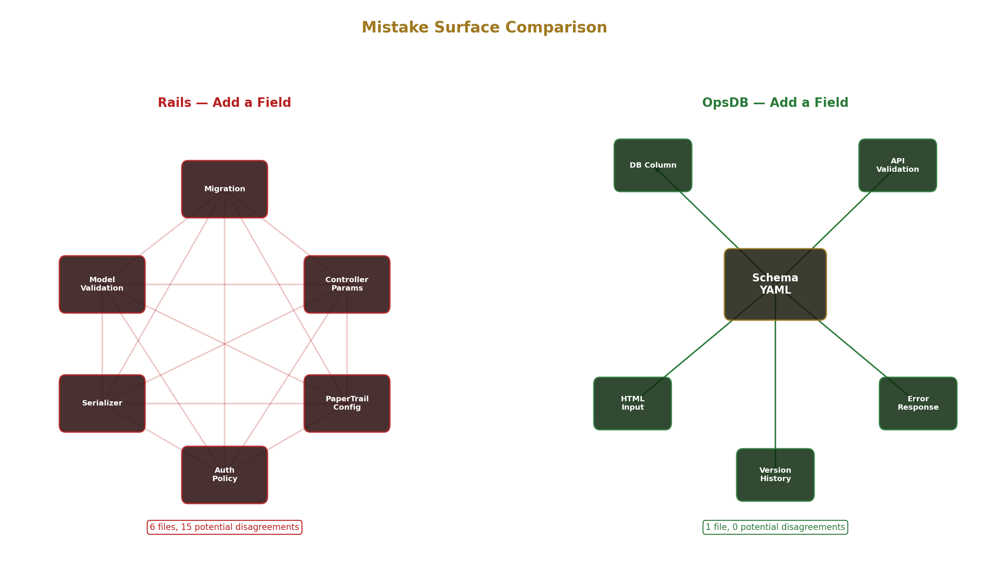

# Building Web Applications with HTMX and OpsDB

## A Development Method for Governed Web Applications

---

## 1. What This Is and Where It Stands

This document describes a method for building web applications. The frontend is HTMX — HTML pages that make HTTP requests and swap fragments. The backend is OpsDB — a governed data substrate that validates, authorizes, versions, and audits every interaction through a single API. Between them, where your application needs domain logic, thread runner mini services handle the computation and hand results to OpsDB for storage.

The method produces web applications where you write three things: schema YAML files defining your data model, handler functions containing your domain logic, and HTMX templates rendering your pages. Everything else — validation, authentication, authorization, versioning, change management, audit logging, search, pagination, concurrency control — is provided by the substrate.

**Current status.** The OpsDB substrate is fully specified. The specification covers the gate pipeline, the schema engine, the change management system, the versioning system, the audit log, the runner framework, and the shared library suite. A skeleton implementation exists with example code demonstrating each component. The system is not yet running. First implementation — building the working gate pipeline, the loader, and the API — makes the substrate viable for every application type and pattern described here. The HTMX framework layer described in this document is a design that builds on the substrate.

The design is complete. The engineering remaining is implementation, not research. This document teaches the method so developers can evaluate it now and build on it when the substrate reaches viability.

---

## 2. Three Paths, One Backend



Every endpoint in your application takes one of three paths. There is no fourth.

**Path 1: HTMX direct to OpsDB API.** The page makes an HTTP request to the OpsDB API. The API validates, authorizes, versions, and audits the operation. The response comes back. HTMX swaps the result into the page. No application code runs between the page and the API. Use this path when the request is pure CRUD — creating a task, editing a comment, listing projects, viewing a detail page. The schema defines the validation. The API enforces it. The page renders the result.

**Path 2: HTMX to thread runner mini service to OpsDB API.** The page makes an HTTP request to a mini service — a handler function running as a thread in your application server. The handler applies domain logic: checks availability across resource pools, computes invoice totals, validates business rules against external data, scores candidates. The handler produces a result. The framework writes that result to OpsDB through the API. The API validates, authorizes, versions, and audits. The response returns through the mini service to the page. HTMX swaps the result. Use this path when the request needs domain logic before the write — logic that the schema constraints cannot express.

**Path 3: HTMX reads runner-produced data from OpsDB API.** A polling runner — a separate background process on a cycle — reads from an external system (a payment processor, a weather API, a monitoring service) and writes observations to OpsDB through the API. The HTMX page reads those observations through the same search API it uses for everything else. Use this path when the data originates outside your application and arrives via background synchronization.

The decision framework:

| Question | Answer | Path |
|---|---|---|
| Does the request need domain logic before the write? | No | Path 1 — HTMX direct to API |
| Does the request need domain logic before the write? | Yes | Path 2 — HTMX to mini service to API |
| Does the data come from a background process or external source? | Yes | Path 3 — HTMX reads from API |

Every endpoint is one of these three. When designing an endpoint, ask the question. The answer determines what you write and what you skip.



---

## 3. The Schema Is Your Data Model

Your data model is a set of YAML files. One file per entity type. Each file declares the entity's fields with types, constraints, and relationships. A loader reads the files, generates database tables, and populates metadata that the API reads at runtime. After the loader runs, the API serves your entities.

Here is a project management application with four entities.

**project.yaml:**

```yaml
name: project
fields:
  name:
    type: varchar
    max_length: 255
  description:
    type: text
    nullable: true
  status:
    type: enum
    enum_values: [planning, active, paused, completed, archived]
    default: planning
  start_date:
    type: date
    nullable: true
  target_end_date:
    type: date
    nullable: true
governance:
  _requires_group:
    type: foreign_key
    references: ops_group
    nullable: true
versioned: true
soft_delete: true
```

**task.yaml:**

```yaml
name: task
fields:
  title:
    type: varchar
    max_length: 500
  description:
    type: text
    nullable: true
  status:
    type: enum
    enum_values: [backlog, todo, in_progress, review, done, cancelled]
    default: backlog
  priority:
    type: int
    min_value: 1
    max_value: 5
  due_date:
    type: date
    nullable: true
  project_id:
    type: foreign_key
    references: project
versioned: true
soft_delete: true
```

**task_assignment.yaml:**

```yaml
name: task_assignment
fields:
  task_id:
    type: foreign_key
    references: task
  user_id:
    type: foreign_key
    references: ops_user
  role:
    type: enum
    enum_values: [assignee, reviewer, observer]
    default: assignee
  assigned_date:
    type: date
versioned: true
```

**comment.yaml:**

```yaml
name: comment
fields:
  body:
    type: text
  task_id:
    type: foreign_key
    references: task
  parent_comment_id:
    type: foreign_key
    references: comment
    nullable: true
versioned: true
soft_delete: true
```

Run the loader. It validates every file — field types must be from the nine allowed types (int, float, varchar, text, boolean, datetime, date, json, enum, foreign_key), foreign key references must point to entities that exist, constraints must be consistent. If validation passes, the loader generates database tables and populates schema metadata tables.

The API now serves these entities. Create a task:

```
POST /api/task
{
  "title": "Design landing page",
  "status": "todo",
  "priority": 3,
  "project_id": 1
}
```

The API runs the request through a ten-step pipeline. Step 1 authenticates the caller. Step 2 checks authorization — does the caller have permission to create tasks in this project? Step 3 checks schema validation — does the `title` field exist? Is it a string? Step 4 checks bound validation — is `priority` between 1 and 5? Is `project_id` a real project? Step 5 evaluates any policy rules. Steps 6-7 handle versioning and change management. Step 8 writes an audit log entry. Step 9 executes the database insert. Step 10 returns the result.

If the request is valid, the response includes the created entity with its auto-generated `id`, `created_time`, and `updated_time`. If the request is invalid, the response identifies the exact step that failed, the field that caused it, and the constraint that was violated:

```json
{
  "error": "bound_validation_failed",
  "step": 4,
  "field": "priority",
  "constraint": "max_value",
  "limit": 5,
  "submitted": 8,
  "message": "priority must be at most 5"
}
```

You defined four YAML files. You now have a validated, authorized, versioned, audited API for projects, tasks, assignments, and comments. You wrote no controllers, no middleware, no migration files, no model classes, no serializers.

The schema is the single definition. The API validates against it. HTMX forms are generated from it. There is no second definition that could disagree.



---

## 4. HTMX Direct to API — Pure CRUD

For entities where no domain logic is needed before the write, the HTMX page talks directly to the OpsDB API. The HTML is derived from the schema. Field types map to input types. Constraints map to HTML attributes. The API's structured errors map back to form fields through HTMX swap targets.

**A task list page:**

```html
<div id="task-list">
  <form hx-get="/api/task/search" hx-target="#task-results" hx-trigger="submit">
    <select name="filter_status">
      <option value="">All</option>
      <option value="backlog">Backlog</option>
      <option value="todo">To Do</option>
      <option value="in_progress">In Progress</option>
      <option value="review">Review</option>
      <option value="done">Done</option>
    </select>

    <select name="filter_priority_gte">
      <option value="">Any Priority</option>
      <option value="1">1+</option>
      <option value="3">3+</option>
      <option value="5">5 only</option>
    </select>

    <button type="submit">Filter</button>
  </form>

  <div id="task-results">
    <!-- search results swapped here -->
  </div>

  <button hx-get="/api/task/search?cursor=${next_cursor}"
          hx-target="#task-results"
          hx-swap="innerHTML">
    Next Page
  </button>
</div>
```

The filter controls are derived from the schema. The `status` field is an enum — it becomes a select with options from `enum_values`. The `priority` field is an int with min 1 and max 5 — it becomes a range filter. The search API handles the predicate composition, the access control filtering, and the cursor pagination.

**A task edit form:**

```html
<form hx-put="/api/task/42"
      hx-target="#task-detail"
      hx-swap="innerHTML">

  <label for="title">Title</label>
  <input type="text" name="title" value="Design landing page"
         maxlength="500" required>
  <span id="error-title" class="error"></span>

  <label for="status">Status</label>
  <select name="status" required>
    <option value="backlog">Backlog</option>
    <option value="todo" selected>To Do</option>
    <option value="in_progress">In Progress</option>
    <option value="review">Review</option>
    <option value="done">Done</option>
    <option value="cancelled">Cancelled</option>
  </select>
  <span id="error-status" class="error"></span>

  <label for="priority">Priority</label>
  <input type="number" name="priority" value="3"
         min="1" max="5" required>
  <span id="error-priority" class="error"></span>

  <label for="due_date">Due Date</label>
  <input type="date" name="due_date" value="2026-06-15">
  <span id="error-due_date" class="error"></span>

  <button type="submit">Save</button>
</form>
```

The `maxlength="500"` on the title input comes from the schema's `max_length: 500`. The `min="1" max="5"` on the priority input comes from `min_value: 1, max_value: 5`. The select options come from `enum_values`. These are client-side hints for user experience — the API validates authoritatively regardless of what the HTML attributes say.

When the form submits, the API either accepts the write and returns the updated entity, or rejects it with a structured error. The HTMX response handling swaps the error into the correct field's error span:

```html
<!-- returned by API on validation failure, swapped into the form -->
<span id="error-priority" class="error">
  priority must be at most 5
</span>
```

**What happens with access control.** If the caller lacks permission to see a field — because the field has an `_access_classification` higher than the caller's clearance — the API omits the field from responses. The HTMX page never receives the field. There is no hidden HTML element with sensitive data that CSS hides. The data never reaches the browser. The page renders what the API returns, and the API returns only what the caller can see.

**What happens with change management.** Some writes return immediately — the change was auto-approved per policy and applied. Some writes return a pending status — the change requires human approval. The HTMX page handles both cases:

```html
<!-- returned by API when change is auto-approved and applied -->
<div id="task-detail">
  <h2>Design landing page</h2>
  <p>Status: In Progress</p>
  <p>Updated just now</p>
</div>

<!-- returned by API when change requires approval -->
<div id="task-detail">
  <h2>Design landing page</h2>
  <p>Status: To Do (change to In Progress pending approval)</p>
  <p>Awaiting approval from: Project Lead</p>
  <div hx-get="/api/change_set/417/status"
       hx-trigger="every 5s"
       hx-target="#approval-status">
    <span id="approval-status">Pending</span>
  </div>
</div>
```

The page doesn't decide which path to take. The API decides based on policy data. The page renders whichever response the API returns. If the policy changes — an entity type moves from auto-approve to approval-required — the page adapts without modification because it renders the API response, not a hardcoded workflow.

For pure CRUD endpoints, the developer writes: the schema YAML (which they already wrote), the HTMX templates (which can be generated from schema metadata), and nothing else. No controller. No validation code. No authorization check. No audit logging. No versioning logic.

---

## 5. Thread Runner Mini Services — Your Application Logic

When an endpoint needs domain logic before the write, the request goes through a thread runner mini service. The mini service is a handler function — not a controller, not a service class, not an endpoint. A function that receives the request context and returns a result.

A booking system needs availability checking. The schema can enforce that a booking has valid dates, a valid resource reference, and a valid customer reference. The schema cannot enforce that the requested time slot is available across resource pools with blackout dates and timezone adjustments. That is domain logic. It belongs in a handler function.

**The handler function:**

```python
def booking_validator(context):
    """
    Receives: context.request_data (the booking request fields)
              context.user (the authenticated caller)
              context.prior_results (results from earlier steps)

    Returns: accept(data) or reject(reasons)
    """
    booking = context.request_data
    resource_id = booking["resource_id"]
    start_time = booking["start_time"]
    end_time = booking["end_time"]

    # Read current bookings for this resource from OpsDB
    existing = context.api.search("booking", filters={
        "resource_id": resource_id,
        "status__in": ["confirmed", "pending"],
        "start_time__lt": end_time,
        "end_time__gt": start_time
    })

    if existing.count > 0:
        return reject([{
            "field": "start_time",
            "reason": "Resource is already booked for this time period"
        }])

    # Check blackout dates
    blackouts = context.api.search("blackout_date", filters={
        "resource_id": resource_id,
        "blackout_date__gte": start_time.date(),
        "blackout_date__lte": end_time.date()
    })

    if blackouts.count > 0:
        return reject([{
            "field": "start_time",
            "reason": "Requested dates include blackout periods",
            "detail": [b["blackout_date"] for b in blackouts.rows]
        }])

    return accept(booking)
```

This function is 30 lines. It receives validated, authenticated request data — the framework already confirmed the caller is who they claim to be and the data matches the schema. The function applies domain reasoning: is the slot available? Are there blackout conflicts? It returns accept or reject with structured reasons.

The function does not handle HTTP parsing. It does not check authentication. It does not validate field types or constraints. It does not write to the database. It does not log anything. It does not manage transactions. It makes a domain decision. Everything else is handled by the framework and the OpsDB API.

**Mini services vs polling runners.** Thread runner mini services and polling runners are different things with different jobs. Mini services are synchronous — they handle a request and return a response. They are latency-sensitive. They contain your application's request-path logic. Polling runners are asynchronous — they run on a cycle, read current state, and act on it. They are throughput-oriented. They contain your application's background logic. Both write through the same API. Both are governed by the same pipeline. But they serve different purposes.

A mini service that processes a booking request runs when the user clicks "Book." A polling runner that syncs payment status from Stripe runs every 30 seconds regardless of user activity. Same domain, different operational profiles, different homes.

---

## 6. Logic Paths — Composing Steps in YAML

Each custom endpoint is declared as a logic path — an ordered sequence of steps in YAML. The framework executes the steps in order. Each step's output is available to subsequent steps. First failure halts the pipeline.

**The step vocabulary is closed.** Seven step types. No plugins, no middleware chains, no custom step types.

`validate_schema` — runs the request data against OpsDB schema constraints as a fast-fail before hitting the API. Client-side pre-validation for user experience. The API validates again authoritatively.

`validate_custom` — calls a handler function for domain validation. The function receives the request context and returns accept or reject. This is where your application logic lives.

`verify_external` — calls an external service through the library suite for verification. Payment preauthorization, identity verification, address validation. The library suite handles authentication, retry, and circuit breaking. The step declaration specifies the service and the failure behavior.

`compute` — calls a handler function that transforms or enriches the data. The pricing calculator. The invoice totals computer. The scoring algorithm. Takes validated input and produces the data to write.

`write` — writes to OpsDB through the API. The ten-step gate pipeline runs. This is where data enters the governed substrate.

`query` — reads from OpsDB after the write. Fetches freshly written data joined with related entities for the response.

`notify` — dispatches notifications asynchronously. Uses the notification library with channel configuration from OpsDB data.

`return` — selects the HTMX template and passes the data from prior steps. The template renders the HTML fragment that HTMX swaps into the page.

**A booking request flow:**

```yaml
logic_paths:

  booking_request_flow:
    steps:
      - step: validate_schema
        source: opsdb_schema

      - step: validate_custom
        handler: booking_validator

      - step: verify_external
        handler: payment_preauth
        service: stripe
        on_failure: reject

      - step: compute
        handler: booking_finalizer

      - step: write
        target: opsdb
        operation: change_set

      - step: query
        source: opsdb
        query: booking_with_resource_and_customer

      - step: notify
        handler: booking_confirmation_notifier
        async: true

      - step: return
        template: booking/confirmation
```

Read this YAML and you know exactly what happens when a user submits a booking request. The data is checked against the schema. The booking validator checks availability and blackout dates. Stripe preauthorizes the payment. The booking finalizer computes the final price and confirmation code. The result is written to OpsDB as a change set. The freshly written booking is queried back with its resource and customer details joined. A confirmation notification is dispatched asynchronously. The confirmation page is rendered.

A simpler flow for task assignment:

```yaml
  task_assignment_flow:
    steps:
      - step: validate_schema
        source: opsdb_schema

      - step: validate_custom
        handler: assignment_validator

      - step: write
        target: opsdb
        operation: change_set

      - step: notify
        handler: assignment_notifier
        async: true

      - step: return
        template: task/detail
```

Five steps instead of eight. No external verification, no computation step, no post-write query. Simple flows have fewer steps.

**The route manifest ties paths to URLs:**

```yaml
app:
  name: booking_system
  opsdb: booking_appdb
  schema_ref: ./schema/

routes:
  - path: /resources
    entity: resource
    crud: true
    views: [list, detail, edit, create]

  - path: /customers
    entity: customer
    crud: true
    views: [list, detail, edit, create]

  - path: /bookings
    entity: booking
    crud: true
    views: [list, detail]

  - path: /bookings/request
    method: POST
    logic_path: booking_request_flow
    template: booking/request_form

  - path: /tasks/{id}/assign
    method: POST
    logic_path: task_assignment_flow
```

CRUD routes generate pages from schema metadata. Custom routes point to logic paths. Every endpoint in the application is visible in this file.

---

## 7. Reading Runner-Produced Data

Polling runners run on cycles. A payment status runner queries Stripe every 30 seconds and writes the current status of each pending payment to OpsDB observation cache tables. A weather runner queries a forecast API every hour and writes conditions to observation cache. A metrics runner pulls system health data and writes summaries.

HTMX pages read this data through the same search API used for everything else.

**A payment status display on an invoice page:**

```html
<div hx-get="/api/observation_cache_payment/search?booking_id=42&max_staleness_seconds=60"
     hx-trigger="load, every 10s"
     hx-target="#payment-status">
  <div id="payment-status">
    Loading payment status...
  </div>
</div>
```

This div loads payment status on page load and refreshes every 10 seconds. The `max_staleness_seconds=60` parameter tells the search API to filter out observations older than 60 seconds — if the payment runner hasn't written in the last minute, the response indicates stale data rather than showing outdated status.

**Weather alongside garden notes:**

```html
<div class="garden-journal">
  <div class="planting-notes">
    <div hx-get="/api/planting_note/search?plot_id=7&order=-created_time"
         hx-trigger="load"
         hx-target="#notes-list">
      <div id="notes-list">Loading notes...</div>
    </div>
  </div>

  <div class="weather-panel">
    <div hx-get="/api/observation_cache_weather/search?location_id=1&max_staleness_seconds=3600"
         hx-trigger="load"
         hx-target="#weather-data">
      <div id="weather-data">Loading weather...</div>
    </div>
  </div>
</div>
```

The planting notes are governed entities written by users through the API. The weather data is observation cache written by a polling runner. Both are read through the same search API. Both are rendered by HTMX swapping HTML fragments. The page doesn't know or care which path produced the data.

**The communication model.** Runners and HTMX pages never talk to each other directly. Runners write to OpsDB. HTMX pages read from OpsDB. OpsDB is the communication channel. There are no webhooks from runners to pages, no server-sent events, no WebSocket connections for most application patterns. The polling runner writes on its cycle. The HTMX page reads on its refresh interval. The data meets in OpsDB.

For most application read patterns — showing payment status, displaying weather, rendering dashboards with aggregated metrics, showing sync status from external systems — this model is simpler than real-time push. The HTMX `hx-trigger="every Ns"` provides the refresh. The observation cache provides the data. The freshness annotation provides staleness detection.



---

## 8. What the Substrate Handles



When you define an entity in the schema and run the loader, that entity immediately has all of the following. You do not build any of it.

**Schema validation.** Every write is checked against the declared field types and constraints. An integer field rejects strings. A varchar field rejects values exceeding its max_length. An enum field rejects values not in its declared set. A foreign key field rejects references to entities that don't exist. Every field, every write, every time.

**Five-layer authorization.** Layer 1: role and group membership — which operations the caller can perform on which entity types. Layer 2: per-entity governance — the `_requires_group` field scopes access to specific groups per row. Layer 3: per-field classification — `_access_classification` controls which fields the caller can see based on their clearance level. Fields the caller cannot see are omitted from API responses entirely. Layer 4: per-runner authority — automated writers are restricted to their declared scope. Layer 5: policy rules — separation of duty, time-of-day restrictions, custom constraints. All five layers compose via AND. First denial halts.

**Full version history.** Every write to a versioned entity creates a version row containing the complete entity state — all fields, not just the ones that changed. Reconstructing the state at any point in time is a single row lookup, not a chain replay. "What did this look like last Tuesday at 3pm" is one API call.

**Change management.** Writes to governed entities are expressed as change sets — bundles of proposed field changes with a stated reason. Change sets route to approvers based on policy data. Low-stakes changes auto-approve per policy — the change set is created, validated, and applied within the same request. The user experiences it as immediate. High-stakes changes route to human approvers. Both paths produce the same audit trail. Changing who approves what means changing policy data, not deploying code.

**Append-only audit logging.** Every API operation — read, write, approve, reject, search — produces an audit log entry recording the caller identity, the operation, the target entity, the outcome, and contextual metadata. The audit log table has no UPDATE or DELETE permission for any database role. Entries are written and never modified. The audit log is queryable through the same search API.

**Optimistic concurrency control.** When two people edit the same entity, the second submission detects that the entity has changed since they loaded it and rejects with a stale version error. Silent overwrites are prevented. The submitter reconciles and resubmits.

**Search API.** Filter predicates (equality, comparison, set membership, pattern matching, null checks, range), composable with AND/OR/NOT. Named join paths for traversing relationships. Projection for controlling which fields are returned. Cursor-based pagination. Freshness annotations for cached data. All bounded — maximum result size, maximum join depth, maximum query time — configurable per role.

**Retention policies.** Configurable per entity type as policy data. A reaper runner enforces them. Version history, observation cache, and audit entries have independently configurable retention.

**Draft mode.** Three per-table governance flags relax the recording properties for interactive editing. Authentication, authorization, and validation always run. Versioning, change management, and audit logging for interim saves can be skipped. Explicit version commits restore full governance. A document table can have draft mode for fluid editing while a budget table has full governance for every keystroke.

These exist on every entity from the moment you define it in the schema. You don't add them later. You don't build them. The first entity you define has all of them.





---

## 9. The App Compiler

The app compiler reads your YAML files and produces a running application. It validates everything before runtime.

**Input files:**

- Schema YAML — your entity definitions (read by the OpsDB loader)
- Route manifest YAML — your endpoint declarations
- Logic path YAML — your step sequences for custom endpoints
- Handler registrations — your domain logic functions mapped to handler names

**What the compiler validates:**

Every entity referenced in a route exists in the schema. Every handler referenced in a logic path is registered. Every query step references valid entity types and field names from the schema. Every external service referenced in verify_external steps has a configured connector in the library suite. Every logic path ends with a return step. Every CRUD route references an entity with the views it declares.

If anything doesn't resolve, the compiler rejects with a structured error before runtime:

```
ERROR: Route /bookings/request references logic_path 'booking_request_flow'
       Step 2 (validate_custom) references handler 'booking_validator'
       No handler registered with name 'booking_validator'
       
       Registered handlers: assignment_validator, invoice_finalizer
```

You don't discover at runtime that a route is misconfigured.

**What the compiler produces:**

The route table mapping every URL path to its handler — either a generated CRUD handler or a step pipeline executor.

HTMX templates for CRUD entities — generated from schema metadata. List views with filter controls, detail views, edit forms, create forms. All field types mapped to input types. All constraints mapped to HTML attributes.

The step pipeline runtime — the engine that executes logic path steps in order, threads context through, calls handlers, calls the OpsDB API, calls external services through the library suite, and renders HTMX templates for responses.

**Deployment by artifact type:**

Schema changes deploy through the OpsDB schema executor — a specialized runner that applies approved DDL changes atomically. Additive only. New entities and new fields don't require downtime.

Route and logic path changes deploy through the compiler — rebuild and restart the application server. These are YAML file changes, not code changes.

Handler code deploys as binary updates — rebuild the application with the updated handler functions and restart.

Policy changes — approval rules, access control configuration, retention policies — deploy as change sets through the OpsDB API. They take effect when the change set is approved and applied. No rebuild, no restart. Changing who approves what, who can access what, or how long data is retained is a data change, not a deployment.

---

## 10. Walkthrough — Build a Booking System

This section builds a complete application from zero. Every file, every decision, every step.

The application is a resource booking system. Users browse resources, manage their customer profile, request bookings with availability checking and payment preauthorization, and view booking status including payment state synced from Stripe.

### 10.1 Schema

Four governed entities and one observation cache entity.

**schema/resource.yaml:**

```yaml
name: resource
fields:
  name:
    type: varchar
    max_length: 255
  description:
    type: text
    nullable: true
  resource_type:
    type: enum
    enum_values: [room, equipment, vehicle, space]
  hourly_rate:
    type: float
    min_value: 0
    precision_decimal_places: 2
  is_bookable:
    type: boolean
    default: true
  location:
    type: varchar
    max_length: 500
    nullable: true
versioned: true
soft_delete: true
```

**schema/customer.yaml:**

```yaml
name: customer
fields:
  name:
    type: varchar
    max_length: 255
  email:
    type: varchar
    max_length: 255
    must_be_unique: true
  phone:
    type: varchar
    max_length: 50
    nullable: true
  stripe_customer_id:
    type: varchar
    max_length: 255
    nullable: true
governance:
  _access_classification:
    fields:
      stripe_customer_id: restricted
      email: internal
      phone: internal
versioned: true
soft_delete: true
```

The `stripe_customer_id` field is classified `restricted` — only users with sufficient clearance see it. The `email` and `phone` fields are classified `internal` — not visible to public-role users. The API enforces this. The HTMX page never receives the fields the caller can't see.

**schema/booking.yaml:**

```yaml
name: booking
fields:
  resource_id:
    type: foreign_key
    references: resource
  customer_id:
    type: foreign_key
    references: customer
  start_time:
    type: datetime
  end_time:
    type: datetime
  status:
    type: enum
    enum_values: [pending, confirmed, cancelled, completed, no_show]
    default: pending
  total_price:
    type: float
    min_value: 0
    precision_decimal_places: 2
  confirmation_code:
    type: varchar
    max_length: 20
    nullable: true
    must_be_unique: true
  notes:
    type: text
    nullable: true
versioned: true
soft_delete: true
```

**schema/blackout_date.yaml:**

```yaml
name: blackout_date
fields:
  resource_id:
    type: foreign_key
    references: resource
  blackout_date:
    type: date
  reason:
    type: varchar
    max_length: 255
    nullable: true
versioned: true
```

**schema/observation_cache_payment.yaml:**

```yaml
name: observation_cache_payment
fields:
  booking_id:
    type: foreign_key
    references: booking
  stripe_payment_intent_id:
    type: varchar
    max_length: 255
  payment_status:
    type: enum
    enum_values: [pending, processing, succeeded, failed, refunded]
  amount_cents:
    type: int
    min_value: 0
  failure_reason:
    type: varchar
    max_length: 500
    nullable: true
  _observed_time:
    type: datetime
```

This is observation cache — written by the payment status polling runner, not by users. The `_observed_time` field enables freshness filtering.

Run the loader. Five entities are now served by the API.

### 10.2 Routes and Logic Paths

**app/manifest.yaml:**

```yaml
app:
  name: booking_system
  opsdb: booking_appdb
  schema_ref: ./schema/

routes:
  # Path 1: CRUD direct to API
  - path: /resources
    entity: resource
    crud: true
    views: [list, detail]

  - path: /resources/admin
    entity: resource
    crud: true
    views: [list, detail, edit, create]

  - path: /customers
    entity: customer
    crud: true
    views: [list, detail, edit, create]

  - path: /bookings
    entity: booking
    crud: true
    views: [list, detail]

  # Path 2: Custom logic through mini service
  - path: /bookings/request
    method: POST
    logic_path: booking_request_flow
    template: booking/request_form

  - path: /bookings/{id}/cancel
    method: POST
    logic_path: booking_cancellation_flow

  # Path 3: Runner-produced data read through API
  # (No route declaration needed — the HTMX templates
  # query observation_cache_payment directly through
  # the search API using hx-get)
```

Path 3 doesn't need route declarations because the HTMX templates read observation cache directly from the API. The route manifest only declares endpoints that the application server handles.

**app/logic_paths.yaml:**

```yaml
logic_paths:

  booking_request_flow:
    steps:
      - step: validate_schema
        source: opsdb_schema

      - step: validate_custom
        handler: booking_validator

      - step: verify_external
        handler: payment_preauth
        service: stripe
        on_failure: reject

      - step: compute
        handler: booking_finalizer

      - step: write
        target: opsdb
        operation: change_set

      - step: query
        source: opsdb
        query: booking_with_resource_and_customer

      - step: notify
        handler: booking_confirmation_notifier
        async: true

      - step: return
        template: booking/confirmation

  booking_cancellation_flow:
    steps:
      - step: validate_custom
        handler: cancellation_validator

      - step: verify_external
        handler: payment_refund
        service: stripe
        on_failure: reject

      - step: compute
        handler: cancellation_finalizer

      - step: write
        target: opsdb
        operation: change_set

      - step: query
        source: opsdb
        query: booking_with_resource_and_customer

      - step: notify
        handler: cancellation_notifier
        async: true

      - step: return
        template: booking/cancelled
```

### 10.3 Handler Functions

**handlers/booking_validator.py:**

```python
def booking_validator(context):
    booking = context.request_data
    resource_id = booking["resource_id"]
    start_time = booking["start_time"]
    end_time = booking["end_time"]

    # Validate time ordering
    if end_time <= start_time:
        return reject([{
            "field": "end_time",
            "reason": "End time must be after start time"
        }])

    # Check resource is bookable
    resource = context.api.get_entity("resource", resource_id)
    if not resource["is_bookable"]:
        return reject([{
            "field": "resource_id",
            "reason": "This resource is not currently available for booking"
        }])

    # Check for overlapping bookings
    overlapping = context.api.search("booking", filters={
        "resource_id": resource_id,
        "status__in": ["pending", "confirmed"],
        "start_time__lt": end_time,
        "end_time__gt": start_time
    })

    if overlapping.count > 0:
        return reject([{
            "field": "start_time",
            "reason": "Resource is already booked for this time period"
        }])

    # Check blackout dates
    blackouts = context.api.search("blackout_date", filters={
        "resource_id": resource_id,
        "blackout_date__gte": start_time.date(),
        "blackout_date__lte": end_time.date()
    })

    if blackouts.count > 0:
        return reject([{
            "field": "start_time",
            "reason": "Requested dates include blackout periods"
        }])

    # Pass resource forward for price computation
    return accept(booking, extra={"resource": resource})
```

**handlers/payment_preauth.py:**

```python
def payment_preauth(context):
    booking = context.request_data
    resource = context.prior_results["resource"]
    customer = context.api.get_entity("customer", booking["customer_id"])

    hours = (booking["end_time"] - booking["start_time"]).total_seconds() / 3600
    amount_cents = int(resource["hourly_rate"] * hours * 100)

    if not customer.get("stripe_customer_id"):
        return reject([{
            "field": "customer_id",
            "reason": "Customer has no payment method on file"
        }])

    result = context.stripe.payment_intents.create(
        amount=amount_cents,
        currency="usd",
        customer=customer["stripe_customer_id"],
        capture_method="manual"
    )

    if result.status != "requires_capture":
        return reject([{
            "field": "customer_id",
            "reason": "Payment preauthorization failed"
        }])

    return accept(booking, extra={
        "payment_intent_id": result.id,
        "amount_cents": amount_cents
    })
```

**handlers/booking_finalizer.py:**

```python
import secrets
import string

def booking_finalizer(context):
    booking = context.request_data
    resource = context.prior_results["resource"]
    amount_cents = context.prior_results["amount_cents"]

    code = ''.join(secrets.choice(string.ascii_uppercase + string.digits) for _ in range(8))

    hours = (booking["end_time"] - booking["start_time"]).total_seconds() / 3600

    return accept({
        **booking,
        "total_price": round(resource["hourly_rate"] * hours, 2),
        "confirmation_code": code,
        "status": "confirmed"
    })
```

Each handler is short. Each does one thing. The booking validator checks domain rules — 35 lines. The payment preauth calls Stripe through the library suite — 20 lines. The booking finalizer computes the final price and generates a confirmation code — 10 lines. The total application logic for the booking request flow is 65 lines across three functions.

### 10.4 Polling Runner

The payment status runner syncs from Stripe on a 30-second cycle.

**runners/payment_status_puller.py:**

```python
class PaymentStatusPuller(Runner):
    kind = "puller"
    cycle_seconds = 30
    targets = ["observation_cache_payment"]

    def get(self):
        # Read all bookings with pending/confirmed status
        self.bookings = self.api.search("booking", filters={
            "status__in": ["pending", "confirmed"]
        })

    def act(self):
        self.results = []
        for booking in self.bookings.rows:
            # Find the payment intent for this booking
            existing = self.api.search("observation_cache_payment", filters={
                "booking_id": booking["id"]
            })

            if existing.count == 0:
                continue

            payment = existing.rows[0]
            intent = self.stripe.payment_intents.retrieve(
                payment["stripe_payment_intent_id"]
            )

            self.results.append({
                "booking_id": booking["id"],
                "stripe_payment_intent_id": intent.id,
                "payment_status": self._map_status(intent.status),
                "amount_cents": intent.amount,
                "failure_reason": intent.last_payment_error.message
                    if intent.last_payment_error else None
            })

    def set(self):
        for result in self.results:
            self.api.write_observation(
                "observation_cache_payment",
                result,
                uniqueness_key=["booking_id"]
            )

    def _map_status(self, stripe_status):
        mapping = {
            "requires_payment_method": "pending",
            "requires_confirmation": "pending",
            "requires_action": "processing",
            "processing": "processing",
            "succeeded": "succeeded",
            "canceled": "failed",
        }
        return mapping.get(stripe_status, "pending")
```

The runner follows the three-phase pattern. Get: read bookings that need payment tracking. Act: query Stripe for current payment status through the library suite. Set: write observations to OpsDB through the API. The `uniqueness_key` ensures each booking has one observation row that gets updated each cycle rather than accumulating duplicates.

The library suite handles Stripe authentication, retry on transient failures, and circuit breaking if Stripe is down. The runner handles the domain logic: which bookings to check, how to map Stripe statuses to application statuses.

### 10.5 HTMX Pages

**templates/booking/request_form.html:**

```html
<div id="booking-form-container">
  <h2>Request a Booking</h2>

  <form hx-post="/bookings/request"
        hx-target="#booking-form-container"
        hx-swap="innerHTML">

    <label for="resource_id">Resource</label>
    <select name="resource_id" required
            hx-get="/api/resource/search?is_bookable=true"
            hx-trigger="load"
            hx-target="#resource-options">
      <option value="">Select a resource...</option>
      <span id="resource-options"></span>
    </select>
    <span id="error-resource_id" class="error"></span>

    <label for="customer_id">Customer</label>
    <select name="customer_id" required
            hx-get="/api/customer/search?order=name"
            hx-trigger="load"
            hx-target="#customer-options">
      <option value="">Select a customer...</option>
      <span id="customer-options"></span>
    </select>
    <span id="error-customer_id" class="error"></span>

    <label for="start_time">Start Time</label>
    <input type="datetime-local" name="start_time" required>
    <span id="error-start_time" class="error"></span>

    <label for="end_time">End Time</label>
    <input type="datetime-local" name="end_time" required>
    <span id="error-end_time" class="error"></span>

    <label for="notes">Notes</label>
    <textarea name="notes" maxlength="65535"></textarea>

    <button type="submit">Request Booking</button>
  </form>
</div>
```

The resource select populates itself on page load by querying the search API for bookable resources. The customer select does the same. Both are HTMX requests — no JavaScript needed to populate dropdowns from the API.

**templates/booking/confirmation.html:**

```html
<div id="booking-form-container">
  <h2>Booking Confirmed</h2>

  <div class="confirmation-details">
    <p><strong>Confirmation Code:</strong> ${booking.confirmation_code}</p>
    <p><strong>Resource:</strong> ${resource.name}</p>
    <p><strong>Time:</strong> ${booking.start_time} — ${booking.end_time}</p>
    <p><strong>Total:</strong> $${booking.total_price}</p>
    <p><strong>Status:</strong> ${booking.status}</p>
  </div>

  <div class="payment-status"
       hx-get="/api/observation_cache_payment/search?booking_id=${booking.id}&max_staleness_seconds=60"
       hx-trigger="load, every 10s"
       hx-target="#payment-info">
    <div id="payment-info">
      Checking payment status...
    </div>
  </div>

  <a hx-get="/bookings/${booking.id}"
     hx-target="#main-content">View Booking Details</a>
</div>
```

The confirmation page shows the booking details from the query step's response and starts polling payment status from the observation cache. The payment status div refreshes every 10 seconds. The polling runner writes the current Stripe status every 30 seconds. The page picks it up on its next refresh cycle.

**templates/booking/detail.html:**

```html
<div id="booking-detail">
  <h2>Booking ${booking.confirmation_code}</h2>

  <div class="booking-info">
    <p><strong>Resource:</strong> ${resource.name} (${resource.resource_type})</p>
    <p><strong>Customer:</strong> ${customer.name}</p>
    <p><strong>Time:</strong> ${booking.start_time} — ${booking.end_time}</p>
    <p><strong>Total:</strong> $${booking.total_price}</p>
    <p><strong>Status:</strong> ${booking.status}</p>
  </div>

  <div class="payment-status"
       hx-get="/api/observation_cache_payment/search?booking_id=${booking.id}&max_staleness_seconds=60"
       hx-trigger="load, every 10s"
       hx-target="#payment-info">
    <div id="payment-info">Loading payment status...</div>
  </div>

  <div class="booking-history">
    <h3>History</h3>
    <div hx-get="/api/booking/${booking.id}/history"
         hx-trigger="load"
         hx-target="#history-list">
      <div id="history-list">Loading history...</div>
    </div>
  </div>

  <div class="booking-actions">
    <button hx-post="/bookings/${booking.id}/cancel"
            hx-target="#booking-detail"
            hx-confirm="Cancel this booking?">
      Cancel Booking
    </button>
  </div>
</div>
```

The detail page shows booking info, live payment status from observation cache, version history from the OpsDB versioning system, and a cancel action that goes through the cancellation logic path. Three paths in one page: governed entity data (path 1 read), runner-produced observation cache (path 3), and a custom action (path 2).

### 10.6 What the Developer Wrote

Total files:

- 5 schema YAML files (entities)
- 1 route manifest YAML file
- 1 logic paths YAML file
- 4 handler functions (~100 lines total)
- 1 polling runner (~50 lines)
- 4 HTMX templates (plus generated CRUD templates)

Total application code: roughly 150 lines of domain logic across handlers and the runner, plus YAML declarations and HTML templates.

What the developer did not write: authentication, authorization, input validation beyond domain rules, API endpoints, database migrations, model classes, serializers, audit logging, version history management, change management workflows, concurrency control, search and pagination infrastructure, retry logic for external APIs, background job infrastructure, notification dispatch infrastructure.

### 10.7 Testing the Application

**Schema tests.** Submit valid and invalid data through the API. Create a booking with end_time before start_time — the booking_validator rejects it. Create a booking with priority outside the declared range — the gate pipeline rejects it at step 4. Create a booking referencing a nonexistent resource — the gate pipeline rejects it at step 4. Each rejection returns a structured error identifying the field and constraint.

**Handler tests.** Call each handler function with test context. Call booking_validator with an overlapping booking in the database — it returns reject. Call it with a clear time slot — it returns accept. Call payment_preauth with a customer missing a Stripe ID — it returns reject. Each handler is a function. Test it like a function.

**Integration tests.** Submit a full booking request through the logic path. Verify the booking entity was created in OpsDB. Verify the version row exists with the correct field values. Verify the audit log entry records the operation, the caller, and the outcome. Verify the payment observation cache row was written by the runner on its next cycle. Each verification is a search API call.

**What you don't test.** You don't test that the gate pipeline validates field types — the platform tests that. You don't test that authorization filters search results — the platform tests that. You don't test that version rows contain full state — the platform tests that. You test your domain logic and your declarations.

---

## 11. What This Method Changes About How You Work

**Sprint planning.** Infrastructure stories disappear. There is no "add authentication" story, no "build validation layer" story, no "implement audit logging" story. The remaining categories are schema stories (small, measured in hours, but permanent — invest grooming time in getting names and relationships right), handler stories (conventional code, your domain logic), runner stories (small programs using the library suite), and frontend stories (HTMX templates, unchanged from normal frontend work).

**Estimation.** What was an 8-point story in conventional development — an entity with CRUD endpoints, validation, authorization, tests — is a 1-2 point story. A YAML file, a loader run, and verification through the API. Custom logic paths are larger but bounded — the handler functions are the work, and they're 20-50 lines each.

**Testing.** The gate pipeline is the test runner for validation and authorization. You verify your declarations by submitting data through the API and checking accept/reject responses. You test your handler functions as functions. You don't write tests for infrastructure concerns.

**Debugging.** Every problem follows the same investigation path. What happened? Query the audit log. What changed? Query the version history. What did the runner see? Query the observation cache. What was the state at the time? Call get_entity_at_time. Every step is a search API call through the same interface your application uses.

**Schema decisions are permanent.** Fields cannot be deleted, renamed, or have their types changed. This is intentional — it means version history, audit logs, and every consumer that references a field by name never break. The cost is that mistakes in naming or typing require the six-step duplication pattern to correct: add a new field alongside the old one, migrate writers and readers, deprecate the old field. The old field remains forever. Invest the grooming time to get schema design right. Runner code is replaceable. Schema decisions are not.

**The YAML is the documentation.** Read the route manifest — you see every endpoint. Read a logic path — you see every step a request passes through. Read the schema — you see every entity, field, and constraint. A new developer reads three YAML files and understands the application's structure without reading implementation code. The implementation code is just the handler functions — the domain logic — which is the only part that requires domain expertise to understand.



---

## 12. Current Status and Path to Viability

The OpsDB substrate is fully specified. The specification covers:

- The ten-step gate pipeline with authentication, five-layer authorization, schema validation, bound validation, policy evaluation, versioning preparation, change management routing, audit logging, execution, and response construction.
- The schema engine with nine types, three modifiers, closed constraint vocabulary, and the loader that generates database structure from YAML files.
- The change management system with change set lifecycle, approval routing from policy data, auto-approval, emergency path, and bulk operations.
- The versioning system with full-state version rows and point-in-time reconstruction.
- The append-only audit log with optional cryptographic chaining.
- The runner framework with ten runner kinds, three-phase pattern, three disciplines, gating modes, and authority declarations.
- The shared library suite with OpsDB API client, external service connectors, retry and resilience, notification dispatch, and scope enforcement.

Skeleton implementation exists with example code for each component. The specification includes concrete schema examples, API interaction examples, runner examples, and logic path examples.

The system is not yet running. The work remaining is first implementation:

**Phase 1: Core substrate.** Build the working schema loader, the gate pipeline, and the API. After this phase, developers can define schema YAML, run the loader, and interact with governed entities through the API. Schema validation, authorization, versioning, and audit logging are operational.

**Phase 2: Runner framework.** Build the runner execution environment, the shared library suite, and the standard runner kinds. After this phase, polling runners, reconcilers, and verifiers operate against the substrate.

**Phase 3: HTMX framework layer.** Build the app compiler, the route manifest processor, the logic path step pipeline, the handler registration system, and the HTMX template generator. After this phase, the full development method described in this document is operational.

Phase 1 is the critical path. The gate pipeline is the substrate — everything else builds on it. Phase 2 enables background processing. Phase 3 enables the web application development method. Each phase produces a usable system. Phase 1 alone is sufficient for API-only applications. Phase 1 plus 2 is sufficient for API-plus-automation applications. All three phases produce the full HTMX web application method.

The design is complete. The implementation is engineering — bounded, estimable, and sequential. Each phase has a clear deliverable and a clear test: does the gate pipeline accept valid writes and reject invalid ones? Do runners execute on cycle and write through the API? Does the compiler produce a working application from YAML files and handler functions?

---

## Summary

The method has three layers. HTMX pages handle presentation — HTML with attributes that make HTTP requests and swap fragments. Thread runner mini services handle domain logic — handler functions that receive validated, authenticated request data and return accept/reject or transformed data. OpsDB handles governance — validation, authorization, versioning, change management, and audit on every operation through a single API.

Every endpoint takes one of three paths. Pure CRUD goes direct from HTMX to the OpsDB API with no application code. Custom logic goes through a mini service composed as a step pipeline declared in YAML. Runner-produced data is read from OpsDB observation cache through the same search API.

You write schema YAML, handler functions, logic path YAML, and HTMX templates. The substrate handles everything between the frontend and the database. The compiler validates everything resolves before runtime. The gate pipeline enforces governance on every operation without application code.

The schema is the single definition of your data model. The route manifest is the single definition of your application's endpoints. The logic paths are the single definition of your request processing flows. Each definition exists in one place. There is no second definition that could disagree.

---

# YAreGNI Addendum: The Velocity Comparison

## Why Planning and Alignment Produce Faster Delivery Than "Just Writing Code"

**Companion paper:** [htmx_app_dev_method.md](htmx_app_dev_method.md) (Building Web Applications with HTMX and OpsDB)

---

## 1. The Velocity Illusion

Writing a Rails controller or an Express route handler feels fast. The feedback loop is immediate: write the handler, hit the endpoint, see the response. The developer is productive. Lines of code accumulate. Features appear to ship.

Measure what those lines actually contain. A booking creation endpoint in Express:

```javascript
router.post('/bookings', authenticate, async (req, res) => {
  try {
    // Parse and validate input
    const validated = bookingSchema.parse(req.body);
    
    // Check authorization
    if (!req.user.hasPermission('create', 'booking')) {
      return res.status(403).json({ error: 'Forbidden' });
    }
    
    // Check resource exists
    const resource = await Resource.findById(validated.resource_id);
    if (!resource) {
      return res.status(404).json({ error: 'Resource not found' });
    }
    
    // Check availability (domain logic)
    const conflicts = await Booking.find({
      resource_id: validated.resource_id,
      status: { $in: ['pending', 'confirmed'] },
      start_time: { $lt: validated.end_time },
      end_time: { $gt: validated.start_time }
    });
    if (conflicts.length > 0) {
      return res.status(409).json({ error: 'Time slot unavailable' });
    }
    
    // Create booking
    const booking = await Booking.create(validated);
    
    // Audit log (if you remembered to add it)
    await AuditLog.create({
      action: 'create',
      entity: 'booking',
      entity_id: booking.id,
      user_id: req.user.id,
      timestamp: new Date()
    });
    
    // Format response
    res.status(201).json(serializeBooking(booking));
  } catch (err) {
    if (err instanceof ZodError) {
      return res.status(400).json({ errors: err.errors });
    }
    res.status(500).json({ error: 'Internal server error' });
  }
});
```

Count the lines by concern:

- Input parsing and validation: 1 line (Zod), but Zod schema is defined elsewhere — another 15-20 lines
- Authorization check: 3 lines
- Foreign key existence check: 3 lines
- Domain logic (availability check): 8 lines
- Database write: 1 line
- Audit logging: 6 lines
- Response serialization: 1 line (serializer defined elsewhere — another 10-15 lines)
- Error handling: 7 lines

Domain logic: 8 lines. Infrastructure: everything else. The ratio is roughly 25% domain, 75% infrastructure. Three quarters of the code the developer wrote is infrastructure they wouldn't write with a governed substrate.

The same booking creation in the OpsDB+HTMX method. The infrastructure — validation, authorization, FK existence, audit logging, versioning, error response formatting — is the gate pipeline. The developer writes:

```python
def booking_validator(context):
    conflicts = context.api.search("booking", filters={
        "resource_id": context.request_data["resource_id"],
        "status__in": ["pending", "confirmed"],
        "start_time__lt": context.request_data["end_time"],
        "end_time__gt": context.request_data["start_time"]
    })
    if conflicts.count > 0:
        return reject([{"field": "start_time",
                        "reason": "Time slot unavailable"}])
    return accept(context.request_data)
```

Eight lines. All domain logic. The infrastructure is handled by the gate pipeline and the logic path step sequence. The developer wrote 8 lines instead of 35+ lines (plus the Zod schema, plus the serializer, plus the audit log table design, plus the authentication middleware configuration).

The velocity illusion: the Express developer feels productive writing 35 lines. The OpsDB developer writes 8 lines and feels like they didn't do much. The Express developer shipped more code. The OpsDB developer shipped more application.

---

## 2. Building a Booking System — Side by Side

The same application built three ways. A booking system with resources, customers, bookings, blackout dates, availability checking, and payment integration. Track every artifact created.

### 2.1 Entity Definition

**Rails (per entity: resource, booking, customer, blackout_date):**

| Artifact | Files | Lines (approx) |
|----------|-------|-----------------|
| Migration | 4 | 80 |
| Model with validations | 4 | 120 |
| Controller with CRUD | 4 | 280 |
| Serializer | 4 | 60 |
| Routes | 1 | 12 |
| Model tests | 4 | 160 |
| Controller tests | 4 | 240 |
| **Total** | **25** | **~950** |

**Express/Next (per entity):**

| Artifact | Files | Lines (approx) |
|----------|-------|-----------------|
| Prisma schema | 1 | 60 |
| Migration (generated) | 4 | 80 |
| Zod validation schemas | 4 | 100 |
| Route handlers | 4 | 320 |
| Middleware (auth per route) | 4 | 60 |
| Type definitions | 4 | 80 |
| Tests | 4 | 200 |
| **Total** | **25** | **~900** |

**OpsDB+HTMX:**

| Artifact | Files | Lines (approx) |
|----------|-------|-----------------|
| Schema YAML | 4 | 80 |
| Route manifest | 1 | 15 |
| **Total** | **5** | **~95** |

The CRUD endpoints, validation, authorization, versioning, audit logging, serialization, error handling, and pagination are provided by the gate pipeline and the compiler's CRUD generation. The 5 YAML files replace 25 files. The 95 lines replace 900-950 lines. Every entity has full governance from the moment the loader runs.

### 2.2 Validation

**Rails:** Model validations in Ruby — `validates :priority, inclusion: { in: 1..5 }`. Separate from the migration's database constraints. Separate from the controller's strong parameters. Three places defining the same constraint, maintained independently.

**Express:** Zod schemas — `z.number().min(1).max(5)`. Separate from the Prisma schema's database constraints. Separate from the route handler's input parsing. Three places.

**OpsDB:** `min_value: 1, max_value: 5` in the YAML field declaration. One place. The database constraint, the API validation, and the HTMX form attribute (`min="1" max="5"`) are derived from it.

### 2.3 Authorization

**Rails:** Install Pundit. Write a policy class per model. Call `authorize` in each controller action. Miss one action and that endpoint has no authorization. The gap is a security hole discovered during a security review or, worse, an incident.

**Express:** Write authorization middleware. Apply it per route. Miss one route and that endpoint is unprotected. The same gap.

**OpsDB:** Five authorization layers active on every operation from the first entity definition. No per-endpoint wiring. No gaps. The developer configures roles, groups, and per-entity governance through data — not through code applied per endpoint.

### 2.4 Audit Logging

**Rails:** Install PaperTrail. Configure it per model — `has_paper_trail` in each model class. Wire `PaperTrail.request.whodunnit = current_user.id` in the application controller. Forget it in a background job context and the version entry has null attribution. Forget to add `has_paper_trail` to a new model and that model has no audit trail.

**Express:** Build custom audit middleware. Design the audit table. Write the middleware that captures request data, response data, caller identity, and outcome. Apply it per route. Maintain it as routes change. Accept that some code paths (admin scripts, data migrations, REPL sessions) bypass it.

**OpsDB:** Gate step 8. Every operation. Every entity. Attribution from the authenticated identity. No configuration per model. No middleware to apply per route. No code paths that bypass it.

### 2.5 Domain Logic (Availability Checking)

**Rails:** Write a service class or model method that queries for conflicting bookings. Approximately 15-25 lines of Ruby.

**Express:** Write a function that queries for conflicting bookings. Approximately 15-25 lines of JavaScript.

**OpsDB:** Write a handler function that queries for conflicting bookings. Approximately 10-15 lines of Python/Go.

This is roughly equivalent across all three. The domain logic is the same work regardless of substrate. The difference is that in Rails and Express, this domain logic is embedded in a controller alongside 30+ lines of infrastructure code. In OpsDB, the handler function contains only the domain logic.

### 2.6 Payment Integration

**Rails:** Write a service class that calls the Stripe API. Handle authentication, retry, error handling, and response parsing. Approximately 40-60 lines, or use the Stripe gem and write 20-30 lines.

**Express:** Same pattern with the Stripe npm package. 20-30 lines.

**OpsDB:** Write a handler function that calls Stripe through the library suite. The library handles authentication, retry, circuit breaking, and correlation ID propagation. The handler is 15-20 lines of domain logic — which payment method, what amount, what to do on success/failure.

The difference is modest for the initial implementation. It compounds over time because the library suite handles retry and circuit breaking consistently across all external integrations, while the Rails/Express approach handles them per-integration with different strategies, different error handling, and different logging.

### 2.7 Total Comparison at Launch

| Concern | Rails | Express | OpsDB+HTMX |
|---------|-------|---------|-------------|
| Entity definition | 25 files, ~950 lines | 25 files, ~900 lines | 5 files, ~95 lines |
| Validation | In models + migrations | In Zod + Prisma | In YAML (done) |
| Authorization | Pundit policies per model | Middleware per route | Five layers (done) |
| Audit logging | PaperTrail + config | Custom middleware | Gate step 8 (done) |
| Version history | PaperTrail (partial) | Not built yet | versioned: true (done) |
| Change management | Not built | Not built | Change sets (done) |
| Domain logic | ~50 lines | ~50 lines | ~50 lines |
| Payment integration | ~30 lines | ~30 lines | ~20 lines |
| CRUD UI | Views + forms (manual) | Components (manual) | Generated from schema |
| **Total files** | **~35** | **~35** | **~10** |
| **Total lines** | **~1200** | **~1100** | **~250** |
| **Governance gaps** | Version partial, no change mgmt | No versions, no change mgmt | None |

At launch, the OpsDB approach has produced fewer files, fewer lines, and more governance. The Rails and Express approaches have produced more code with less governance. The code difference is 4-5x. The governance difference is total vs partial.

---

## 3. The Rework Ledger

Track what gets rewritten over 24 months as governance requirements arrive.

**Month 6 — Per-entity access control.**

Rails: Refactor Pundit policies from role-based to entity-scoped. Add `_requires_group` equivalent logic to each policy. Update each controller to pass the entity to the policy for per-row checks. Test every endpoint. Estimated: 2-3 weeks.

Express: Refactor authorization middleware to query entity-level permissions. Add a permission table and query it in the middleware. Update each route handler. Test. Estimated: 2-3 weeks.

OpsDB: Add `_requires_group` field to entity YAML files. Assign group values to entities. The gate pipeline already evaluates layer 2 on every operation. Estimated: 1-2 hours.

**Month 12 — SOC2 Type II compliance.**

Rails: Audit PaperTrail coverage — discover 40% of models don't have it. Add it to remaining models (migration + config per model). Fix null-attribution entries in background jobs. Build change management — pending changes table, approval model, notification integration, approver UI. Build access review reporting. Assemble evidence from 12 months of partial logs. Estimated: 3-5 months.

Express: Similar scope. Build audit system if not built yet. Build change management from scratch. Build access review tooling. Estimated: 3-5 months.

OpsDB: Run search queries against the audit log filtered by time range and entity type. Run search queries against change sets filtered by approval status. Show version history. Show access classification configuration. Estimated: 2-3 days of query writing and report formatting.

**Month 18 — Version history for data recovery.**

Rails: Add PaperTrail to remaining models. Write migrations for version tables. Configure callbacks. Accept that history starts at month 18 for newly versioned models. Estimated: 2-4 weeks.

Express: Build custom version tables. Implement versioning middleware or callbacks. Same historical gap. Estimated: 3-6 weeks.

OpsDB: Already done since day one. Every versioned entity has complete history from creation. Estimated: zero.

**Month 24 — Field-level access classification.**

Rails: Add a classification system for fields. Refactor every serializer to check the caller's clearance and omit classified fields. Test every endpoint to verify classified fields are actually omitted. Estimated: 3-6 weeks.

Express: Refactor every response formatter. Add field-level filtering middleware. Test. Estimated: 3-6 weeks.

OpsDB: Add `_access_classification` values to fields in the YAML. The API already omits unauthorized fields from responses. Estimated: 1-2 hours.

**Rework summary over 24 months:**

| Approach | Rework events | Total rework time | Features shipped during rework |
|----------|---------------|--------------------|---------------------------------|
| Rails | 4 major retrofits | 5-8 months | Zero — team is doing infrastructure |
| Express | 4 major retrofits | 5-8 months | Zero — team is doing infrastructure |
| OpsDB | 0 retrofits | ~2 days total | Features shipped continuously |

The rework time for Rails and Express — 5-8 months over 24 months — is 20-33% of the team's total capacity spent on infrastructure that could have been free. During those months, the OpsDB team shipped features.

---

## 4. The Shared Mechanism Advantage

When infrastructure is shared across all entities, improvements apply everywhere simultaneously. When infrastructure is per-entity or per-endpoint, improvements are per-entity work.

**A security vulnerability in the authorization layer:**

Rails: The vulnerability is in the Pundit policy logic or in a controller's authorization check. The fix is per-policy or per-controller. If the vulnerability is a pattern (missing authorization on a specific action type), every controller must be audited and potentially fixed. The fix is proportional to the number of controllers.

OpsDB: The vulnerability is in the gate pipeline's authorization step. The fix is in one place. Every entity, every operation, every caller benefits from the fix in one deployment. The fix is O(1) regardless of how many entities exist.

**A performance improvement in query execution:**

Rails: An index optimization or query refactoring in one controller's index action improves that one endpoint. The same optimization in another controller requires separate implementation.

OpsDB: An improvement in the search API benefits every search query for every entity. One improvement, universal benefit.

**A new governance feature — configurable retention policies:**

Rails: Build a retention system from scratch. Design retention policy tables. Write a reaper job. Configure per-model. Test. Deploy. Every application that needs retention builds its own.

OpsDB: Retention policies are data rows. The reaper runner reads them and enforces them. Adding retention to a new entity type means creating a policy row through a change set. No code. Every application on the substrate gets the same capability through the same mechanism.

**The compound effect:**

At 5 entities, the shared mechanism advantage is modest — 5x leverage on each fix or improvement. At 50 entities, it is 50x leverage. At 200 entities across 10 applications on the same substrate, it is 2000x leverage. A single security fix protects 200 entity types across 10 applications. The alternative is auditing and fixing 200 controllers across 10 codebases.

The advantage grows linearly with the number of entities and applications. The cost of maintaining per-entity infrastructure grows linearly too — but in the wrong direction. More entities means more controllers to audit, more serializers to update, more policies to review, more test suites to maintain. The shared mechanism flattens that cost to a constant.

---

## 5. The Alignment Dividend

Alignment errors occur when two parts of the system disagree about what the data looks like. They are a major source of bugs, rework, and incidents in conventional development. They cannot occur when there is one definition.

**The Rails alignment problem — one field, five definitions:**

The migration says: `add_column :tasks, :priority, :integer`. The field exists in the database as an integer with no constraints.

The model says: `validates :priority, inclusion: { in: 1..5 }`. The model rejects values outside 1-5 — but only when saving through ActiveRecord. A direct SQL insert bypasses this.

The controller says: `params.require(:task).permit(:priority)`. The controller accepts the field — but if someone forgets to add it to the permit list, the API silently drops the field from the input.

The serializer says: `attributes :id, :title, :priority`. The serializer includes the field in responses — but if someone forgets to add it, the API returns the entity without the field and the frontend doesn't know it exists.

The frontend says: `<input type="number" min="0" max="10">`. The frontend allows 0-10. The model allows 1-5. A user enters 0, the frontend accepts it, the controller permits it, ActiveRecord rejects it, the user gets an error that the frontend should have prevented.

Five definitions. Any two can disagree. The disagreements are bugs. Some are caught by tests (if tests exist for every combination). Most are caught by users in production or by security reviewers months later.

How many bugs in a typical Rails application trace to alignment errors? Consider every case where: a validation doesn't match the database constraint, a controller permit list is missing a field, a serializer exposes a field that should be access-controlled, a frontend validation allows values the backend rejects, a background job writes data that bypasses model validations, a data migration introduces values that violate model constraints. Each category produces bugs. The aggregate is a significant fraction of total bugs in the application.

**The OpsDB alignment solution — one field, one definition:**

```yaml
priority:
  type: int
  min_value: 1
  max_value: 5
```

The database column has a CHECK constraint for 1-5. The API validates at gate step 4 against the same bounds. The HTMX form renders `<input min="1" max="5">` derived from the same declaration. The error message says "priority must be at most 5" generated from the same constraint metadata.

These cannot disagree because they are not independent definitions. They are derived from one YAML declaration. A change to the YAML — widening the range to 1-10 — propagates to the database constraint, the API validation, and the form attributes simultaneously.

The alignment dividend is not "fewer bugs." It is "an entire category of bugs that does not exist." Every alignment error between validation, database, controller, serializer, and frontend is eliminated structurally. The developer does not prevent these bugs through discipline or testing. The architecture prevents them through single-source derivation.

---

## 6. The CRUD Acceleration

The companion paper ([htmx_app_dev_method.md](htmx_app_dev_method.md)) describes the HTMX+OpsDB development method in detail. The velocity implication is summarized here.

For pure CRUD entities — which are the majority of entities in most applications — the development time approaches zero beyond the schema definition. Define the YAML. Run the loader. The API serves the entity with full governance. The compiler generates HTMX templates: list views with filter controls derived from field types, detail views, edit forms with constraints mapped to HTML attributes, create forms.

The generated CRUD is not a scaffold that the developer immediately starts modifying. It is a finished product. The forms validate against the schema. The authorization filters what each user can see. The change management routes writes through approval when policy data requires it. The version history is available through the API. The audit trail is active.

In Rails, `rails generate scaffold Task title:string priority:integer` produces seven files that the developer immediately modifies — adding validations, authorization, custom views, serialization logic, and tests. The scaffold is a starting point. The developer's work begins after the scaffold.

In OpsDB+HTMX, `crud: true` in the route manifest produces the equivalent of those seven files from schema metadata, with full governance active. The developer's work begins only if the entity needs custom domain logic (a handler function) or custom presentation (a custom HTMX template). For entities that are pure data management — and most entities are — the developer's work is done when the YAML is written.

This means the developer spends time on two things: schema design (what entities exist, what fields they have, how they relate) and domain logic (handler functions for business rules that schema constraints can't express). The infrastructure is free. The CRUD is free. The governance is free. The developer works on what only a developer can decide.

---

## 7. The Planning Paradox

The objection: "We don't have time to plan a schema. We need to ship."

The paradox: planning and alignment produce faster shipping.

**Week 1, the "just write code" approach:**

Day 1: Write the User model, migration, controller, serializer, routes. Get the auth endpoint working.

Day 2: Write the Project model, migration, controller. Discover that the User serializer needs updating to include project associations. Fix it.

Day 3: Write the Task model. Discover that Tasks need to reference both Project and User. Write two migrations — one for the table, one for the foreign keys that were forgotten. Update the User and Project serializers to include task associations. Write task controller with CRUD.

Day 4: Add validation. Discover that the priority field should have been an enum, not an integer. Write another migration to change the type. Update the model validation. Update the frontend form. Update the controller's strong parameters. Update the serializer.

Day 5: Add basic authorization. Install Pundit. Write policies for User, Project, and Task. Discover that the Task controller's `index` action doesn't call `authorize` — it was missed. Fix it. Write tests for the authorization.

End of week 1: Three entities with CRUD, partial validation, basic authorization with a gap that was found and fixed, no audit logging, no versioning, no change management. Four migrations, three of which are fixes for things that should have been right the first time. Fourteen files across models, controllers, serializers, policies, and tests.

**Week 1, the OpsDB approach:**

Day 1: Write four schema YAML files: user, project, task, task_assignment. Design the relationships. Set field types, constraints, and enum values. Review the naming. Run the loader. The API serves all four entities with full governance.

Day 2: Write the route manifest declaring CRUD routes for all entities. Run the compiler. Generated HTMX pages serve list, detail, edit, and create views for all entities. Test by creating data through the forms, verifying validation rejects invalid input, verifying authorization filters correctly.

Day 3: Write handler functions for any domain logic that the schema can't express. Task assignment validation that checks project membership and capacity limits. Write the logic path YAML composing the handler with the write step.

Day 4-5: Custom HTMX templates for any views that need presentation beyond the generated CRUD. Dashboard, project overview, task board.

End of week 1: Four entities with full CRUD, full validation, full five-layer authorization, full version history, full audit logging, change management active, custom domain logic for task assignment. Five YAML files, two handler functions, a few custom templates. Zero migrations. Zero fixes for things that should have been right the first time, because the YAML was designed before anything was built.

**The comparison at day 5:**

| Metric | "Just write code" | OpsDB |
|--------|-------------------|-------|
| Entities with CRUD | 3 | 4 |
| Validation coverage | Partial | Complete |
| Authorization coverage | Basic with gaps found and fixed | Five layers, complete |
| Audit logging | None | Complete |
| Version history | None | Complete |
| Change management | None | Active |
| Files created | 14+ | 7 |
| Rework done (fixes to own code) | 3 migrations, 2 serializer updates | 0 |

The team that planned the schema shipped more, with more governance, in less time, with no rework. The planning was not overhead. The planning was the implementation. The YAML files were both the plan and the working system.

---

## 8. The Compound Effect

Each velocity source is a multiplier. They compound.

**No infrastructure code.** The developer writes 80% fewer lines because infrastructure is provided by the pipeline. Fewer lines means fewer bugs possible. Fewer bugs means less debugging time. Less debugging means more time on features. Multiplier: the developer's effective output per hour increases because they spend that hour on domain logic, not on reimplementing validation, auth, and audit.

**One definition, zero alignment errors.** Every alignment bug that would exist in a multi-definition system — validation disagreeing with database constraints, serializers exposing classified fields, frontend allowing values the backend rejects — does not exist. Zero alignment debugging. Zero alignment rework. The bug category is structurally eliminated. Multiplier: the bugs that consume the most debugging time (the ones where "it works on my machine" because the local validation differs from the production database constraint) never occur.

**Shared mechanisms, universal upgrades.** A security fix in the gate pipeline protects every entity. A performance improvement in the search API accelerates every query. A new governance feature is available to every entity through configuration. The cost of improvement is O(1) regardless of entity count. Multiplier: maintenance and improvement effort is divided by the number of entities rather than multiplied by it.

**Governance from day one, zero retrofit projects.** The 5-8 months of retrofit work that Rails and Express teams spend over 24 months does not happen. That engineering time goes to features. Multiplier: 20-33% of total engineering capacity that would be consumed by retrofit is available for feature development.

**CRUD generation, zero UI code for standard operations.** For entities that are pure data management, the developer writes zero UI code. The forms, the list views, the detail pages, the filter controls, the pagination — all generated from schema metadata. Multiplier: the majority of entities require zero frontend development effort.

**Planning as implementation.** The YAML file is the plan and the working system simultaneously. There is no phase where the team plans without producing working artifacts. There is no phase where the team builds without a plan. Multiplier: the overhead of planning is zero because the plan is the deliverable.

Each multiplier individually is a 20-50% improvement. Combined across a 24-month application lifecycle, they produce an application that requires one-fifth to one-tenth the total engineering effort of the conventional approach.

The difference is not visible in the first day. On day 1, the Rails developer has a controller and the OpsDB developer has a YAML file. They look equivalent. By day 30, the OpsDB developer has 20 entities with full governance and is working on domain logic. The Rails developer has 20 entities with partial governance, three retrofit tasks in the backlog, and alignment bugs in the issue tracker. By month 12, the OpsDB developer's velocity has compounded — each new entity takes minutes, each governance requirement is already met, each domain logic addition is a handler function with no infrastructure code. The Rails developer's velocity has decelerated — each new entity touches 7 files, each governance requirement triggers a retrofit project, each domain logic addition is buried in a controller alongside infrastructure code that must be maintained alongside it.

The compound effect is the answer to "but we need to ship fast." Planning and alignment do not slow down delivery. They accelerate it. The acceleration is not visible on day 1. It is undeniable by month 6 and transformative by month 12. Every team that has tried both approaches knows this. The ones who haven't tried the governed approach assume it's slower because they haven't experienced the compound effect. They are measuring the cost of the YAML file without measuring the cost of the controllers, the middlewares, the validators, the serializers, the audit callbacks, the versioning libraries, the authorization policies, the retrofits, the alignment bugs, and the compliance scrambles that the YAML file replaces.
